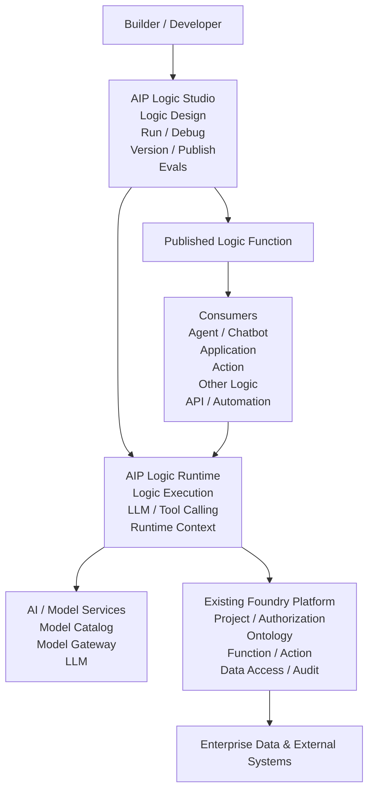

# Foundry 平台之上复刻 AIP Logic Studio：产品定义、架构设计、功能清单与开发建议

> **适用前提**
>
> 已经具备一个 Foundry-like 平台底座，包括 Project / Folder / Resource、Identity / Authorization、Ontology、Action、Function、Dataset / Data Access、Model Gateway / Model Catalog、Audit / Lineage 等基础能力。
>
> **目标**
>
> 在现有 Foundry 之上新增一层完整的 **AI Logic 开发、运行、调试、发布与评估平台**，其产品形态和能力边界参考 Palantir AIP Logic，同时在内部实现上采用适合自研平台的 Meta-Model、Compiler、Runtime 和 Trace 架构。
>
> **重要说明**
>
> 本文会区分两类内容：
>
> 1. **Palantir 公开能力**：来自 Palantir 官方 AIP Logic / AIP Evals 文档中公开的产品能力。
> 2. **复刻实现建议**：例如 `Logic Compiler`、`ExecutionPlan`、`BlockExecutor Registry` 等，是为了自研类似能力而建议增加的内部架构抽象；不表示 Palantir 对外公开了同名内部组件。

---

## 1. 文档定位与核心结论

如果已经有了 Foundry 平台，再建设 AIP Logic Studio，本质上不是再造一个数据平台，也不是再造一个 Ontology 平台，而是在既有 Foundry 之上增加一层：

> **面向 LLM 的企业级 Logic / Function 开发与运行平台。**

可以把完整平台分层理解为：

```text
Application / Agent
        ↑
Published AI Logic Function
        ↑
AIP Logic Studio
        ↑
Function / Action / Ontology Runtime
        ↑
Foundry Platform
        ↑
Enterprise Data & Operational Systems
```

因此，AIP Logic Studio 的核心产品公式可以定义为：

> **AIP Logic Studio = Logic Designer + Typed Meta-Model + Logic Compiler + Logic Runtime + Tool Runtime + Debugger / Trace + Version / Publish + Evals + Foundry Integration**

其中：

- **Logic Designer**：低代码 / 无代码配置 Logic。
- **Typed Meta-Model**：定义 Logic、Block、Input、Output、Binding、Tool 等结构。
- **Logic Compiler**：验证 Logic 并生成可执行计划。
- **Logic Runtime**：真正执行 Logic。
- **Tool Runtime**：安全调用 Ontology Query、Function、Action 等企业能力。
- **Debugger / Trace**：观察每次执行发生了什么。
- **Version / Publish**：把 Draft 变成稳定、可复用的 Logic Function。
- **Evals**：解决 LLM 的非确定性测试和回归问题。
- **Foundry Integration**：复用 Foundry 已有的 Project、Ontology、Function、Action、权限、审计和数据能力。

---

## 2. AIP Logic 是什么

### 2.1 Palantir 官方定位

Palantir 将 **AIP Logic** 定义为一个 **no-code development environment**，用于构建、测试和发布由 LLM 驱动的 Functions。

它的核心价值不是“提供一个 Prompt 输入框”，而是让应用构建者在不自己搭建完整 LLM SDK、API、权限、Ontology 查询和业务写回链路的情况下，把：

```text
LLM
+
Prompt
+
Enterprise Context
+
Ontology
+
Function
+
Action
+
Control Flow
```

组合成一个可测试、可发布、可复用的 **Logic Function**。

一个典型 Logic 可以是：

```text
Input
  │
  ▼
读取 Equipment / WorkOrder
  │
  ▼
调用 calculateFailureRisk()
  │
  ▼
Use LLM 分析故障原因
  │
  ▼
Conditional: risk > 0.8 ?
  │
  ├── YES → Apply Action: CreateWorkOrder
  │
  └── NO  → 返回维修建议
  │
  ▼
Output
```

最终它不是一个页面，而是一个稳定的 AI 业务能力：

```text
AnalyzeEquipmentFailure(
    equipment,
    description
) -> FailureAnalysis
```

发布以后，这个能力可以继续被：

```text
Agent / Chatbot
Application
Action
Other Logic
Function
API / SDK
Automation
```

调用。

### 2.2 它不是 Agent Studio

AIP Logic 与 Agent / Chatbot Studio 不是同一个层次。

可以用一句话区分：

> **AIP Logic 解决“一个 AI 业务能力具体怎么执行”；Agent Studio 解决“面对当前用户和上下文，下一步应该调用哪个能力”。**

关系可以表示为：

```text
User
  │
  ▼
Agent / Chatbot
  │
  │ decide which tool/function to use
  ▼
AI Logic Function
  │
  │ execute a deterministic-enough business procedure
  ▼
Ontology / Function / Action
```

因此，如果能力是：

```text
AnalyzeSupplierRisk()
GenerateRecoveryPlan()
ClassifyComplaint()
ExtractContractTerms()
```

更适合建成 Logic。

如果产品是：

```text
Supply Chain Copilot
Maintenance Assistant
Procurement Agent
Customer Service Agent
```

则属于 Agent / Chatbot 层；Agent 可以把发布后的 Logic Function 当作 Tool 使用。

### 2.3 它也不是普通 Workflow Engine

传统 Workflow 更擅长：

```text
A → B → C → D
```

AIP Logic 则需要同时解决：

```text
结构化业务流程
+
LLM 非确定性推理
+
Prompt / Context Engineering
+
Tool Calling
+
Ontology 读写
+
权限约束
+
模型治理
+
测试 / Eval
+
运行追踪
```

因此，AIP Logic Studio 应被理解为：

> **AI-native Function / Workflow Development Platform**

而不是简单的 BPM、n8n Clone 或 Prompt IDE。

---

## 3. AIP Logic 解决什么问题

### 3.1 问题一：LLM 很强，但默认不知道企业业务语义

裸 LLM 通常只能看到 Prompt 中显式提供的信息：

```text
LLM
  │
  └── Prompt
```

它并不知道企业内部：

- 什么是 Customer、Supplier、Equipment、WorkOrder；
- Object 之间有什么关系；
- 哪些 Function 可以调用；
- 哪些 Action 可以安全执行；
- 当前用户可以看到什么数据；
- 修改业务状态应该遵循什么业务规则。

AIP Logic 将 LLM 放到 Foundry / Ontology 的业务语义和权限体系之上：

```text
LLM
  │
  ▼
Tools
  │
  ├── Query Objects
  ├── Call Function
  └── Apply Action
  │
  ▼
Ontology / Business Runtime
```

从而让 LLM 从“会生成文字”升级为“能够在企业业务语义中工作”。

---

### 3.2 问题二：直接开发 LLM 应用的工程复杂度太高

如果没有 AIP Logic，开发团队通常需要自己处理：

```text
LLM SDK / API
Prompt Template
Structured Output
Function Calling
Ontology / Data Query
Authorization
Action Execution
Retry / Timeout
Tracing
Versioning
Evaluation
Deployment
```

每个应用都会重复建设一遍。

AIP Logic Studio 把这些能力平台化：

```text
业务开发者
    │
    ▼
Logic Designer
    │
    ▼
统一 Runtime / Tool / Permission / Trace
```

使业务开发者主要关注：

> 输入是什么 → 业务步骤是什么 → 模型做什么 → 可以调用哪些工具 → 输出是什么。

---

### 3.3 问题三：Prompt 很难成为稳定的生产软件资产

单独保存 Prompt 会产生：

- 没有明确 Input / Output Contract；
- 缺少版本；
- 很难复用；
- 很难知道依赖哪些 Object / Function / Action；
- 很难回归测试；
- 很难安全发布；
- 很难被其他应用以稳定 API 调用。

AIP Logic 把 Prompt 包装进完整的 Logic Function：

```text
Logic Function
│
├── Input Contract
├── Output Contract
├── Blocks
├── Prompt
├── Model
├── Tools
├── Type / Binding
├── Version
├── Runtime
├── Trace
└── Evals
```

因此 AI 能力可以像软件 Function 一样治理。

---

### 3.4 问题四：LLM Tool Calling 本身不等于安全执行

不能让模型直接拥有：

```text
Database Credential
SQL Write
Admin API
Action Runtime Super Permission
```

正确链路应是：

```text
LLM
  │
  │ asks to call a tool
  ▼
AIP Logic Tool Runtime
  │
  ▼
Authorization / Policy
  │
  ▼
Ontology Query / Function / Action
  │
  ▼
Audit / Transaction / Data
```

也就是说：

> **模型只能提出“我要使用这个 Tool”，真正执行 Tool 的是平台 Runtime。**

这样才能统一实现：

- 用户权限；
- Project 权限；
- Object / Property 权限；
- Action 权限；
- 审计；
- 敏感数据控制；
- Staged Write；
- Human Review。

---

### 3.5 问题五：LLM 是非确定性的，传统单元测试不够

普通 Function：

```text
same input → usually same output
```

LLM Function：

```text
same input
   ↓
different runs
   ↓
可能得到略有不同的输出
```

因此需要 AIP Evals 一类能力：

```text
Test Cases
   │
   ▼
Target Logic
   │
   ▼
Repeated Runs
   │
   ▼
Evaluators
   │
   ▼
Metrics / Comparison
```

需要能够比较：

- Prompt v1 vs v2；
- Model A vs Model B；
- Logic Version A vs B；
- 多次执行的 variance；
- 准确度与成本；
- 发布前后的回归。

---

### 3.6 问题六：AI 推理必须真正连接企业操作闭环

企业 AI 的目标不只是：

```text
Question
  ↓
LLM
  ↓
Answer
```

更重要的是：

```text
Observe
  ↓
Reason
  ↓
Decide
  ↓
Act
  ↓
Update Ontology
  ↓
Continue business process
```

例如：

```text
检测 Shipment Delay
       ↓
查询 Supplier / Order / Inventory
       ↓
LLM 分析影响
       ↓
Function 计算替代方案
       ↓
Conditional
       ↓
Action: ExpediteShipment
       ↓
更新 Ontology
```

这正是 AIP Logic 位于 Foundry / Ontology 之上的关键意义。

---

## 4. AIP Logic 的核心抽象

建议将 AIP Logic 的产品抽象固定为：

```text
Logic
│
├── Inputs
├── Outputs
├── Blocks
│    ├── Use LLM
│    ├── Execute Function
│    ├── Apply Action
│    ├── Conditional
│    ├── Loop
│    └── Create Variable
│
├── Bindings
├── Model
├── Tools
├── Execution Mode
├── Version
├── Runs
├── Debug / Trace
└── Evals
```

对自研实现，则进一步拆成：

```text
LogicDefinition
LogicVersion
BlockDefinition
Binding
ToolDefinition
ExecutionPlan
LogicRun
BlockRun
```

其中：

- 前一组更接近产品概念；
- 后一组是推荐的内部工程元模型。

---

## 5. AIP Logic Studio 总体架构图（简化版）

为了便于产品设计、立项评审和团队沟通，总体架构不展开内部的 Compiler、Executor、Trace、Binding 等实现细节，只保留大的平台模块。



### 5.1 五个核心模块

从总体架构上，只需要理解五个核心部分。

#### 1. AIP Logic Studio

这是 Builder 面向的低代码开发环境，负责：

```text
Create Logic
Define Input / Output
Configure Blocks
Configure Prompt / Model / Tools
Run / Debug
Version
Publish
Evaluate
```

它负责“开发 Logic”，但不直接承担所有底层业务能力。

---

#### 2. AIP Logic Runtime

这是 AI Logic 真正的执行层，负责：

```text
执行 Logic
维护运行上下文
调用 LLM
调用 Tool
执行 Function / Action
处理条件和循环
记录运行状态
```

可以简单理解为：

> **Studio 负责设计，Runtime 负责执行。**

---

#### 3. AI / Model Services

这一层提供 AI 模型能力：

```text
Model Catalog
Model Gateway
LLM Provider
```

AIP Logic 不应该直接把各个模型 API Key、Endpoint 和 Provider 逻辑写死在每个 Logic 中，而是统一经过模型服务。

---

#### 4. Existing Foundry Platform

这是 AIP Logic 最重要的底座。

AIP Logic 应直接复用已有 Foundry 的：

```text
Project
Identity / Authorization
Ontology
Object Query
Function
Action
Dataset / Data Access
Audit / Lineage
```

因此：

```text
AIP Logic
```

不是一个脱离 Foundry 的独立 Workflow 系统，而是：

> **建立在 Foundry / Ontology 之上的 AI 业务逻辑层。**

---

#### 5. Consumers

Logic 发布后，应成为一个稳定的：

```text
Published Logic Function
```

然后可以被：

```text
Agent / Chatbot
Application
Action
Other Logic
API
Automation
```

调用。

所以完整闭环是：

```text
Build
  ↓
Run / Debug
  ↓
Publish
  ↓
Logic Function
  ↓
被其他平台能力复用
```

---

### 5.2 用一句话理解总体关系

整个架构可以进一步浓缩为：

```text
              Agent / App / API
                     │
                     ▼
             Published Logic
                     │
                     ▼
              AIP Logic Runtime
                │           │
                ▼           ▼
             LLM / AI     Foundry
                            │
                            ▼
                         Ontology
                            │
                            ▼
                           Data
```

其中最重要的关系是：

> **AIP Logic Runtime 不应该绕开 Foundry 直接操作企业数据库。**

推荐：

```text
LLM
 ↓
AIP Logic Runtime
 ↓
Ontology / Function / Action
 ↓
Foundry Authorization / Audit
 ↓
Enterprise Data
```

而不是：

```text
LLM
 ↓
SQL / Database
```

这样才能保持 Ontology、权限、Action、审计和业务规则的一致性。

---

## 6. Foundry 已有能力：不建议重复开发

如果现有 Foundry 已经具备：

```text
Project / Folder / Resource
        │
        ├── Identity / Authorization
        ├── Ontology
        │     ├── Object Type
        │     ├── Link Type
        │     └── Interface
        │
        ├── Action Type / Action Runtime
        ├── Function / Function Runtime
        ├── Dataset / Data Access
        ├── Model Gateway / Model Catalog
        └── Audit / Lineage
```

那么 AIP Logic Studio 应优先复用这些能力，而不是重新实现。

换句话说，AIP Logic Studio 负责新增的是：

```text
Logic Definition
Logic Designer
Prompt / LLM Block
Tool Binding
Logic Compiler
Logic Runtime
Debug / Trace
Version / Publish
Evals
```

而不是重新实现 Foundry 底座。

---

## 7. 功能优先级定义

- **P0**：第一版必须具备
- **P1**：产品化后应快速补齐
- **P2**：企业增强能力，可后置

---

## 8. 模块 1：Logic Resource 管理

| 功能 | 描述 | 优先级 |
|---|---|---:|
| 创建 Logic | 在 Project 中创建新的 Logic 资源 | P0 |
| Logic Name | 设置显示名称 | P0 |
| API Name | 设置稳定程序标识，如 `analyze_supplier_risk` | P0 |
| Description | 描述 Logic 的业务用途 | P0 |
| Project Binding | Logic 必须归属某个 Project | P0 |
| Logic Owner | 记录创建者和 Owner | P0 |
| Save Draft | 保存当前开发状态 | P0 |
| Copy Logic | 基于已有 Logic 创建副本 | P1 |
| Delete / Archive | 删除或归档 Logic | P1 |
| Resource Metadata | 创建时间、更新时间、标签、状态等 | P1 |
| Dependency View | 查看 Logic 依赖的 Object、Action、Function、Model | P1 |
| Used By | 查看哪些 Action、Agent、App、Logic 正在使用当前 Logic | P1 |

---

## 9. 模块 2：Logic 输入与输出定义

```text
AnalyzeEquipmentFailure

Input
├── equipment: Equipment
├── description: String
└── temperature: Double

Output
└── result: FailureAnalysis
```

| 功能 | 描述 | 优先级 |
|---|---|---:|
| Input Definition | 定义 Logic 输入参数 | P0 |
| Input Name | 输入变量名 | P0 |
| Input Type | 输入类型 | P0 |
| Required / Optional | 是否必填 | P0 |
| Default Value | 默认值 | P1 |
| Primitive Types | String、Boolean、Integer、Double、Timestamp 等 | P0 |
| Struct Type | 结构化对象 | P0 |
| List Type | 列表类型 | P0 |
| Ontology Object Type | 输入可直接绑定 Customer、Equipment 等对象类型 | P0 |
| Object List | 一组 Ontology Objects | P0 |
| Object Set | Ontology ObjectSet | P1 |
| Output Definition | 定义最终输出 | P0 |
| Structured Output | Struct / JSON Schema 类型输出 | P0 |
| Object Output | 返回 Ontology Object | P1 |
| Ontology Edit Output | 返回 Ontology 编辑结果 | P1 |
| Type Checker | 检查输入输出类型兼容性 | P0 |

---

## 10. 模块 3：Logic Designer

建议第一版采用相对受控的流程式编排，而不是完全自由 DAG。

```text
Input
  ↓
Block
  ↓
Block
  ↓
Conditional
 ├── Path A
 └── Path B
  ↓
Output
```

| 功能 | 描述 | 优先级 |
|---|---|---:|
| Block Palette | 显示可使用的 Block 类型 | P0 |
| Add Block | 插入 Block | P0 |
| Delete Block | 删除 Block | P0 |
| Reorder Block | 调整执行顺序 | P0 |
| Copy Block | 复制 Block | P1 |
| Block Config Panel | 编辑 Block 配置 | P0 |
| Block Input | 配置 Block 输入 | P0 |
| Block Output | 配置 Block 输出 | P0 |
| Nested Path | Condition / Loop 内部嵌套执行路径 | P0 |
| Variable Picker | 选择之前的 Input / Block Output | P0 |
| Search Variables | 搜索变量 | P1 |
| Validation Indicator | 显示配置错误 | P0 |
| Type Hint | 显示变量类型 | P0 |
| Auto Complete | Prompt、Function、Object 等自动完成 | P1 |
| Undo / Redo | 编辑撤销与恢复 | P1 |

> Studio 只是 `LogicDefinition` 的可视化编辑器，执行逻辑不应写死在前端。

---

## 11. 模块 4：核心 Block

| Block | 功能 | 优先级 |
|---|---|---:|
| Use LLM | 调用大模型完成 AI 推理 | P0 |
| Execute Function | 调用 Foundry Function | P0 |
| Apply Action | 调用 Ontology Action | P0 |
| Conditional | if / else / 多条件分支 | P0 |
| Loop | 遍历 Collection | P1 |
| Create Variable | 创建中间变量 | P0 |

统一内部模型：

```text
BlockDefinition

blockId
blockType
inputs
outputs
config
errorPolicy
timeout
```

---

## 12. 模块 5：Use LLM Block

推荐设计：

```text
LLMNode
│
├── modelRef
├── systemPrompt
├── userPrompt
├── temperature
├── maxTokens
├── inputBindings
├── tools[]
├── outputSchema
└── retryPolicy
```

| 功能 | 描述 | 优先级 |
|---|---|---:|
| Model Selection | 从 Model Catalog 选择模型 | P0 |
| Prompt Editor | 编辑 Prompt | P0 |
| Input Variable Insert | Prompt 中插入 Logic Input | P0 |
| Block Output Insert | 引用之前 Block 输出 | P0 |
| Object Property Insert | 选择 Object Property | P0 |
| Prompt Preview | 查看最终 Prompt | P0 |
| Structured Output | 定义结构化 LLM 返回值 | P0 |
| Output Schema | 定义返回字段和类型 | P0 |
| Tool Configuration | 给当前 LLM 配置 Tools | P0 |
| Tool Description | 描述 Tool 的用途 | P0 |
| Native Tool Calling | 模型支持时使用原生 Tool Calling | P1 |
| Prompted Tool Calling | 不支持原生 Tool Calling 时降级 | P1 |
| Model Parameters | Temperature、Max Tokens 等 | P1 |
| Fallback Model | 主模型失败时切换备用模型 | P2 |
| Token Limit Guard | 防止 Context / Output 超限 | P1 |

---

## 13. 模块 6：LLM Tool 系统

第一版建议支持：

```text
LLM
 │
 ├── Query Objects
 ├── Call Function
 ├── Apply Action
 └── Calculator
```

### 9.1 Query Objects Tool

| 功能 | 描述 | 优先级 |
|---|---|---:|
| Select Object Type | 指定允许访问的 Object Type | P0 |
| Property Allowlist | 指定允许读取的 Property | P0 |
| Filter | 根据条件查询对象 | P0 |
| Aggregation | Count / Sum / Avg 等 | P1 |
| Link Traversal | 沿 Link 查询关联对象 | P1 |
| Result Limit | 限制返回对象数量 | P0 |
| Authorization | 查询必须经过 Ontology 权限体系 | P0 |

### 9.2 Call Function Tool

```text
LLM
 ↓
Call Function
 ↓
Foundry Function Runtime
```

| 功能 | 描述 | 优先级 |
|---|---|---:|
| Function Selector | 选择 Function | P0 |
| Signature Discovery | 自动获取 Function 参数定义 | P0 |
| Parameter Mapping | 参数绑定 | P0 |
| Output Mapping | Function 结果返回 LLM | P0 |
| Logic-as-Function | 调用另一个已发布 Logic | P1 |

### 9.3 Apply Action Tool

```text
LLM
 ↓
request Action
 ↓
AI Logic Runtime
 ↓
Authorization
 ↓
Action Runtime
 ↓
Ontology
```

| 功能 | 描述 | 优先级 |
|---|---|---:|
| Action Selector | 选择允许调用的 Action | P0 |
| Action Parameter Schema | 获取 Action 参数定义 | P0 |
| Tool Parameter Mapping | Tool Call 参数映射到 Action | P0 |
| Permission Check | Action 权限校验 | P0 |
| Audit | 记录 AI 发起的修改 | P0 |
| Staged Write | 修改先暂存再提交 | P1 |

> LLM 不应直接操作数据库，也不应绕过权限层直接调用底层写入接口。

---

## 14. 模块 7：变量、Binding 与强类型系统

```text
QuerySupplier.output.supplier
             │
             ▼
AnalyzeRisk.input.supplier
```

后台应保存：

```text
InputBinding

sourceBlockId
sourceOutput

targetBlockId
targetInput
```

| 功能 | 描述 | 优先级 |
|---|---|---:|
| Variable Registry | 保存当前可用变量 | P0 |
| Input Binding | Input → Block | P0 |
| Output Binding | Block → Block | P0 |
| Property Binding | `customer.name` 等字段绑定 | P0 |
| Type Validation | 检查类型兼容 | P0 |
| Scope | Loop / Conditional 局部作用域 | P0 |
| Null Handling | Optional / Null | P1 |
| List Mapping | List → Loop Element | P1 |
| Branch Output Validation | 不同分支输出类型一致性检查 | P0 |

---

## 15. 模块 8：Logic Compiler

```text
LogicDefinition
      ↓
Schema Validation
      ↓
Type Check
      ↓
Dependency Validation
      ↓
Permission Validation
      ↓
Control Flow Validation
      ↓
Compile
      ↓
ExecutionPlan
```

| 功能 | 描述 | 优先级 |
|---|---|---:|
| Schema Validation | Logic JSON 结构检查 | P0 |
| Block Validation | Block 配置完整性检查 | P0 |
| Type Check | 输入输出类型检查 | P0 |
| Binding Validation | 参数绑定检查 | P0 |
| Function Signature Validation | Function 参数兼容性检查 | P0 |
| Action Signature Validation | Action 参数兼容性检查 | P0 |
| Model Validation | Model 是否可用 | P0 |
| Tool Validation | Tool 是否可访问 | P0 |
| Control Flow Check | Condition / Loop 合法性检查 | P0 |
| Dependency Resolution | 解析 transitive dependency | P1 |
| Execution Plan Generation | 生成 Runtime 可执行计划 | P0 |

---

## 16. 模块 9：Logic Runtime

```text
Logic Runtime
      │
      ├── Run Manager
      ├── Execution Engine
      ├── Variable Context
      ├── Block Executor Registry
      │
      ├── LLMExecutor
      ├── FunctionExecutor
      ├── ActionExecutor
      ├── ConditionalExecutor
      ├── LoopExecutor
      └── VariableExecutor
```

| 功能 | 描述 | 优先级 |
|---|---|---:|
| Execute Logic | 执行 Logic | P0 |
| Execution Context | 保存用户、项目、版本等上下文 | P0 |
| Variable Context | 保存运行时变量 | P0 |
| Block Executor | Block 执行框架 | P0 |
| Sequential Execution | 顺序执行 | P0 |
| Conditional Execution | 条件路径执行 | P0 |
| Loop Execution | 循环执行 | P1 |
| Parallel Execution | 支持可并行循环 | P1 |
| Error Handling | 节点失败处理 | P0 |
| Timeout | 执行超时 | P0 |
| Retry Policy | 自动重试 | P1 |
| Cancel Run | 取消执行 | P1 |
| Execution Status | Pending / Running / Success / Failed | P0 |
| Output Collection | 生成最终结果 | P0 |

---

## 17. 模块 10：Execution Mode 与安全

建议支持：

```text
User-scoped Execution
```

和：

```text
Project-scoped Execution
```

| 功能 | 描述 | 优先级 |
|---|---|---:|
| User-scoped Mode | 以当前用户身份执行 | P0 |
| Project-scoped Mode | 以 Project Runtime Identity 执行 | P1 |
| Principal Propagation | 用户身份向下传递 | P0 |
| Ontology Permission | Object 查询权限检查 | P0 |
| Function Permission | Function 调用权限检查 | P0 |
| Action Permission | Action 权限检查 | P0 |
| Model Permission | Model 使用权限检查 | P0 |
| Tool Allowlist | Logic 显式允许哪些 Tool | P0 |
| Audit Trail | 谁运行、调用什么、修改了什么 | P0 |
| Sensitive Data Control | 控制哪些数据进入 Prompt | P1 |

> LLM 不能成为新的 Super Admin。

---

## 18. 模块 11：Ontology Write / Staged Write

```text
Logic Run

Action A
   ↓
Stage Edit

Action B
   ↓
Stage Edit

Query
   ↓
可以读取 staged state

Logic Success
   ↓
COMMIT

Logic Failure
   ↓
ROLLBACK
```

| 功能 | 描述 | 优先级 |
|---|---|---:|
| Edit Staging | 修改暂存 | P1 |
| Read-your-writes | 后续 Block 可读取本次修改 | P1 |
| Atomic Commit | Logic 成功后统一提交 | P1 |
| Rollback | 失败时不提交 | P1 |
| Edit Preview | 查看 Logic 将修改哪些对象 | P1 |
| Human Approval | 人工确认后提交 | P2 |

---

## 19. 模块 12：Run / Preview

```text
Test Input
       ↓
      RUN
       ↓
Logic Runtime
       ↓
Result
```

| 功能 | 描述 | 优先级 |
|---|---|---:|
| Input Form | 输入测试参数 | P0 |
| Run | 执行当前 Draft | P0 |
| Run Status | 显示运行状态 | P0 |
| Final Output | 查看输出 | P0 |
| Run Duration | 执行时间 | P0 |
| Token Usage | LLM Token 使用量 | P1 |
| Model Used | 实际调用的模型 | P1 |
| Tool Calls | 展示执行的 Tool | P0 |
| Retry Run | 使用相同输入再次执行 | P1 |

---

## 20. 模块 13：Debugger / Trace

建议 V1 就开发。

```text
Run R001

Input
 ↓
Query Object
  input
  output
  duration
 ↓
LLM
  model
  rendered prompt
  response
  tool calls
  token usage
 ↓
Function
  parameters
  result
 ↓
Action
  parameters
  staged edits
 ↓
Output
```

| 功能 | 描述 | 优先级 |
|---|---|---:|
| Run Trace | 一次完整运行链路 | P0 |
| Block Trace | 每个 Block 的执行情况 | P0 |
| Input Snapshot | Block 实际输入 | P0 |
| Output Snapshot | Block 实际输出 | P0 |
| Rendered Prompt | 查看真正发送给模型的 Prompt | P0 |
| LLM Response | 查看模型响应 | P0 |
| Tool Call Trace | Tool 名称和参数 | P0 |
| Function Trace | Function 请求与结果 | P0 |
| Action Trace | Action 请求和修改 | P0 |
| Error Detail | Error / Stack / Error Code | P0 |
| Duration | 每个 Block 耗时 | P1 |
| Token Usage | 每个 LLM Block Token | P1 |
| Cost | 模型调用成本 | P1 |

---

## 21. 模块 14：Run History 与 Observability

```text
LogicRun
 ├── RunId
 ├── LogicVersion
 ├── Principal
 ├── Input
 ├── Output
 ├── Status
 ├── StartedAt
 ├── EndedAt
 └── NodeRuns[]
```

| 功能 | 描述 | 优先级 |
|---|---|---:|
| Run History | 查看历史执行 | P0 |
| Run Search | 按用户、状态、时间查询 | P1 |
| Run Detail | 查看完整 Trace | P0 |
| Success Count | 成功次数 | P1 |
| Failure Count | 失败次数 | P1 |
| P95 Duration | P95 执行耗时 | P1 |
| Failure Categories | 错误分类 | P1 |
| Usage Statistics | Token / Model / Tool 使用量 | P1 |
| Dataset Export | 将运行数据写入 Dataset | P2 |

---

## 22. 模块 15：Version 管理

```text
LogicDefinition

├── Version 1
├── Version 2
├── Version 3
└── Draft
```

| 功能 | 描述 | 优先级 |
|---|---|---:|
| Auto Save Version | 自动保存历史版本 | P0 |
| Version History | 查看版本历史 | P0 |
| Compare | 两个版本 Diff | P1 |
| Rollback | 恢复历史版本 | P1 |
| Published Version | 标记生产版本 | P0 |
| Immutable Release | 发布版本不可直接修改 | P0 |
| Compatibility Check | Input / Output breaking change 检查 | P1 |

---

## 23. 模块 16：Publish / Release

```text
Draft Logic
   ↓ validate
   ↓ compile
   ↓ test
Publish
   ↓
Logic Function v1
   ↓
Foundry Function Registry
```

| 功能 | 描述 | 优先级 |
|---|---|---:|
| Publish Validation | 发布前检查 | P0 |
| Publish | 发布 Logic | P0 |
| Function Registration | 注册为 Foundry Function | P0 |
| Version Number | Function Version | P0 |
| API Signature | 固定 Input / Output Signature | P0 |
| Deprecated | 标记版本废弃 | P1 |
| Consumer Compatibility | 检查调用方兼容性 | P1 |

> Logic 发布后的产品形态，应是一个可被平台其他模块调用的 Foundry Function。

---

## 24. 模块 17：Usage / Integration

```text
                Logic Function
                       │
       ┌───────────────┼───────────────┐
       ▼               ▼               ▼
     Action         Workshop         Agent
       │                               │
       ├──────── Other Logic ──────────┤
       │
       └──────── API
```

| 功能 | 描述 | 优先级 |
|---|---|---:|
| Call from Function | 普通 Function 调 Logic | P0 |
| Call from Logic | Logic 调另一个 Logic | P1 |
| Back Action | Logic 作为 Action 实现 | P0 |
| Workshop Integration | App 调 Logic | P1 |
| Agent Function Tool | Agent 将 Logic 当 Tool | P1 |
| REST / Function API | 外部 API 调用 | P1 |
| SDK Invocation | SDK 调用 | P2 |
| Usage View | 查看如何使用当前 Logic | P1 |

---

## 25. 模块 18：AIP Evals

建议放到 V1.1。

```text
EvaluationSuite
    │
    ├── TestCase
    ├── Target Logic
    ├── Evaluator
    └── Metrics
```

| 功能 | 描述 | 优先级 |
|---|---|---:|
| Test Case | 定义输入和期望输出 | P1 |
| Save Run as Test | 将历史 Run 保存为测试用例 | P1 |
| Evaluation Suite | 管理测试集合 | P1 |
| Target Logic | 指定被评估 Logic | P1 |
| Evaluator | 评估函数 | P1 |
| Exact Match | 精确匹配 | P1 |
| Numeric Metrics | 数值指标 | P1 |
| LLM Judge | 使用 LLM 作为评价器 | P2 |
| Model Comparison | 模型 A/B 比较 | P1 |
| Version Comparison | Logic v1/v2 比较 | P1 |
| Repeated Runs | 测试随机性和稳定性 | P1 |
| Aggregate Metrics | 汇总指标 | P1 |
| Regression Gate | 发布前质量门禁 | P2 |

---

## 26. 模块 19：Branching / 协作开发

```text
main
  ├──── Branch A
  │
  │    修改 Logic
  │    Test
  │    Publish Preview
  │
  └──── Proposal
           ↓
         Review
           ↓
         Merge
```

| 功能 | 描述 | 优先级 |
|---|---|---:|
| Create Branch | 分支开发 | P2 |
| Branch Logic | 在分支修改 Logic | P2 |
| Preview Publish | 分支发布测试版本 | P2 |
| Diff | Main 与 Branch 对比 | P2 |
| Rebase | 同步 Main | P2 |
| Conflict Resolution | 冲突处理 | P2 |
| Proposal | 发起合并申请 | P2 |
| Review / Approval | 审批 | P2 |
| Merge | 合并回 Main | P2 |

---

## 27. 模块 20：Automation

建议复用现有 Foundry Automation Engine。

```text
New Alert Object
        ↓
Trigger
        ↓
AnalyzeAlert Logic
        ↓
Action
```

或：

```text
Every day 08:00
       ↓
AnalyzeSupplierRisk
```

| 功能 | 描述 | 优先级 |
|---|---|---:|
| Event Trigger | Object 创建/变化触发 | P2 |
| Schedule Trigger | 时间触发 | P2 |
| Logic Effect | 执行 Logic | P2 |
| Action Effect | 执行 Action-backed Logic | P2 |
| Retry | 自动重试 | P2 |
| Human Review | 人工审核 | P2 |

---

## 28. MVP 功能范围

| 模块 | V1 |
|---|---:|
| Logic Resource | ✅ |
| Input / Output Definition | ✅ |
| Strong Type System | ✅ |
| Block Designer | ✅ |
| Use LLM | ✅ |
| Query Object Tool | ✅ |
| Call Function Tool | ✅ |
| Apply Action Tool | ✅ |
| Execute Function Block | ✅ |
| Apply Action Block | ✅ |
| Conditional | ✅ |
| Create Variable | ✅ |
| Binding | ✅ |
| Compiler | ✅ |
| Logic Runtime | ✅ |
| User-scoped Permission | ✅ |
| Run / Preview | ✅ |
| Debug / Trace | ✅ |
| Run History | ✅ |
| Version | ✅ |
| Publish as Function | ✅ |
| Loop | V1.1 |
| Project-scoped Execution | V1.1 |
| Staged Writes | V1.1 |
| Evals | V1.1 |
| Metrics | V1.1 |
| Branching | V2 |
| Automate | V2 |
| Human Approval | V2 |

---

## 29. MVP 的真正完成标准

```text
① Create Logic
        ↓
② Define Input / Output
        ↓
③ Add Blocks
        ↓
④ Configure LLM
     Model
     Prompt
     Tools
        ↓
⑤ Bind Variables
        ↓
⑥ Validate
        ↓
⑦ Compile
        ↓
⑧ Run
        ↓
⑨ Debug
   查看：
   Block Input
   Block Output
   Prompt
   Tool Calls
   Errors
        ↓
⑩ Save Version
        ↓
⑪ Publish
        ↓
⑫ Register as Foundry Function
        ↓
⑬ 被 Action / Agent / App / Other Logic 调用
```

完成这个闭环后，才可以认为 Foundry 上已经拥有一个真正完整的 AI Logic Studio。

---

## 30. 推荐代码模块拆分

如果采用 Spring Boot Modular Monolith：

```text
ai-logic
│
├── logic-definition
│    LogicDefinition
│    LogicVersion
│    LogicInput
│    LogicOutput
│
├── block-model
│    BlockDefinition
│    BlockType
│    Binding
│
├── compiler
│    Validator
│    TypeChecker
│    DependencyResolver
│    ExecutionPlanCompiler
│
├── runtime
│    LogicRun
│    ExecutionContext
│    ExecutionEngine
│    VariableContext
│
├── executors
│    LlmExecutor
│    FunctionExecutor
│    ActionExecutor
│    ConditionalExecutor
│    LoopExecutor
│    VariableExecutor
│
├── tool-runtime
│    QueryObjectTool
│    FunctionTool
│    ActionTool
│    CalculatorTool
│
├── trace
│    LogicRun
│    BlockRun
│    ToolCallTrace
│    LlmTrace
│
├── versioning
│    Version
│    Publish
│    Rollback
│
└── evaluation
     EvaluationSuite
     TestCase
     Evaluator
     EvalRun
```

与已有 Foundry 的关系：

```text
                     AI Logic
                        │
        ┌───────────────┼────────────────┐
        ▼               ▼                ▼
   Model Gateway   Function Runtime   Action Runtime
                                         │
        └───────────────┬─────────────────┘
                        ▼
                  Ontology Runtime
                        │
                        ▼
                     Foundry
```

---

## 31. 推荐第一份开发规格文档

真正开工时，第一份开发 Spec 建议是：

# 《AI Logic Meta-Model & Runtime Specification》

优先定义：

```text
LogicDefinition
LogicVersion
BlockDefinition
Binding
ExecutionPlan
LogicRun
BlockRun
ToolDefinition
```

然后围绕这些模型实现：

```text
Compiler
Runtime
Trace
Debugger
Publish
Studio UI
```

这一步将决定后续整个 AI Logic Studio 是否可扩展、可维护、可测试、可治理。


---


## 32. 为什么不建议直接用 n8n 或 Dify 替代 AIP Logic Studio

### 32.1 先给结论

如果你的目标只是：

```text
快速做一个 LLM Workflow
接几个 API
做 RAG
做一个 Agent
串几个 SaaS
跑一个自动化流程
```

那么 **n8n 和 Dify 都是非常有价值的选择**，甚至可能比自研 AIP Logic Studio 更快。

但是，如果你的目标是：

> **在已经存在的 Foundry 平台之上，建设一个类似 Palantir AIP Logic 的“Ontology-native、权限原生、Function-native、可治理”的 AI Logic 层**

那么不建议直接把 n8n 或 Dify 当成最终核心 Runtime。

更准确地说：

```text
n8n / Dify
≠
Palantir AIP Logic 的直接替代品
```

原因不是它们“没有 Workflow”或者“没有 AI”。

恰恰相反：

- n8n 已经具备强大的 Workflow Automation、AI Agent、Tool、Credential、Project / RBAC、Execution History、Source Control / Environments、Evaluation 和 Human-in-the-loop 等能力。
- Dify 已经具备 LLM Workflow、Chatflow、Agent、RAG、Model Provider、变量、Iteration、Structured Output、API 发布等能力。

真正的问题在于：

> **它们的核心资源模型、权限模型、执行模型和 Foundry / Ontology 的模型并不一致。**

如果强行把其中一个作为 AIP Logic 核心，后期往往会变成：

```text
Foundry Platform
      │
      ▼
大量 Adapter / Proxy / Credential Mapping
      │
      ▼
n8n / Dify Runtime
      │
      ▼
再反向调用 Foundry
```

最后会形成“双控制面、双权限体系、双资源模型、双运行时”的复杂结构。

对于一个准备长期建设的 Palantir-like 平台，这通常不是最优架构。

---

### 32.2 n8n 和 Dify 分别更擅长什么

#### n8n 的核心定位

n8n 的核心优势是：

> **通用 Workflow Automation + 系统集成 + AI Workflow**

典型结构：

```text
Trigger
  ↓
HTTP
  ↓
CRM
  ↓
Database
  ↓
AI Agent
  ↓
Email
  ↓
Webhook
```

它非常擅长：

- SaaS / API Integration；
- Event Trigger；
- Schedule；
- Webhook；
- ETL / 数据搬运；
- 跨系统自动化；
- AI Agent + Tool Calling；
- Human-in-the-loop；
- 快速编排大量第三方系统。

因此如果你的问题是：

```text
收到邮件
  ↓
让 LLM 分类
  ↓
调用 Salesforce
  ↓
发送 Slack
```

n8n 非常合适。

---

#### Dify 的核心定位

Dify 更接近：

> **LLM Application Development Platform**

它非常擅长：

- Prompt Engineering；
- LLM Workflow；
- Chatflow；
- RAG / Knowledge；
- Agent；
- Model Provider；
- Structured Output；
- Iteration；
- AI Application API；
- 快速制作 AI App。

典型结构：

```text
User Input
    ↓
Knowledge Retrieval
    ↓
LLM
    ↓
Condition
    ↓
Tool
    ↓
Output
```

如果你的目标是：

```text
企业知识问答
智能客服
RAG 应用
内容生成
AI Agent MVP
```

Dify 非常适合。

---

### 32.3 为什么它们看起来和 AIP Logic 很像

三者表面上都有：

```text
Canvas
Node / Block
LLM
Variable
Condition
Loop
Tool
Run
Debug
Publish
```

因此第一反应很容易是：

> “既然 n8n / Dify 已经有 Workflow，为什么还要开发 AI Logic Studio？”

问题就在于：

```text
UI 看起来相似
≠
底层平台语义相同
```

AIP Logic 真正特殊的地方不是 Canvas，而是它所在的平台上下文：

```text
AIP Logic
   │
   ├── Project
   ├── Ontology
   ├── Object Type
   ├── Object Set
   ├── Function
   ├── Action
   ├── Authorization
   ├── Branching
   ├── Audit
   ├── Staged Write
   └── Published Function
```

也就是说：

> **AIP Logic 是 Foundry 的一个原生计算与业务能力层，而不只是一个独立 Workflow 产品。**

---

### 32.4 核心差异一：Ontology 不是普通 JSON / Variable

这是最重要的差异。

在通用 Workflow 平台里，数据通常更接近：

```text
JSON
Array
String
Number
File
Variable
```

例如：

```json
{
  "customerId": "C001",
  "name": "Alice",
  "risk": 0.8
}
```

但是在 Foundry / Ontology 中：

```text
Customer
```

不是一段普通 JSON。

它是平台一级资源：

```text
Customer Object Type
│
├── Primary Key
├── Properties
├── Links
├── Interfaces
├── Actions
├── Functions
├── Security
├── History
└── Semantic Meaning
```

例如：

```text
Customer
   │
   ├── places Order
   ├── owns Contract
   ├── has SupportTicket
   └── can execute:
          EscalateCustomer
          ChangeRiskLevel
```

因此 AIP Logic 中一个变量如果是：

```text
customer: Customer
```

应该保留：

```text
Ontology Type
Object Identity
Property Schema
Links
Authorization Context
Action Availability
```

而不应该在进入 Workflow 后退化成：

```text
Map<String, Object>
```

#### 如果直接使用 n8n / Dify

你通常需要额外实现：

```text
Ontology Object
      ↓
Serialize
      ↓
Workflow JSON
      ↓
Execute
      ↓
Deserialize
      ↓
Ontology Object
```

这会造成：

- Ontology Type 丢失；
- Link 语义丢失；
- Interface 语义丢失；
- Action 能力变成普通 API；
- IDE 无法原生做 Ontology Type Check；
- Dependency 无法自然追踪；
- 权限语义必须额外传递。

所以核心问题不是“能不能传数据”。

当然能。

真正的问题是：

> **能不能让 Ontology Object 成为 Workflow Runtime 的第一等公民。**

---

### 32.5 核心差异二：AIP Logic 需要继承 Foundry 的权限上下文

Palantir AIP Logic 支持至少两种重要执行语义：

```text
User-scoped Execution
```

以及：

```text
Project-scoped Execution
```

User-scoped：

```text
User A
  ↓
Run Logic
  ↓
Object Query
  ↓
只能看到 User A 有权看到的数据
```

Project-scoped：

```text
User
  ↓
Run Logic
  ↓
Project Runtime Context
  ↓
使用 Project 被授予的资源访问能力
```

这和普通 Integration Credential 有根本区别。

#### n8n 的典型方式

n8n 很强的一部分能力来自：

```text
Node
  ↓
Credential
  ↓
External System
```

例如：

```text
Salesforce Credential
Google Credential
PostgreSQL Credential
AWS Credential
```

这对于 Integration Workflow 非常合理。

但对于 Foundry，真正需要的是：

```text
Principal
  ↓
Project / Resource Authorization
  ↓
Object / Property / Action Permission
  ↓
Runtime
```

不能简单变成：

```text
一个统一的 Foundry API Credential
```

否则很容易出现：

```text
用户原本没有权限
        ↓
Workflow 使用平台 Service Credential
        ↓
用户间接获得了额外数据 / Action 权限
```

这就是典型的 **Confused Deputy** 风险。

#### Dify 也存在同样的架构问题

Dify 有自己的：

```text
Workspace
Model Provider
App
Tool
API Key
```

权限体系。

如果把 Foundry 资源完全接进去，你仍需要再开发：

```text
Foundry Principal Propagation
Project Context
Resource Permission Mapping
Object Permission Check
Action Permission Check
```

所以最后 Authorization 仍然必须由你的 Foundry Runtime 掌控。

---

### 32.6 核心差异三：Action 不是普通 API Call

在普通 Workflow 系统里：

```text
HTTP POST
```

通常意味着：

```text
调用成功
=
系统状态已经修改
```

但 Foundry 的 Action 是一个平台级业务语义：

```text
Action Type
│
├── Parameters
├── Object Binding
├── Validation
├── Permission
├── Business Rule
├── Function Backend
├── Audit
└── Ontology Edit
```

例如：

```text
ApprovePurchaseOrder
```

不是：

```http
POST /purchase-order/update
```

这么简单。

它意味着：

```text
Who can approve?
Which PO can be approved?
What parameters are required?
What validation applies?
Which objects change?
Which downstream rules are triggered?
What gets audited?
```

所以：

```text
LLM
 ↓
Apply Action
```

在 AIP Logic 中是一个 **受 Ontology Governance 控制的业务动作**。

而在通用 Workflow 平台里，它通常最终只是一个：

```text
HTTP Node
Custom Tool
Plugin Call
```

可以做，但平台语义不同。

---

### 32.7 核心差异四：Staged Write / Transaction 语义很难外置

Palantir AIP Logic 当前有一个很重要的能力：

```text
Staged Writes
```

逻辑类似：

```text
Logic Run
   │
   ├── Create Object A
   │
   ├── Update Object B
   │
   ├── Call Function
   │
   ├── Apply Action
   │
   ├── 再读取 A / B
   │
   └── Finish
        │
        ▼
      COMMIT
```

如果中间失败：

```text
ROLLBACK
```

并且需要：

```text
Read Your Writes
```

即：

```text
前面刚修改的数据
      ↓
后面的 Block 能立即读取
```

这已经不是普通 Workflow 的：

```text
Node A 成功
Node B 成功
Node C 失败
```

问题。

而是：

> **整个 Logic 需要参与 Ontology 的一致性 / Transaction Context。**

如果 Workflow Runtime 是外部的 n8n / Dify：

```text
n8n / Dify
     │
     ├── API Call A
     ├── API Call B
     ├── API Call C
     └── API Call D
```

要实现真正的 staged-write 语义，你最终还是要在 Foundry 中构建：

```text
Transaction ID
Staging Store
Read Overlay
Commit
Rollback
Nested Function Context
Nested Action Context
```

于是最复杂的 Runtime 仍然在 Foundry。

这时外部 Workflow Engine 的价值就明显下降了。

---

### 32.8 核心差异五：Logic 发布后应该成为 Foundry Function

AIP Logic 最重要的产品闭环之一是：

```text
Logic
 ↓
Publish
 ↓
Logic Function
```

然后：

```text
Logic Function
   │
   ├── Workshop
   ├── Action
   ├── Agent
   ├── Other Logic
   ├── Function
   ├── API
   └── Automation
```

所以一个 Logic 的身份应该是：

```text
Foundry Resource
+
Function
```

并拥有稳定：

```text
API Name
Input Signature
Output Signature
Version
Dependency
Permission
Usage
```

如果使用 n8n：

```text
Logic
≈
Workflow ID
```

如果使用 Dify：

```text
Logic
≈
Workflow App / API
```

当然也可以再包一层：

```text
Foundry Function
      ↓
HTTP
      ↓
Dify / n8n Workflow
```

但这样会形成：

```text
Foundry Function Registry
        ↓
External Workflow Registry
        ↓
External Version
        ↓
External Permission
        ↓
External Runtime
```

平台的资源模型被切成两半。

---

### 32.9 核心差异六：强类型系统与 Dependency Graph

AIP Logic 应支持：

```text
Input:
customer: Customer

Output:
risk: RiskAssessment
```

Block：

```text
Function:
calculateRisk(Customer)
```

连接时 IDE 应知道：

```text
Customer
    ↓
Customer ✅
```

而：

```text
Supplier
    ↓
Customer ❌
```

应该在 **设计期 / Compile 阶段** 就报错。

此外平台应该自动知道：

```text
Logic AnalyzeCustomerRisk
     │
     ├── depends on Customer Object Type
     ├── depends on Order Object Type
     ├── depends on calculateRisk Function
     ├── depends on EscalateCustomer Action
     └── depends on GPT-X Model
```

这叫：

```text
Dependency Graph
```

它用于：

- Impact Analysis；
- Used By；
- Branching；
- Publish Validation；
- Breaking Change Detection；
- Security Review；
- Migration。

通用 Workflow 平台通常能记录 Node、变量、连接和 Credential 依赖，但它们并不知道：

```text
Customer Object Type v3
```

或者：

```text
Action Type Signature
```

对整个 Ontology Platform 意味着什么。

除非你重新实现这套 Domain-aware Compiler / Metadata 层。

---

### 32.10 核心差异七：Branching 必须和 Foundry Resource 一起 Branch

你的 Foundry 如果未来支持：

```text
main
 │
 └── feature-risk-v2
```

那么一个 Branch 中可能同时修改：

```text
Customer Object Type
Risk Function
Escalate Action
AI Logic
Workshop App
```

理想状态：

```text
Branch
  │
  ├── Object Type vNext
  ├── Function vNext
  ├── Action vNext
  └── Logic vNext
```

它们应该：

```text
一起 Preview
一起 Type Check
一起 Dependency Check
一起 Review
一起 Merge
```

n8n 自身已经有 Git-based source control / environments。

但如果它作为外部 Runtime，问题会变成：

```text
Foundry Branch
       ↕
n8n Branch / Environment
```

你必须解决：

```text
branch mapping
resource mapping
version mapping
deployment ordering
rollback consistency
cross-system conflict
```

结果是两套 Branching 体系要同步。

Dify 也类似：

> 你的核心问题不是有没有版本 / 发布，而是 **AI Logic 的版本是否和 Foundry Ontology / Function / Action 属于同一条变更链**。

---

### 32.11 核心差异八：Audit / Lineage 必须跨 LLM 和业务动作贯通

企业场景中，一次 AI Logic Run 可能是：

```text
User: Alice
  ↓
Logic: AnalyzeSupplierRisk v7
  ↓
LLM: Model-X
  ↓
Query Supplier
  ↓
Query Orders
  ↓
Function calculateExposure
  ↓
LLM Tool Call
  ↓
Action ChangeSupplierStatus
  ↓
Ontology Edit
```

平台应该能统一回答：

```text
谁运行的？
使用哪个 Logic Version？
用了哪个 Model？
读取了哪些 Object？
调用了哪些 Function？
LLM 请求了哪个 Tool？
执行了哪个 Action？
最终修改了哪些 Object？
```

理想 Trace：

```text
LogicRun
   │
   ├── BlockRun
   │      ├── LLMTrace
   │      └── ToolCallTrace
   │
   ├── FunctionRun
   ├── ActionRun
   └── OntologyEdits
```

如果 n8n / Dify 是独立 Runtime：

```text
Foundry Audit
+
n8n Execution
```

或者：

```text
Foundry Audit
+
Dify Workflow Log
```

需要再拼接。

这对于严格审计场景会增加很大复杂度。

---

### 32.12 核心差异九：AIP Logic 的 Tool 应该来自 Foundry Resource，而不是 Integration Marketplace

n8n 的强项是：

```text
Google
Slack
Salesforce
AWS
Postgres
HTTP
...
```

这种 Integration Node。

Dify 的 Tool 也非常适合：

```text
Web Search
API
Plugin
Knowledge
External Service
```

但是你的 AIP Logic 最核心 Tool 应该是：

```text
Ontology Query
Function
Action
Other Logic
```

例如：

```text
Tool:
Query Customer
```

不是普通：

```text
GET /api/customer
```

而是：

```text
Object Type = Customer

Allowed properties:
name
segment
risk

Allowed links:
orders
contracts

Authorization:
Current Principal

Branch:
Current Branch

Execution Context:
Current Logic Run
```

所以你需要的是：

> **Foundry Resource → 自动生成 Tool Contract**

而不是：

> **给每个 Foundry API 手工写一个 Plugin / HTTP Node。**

---

### 32.13 核心差异十：Foundry 中的 AI Logic 是平台能力，不只是独立 App

Dify 的核心抽象更多是：

```text
AI Application
Workflow
Chatflow
Agent
```

n8n 的核心抽象更多是：

```text
Workflow
Automation
Integration
```

而你需要的核心抽象是：

```text
Foundry Function
```

也就是说：

```text
AI Logic
```

不是最终 App。

它是更底层的可组合能力：

```text
                Agent
                  │
                  ▼
                Logic
                  │
        ┌─────────┼─────────┐
        ▼         ▼         ▼
    Function    Action    Ontology
```

这一点会直接影响：

- Resource Model；
- API；
- Versioning；
- Runtime；
- Permission；
- Dependency；
- Publication；
- Used By；
- Branching。

因此仅仅“有一个 Workflow Canvas”远远不够。

---

### 32.14 对比表：AIP Logic Studio vs n8n vs Dify

下面的表格不是“谁更好”的排名，而是比较三者的主要产品抽象和适用场景。

| 维度 | 自研 Foundry-native AIP Logic | n8n | Dify |
|---|---|---|---|
| 核心定位 | Foundry 原生 AI Function / Logic | Workflow Automation / Integration | AI Application / LLM Workflow |
| 可视化 Workflow | ✅ | ✅ | ✅ |
| LLM Node | ✅ | ✅ | ✅ |
| Agent / Tool Calling | ✅ | ✅ | ✅ |
| Condition / Loop | ✅ | ✅ | ✅ |
| 第三方 SaaS Integration | 可开发 | **强项** | 可通过 Tool / Plugin |
| RAG / Knowledge | 可接 Foundry Search / Knowledge | 可集成 | **强项** |
| Ontology Object First-class | **核心能力** | 需要 Adapter | 需要 Adapter |
| Ontology Link / Interface 语义 | **核心能力** | 需要自研 | 需要自研 |
| Action Type First-class | **核心能力** | 通常映射为 Node/API | 通常映射为 Tool/API |
| Function Type First-class | **核心能力** | Sub-workflow / API / custom node | Tool / API / workflow |
| Ontology 强类型 Binding | **原生设计目标** | 需要自研扩展 | 需要自研扩展 |
| User-scoped Foundry 权限 | **原生设计目标** | 需额外 Principal Propagation | 需额外 Principal Propagation |
| Project-scoped Foundry 权限 | **原生设计目标** | 需额外集成 | 需额外集成 |
| Staged Ontology Writes | **原生设计目标** | Foundry 侧仍需实现 | Foundry 侧仍需实现 |
| Read-your-writes | **原生设计目标** | Foundry 侧仍需实现 | Foundry 侧仍需实现 |
| Atomic Ontology Commit | **原生设计目标** | Foundry 侧仍需实现 | Foundry 侧仍需实现 |
| Publish as Foundry Function | **核心能力** | 需要 Wrapper | 需要 Wrapper |
| Foundry Dependency Graph | **核心能力** | 需要同步 / Adapter | 需要同步 / Adapter |
| Foundry Branching 一体化 | **核心能力** | 需要双系统映射 | 需要双系统映射 |
| Foundry Audit / Lineage | **统一** | 需要 Trace 拼接 | 需要 Trace 拼接 |
| Generic Workflow Automation | 可以做，但不是重点 | **强项** | 中等 |
| 快速 AI App MVP | 可以 | 可以 | **强项** |
| 快速跨 SaaS 自动化 | 可以 | **强项** | 可以 |

这里最重要的一点是：

> n8n / Dify 在自己的目标领域非常成熟；问题在于它们的**核心抽象不是你的 Foundry Ontology / Function / Action**。

---

### 32.15 如果强行采用 n8n 作为 AIP Logic Runtime，会出现什么架构

可能变成：

```text
┌──────────────────────────────┐
│          Foundry             │
│                              │
│ Project                      │
│ Ontology                     │
│ Function                     │
│ Action                       │
│ Authorization                │
└──────────────┬───────────────┘
               │
         Adapter Layer
               │
               ▼
┌──────────────────────────────┐
│             n8n              │
│                              │
│ Workflow                     │
│ Node                         │
│ Credential                   │
│ AI Agent                     │
│ Execution                    │
└──────────────┬───────────────┘
               │
               │ API
               ▼
          Foundry Again
```

你将需要长期维护：

```text
Ontology → n8n Node Mapping
Function → n8n Node Mapping
Action → n8n Node Mapping
Foundry Principal → Credential / Header Mapping
Foundry Version → Workflow Version Mapping
Branch → Environment Mapping
Trace ID Mapping
Transaction Context Mapping
```

所以真正复杂的东西没有消失，只是移动到了 Adapter Layer。

---

### 32.16 如果强行采用 Dify 作为 AIP Logic Runtime，会出现什么架构

可能变成：

```text
┌──────────────────────────────┐
│          Foundry             │
│                              │
│ Ontology                     │
│ Action                       │
│ Function                     │
│ Auth                         │
└──────────────┬───────────────┘
               │
         Tool / API Adapter
               │
               ▼
┌──────────────────────────────┐
│            Dify              │
│                              │
│ Workflow                     │
│ LLM                          │
│ Agent                        │
│ Knowledge                    │
│ Tools                        │
└──────────────┬───────────────┘
               │
               ▼
          Foundry API
```

Dify 的 LLM Workflow 能力会让 V1 非常快。

但是随着平台深入：

```text
Ontology Type
Action Type
Project Scoped Permission
Staged Write
Branching
Dependency Graph
Publish as Function
Audit / Lineage
```

这些东西仍然必须在 Foundry 中重新建立。

于是：

```text
Dify Workflow
```

越来越像：

```text
外部的 Visual Orchestrator
```

而不是平台真正的 Logic Runtime。

---

### 32.17 能不能把 n8n / Dify 当作底层技术组件

可以，但需要明确边界。

#### 方案 A：n8n 用于 Integration Automation

推荐：

```text
Foundry
  │
  ├── AIP Logic Runtime
  │
  └── Integration Gateway
           │
           ▼
          n8n
           │
           ├── Salesforce
           ├── SAP
           ├── Slack
           ├── Email
           └── External SaaS
```

这非常合理。

n8n 可以成为：

> **External Integration / Automation Plane**

而不是：

> **Ontology Logic Runtime**

例如：

```text
AIP Logic
    ↓
Function
    ↓
Integration Function
    ↓
n8n
    ↓
SAP
```

这样双方发挥各自优势。

---

#### 方案 B：Dify 用于 AI 原型 / RAG 实验

例如：

```text
Dify
  │
  ├── Prompt Prototype
  ├── Model Comparison
  ├── RAG Prototype
  └── Agent Prototype
```

当能力稳定后：

```text
Prototype
   ↓
迁移 / 固化
   ↓
Foundry AI Logic
```

也可以使用 Dify 作为某些独立 AI App Runtime，但不要让它成为 Ontology 核心业务写入的唯一执行层。

---

### 32.18 一个更合理的组合架构

如果你同时想利用 n8n / Dify 的成熟能力，可以设计成：

```text
                      Application / Agent
                              │
                              ▼
┌─────────────────────────────────────────────────────┐
│                 Foundry AIP Layer                    │
│                                                     │
│       Agent Studio           AI Logic Studio        │
│                                  │                  │
│                                  ▼                  │
│                         AI Logic Runtime             │
└───────────────────────────────┬─────────────────────┘
                                │
              ┌─────────────────┼─────────────────┐
              ▼                 ▼                 ▼
          Ontology          Function           Action
              │                 │                 │
              └─────────────────┼─────────────────┘
                                │
                         Integration Gateway
                                │
               ┌────────────────┼───────────────┐
               ▼                ▼               ▼
             n8n          External API       Dify*
               │
          SaaS / SAP                         AI/RAG
```

其中：

```text
n8n
=
外部系统自动化 / Integration Engine
```

而：

```text
Dify
=
某些 AI App / RAG / Prototype 能力
```

核心：

```text
Ontology Business Logic
Permission
Action
Transaction
Function Publication
```

仍然留在 Foundry 内。

---

### 32.19 什么情况下直接用 n8n，而不要自研 AIP Logic

如果你的真实需求主要是：

```text
API Integration
Webhook
Schedule
Email
Slack
CRM
ERP
数据搬运
跨 SaaS 自动化
```

并且：

```text
Ontology 只是一个普通 API
```

那么直接用 n8n 很可能更加经济。

例如：

```text
每天 08:00
   ↓
读 ERP
   ↓
LLM Summarize
   ↓
发 Teams
```

这种场景没有必要为了“像 Palantir”而自研完整 Runtime。

---

### 32.20 什么情况下直接用 Dify，而不要自研 AIP Logic

如果你的核心目标是：

```text
RAG
Chatbot
Prompt Workflow
Agent
文本生成
知识问答
AI 应用 API
```

而企业 Ontology、Action、Branching、Staged Write 并不是核心要求，那么 Dify 会非常高效。

例如：

```text
上传制度文档
   ↓
Knowledge
   ↓
RAG
   ↓
LLM
   ↓
Chatbot
```

这类能力没有必要全部重新开发。

---

### 32.21 什么情况下必须考虑自研 Foundry-native AIP Logic

当下面这些要求同时出现时，自研价值开始非常高：

```text
① 已经有自己的 Foundry / Ontology Platform

② Object Type 是平台一级资源

③ Action Type 是平台一级业务动作

④ Function 是统一计算接口

⑤ 需要 User-scoped 权限

⑥ 需要 Project-scoped Runtime Identity

⑦ AI 必须严格继承 Ontology 权限

⑧ AI 会修改 Ontology

⑨ 需要 Staged Write / Atomic Commit

⑩ Logic 发布后必须成为统一 Function

⑪ Logic 必须进入 Dependency / Used By 图

⑫ Logic 必须和 Foundry Branch 一起 Branch

⑬ Run / Action / Ontology Edit 必须统一审计

⑭ Agent 要把 Logic 当作平台 Tool
```

如果这些都属于你的平台规划：

> **那么 AI Logic 就已经不是“接一个 Workflow 产品”这么简单，而是 Foundry Runtime 自身的一部分。**

---

### 32.22 不建议采用的判断方式

不要因为：

```text
n8n 有 Canvas
Dify 有 Workflow
```

就得出：

```text
AIP Logic 已经不用开发
```

这相当于因为：

```text
Excel 有表格
```

就认为：

```text
Database 不需要开发
```

UI 只是表面。

真正应该比较：

```text
Resource Model
Type System
Execution Context
Permission Model
Transaction Semantics
Version Model
Dependency Model
Audit Model
Publication Model
```

---

### 32.23 技术选型建议

针对当前这个“已有 Foundry，再建设 Palantir-like AIP”项目，推荐：

```text
Foundry-native AI Logic Studio
          │
          ├── 自研 Meta-Model
          ├── 自研 Compiler
          ├── 自研 Logic Runtime
          ├── 自研 Tool Gateway
          ├── 复用 Ontology Runtime
          ├── 复用 Function Runtime
          ├── 复用 Action Runtime
          ├── 复用 Authorization
          └── 复用 Audit / Branching
```

外部平台则可以作为补充：

```text
n8n
  → Integration / Automation

Dify
  → AI Prototype / RAG / 独立 AI App

Temporal（后期可选）
  → Durable Execution

React Flow
  → Logic Designer UI
```

这比：

```text
Foundry
   ↓
把所有 Logic 都外包给 n8n / Dify
```

长期更容易维持统一的平台语义。

---

### 32.24 最终判断

可以把选择原则浓缩为：

#### 如果你需要的是：

```text
“把系统连接起来”
```

优先考虑：

```text
n8n
```

#### 如果你需要的是：

```text
“快速构建 AI 应用 / RAG / Agent”
```

优先考虑：

```text
Dify
```

#### 如果你需要的是：

```text
“让 LLM 成为 Foundry Ontology 上受权限、类型、Action、
Function、版本、Branching、审计和 Transaction 治理的
一等计算能力”
```

那么应该建设：

```text
Foundry-native AIP Logic Studio
```

所以结论并不是：

> **n8n / Dify 不好。**

而是：

> **它们解决的是相邻但不同的问题。**

对于已经拥有 Foundry 平台、并且目标是复刻 Palantir AIP 的场景，最重要的是不要丢掉：

```text
Ontology-native
Function-native
Action-native
Authorization-native
Branch-native
Audit-native
Transaction-native
```

这七个“native”。

它们才是自研 AIP Logic Studio 相比通用 AI Workflow 工具真正的架构价值。


## 33. 官方参考资料

以下资料用于校准本文中关于 Palantir AIP Logic 公开能力的描述：

1. **Palantir AIP Logic — Overview**  
   https://www.palantir.com/docs/foundry/logic

2. **Palantir AIP Logic — Blocks**  
   https://www.palantir.com/docs/foundry/logic/blocks

3. **Palantir AIP Logic — Core concepts**  
   https://www.palantir.com/docs/foundry/logic/core-concepts

4. **Palantir AIP Logic — Execution mode settings**  
   https://www.palantir.com/docs/foundry/logic/execution-mode-settings

5. **Palantir AIP Evals — Overview**  
   https://www.palantir.com/docs/foundry/aip-evals/overview

6. **Palantir AIP Architecture**  
   https://www.palantir.com/docs/foundry/architecture-center/aip-architecture

7. **Palantir AIP Overview**  
   https://www.palantir.com/docs/foundry/aip

8. **n8n Documentation — Overview**  
   https://docs.n8n.io/

9. **n8n — Workflow Sharing / Roles and Permissions**  
   https://docs.n8n.io/workflows/sharing/

10. **n8n — Source Control and Environments**  
    https://docs.n8n.io/source-control-environments/create-environments/

11. **n8n — Executions**  
    https://docs.n8n.io/workflows/executions/all-executions/

12. **Dify Documentation — Introduction**  
    https://docs.dify.ai/guides/knowledge-base/retrieval

13. **Dify — Workflow Application Quick Start**  
    https://docs.dify.ai/en/guides/application-orchestrate/creating-an-application

14. **Dify — Model Providers**  
    https://docs.dify.ai/zh-hans/guides/model-configuration/readme

---

## 34. 最终建议

如果你的 Foundry 底座已经存在，那么复刻 AIP Logic Studio 时，第一阶段最值得先冻结的不是页面，而是以下八个核心模型：

```text
LogicDefinition
LogicVersion
BlockDefinition
Binding
ToolDefinition
ExecutionPlan
LogicRun
BlockRun
```

在这些模型之上，按照下面的顺序建设：

```text
Meta-Model
   ↓
Validator / Type Checker
   ↓
Compiler
   ↓
Runtime
   ↓
Tool Gateway
   ↓
Trace / Debugger
   ↓
Version / Publish
   ↓
Visual Studio
   ↓
Evals
```

核心原则可以浓缩为：

> **AIP Logic Studio 的价值，不是“让用户拖几个 AI 节点”，而是把 LLM 能力变成受 Ontology、权限、版本、测试、审计和运行时治理约束的企业级 Function。**

当一个 Logic 可以完成：

```text
Create
→ Configure
→ Validate
→ Compile
→ Run
→ Debug
→ Evaluate
→ Version
→ Publish
→ Reuse
```

并且发布后可以被 Agent、App、Action、其他 Logic 和 API 继续调用时，才真正形成完整的 AIP Logic Studio 产品闭环。
