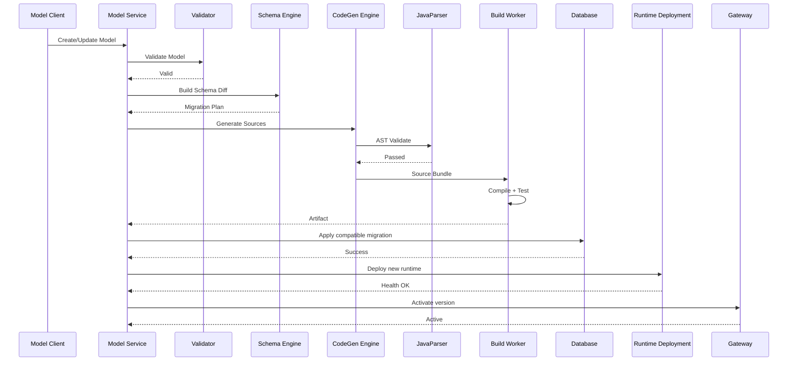

# 动态生成 Spring JPA → Controller 模块化 Runtime 开发框架完整方案

> 版本：2.0（Modular Runtime / Runtime Group 最终架构版）  
> 日期：2026-08-11  
> 目标：构建一个**模型驱动（Model-Driven）**的 Java 后端生成与运行平台，根据业务元数据自动生成数据库变更、Spring JPA Entity、Repository、DTO、Mapper、Service、Controller、OpenAPI 等制品；业务模型生成的是**普通业务模块 Artifact**，多个业务模块按 Bounded Context / Runtime Group 聚合成少量 Spring Boot Runtime，通过 API Gateway 统一对外提供服务。  
> 核心原则：**Meta Model 是唯一事实源；Generation Unit ≠ Deployment Unit ≠ Scaling Unit；FreeMarker 负责确定性源码生成；JavaParser 负责 AST 级质量门；Spring Modulith 约束模块边界；稳定能力下沉 runtime-core；数据库与应用按版本化 Release 发布。**

---

## 1. 方案结论

如果目标是“业务人员或上层系统定义业务对象/业务问题后，自动产生可运行的 Spring REST 服务”，推荐采用 **Control Plane + Generated Business Modules + Runtime Groups + API Gateway** 的四层架构，而不是“一个业务问题一个 Spring Boot JAR”。

```text
                          ┌──────────────────────────────┐
                          │       CONTROL PLANE          │
                          │                              │
Business DSL / Ontology ─▶│ Meta Model / Version /      │
                          │ Schema Diff / CodeGen /      │
                          │ Build / Release / Registry   │
                          └──────────────┬───────────────┘
                                         │
                                         │ Generate
                                         ▼
                          ┌──────────────────────────────┐
                          │   GENERATED BUSINESS MODULES │
                          │                              │
                          │ customer-module.jar          │
                          │ contract-module.jar          │
                          │ order-module.jar             │
                          │ invoice-module.jar           │
                          │ ...                          │
                          └──────────────┬───────────────┘
                                         │ Aggregate by Runtime Group
                    ┌────────────────────┼─────────────────────┐
                    │                    │                     │
                    ▼                    ▼                     ▼
             ┌───────────────┐    ┌───────────────┐    ┌───────────────┐
             │ CRM Runtime   │    │Supply Runtime │    │Finance Runtime│
             │ Spring Boot   │    │ Spring Boot   │    │ Spring Boot   │
             │ :8080         │    │ :8080         │    │ :8080         │
             │               │    │               │    │               │
             │ Customer      │    │ Order         │    │ Invoice       │
             │ Contract      │    │ Inventory     │    │ Payment       │
             │ Lead          │    │ Logistics     │    │ Settlement    │
             └───────┬───────┘    └───────┬───────┘    └───────┬───────┘
                     │                    │                     │
                     └────────────────────┼─────────────────────┘
                                          ▼
                                  ┌───────────────┐
                                  │ API Gateway   │
                                  │ HTTPS :443    │
                                  └───────┬───────┘
                                          ▼
                                       Clients
```

该模型中最重要的是把三个概念拆开：

```text
Generation Unit  = Business Module
Deployment Unit  = Runtime Group
Scaling Unit     = Runtime Group
External Entry   = API Gateway
```

例如 300 个业务问题并不意味着 300 个 Spring Boot 服务。它们可以形成 300 个逻辑业务模块，但根据领域、SLA、负载、安全和团队边界聚合为 5～20 个 Runtime Group。

### 1.1 最重要的 15 条架构原则

1. **Meta Model 是唯一事实源（SSOT）**：数据库结构、Java 类、API 契约、模块归属和部署策略都由它派生。
2. **Generation Unit ≠ Deployment Unit ≠ Scaling Unit**：业务模块负责生成和版本；Runtime Group 才负责部署与扩缩容。
3. **业务模块 JAR 是普通 Library，不是可执行 Spring Boot JAR**，不拥有自己的端口、Tomcat、DataSource 或 EntityManagerFactory。
4. **多个业务模块按 Bounded Context / Runtime Group 聚合**，构建成少量 Spring Boot Runtime。
5. **外部流量统一从 API Gateway 进入**；客户端不感知后端 Runtime 数量和端口。
6. **生成代码与手写代码严格分离**：generated 可覆盖，extension 永不覆盖。
7. **FreeMarker 负责 80%～90% 的确定性源码生成**；不要用 AST API 拼普通 CRUD。
8. **JavaParser 是 AST 质量门而不是主模板引擎**：负责 parse、结构校验、受控 patch 和架构检查。
9. **Spring Modulith 用来表达和验证逻辑模块边界**：禁止循环依赖，跨模块只能访问公开 API / Named Interface。
10. **同 Runtime 内优先 Java API / Domain Event；跨 Runtime 才使用 REST/gRPC/MQ**。
11. **JPA 只负责 ORM，不负责生产环境 schema 自动演进**；生产使用 Liquibase/Flyway。
12. **不要在正在运行的同一个 EntityManagerFactory 中随意热插 Entity**；模块变化通过 Runtime Release 发布。
13. **稳定能力放 runtime-core**：查询、分页、异常、权限、审计、事务、多租户、Hook、观测性不重复生成。
14. **Controller 不直接暴露 Entity**，使用 Create/Update/Response DTO，并通过 Mapper 隔离 API 与持久化模型。
15. **生成、迁移、编译、测试、聚合、部署、激活必须具有完整版本链和可追溯性**。

---

# 2. 适用场景与边界

## 2.1 适合本方案

- 业务对象数量持续增加，但不是“每秒创建新表”。
- 需要强类型 Java 代码、IDE 可读性和可调试性。
- 需要标准 Spring Boot/Spring Data JPA 生态。
- 需要自动生成稳定的 CRUD API。
- 需要独立 DTO、校验、权限、OpenAPI。
- 需要模型版本化和数据库版本化。
- 每次模型变更可以经过“生成 → 构建 → 发布”的生命周期。

## 2.2 不适合本方案

如果要求：

- 每分钟甚至每秒创建大量 Object Type；
- 创建字段后毫秒级立即在线，无发布过程；
- 同一个 JVM 的同一个 EntityManagerFactory 必须不停机识别任意新实体；

则不建议把 JPA Entity 代码生成作为核心数据运行时。此类场景更适合：

```text
Meta Model
    ↓
Generic Data Runtime
    ↓
SQL AST / JDBC / jOOQ
    ↓
Dynamic Table
```

Java 代码生成可以用于 SDK、API Client、开发者模型，而不是实时数据访问核心。

---

# 3. 技术基线

截至 2026-08-11，建议的工程基线如下。具体 patch 版本应由平台 BOM/Dependency Management 统一维护，Meta Model 不记录第三方库版本。

| 层 | 建议技术 |
|---|---|
| Java | Java 21 或 Java 25；生产统一一个受支持的 LTS/企业标准版本 |
| Runtime | Spring Boot 4.1.x / Spring Framework 7 |
| Modular Architecture | Spring Modulith 2.1.x |
| Web | Spring MVC |
| Persistence | Spring Data JPA 4.1.x / Hibernate |
| Code Template | Apache FreeMarker 2.3.34 |
| Java AST | JavaParser 3.28.x + JavaSymbolSolver（按需） |
| Compile | JDK `javax.tools.JavaCompiler` 或隔离 Maven Build Worker |
| DB Migration | Liquibase；生产禁止依赖 Hibernate `ddl-auto=update` |
| Validation | Jakarta Bean Validation |
| Query | `JpaSpecificationExecutor` + 受控 Specification Builder |
| Gateway | Spring Cloud Gateway 5.x 或企业统一 Gateway |
| Build | Maven |
| Test | JUnit 5 + Testcontainers + Spring Modulith `@ApplicationModuleTest` |
| Observability | Actuator + Micrometer + OpenTelemetry |
| Delivery | Container + Kubernetes；推荐 Rolling / Blue-Green / Canary |
| API Contract | OpenAPI |

当前官方技术事实：

- Spring Boot 4.1.0 要求至少 Java 17，可运行到 Java 26；
- Spring Modulith 2.1.0 面向模块化 Spring Boot 应用，提供模块验证、模块测试、事件和观测能力；
- Spring Data JPA 4.1.0 的 `JpaSpecificationExecutor` 支持 Specification/PredicateSpecification 组合查询；
- FreeMarker 2.3.34 的核心模型仍然是 Template + Data Model → Output；
- JavaParser 可解析、变换和生成 Java AST，JavaSymbolSolver 可解析类型/声明关系；
- JDK `JavaCompiler` 是标准的程序内调用 javac API；
- Liquibase 官方建议每次部署前执行 changelog `validate`。

> **版本原则**：业务模块只声明平台 API/BOM 兼容范围，不把 Spring/Hibernate/FreeMarker 等具体依赖版本固化在业务 Meta Model 中。

---

# 4. 总体模块设计

建议整个项目拆成 7 个核心模块：

```text
dynamic-codegen-platform/
│
├── metamodel-core/
│   ├── EntityDefinition
│   ├── FieldDefinition
│   ├── IdDefinition
│   ├── RelationDefinition
│   ├── IndexDefinition
│   ├── ConstraintDefinition
│   ├── ValidationDefinition
│   ├── ApiDefinition
│   ├── SecurityDefinition
│   └── ModelVersion
│
├── model-validation/
│   ├── NamingValidator
│   ├── TypeValidator
│   ├── RelationValidator
│   ├── SchemaCompatibilityValidator
│   └── ApiCompatibilityValidator
│
├── schema-engine/
│   ├── SchemaPlanner
│   ├── SchemaDiff
│   ├── MigrationPlan
│   ├── LiquibaseGenerator
│   └── MigrationValidator
│
├── codegen-engine/
│   ├── template/
│   ├── model/
│   ├── generator/
│   ├── ast/
│   └── formatter/
│
├── runtime-core/
│   ├── persistence/
│   ├── query/
│   ├── web/
│   ├── security/
│   ├── audit/
│   ├── tenancy/
│   └── extension/
│
├── build-release-engine/
│   ├── CompilerService
│   ├── TestRunner
│   ├── ArtifactBuilder
│   ├── ArtifactRegistry
│   ├── DeploymentService
│   └── ActivationService
│
└── generated-app/
    ├── generated/
    └── extension/
```

---

# 5. Meta Model：整个系统的核心

## 5.1 设计原则

Meta Model 不应该等同于数据库表定义，也不应该等同于 JPA Entity。

它应表达：

```text
业务语义
  + 数据结构
  + 数据约束
  + 关系
  + API 能力
  + 查询能力
  + 权限
  + 生命周期
  + 版本信息
```

然后分别投影为：

```text
Meta Model
 ├── Relational Schema Model
 ├── JPA Model
 ├── API Model
 ├── Validation Model
 ├── Security Model
 └── OpenAPI Model
```

## 5.2 核心 Java 模型

```java
public record EntityDefinition(
        String namespace,
        String name,
        String displayName,
        String tableName,
        IdDefinition id,
        List<FieldDefinition> fields,
        List<RelationDefinition> relations,
        List<IndexDefinition> indexes,
        ApiDefinition api,
        SecurityDefinition security,
        boolean auditing,
        boolean optimisticLock,
        ModelVersion version) {
}
```

```java
public record FieldDefinition(
        String name,
        String columnName,
        FieldType type,
        boolean nullable,
        Integer length,
        Integer precision,
        Integer scale,
        boolean unique,
        DefaultValueDefinition defaultValue,
        ValidationDefinition validation,
        boolean searchable,
        boolean sortable,
        boolean writable,
        boolean readable) {
}
```

```java
public enum FieldType {
    STRING,
    TEXT,
    LONG,
    INTEGER,
    DECIMAL,
    BOOLEAN,
    DATE,
    DATETIME,
    UUID,
    JSON,
    ENUM
}
```

## 5.3 示例 Meta Model JSON

```json
{
  "namespace": "crm",
  "name": "Customer",
  "displayName": "客户",
  "tableName": "crm_customer",
  "version": {
    "number": 12
  },
  "id": {
    "name": "id",
    "type": "LONG",
    "strategy": "IDENTITY"
  },
  "fields": [
    {
      "name": "name",
      "columnName": "name",
      "type": "STRING",
      "length": 200,
      "nullable": false,
      "searchable": true,
      "sortable": true,
      "readable": true,
      "writable": true,
      "validation": {
        "notBlank": true,
        "maxLength": 200
      }
    },
    {
      "name": "email",
      "columnName": "email",
      "type": "STRING",
      "length": 320,
      "nullable": false,
      "unique": true,
      "searchable": true,
      "sortable": false,
      "readable": true,
      "writable": true,
      "validation": {
        "email": true,
        "maxLength": 320
      }
    },
    {
      "name": "level",
      "columnName": "level",
      "type": "INTEGER",
      "nullable": true,
      "searchable": true,
      "sortable": true,
      "readable": true,
      "writable": true
    }
  ],
  "indexes": [
    {
      "name": "idx_crm_customer_name",
      "fields": ["name"],
      "unique": false
    }
  ],
  "api": {
    "basePath": "/api/v1/customers",
    "operations": ["CREATE", "GET", "SEARCH", "UPDATE", "DELETE"]
  },
  "auditing": true,
  "optimisticLock": true
}
```

---

# 6. 元模型版本生命周期

不要让“编辑模型”和“线上生效模型”是同一个状态。

建议状态机：

```text
DRAFT
  ↓
VALIDATING
  ↓
VALIDATED
  ↓
GENERATING
  ↓
GENERATED
  ↓
BUILDING
  ↓
TESTING
  ↓
READY_TO_DEPLOY
  ↓
DEPLOYING
  ↓
ACTIVE
  ↓
DEPRECATED
```

失败状态：

```text
VALIDATION_FAILED
GENERATION_FAILED
BUILD_FAILED
TEST_FAILED
MIGRATION_FAILED
DEPLOY_FAILED
```

每次发布必须生成唯一：

```text
modelVersion
schemaVersion
generatorVersion
templateVersion
runtimeCoreVersion
artifactVersion
buildId
```

建议 Artifact Manifest：

```json
{
  "namespace": "crm",
  "modelVersion": "12",
  "schemaVersion": "12",
  "generatorVersion": "2.3.0",
  "templateVersion": "5.1.2",
  "runtimeCoreVersion": "3.0.0",
  "artifact": "crm-runtime-12.jar",
  "sourceHash": "sha256:...",
  "createdAt": "2026-08-11T11:00:00+08:00"
}
```

---

# 7. 数据库 Schema Engine

## 7.1 核心原则

**不要通过 Hibernate `ddl-auto=update` 管理生产数据库。**

推荐：

```text
Meta Model V11
        +
Meta Model V12
        ↓
Schema Diff
        ↓
Migration Plan
        ↓
Liquibase ChangeLog
        ↓
Validate
        ↓
Pre-production Apply/Test
        ↓
Production Migration
```

JPA 配置建议：

```yaml
spring:
  jpa:
    hibernate:
      ddl-auto: validate
```

或者在生成系统中直接关闭自动 DDL，仅保留模型/数据库一致性检查。

## 7.2 Schema Diff

```java
public interface SchemaDiffEngine {
    SchemaDiff compare(
        EntityDefinition previous,
        EntityDefinition current
    );
}
```

Diff 示例：

```text
ADD_FIELD email
CHANGE_FIELD_LENGTH name 100 -> 200
ADD_INDEX idx_customer_name
DROP_FIELD legacy_code
```

每一种 diff 必须分类：

| 类型 | 示例 | 风险 |
|---|---|---|
| SAFE_EXPAND | 新增 nullable 字段 | 低 |
| SAFE_METADATA | 新增普通索引 | 中 |
| DATA_MIGRATION | 类型转换/回填 | 中高 |
| BREAKING | 删除列、缩短字段 | 高 |
| MANUAL_REVIEW | 复杂关系/大表 DDL | 高 |

## 7.3 Expand / Migrate / Contract

对于生产表变更，坚持：

```text
EXPAND
  ↓
MIGRATE DATA
  ↓
SWITCH READ/WRITE
  ↓
CONTRACT
```

例：`name` 重命名为 `full_name`：

### V12：Expand

```sql
ALTER TABLE crm_customer ADD COLUMN full_name VARCHAR(200);
```

### V13：Migration

回填历史数据，并让应用兼容双字段。

### V14：Switch

应用只使用 `full_name`。

### V15：Contract

```sql
ALTER TABLE crm_customer DROP COLUMN name;
```

不要把高风险破坏性 DDL 与代码切换强行塞进一个不可恢复步骤。

## 7.4 Liquibase 目录

```text
db/
└── changelog/
    ├── db.changelog-master.yaml
    ├── crm/
    │   ├── v001.yaml
    │   ├── v002.yaml
    │   └── v012.yaml
    └── order/
        └── ...
```

每次生成后执行：

```text
liquibase validate
```

并在测试库真实执行，而不能把 changelog 的语法校验等同于数据库执行正确性。

---

# 8. 代码生成的所有权边界

这是整个框架最重要的工程实践之一。

## 8.1 Generated Code

```text
src/generated/java/
```

特点：

- 完全由系统生成；
- 禁止人工修改；
- 每次生成可以覆盖；
- 文件包含 `@Generated`；
- 可通过 hash 检测人为修改。

例如：

```java
@Generated(
    value = "DynamicModelCodeGenerator",
    comments = "DO NOT EDIT - generated from model crm.Customer@12"
)
```

## 8.2 Extension Code

```text
src/main/java/.../extension/
```

特点：

- 人工业务逻辑；
- 永远不被代码生成器覆盖；
- 通过接口、事件、Hook、Strategy SPI 与生成代码集成。

## 8.3 禁止的模式

不要采用：

```text
第一次生成 Java
   ↓
开发人员修改 generated 文件
   ↓
下次 JavaParser 猜哪些代码该保留
```

这种“任意源码自动 merge”会快速变成不可维护系统。

**JavaParser 只做受控 AST 变换，不承担无限制三方 merge。**

---

# 9. FreeMarker Code Generation Engine

## 9.1 模板目录

```text
codegen-engine/
└── src/main/resources/templates/
    ├── entity.ftl
    ├── repository.ftl
    ├── create-request.ftl
    ├── update-request.ftl
    ├── response.ftl
    ├── mapper.ftl
    ├── service.ftl
    ├── controller.ftl
    ├── specification-metadata.ftl
    └── openapi.ftl
```

## 9.2 不要把原始 Meta Model 直接塞给模板

推荐增加 Template ViewModel：

```text
Raw Meta Model
      ↓
Normalizer
      ↓
Resolved Model
      ↓
Template ViewModel
      ↓
FreeMarker
```

原因：

- Java 类型解析不应写进 `.ftl`；
- import 解析不应写进 `.ftl`；
- JPA 注解选择不应写进 `.ftl`；
- naming 规则不应写进 `.ftl`；
- SQL/JPA/API 逻辑应该集中在 Java 代码中，模板只负责布局。

示例：

```java
public record EntityTemplateModel(
    String packageName,
    String className,
    String tableName,
    String baseClass,
    List<String> imports,
    List<FieldTemplateModel> fields,
    String generatedComment) {
}
```

## 9.3 Generator SPI

```java
public interface SourceGenerator<T> {
    GeneratedSource generate(T model, GenerationContext context);
}
```

```java
public record GeneratedSource(
    String qualifiedClassName,
    Path relativePath,
    String source,
    SourceType sourceType) {
}
```

## 9.4 FreeMarker 配置

```java
@Configuration
public class FreeMarkerCodegenConfig {

    @Bean
    public freemarker.template.Configuration codegenFreeMarker() {
        var cfg = new freemarker.template.Configuration(
                freemarker.template.Configuration.VERSION_2_3_34);
        cfg.setClassLoaderForTemplateLoading(
                getClass().getClassLoader(), "/templates");
        cfg.setDefaultEncoding("UTF-8");
        cfg.setLogTemplateExceptions(false);
        cfg.setWrapUncheckedExceptions(true);
        cfg.setFallbackOnNullLoopVariable(false);
        return cfg;
    }
}
```

> 模板版本应跟随 generator artifact 管理，不允许线上随机修改模板后不产生版本变化。

---

# 10. Entity 生成

## 10.1 推荐生成结果

```java
package com.company.generated.crm.entity;

import jakarta.persistence.*;
import javax.annotation.processing.Generated;

@Entity
@Table(name = "crm_customer")
@Generated(
    value = "DynamicModelCodeGenerator",
    comments = "crm.Customer@12"
)
public class CustomerEntity extends BaseJpaEntity<Long> {

    @Id
    @GeneratedValue(strategy = GenerationType.IDENTITY)
    private Long id;

    @Column(name = "name", nullable = false, length = 200)
    private String name;

    @Column(name = "email", nullable = false, length = 320, unique = true)
    private String email;

    @Column(name = "level")
    private Integer level;

    // getter/setter
}
```

## 10.2 Base Entity

审计、乐观锁等稳定能力不重复生成：

```java
@MappedSuperclass
@EntityListeners(AuditingEntityListener.class)
public abstract class BaseJpaEntity<ID> {

    @Version
    private Long version;

    @CreatedDate
    @Column(nullable = false, updatable = false)
    private Instant createdAt;

    @LastModifiedDate
    @Column(nullable = false)
    private Instant updatedAt;

    public abstract ID getId();
}
```

注意：主键字段是否放在 BaseEntity，要根据不同实体是否共享同一种 ID 策略决定。若 ID 类型和策略可变，可仅把审计字段与 `@Version` 放 BaseEntity。

## 10.3 Entity 模板示例

```ftl
package ${packageName};

<#list imports as import>
import ${import};
</#list>

@Entity
@Table(name = "${tableName}")
@Generated(value = "${generatorName}", comments = "${modelIdentity}")
public class ${className} extends ${baseClass} {

<#list fields as field>
<#list field.annotations as annotation>
    ${annotation}
</#list>
    private ${field.javaType} ${field.javaName};

</#list>
<#list fields as field>
    public ${field.javaType} get${field.capitalizedName}() {
        return ${field.javaName};
    }

    public void set${field.capitalizedName}(${field.javaType} value) {
        this.${field.javaName} = value;
    }

</#list>
}
```

---

# 11. Repository 生成

不要生成大量重复 CRUD 方法。

推荐：

```java
public interface CustomerRepository
        extends JpaRepository<CustomerEntity, Long>,
                JpaSpecificationExecutor<CustomerEntity> {
}
```

## 11.1 Query Method 的策略

仅为以下场景生成显式 Repository 方法：

- 明确高频且稳定的查询；
- 需要特定 EntityGraph；
- 需要锁；
- 需要数据库特定优化；
- 无法通过通用 QueryEngine 高效表达的业务查询。

不要生成组合爆炸：

```text
findByName
findByNameAndEmail
findByNameAndEmailAndLevel
...
```

动态搜索统一交给 `JpaSpecificationExecutor` + Query DSL。

---

# 12. DTO 设计

至少生成：

```text
CustomerCreateRequest
CustomerUpdateRequest
CustomerResponse
```

必要时增加：

```text
CustomerSummaryResponse
CustomerDetailResponse
CustomerPatchRequest
```

推荐使用 record（如果团队和序列化生态验证通过）：

```java
public record CustomerCreateRequest(
        @NotBlank
        @Size(max = 200)
        String name,

        @NotBlank
        @Email
        @Size(max = 320)
        String email,

        Integer level) {
}
```

Response：

```java
public record CustomerResponse(
        Long id,
        String name,
        String email,
        Integer level,
        Long version,
        Instant createdAt,
        Instant updatedAt) {
}
```

**禁止 Controller 直接返回 JPA Entity。**

这样可以：

- 避免懒加载序列化问题；
- 避免数据库内部字段泄露；
- 让 API 与数据库演进解耦；
- 支持字段级权限；
- 支持 API 版本独立演进。

---

# 13. Mapper 生成

因为本身已经有代码生成阶段，建议直接生成明确映射代码，避免运行时大量反射。

```java
@Component
@Generated(value = "DynamicModelCodeGenerator")
public class CustomerMapper {

    public CustomerEntity toEntity(CustomerCreateRequest request) {
        var entity = new CustomerEntity();
        entity.setName(request.name());
        entity.setEmail(request.email());
        entity.setLevel(request.level());
        return entity;
    }

    public void update(CustomerEntity entity, CustomerUpdateRequest request) {
        entity.setName(request.name());
        entity.setEmail(request.email());
        entity.setLevel(request.level());
    }

    public CustomerResponse toResponse(CustomerEntity entity) {
        return new CustomerResponse(
                entity.getId(),
                entity.getName(),
                entity.getEmail(),
                entity.getLevel(),
                entity.getVersion(),
                entity.getCreatedAt(),
                entity.getUpdatedAt());
    }
}
```

如果团队已有 MapStruct 标准，也可以让生成器生成 MapStruct mapper 接口；但不要同时存在两套映射机制。

---

# 14. Service 层：Thin Generated Service + Stable Runtime Core

## 14.1 不推荐

每个 Service 生成数百行完全相同的：

```text
create
get
update
delete
search
page
sort
validation
exception translation
...
```

## 14.2 推荐

runtime-core：

```java
public abstract class AbstractCrudService<
        E,
        ID,
        CREATE,
        UPDATE,
        RESPONSE> {

    protected abstract JpaRepository<E, ID> repository();
    protected abstract E createEntity(CREATE request);
    protected abstract void updateEntity(E entity, UPDATE request);
    protected abstract RESPONSE toResponse(E entity);
    protected abstract ID getId(E entity);

    @Transactional
    public RESPONSE create(CREATE request) {
        E entity = createEntity(request);
        beforeCreate(entity, request);
        entity = repository().save(entity);
        afterCreate(entity);
        return toResponse(entity);
    }

    @Transactional(readOnly = true)
    public RESPONSE get(ID id) {
        return repository().findById(id)
                .map(this::toResponse)
                .orElseThrow(() -> new ResourceNotFoundException(id));
    }

    protected void beforeCreate(E entity, CREATE request) {}
    protected void afterCreate(E entity) {}
}
```

生成：

```java
@Service
@Generated(value = "DynamicModelCodeGenerator")
public class CustomerService extends AbstractCrudService<
        CustomerEntity,
        Long,
        CustomerCreateRequest,
        CustomerUpdateRequest,
        CustomerResponse> {

    private final CustomerRepository repository;
    private final CustomerMapper mapper;
    private final CustomerExtension extension;

    public CustomerService(
            CustomerRepository repository,
            CustomerMapper mapper,
            CustomerExtension extension) {
        this.repository = repository;
        this.mapper = mapper;
        this.extension = extension;
    }

    @Override
    protected JpaRepository<CustomerEntity, Long> repository() {
        return repository;
    }

    @Override
    protected CustomerEntity createEntity(CustomerCreateRequest request) {
        return mapper.toEntity(request);
    }

    @Override
    protected void updateEntity(
            CustomerEntity entity,
            CustomerUpdateRequest request) {
        mapper.update(entity, request);
    }

    @Override
    protected CustomerResponse toResponse(CustomerEntity entity) {
        return mapper.toResponse(entity);
    }
}
```

## 14.3 事务边界

业务事务应该优先放 Service 层。

原因：

```text
Controller
   ↓
Service Transaction Boundary
   ├── Repository A
   ├── Repository B
   ├── Domain Hook
   └── Audit/Event
```

不要把跨 Repository 业务事务分散到 Controller 或 Repository。

---

# 15. Controller 层

生成薄 Controller：

```java
@RestController
@RequestMapping("/api/v1/customers")
@Generated(value = "DynamicModelCodeGenerator")
public class CustomerController {

    private final CustomerService service;

    public CustomerController(CustomerService service) {
        this.service = service;
    }

    @PostMapping
    @ResponseStatus(HttpStatus.CREATED)
    public CustomerResponse create(
            @Valid @RequestBody CustomerCreateRequest request) {
        return service.create(request);
    }

    @GetMapping("/{id}")
    public CustomerResponse get(@PathVariable Long id) {
        return service.get(id);
    }

    @PutMapping("/{id}")
    public CustomerResponse update(
            @PathVariable Long id,
            @Valid @RequestBody CustomerUpdateRequest request) {
        return service.update(id, request);
    }

    @DeleteMapping("/{id}")
    @ResponseStatus(HttpStatus.NO_CONTENT)
    public void delete(@PathVariable Long id) {
        service.delete(id);
    }
}
```

Controller 不应该包含：

- Repository 调用；
- JPA Entity 操作；
- 事务；
- SQL；
- 复杂权限逻辑；
- 业务规则。

---

# 16. 通用动态 Query Engine

这是框架中非常值得做成 runtime-core 的部分。

## 16.1 API 示例

```http
GET /api/v1/customers?page=0&size=20&sort=createdAt,desc
```

复杂条件建议不要无限堆 URL 参数，可定义有限查询 DSL：

```json
{
  "filters": [
    {"field": "name", "operator": "LIKE", "value": "ACME"},
    {"field": "level", "operator": "GTE", "value": 3}
  ],
  "sort": [
    {"field": "createdAt", "direction": "DESC"}
  ],
  "page": 0,
  "size": 20
}
```

## 16.2 Query Model

```java
public record QueryFilter(
        String field,
        QueryOperator operator,
        JsonNode value) {
}
```

```java
public enum QueryOperator {
    EQ,
    NE,
    GT,
    GTE,
    LT,
    LTE,
    LIKE,
    STARTS_WITH,
    ENDS_WITH,
    IN,
    BETWEEN,
    IS_NULL,
    NOT_NULL
}
```

## 16.3 必须通过 Meta Model 白名单

绝不能允许：

```text
客户端传任意 field → 直接 root.get(field)
```

应该：

```text
field
  ↓
MetaModelRegistry
  ↓
检查 searchable
  ↓
检查 operator 是否适用于字段类型
  ↓
类型转换
  ↓
Specification
```

例如 STRING：

```text
EQ / NE / LIKE / IN
```

INTEGER：

```text
EQ / NE / GT / GTE / LT / LTE / IN / BETWEEN
```

## 16.4 Repository

```java
public interface CustomerRepository
        extends JpaRepository<CustomerEntity, Long>,
                JpaSpecificationExecutor<CustomerEntity> {
}
```

通用 SpecificationBuilder：

```java
public interface SpecificationBuilder {
    <T> Specification<T> build(
        Class<T> entityClass,
        ResolvedQuery query,
        RuntimeEntityModel entityModel
    );
}
```

---

# 17. JavaParser 的正确职责

JavaParser 不应该替代 FreeMarker 做所有代码生成。

推荐职责：

```text
FreeMarker
   ↓
Generated Source
   ↓
JavaParser
   ├── Parse Check
   ├── Structural Validation
   ├── Import Normalization
   ├── Annotation Validation
   ├── Bounded AST Transform
   └── Source Fingerprint
```

## 17.1 语法解析验证

```java
ParseResult<CompilationUnit> result = javaParser.parse(source);

if (!result.isSuccessful()) {
    throw new SourceValidationException(result.getProblems());
}
```

## 17.2 结构验证

例如 Entity 必须：

- class 名正确；
- 有 `@Entity`；
- 有 `@Table`；
- 恰好一个 ID；
- 字段和 Meta Model 一致；
- generated package 不能依赖 extension 的实现类；

Repository 必须：

- 是 interface；
- 继承 `JpaRepository<Entity, Id>`；
- 需要动态查询时继承 `JpaSpecificationExecutor<Entity>`。

Controller 必须：

- 有 `@RestController`；
- base path 与 ApiDefinition 一致；
- 不声明 Repository 字段；
- 不返回 Entity 类型。

## 17.3 Architecture Rules

建议把 AST 规则抽象成：

```java
public interface GeneratedSourceRule {
    List<Violation> validate(
        CompilationUnit unit,
        GenerationContext context
    );
}
```

规则示例：

```text
NoRepositoryInControllerRule
NoEntityReturnFromControllerRule
GeneratedAnnotationRequiredRule
EntityIdRequiredRule
NoForbiddenImportRule
NoSystemExitRule
NoReflectionRule
NoRuntimeExecRule
PackageBoundaryRule
```

## 17.4 JavaParser Patch 仅允许“可确定”修改

允许：

- 自动添加统一 `@Generated`；
- 自动补标准 import；
- 为指定类增加框架 Marker Interface；
- 固定规则下增加审计注解；

不允许：

- 猜测并合并开发人员任意手写代码；
- 根据文本相似度覆盖方法；
- 在不理解语义的情况下修改业务表达式。

---

# 18. Java Type Resolver

必须集中维护类型映射。

```java
public interface TypeResolver {
    JavaTypeDescriptor resolve(FieldDefinition field);
}
```

示例：

| FieldType | Java | JPA/SQL 语义 |
|---|---|---|
| STRING | String | VARCHAR |
| TEXT | String | TEXT/CLOB，按 DB 方言 |
| LONG | Long | BIGINT |
| INTEGER | Integer | INTEGER |
| DECIMAL | BigDecimal | DECIMAL(p,s) |
| BOOLEAN | Boolean | BOOLEAN/TINYINT，按方言 |
| DATE | LocalDate | DATE |
| DATETIME | Instant | TIMESTAMP |
| UUID | UUID | UUID/VARCHAR/BINARY，按方言 |
| JSON | JsonNode/自定义类型 | JSON/JSONB，按数据库能力 |

不要在多个模板内重复：

```ftl
<#if type == "STRING">...</#if>
```

类型决策应该在 Java 层完成。

---

# 19. Naming Strategy

统一：

```java
public interface NamingStrategy {
    String entityClassName(EntityDefinition entity);
    String repositoryClassName(EntityDefinition entity);
    String tableName(EntityDefinition entity);
    String columnName(FieldDefinition field);
    String apiPath(EntityDefinition entity);
}
```

必须处理：

- Java keyword；
- 非法字符；
- 大小写；
- 复数；
- 保留字；
- 重名；
- namespace 隔离。

禁止让外部输入直接成为：

```text
packageName
className
import
annotation class
```

所有名称必须经过规范化和白名单验证。

---

# 20. Relation 生成策略

关系映射是自动 JPA 生成最容易出问题的部分。

## 20.1 第一阶段推荐支持

优先支持：

```text
Many-To-One
One-To-Many（谨慎）
One-To-One
```

Many-To-Many 建议显式建中间实体，而不是直接生成 `@ManyToMany`。

例如：

```text
Order
  ↓ Many-To-One
Customer
```

推荐 Entity：

```java
@ManyToOne(fetch = FetchType.LAZY, optional = false)
@JoinColumn(name = "customer_id", nullable = false)
private CustomerEntity customer;
```

默认：

```text
to-one → LAZY（需结合 provider/增强策略验证）
to-many → LAZY
```

API Response 不直接序列化 JPA 关系，而通过 DTO 显式决定展开深度。

## 20.2 防止 N+1

针对特定 read model：

- EntityGraph；
- projection；
- 专用 query；
- batch fetch；
- DTO query；

不要全局把关系设置为 EAGER。

---

# 21. Extension / Hook 机制

自动生成平台必须允许业务逻辑扩展，但不能让业务人员直接改 generated code。

## 21.1 Hook SPI

```java
public interface EntityLifecycleExtension<CREATE, UPDATE, E> {

    default void beforeCreate(CREATE request) {}

    default void afterCreate(E entity) {}

    default void beforeUpdate(E entity, UPDATE request) {}

    default void afterUpdate(E entity) {}

    default void beforeDelete(E entity) {}
}
```

默认 No-op：

```java
@Component
public class CustomerExtension
        implements EntityLifecycleExtension<
            CustomerCreateRequest,
            CustomerUpdateRequest,
            CustomerEntity> {
}
```

也可以采用事件：

```text
BeforeCreateEvent
AfterCreateEvent
BeforeUpdateEvent
AfterUpdateEvent
```

事务内/事务后事件必须明确区分。

---

# 22. 权限模型

不要把授权规则硬编码在每一个 generated Controller。

推荐：

```text
SecurityDefinition
      ↓
Runtime Authorization Engine
      ↓
Controller / Service Guard
```

Meta Model：

```json
{
  "security": {
    "create": ["CRM_ADMIN"],
    "read": ["CRM_ADMIN", "CRM_READER"],
    "update": ["CRM_ADMIN"],
    "delete": ["CRM_ADMIN"],
    "fields": {
      "email": {
        "read": ["CRM_ADMIN"],
        "write": ["CRM_ADMIN"]
      }
    }
  }
}
```

需要支持：

- Object-level permission；
- Operation-level permission；
- Field-level permission；
- 可选 row-level policy。

字段权限尤其不能只依赖前端隐藏。

---

# 23. API 错误规范

runtime-core 统一处理错误：

```java
@RestControllerAdvice
public class GlobalExceptionHandler {
    // validation / not-found / conflict / authorization / internal
}
```

建议统一响应：

```json
{
  "code": "RESOURCE_NOT_FOUND",
  "message": "Customer 123 does not exist",
  "traceId": "...",
  "details": []
}
```

生成 Controller 不生成重复 try/catch。

---

# 24. OpenAPI 生成

OpenAPI 应从与 Controller 相同的 Meta Model 派生，避免两个事实源。

```text
Meta Model
 ├── Controller.java
 └── openapi.yaml
```

检查：

```text
Meta Model API
    ==
Generated Controller routes
    ==
OpenAPI paths
```

JavaParser 可以检查 Controller 的实际映射，作为一致性校验的一部分。

---

# 25. 编译系统

## 25.1 两种模式

### 模式 A：JDK JavaCompiler

适合：

- 内部编译 Worker；
- 构建速度优先；
- classpath 可严格控制；
- 不需要复杂 Maven plugin 生命周期。

Java 标准 API：

```java
JavaCompiler compiler = ToolProvider.getSystemJavaCompiler();
DiagnosticCollector<JavaFileObject> diagnostics =
        new DiagnosticCollector<>();

try (StandardJavaFileManager fileManager =
         compiler.getStandardFileManager(diagnostics, null, UTF_8)) {

    Iterable<? extends JavaFileObject> units =
            fileManager.getJavaFileObjectsFromPaths(sourceFiles);

    List<String> options = List.of(
        "--release", "21",
        "-classpath", controlledClasspath,
        "-d", classesDir.toString()
    );

    boolean success = compiler.getTask(
        null,
        fileManager,
        diagnostics,
        options,
        null,
        units
    ).call();

    if (!success) {
        throw new CompilationFailedException(diagnostics.getDiagnostics());
    }
}
```

### 模式 B：独立 Maven Build Worker

更适合生产：

```text
Generator
  ↓
Source Bundle
  ↓
Ephemeral Build Worker
  ↓
mvn verify/package
  ↓
Artifact
```

优势：

- 依赖解析标准化；
- Maven Enforcer；
- 测试插件；
- SBOM；
- 签名；
- 统一构建日志；
- 更容易隔离不可信生成任务。

**推荐生产环境最终采用 Build Worker；JavaCompiler 可用于快速预检。**

---

# 26. 构建隔离与安全

生成后的代码即使来自模板，也应该当成“待验证制品”。

Build Worker 应：

- 无宿主机敏感目录权限；
- 默认无外网，或只允许内部 Maven Repository；
- CPU/内存/时间限制；
- 临时工作目录；
- 只读基础依赖；
- 构建完成销毁；
- 记录所有 dependency checksum。

Meta Model 必须禁止：

```text
任意 Java source
任意 SQL
任意 import
任意 annotation
任意 Maven dependency
任意 Maven plugin
任意 shell command
任意 classpath
```

必须由受控 resolver/registry 映射。

---

# 27. Build Validation Pipeline

推荐顺序：

```text
01 Load Model
02 Semantic Validate
03 Compatibility Validate
04 Schema Diff
05 Migration Plan
06 FreeMarker Generate
07 JavaParser Parse
08 JavaParser Architecture Rules
09 Compile
10 Unit Tests
11 Persistence Tests
12 API Contract Tests
13 Migration Validation
14 Migration Integration Test
15 Package
16 SBOM / Security Scan
17 Publish Artifact
18 Deploy Candidate
19 Health Check
20 Smoke Test
21 Activate
```

任何一步失败都不进入下一状态。

---

# 28. 测试体系

## 28.1 Generator Golden Test

输入固定 Meta Model：

```text
customer-v1.json
```

生成固定结果：

```text
CustomerEntity.java
CustomerRepository.java
...
```

与 golden file 比较。

用于检测模板升级是否产生意外代码变化。

## 28.2 AST Structure Test

不依赖空格和格式，检查：

```text
@Entity exists
@Table name == crm_customer
field email type == String
Repository extends correct generic types
Controller doesn't expose entity
```

## 28.3 Compile Test

所有 generated source 必须完整编译。

## 28.4 Persistence Integration Test

Testcontainers 启动真实目标数据库兼容版本：

```text
Migration
  ↓
Spring Context
  ↓
Repository CRUD
  ↓
Query Specification
```

## 28.5 Contract Test

验证：

```text
POST /customers
GET /customers/{id}
PUT /customers/{id}
DELETE /customers/{id}
SEARCH
```

## 28.6 Migration Test

必须同时覆盖：

```text
V(n-1) database
      ↓
apply V(n)
      ↓
V(n) runtime
```

而不只是空库初始化。

---

# 29. 发布模式：推荐“版本化部署”，不是 JPA 任意热插拔

JPA/Hibernate 的实体映射在 EntityManagerFactory/SessionFactory 建立时初始化。

因此推荐：

```text
Current Runtime V12
        │
        │  serving traffic
        ▼

Generate V13
   ↓
Compile V13
   ↓
Test V13
   ↓
Migrate Compatible Schema
   ↓
Start Runtime V13
   ↓
Health/Smoke
   ↓
Switch Traffic
   ↓
Drain V12
```

## 29.1 Blue/Green

```text
              Gateway
                 │
          ┌──────┴──────┐
          ▼             ▼
      Runtime V12    Runtime V13
        ACTIVE         WARMUP

                 ↓ switch

              Gateway
                 │
                 ▼
             Runtime V13
               ACTIVE
```

## 29.2 为什么不推荐同一 EMF 动态加 Entity

即使成功完成：

```text
FreeMarker → Java → javac → ClassLoader
```

也不代表现有 JPA persistence unit 会自动把这个类加入 managed entities。

如果强行实现，就需要为新模块重建或隔离：

```text
ClassLoader
EntityManagerFactory
TransactionManager
Repositories
Spring Context
Request Mapping
```

复杂度显著提高。

---

# 30. 高级模式：模块化热发布（第二阶段再做）

如果未来明确要求不整体重启，可以设计：

```text
Root Context
│
├── Security
├── MetaModel Registry
├── Gateway
├── Runtime Core
└── Module Manager
       │
       ├── Module crm-v12
       │     ├── Child ClassLoader
       │     ├── Child Context
       │     ├── EntityManagerFactory
       │     ├── Repositories
       │     └── Services
       │
       └── Module order-v7
             └── ...
```

但它本质上已经是“模块运行时平台”，要额外解决：

- ClassLoader 泄漏；
- EMF 生命周期；
- 数据源共享；
- 事务边界；
- route 冲突；
- 缓存隔离；
- metric registry 清理；
- module drain；
- 并发请求期间卸载；
- old class GC；

因此建议作为 P2/P3 能力，而不是第一版。

---

# 31. Artifact 与部署单元结构

这一版架构不再采用“一个业务问题一个可执行 JAR”。

必须明确四种 Artifact：

```text
1. Generated Source Artifact
2. Business Module Artifact
3. Runtime Release Artifact
4. Container Image
```

## 31.1 Business Module Artifact

例如：

```text
customer-module-1.13.0.jar
contract-module-2.5.0.jar
lead-module-1.8.0.jar
```

这些都是**普通 Library JAR**，不包含：

```text
@SpringBootApplication
独立 Tomcat
server.port
独立 HikariCP
独立 EntityManagerFactory
独立 Actuator Server
```

一个模块可以包含：

```text
customer-module.jar
├── api/
├── entity/
├── repository/
├── dto/
├── mapper/
├── service/
├── controller/
├── event/
└── module-info / generated-manifest
```

## 31.2 Runtime Release Artifact

多个业务模块按 Runtime Group 聚合：

```text
crm-runtime-1.32.0.jar
├── runtime-core
├── runtime-security
├── runtime-query
├── customer-module-1.13.0
├── contract-module-2.5.0
├── lead-module-1.8.0
└── opportunity-module-3.2.0
```

真正的部署单元是：

```text
crm-runtime:1.32.0
```

而不是单个 `customer-module`。

## 31.3 推荐粒度

```text
Entity/Object Type      = Model Element
Business Capability     = Generation Feature
Business Module         = Generation + Version Unit
Runtime Group           = Deployment + Scaling Unit
Gateway                 = External Access Unit
```

因此：

```text
Generation Unit ≠ Deployment Unit ≠ Scaling Unit
```

这是整个框架必须固化到元模型和 CI/CD 中的约束。

---

# 32. 完整工程目录与聚合结构

推荐仓库结构：

```text
dynamic-business-platform/
│
├── control-plane/
│   ├── metamodel-core/
│   ├── model-registry/
│   ├── schema-engine/
│   ├── codegen-engine/
│   ├── ast-quality-gate/
│   ├── build-orchestrator/
│   ├── runtime-registry/
│   └── release-orchestrator/
│
├── runtime-platform/
│   ├── runtime-core/
│   ├── runtime-query/
│   ├── runtime-security/
│   ├── runtime-web/
│   ├── runtime-observability/
│   └── runtime-eventing/
│
├── generated-modules/
│   ├── crm/
│   │   ├── customer-module/
│   │   ├── contract-module/
│   │   └── lead-module/
│   ├── supply/
│   │   ├── order-module/
│   │   ├── inventory-module/
│   │   └── logistics-module/
│   └── finance/
│       ├── invoice-module/
│       └── payment-module/
│
├── runtimes/
│   ├── crm-runtime/
│   ├── supply-runtime/
│   └── finance-runtime/
│
└── gateway/
```

一个生成模块的内部目录：

```text
customer-module/
├── pom.xml
├── src/main/java/com/company/crm/customer/
│   ├── api/
│   │   ├── CustomerApi.java
│   │   └── CustomerView.java
│   ├── entity/
│   │   └── CustomerEntity.java
│   ├── repository/
│   │   └── CustomerRepository.java
│   ├── dto/
│   │   ├── CustomerCreateRequest.java
│   │   ├── CustomerUpdateRequest.java
│   │   └── CustomerResponse.java
│   ├── mapper/
│   │   └── CustomerMapper.java
│   ├── service/
│   │   └── internal/CustomerService.java
│   ├── controller/
│   │   └── CustomerController.java
│   ├── event/
│   │   └── CustomerCreated.java
│   └── package-info.java
└── src/test/
```

Runtime 聚合项目：

```text
crm-runtime/
├── pom.xml
├── src/main/java/com/company/crm/runtime/
│   └── CrmRuntimeApplication.java
├── src/main/resources/
│   └── application.yml
└── dependencies
    ├── runtime-core
    ├── runtime-query
    ├── runtime-security
    ├── customer-module
    ├── contract-module
    └── lead-module
```

只有 `crm-runtime` 包含：

```java
@SpringBootApplication
public class CrmRuntimeApplication { ... }
```

业务 Module 不允许生成 `@SpringBootApplication`。

---

# 33. Runtime Core 详细组成

```text
runtime-core/
├── persistence/
│   ├── BaseJpaEntity
│   ├── AuditingConfiguration
│   ├── EntityNotFoundSupport
│   └── PersistenceExceptionTranslator
│
├── crud/
│   ├── AbstractCrudService
│   ├── CrudLifecycleHook
│   └── OptimisticLockSupport
│
├── query/
│   ├── QueryRequest
│   ├── QueryFilter
│   ├── QueryOperator
│   ├── QueryValidator
│   ├── QueryValueConverter
│   ├── SpecificationBuilder
│   └── PageResponse
│
├── model/
│   ├── RuntimeModelRegistry
│   ├── RuntimeEntityModel
│   └── RuntimeFieldModel
│
├── web/
│   ├── ApiError
│   ├── GlobalExceptionHandler
│   ├── RequestContext
│   └── CorrelationIdFilter
│
├── security/
│   ├── AuthorizationEngine
│   ├── OperationPolicy
│   ├── FieldPolicy
│   └── RowPolicy
│
├── audit/
│   ├── AuditEvent
│   ├── AuditPublisher
│   └── ActorProvider
│
├── tenancy/
│   ├── TenantContext
│   └── TenantResolver
│
└── extension/
    ├── EntityLifecycleExtension
    └── ExtensionRegistry
```

原则：**runtime-core API 需要保持向后兼容。** Generated artifact 应声明自己依赖的 runtime-core 版本范围。

---

# 34. 多租户（如果未来需要）

多租户必须在架构层提前选模式：

1. Database per tenant；
2. Schema per tenant；
3. Shared schema + `tenant_id`。

不要让每个 Entity 模板自己决定多租户逻辑。

如果使用 shared schema：

```text
runtime-core
  ↓
TenantContext
  ↓
Persistence Enforcement
```

需要保证：

- 写入强制 tenant_id；
- 查询自动 tenant predicate；
- unique index 包含 tenant_id；
- 管理员跨租户查询必须显式授权。

---

# 35. 乐观锁

业务实体默认建议支持：

```java
@Version
private Long version;
```

Update API 建议携带 version：

```json
{
  "name": "New Name",
  "version": 4
}
```

并将并发更新冲突转换为 HTTP 409。

不要默默覆盖别人刚刚提交的数据。

---

# 36. 软删除策略

如果平台需要软删除，应统一实现，不要每个模板随意加：

```text
deleted
 deletedAt
 deletedBy
```

需要同时明确：

- 普通查询是否自动过滤；
- unique constraint 如何处理 deleted 数据；
- 是否支持 restore；
- 审计是否仍保留；
- 物理清理策略。

对于通用平台，建议把软删除作为 entity capability，而不是所有表默认开启。

---

# 37. 缓存策略

第一版不要自动给所有 Entity 打二级缓存。

原因：动态业务对象的读写比、更新频率、数据规模不同。

建议：

```text
Meta Model capability
    ↓
cacheable=true/false
    ↓
Runtime Cache Policy
```

但缓存属于 P2 优化能力，不应影响 P0 代码生成主链路。

---

# 38. 大数据量与分页

禁止默认开放：

```text
GET /customers -> List<CustomerResponse>
```

必须限制：

- 默认 page size；
- 最大 page size；
- 排序字段白名单；
- filter 字段白名单；
- query complexity；
- IN 参数长度；
- 超时；

大量深分页场景应支持 keyset/scroll 类方案，而不永远依赖超大 offset。

---

# 39. Generator 的幂等性

同一个输入：

```text
Meta Model Hash
+
Generator Version
+
Template Version
+
Runtime API Version
```

必须生成同样源码。

即：

```text
same inputs → same generated source
```

不要把：

- 当前时间；
- 随机 UUID；
- 本机路径；
- 非确定排序；

写入会影响 source hash 的内容。

生成时间等信息放 Manifest，而不是放到需要 reproducible build 的源码正文。

---

# 40. Generator Cache

计算：

```text
GenerationKey = SHA-256(
  normalizedMetaModel
  + generatorVersion
  + templateVersion
  + runtimeApiVersion
)
```

若已存在成功 artifact：

```text
cache hit → skip regeneration/build
```

适合大规模模型重复发布和回滚。

---

# 41. Template Versioning

模板必须版本化：

```text
entity.ftl          @ v5
repository.ftl      @ v3
controller.ftl      @ v6
runtime-core API    @ v3
```

升级模板本身可能导致所有 generated source 变化，所以模板升级需要：

```text
Template Change
   ↓
Golden Regression Test
   ↓
Sample Model Matrix
   ↓
Compile All
   ↓
Integration Tests
   ↓
Generator Release
```

不要线上直接修改 `.ftl` 文件。

---

# 42. Meta Model Compatibility Rules

每次从 Vn → Vn+1，先判断：

```text
API Compatibility
Schema Compatibility
Java Compatibility
Data Compatibility
```

例如：

| 变更 | 默认处理 |
|---|---|
| 新增 nullable field | Compatible |
| 新增 required field 无默认值 | Breaking |
| String 100→200 | 通常 Expand |
| String 200→50 | Breaking |
| 删除字段 | Breaking / Contract phase |
| 更改 ID | Major breaking |
| REST path 改名 | API breaking |
| Response 删除字段 | API breaking |

Compatibility Validator 必须在生成前运行。

---

# 43. API Version 策略

不要让 Model Version 直接等于 API Version。

```text
ModelVersion = 27
API Version = v1
```

模型可以变化几十次，而 API 仍保持兼容。

只有出现真正 contract breaking change 才创建：

```text
/api/v2/...
```

---

# 44. Generated Code Quality Gate

每次构建至少检查：

```text
[1] JavaParser parse = success
[2] Architecture rules = success
[3] javac/Maven compile = success
[4] unit tests = success
[5] migration validate = success
[6] migration integration test = success
[7] Spring context startup = success
[8] repository smoke = success
[9] endpoint contract = success
[10] forbidden API/security scan = success
```

建议再加入：

- Checkstyle/Spotless（如团队标准）；
- SpotBugs；
- dependency vulnerability scan；
- SBOM。

---

# 45. 观测性

每次动态生成/发布都应具备 traceability。

关键指标：

```text
codegen_generation_duration
codegen_generation_failure_total
codegen_compile_duration
codegen_compile_failure_total
migration_duration
migration_failure_total
artifact_deploy_duration
runtime_startup_failure_total
model_activation_total
```

日志必须包含：

```text
modelId
modelVersion
buildId
artifactVersion
namespace
traceId
```

不要记录敏感业务数据。

---

# 46. 审计

至少记录：

```text
谁修改了 Meta Model
修改前版本
修改后版本
Diff
谁发布
何时发布
生成器版本
模板版本
Migration 内容
Build 结果
测试结果
部署结果
激活结果
回滚结果
```

这样才能真正做到企业级模型治理。

---

# 47. 回滚策略

不要把“回滚”理解为一个按钮直接执行数据库 reverse DDL。

分三类：

## 47.1 Application rollback

```text
Runtime V13
   ↓
Gateway switch back
   ↓
Runtime V12
```

前提是 schema 采用向后兼容的 Expand 策略。

## 47.2 Schema rollback

只对经过验证、确实安全的 changeset 使用自动 rollback。

## 47.3 Forward fix

对于复杂生产数据迁移，通常应优先使用 forward fix，而不是破坏性反向迁移。

这也是 Expand/Contract 非常重要的原因。

---

# 48. 发布事务不能简单理解成“一个数据库事务”

一次模型发布跨越：

```text
Metadata DB
Source generation
Build system
Artifact registry
Business DB schema
Application deployment
Gateway
```

不可能用一个 ACID 事务包住。

应实现 Release State Machine / Saga：

```text
PREPARE
  ↓
GENERATE
  ↓
BUILD
  ↓
VERIFY
  ↓
MIGRATE
  ↓
DEPLOY
  ↓
ACTIVATE
```

每一步都：

- 幂等；
- 可重复执行；
- 有状态；
- 有补偿动作；
- 有人工干预入口。

---

# 49. 推荐的数据表（平台自身）

至少：

```text
model_definition
model_version
model_change
model_release
model_artifact
schema_migration
build_execution
deployment_execution
activation_history
```

示例 `model_release`：

```text
id
namespace
model_version
status
generator_version
template_version
runtime_core_version
artifact_uri
artifact_sha256
created_by
created_at
activated_at
failure_code
failure_message
```

---

# 50. Generator Orchestrator

```java
public class GenerationOrchestrator {

    public GenerationResult generate(
            ModelVersion model,
            GenerationContext context) {

        modelValidator.validate(model);

        ResolvedModel resolved = modelResolver.resolve(model);

        List<GeneratedSource> sources = new ArrayList<>();
        sources.addAll(entityGenerator.generate(resolved, context));
        sources.addAll(repositoryGenerator.generate(resolved, context));
        sources.addAll(dtoGenerator.generate(resolved, context));
        sources.addAll(mapperGenerator.generate(resolved, context));
        sources.addAll(serviceGenerator.generate(resolved, context));
        sources.addAll(controllerGenerator.generate(resolved, context));

        astValidator.validate(sources, resolved, context);

        return new GenerationResult(
                resolved,
                sources,
                generationManifestFactory.create(...));
    }
}
```

Generator 必须保持纯函数风格：尽量不要在生成过程中直接修改生产数据库、启动 Bean 或发布流量。

---

# 51. 代码生成器接口建议

```java
public interface EntitySourceGenerator {
    GeneratedSource generate(
        ResolvedEntityModel entity,
        GenerationContext context
    );
}
```

```java
public interface RepositorySourceGenerator {
    GeneratedSource generate(
        ResolvedEntityModel entity,
        GenerationContext context
    );
}
```

而不是一个 5000 行：

```text
JavaCodeGenerator.java
```

---

# 52. Template Rendering Service

```java
public final class TemplateRenderer {

    private final Configuration configuration;

    public String render(
            String templateName,
            Object model) {

        try {
            Template template = configuration.getTemplate(templateName);
            StringWriter out = new StringWriter();
            template.process(model, out);
            return out.toString();
        } catch (IOException | TemplateException e) {
            throw new CodeGenerationException(templateName, e);
        }
    }
}
```

不要让各 Generator 自己分别初始化 FreeMarker Configuration。

---

# 53. JavaParser Validation Service

```java
public final class AstValidationService {

    private final JavaParser parser;
    private final List<GeneratedSourceRule> rules;

    public void validate(List<GeneratedSource> sources) {
        for (GeneratedSource source : sources) {
            ParseResult<CompilationUnit> result = parser.parse(source.source());

            if (result.getResult().isEmpty() || !result.getProblems().isEmpty()) {
                throw new GeneratedSourceParseException(
                    source.qualifiedClassName(),
                    result.getProblems());
            }

            CompilationUnit unit = result.getResult().orElseThrow();

            List<Violation> violations = rules.stream()
                .flatMap(rule -> rule.validate(unit, source).stream())
                .toList();

            if (!violations.isEmpty()) {
                throw new GeneratedArchitectureException(violations);
            }
        }
    }
}
```

---

# 54. 不建议 JavaParser 自动“格式化一切”

生成源码的格式应主要由模板本身保证。

JavaParser PrettyPrinter 可以作为 normalize/校验工具，但不要依赖它掩盖杂乱模板。

理由：

- 模板更容易 code review；
- Golden Test 更稳定；
- 源码 diff 更可读；
- 减少 AST printer 版本升级带来的全库格式变化。

---

# 55. 依赖管理

Generated App 不应该允许 Meta Model 任意增加 dependency。

统一使用：

```text
company-generated-runtime-bom
```

例如 Generated App 只依赖：

```xml
<dependency>
    <groupId>com.company.platform</groupId>
    <artifactId>runtime-core</artifactId>
</dependency>

<dependency>
    <groupId>org.springframework.boot</groupId>
    <artifactId>spring-boot-starter-data-jpa</artifactId>
</dependency>

<dependency>
    <groupId>org.springframework.boot</groupId>
    <artifactId>spring-boot-starter-web</artifactId>
</dependency>
```

版本由 parent/BOM 决定。

---

# 56. 推荐的 Package 约束

```text
com.company.generated.{namespace}.entity
com.company.generated.{namespace}.repository
com.company.generated.{namespace}.dto
com.company.generated.{namespace}.mapper
com.company.generated.{namespace}.service
com.company.generated.{namespace}.controller

com.company.extension.{namespace}.*

com.company.runtime.*
```

JavaParser Architecture Rule 可禁止：

```text
controller -> repository
controller -> entity
entity -> controller
runtime-core -> generated module
```

推荐依赖方向：

```text
Controller
   ↓
Service
   ↓
Repository
   ↓
Entity

DTO ← Mapper → Entity

Generated → Runtime Core
Runtime Core -X-> Generated
```

---

# 57. 一个完整 Customer 的生成结果

输入：

```text
Customer Meta Model v12
```

输出：

```text
Database:
  crm_customer
  indexes
  constraints

Java:
  CustomerEntity
  CustomerRepository
  CustomerCreateRequest
  CustomerUpdateRequest
  CustomerResponse
  CustomerMapper
  CustomerService
  CustomerController

API:
  POST   /api/v1/customers
  GET    /api/v1/customers/{id}
  PUT    /api/v1/customers/{id}
  DELETE /api/v1/customers/{id}
  POST   /api/v1/customers/_search

Contract:
  openapi.yaml

Migration:
  crm-v12.yaml

Artifact:
  crm-runtime-12.jar
```

---

# 58. 从创建模型到 API 可用的完整时序



---

# 59. 推荐 API：模型发布

不要用户一保存 Draft 就改数据库。

建议：

```http
POST /models/{modelId}/versions
POST /models/{modelId}/versions/{version}/validate
POST /models/{modelId}/versions/{version}/build
POST /models/{modelId}/versions/{version}/release
GET  /releases/{releaseId}
POST /releases/{releaseId}/activate
```

甚至可以把：

```text
build
release
activate
```

根据组织流程做成自动 pipeline，但状态仍必须存在。

---

# 60. P0 / P1 / P2 落地范围

## P0：先做能生产使用的最小闭环

必须：

- Meta Model：Entity / Field / ID / Index / Validation / API；
- Model version；
- Meta Model Validator；
- Schema Diff（新增表、新增字段、新增索引）；
- Liquibase generation；
- FreeMarker templates；
- Entity/Repository/DTO/Mapper/Service/Controller；
- JavaParser parse + architecture validation；
- Maven/JavaCompiler build；
- generated/extension 分离；
- runtime-core CRUD；
- global exception；
- Specification query；
- integration test；
- artifact version；
- release state machine；
- 版本化部署。

## P1：企业能力

- Relations；
- SecurityDefinition；
- field permission；
- auditing；
- optimistic locking；
- OpenAPI generation；
- Extension Hook；
- model compatibility validator；
- migration risk classification；
- blue/green；
- SBOM/security scan；
- observability。

## P2：高级能力

- row-level policy；
- multi-tenancy；
- projection/read model；
- high-volume keyset paging；
- event/outbox；
- module hot deployment；
- rollback automation；
- generator cache；
- cross-model dependency graph。

---

# 61. 建议研发顺序

不要从 ControllerGenerator 开始。

推荐：

```text
Step 1  Meta Model
Step 2  Model Validator
Step 3  Resolved Model / Type Resolver / Naming Strategy
Step 4  runtime-core contracts
Step 5  FreeMarker Infrastructure
Step 6  Entity + DTO Generator
Step 7  Repository Generator
Step 8  Mapper + Service Generator
Step 9  Controller Generator
Step 10 JavaParser Validation
Step 11 Schema Diff + Liquibase
Step 12 Compile/Test Worker
Step 13 Release State Machine
Step 14 Deployment/Activation
Step 15 Security/Audit/Advanced Query
```

原因：如果 Meta Model 和 runtime-core contract 没稳定，后面每个模板都会重复返工。

---

# 62. 推荐的首个工程里程碑

选择一个完整但不复杂的 Customer：

```text
Customer
  id        Long PK
  name      String required
  email     String unique
  level     Integer
  createdAt Audit
  updatedAt Audit
  version   Optimistic Lock
```

完成闭环：

```text
customer.json
    ↓
validate
    ↓
crm-v1 Liquibase
    ↓
7 个 Java generated files
    ↓
JavaParser validation
    ↓
mvn test
    ↓
Spring Boot startup
    ↓
POST/GET/PUT/DELETE/SEARCH
```

这个闭环完成后，再加入 Relation，不要一开始就做复杂关联。

---

# 63. 需要避免的反模式

## 反模式 1：FreeMarker 内塞业务逻辑

错误：

```ftl
<#if database == "mysql" && type == "uuid" && ...>
```

正确：

```text
Java Resolver
   ↓
ResolvedTemplateModel
   ↓
简单模板
```

## 反模式 2：生成所有业务代码

错误：

```text
每个实体生成几千行 CRUD/权限/分页/异常代码
```

正确：

```text
80% stable runtime-core
20% thin generated code
```

## 反模式 3：把 generated code 当普通源码编辑

后续一定发生 merge disaster。

## 反模式 4：生产使用 `ddl-auto=update`

数据库结构必须有显式、版本化、可审计 migration。

## 反模式 5：Controller 返回 Entity

会把 persistence contract 泄露成 API contract。

## 反模式 6：任意字符串字段直接进入 Specification

必须通过 Meta Model 白名单和类型检查。

## 反模式 7：Model 保存后立即执行 DDL

Draft 和 Release 必须分离。

## 反模式 8：一个 Entity / 一个业务问题一个 Spring Boot 部署单元

优先按 namespace/bounded context 打包。

## 反模式 9：在同一 EntityManagerFactory 上无限动态添加 Entity

JPA 并不是为这种运行时模式设计的；使用版本化 runtime 或独立 module persistence context。

## 反模式 10：让 JavaParser 自动合并任意手写源码

生成区和扩展区分离，远比智能 merge 稳定。

---

# 64. 最终推荐架构

最终推荐采用六个 Plane / Layer：

```text
┌──────────────────────────────────────────────────────────────────────┐
│                        1. MODEL / CONTROL PLANE                      │
│                                                                      │
│ Ontology / DSL / Meta Model / Version / RuntimeGroup Assignment     │
└──────────────────────────────┬───────────────────────────────────────┘
                               │
                               ▼
┌──────────────────────────────────────────────────────────────────────┐
│                        2. GENERATION PLANE                           │
│                                                                      │
│ Schema Planner → FreeMarker → JavaParser → OpenAPI → Manifest       │
└──────────────────────────────┬───────────────────────────────────────┘
                               │
                               ▼
┌──────────────────────────────────────────────────────────────────────┐
│                        3. MODULE ARTIFACT PLANE                      │
│                                                                      │
│ Customer Module / Order Module / Invoice Module / ...               │
│ 普通 Library JAR，无独立端口                                         │
└──────────────────────────────┬───────────────────────────────────────┘
                               │ Aggregate by Runtime Group
                               ▼
┌──────────────────────────────────────────────────────────────────────┐
│                        4. BUILD / RELEASE PLANE                      │
│                                                                      │
│ Verify Modules → Compile → Test → Migration Validate → Package      │
│ → Runtime Release → Image → Deploy → Health → Activate             │
└──────────────────────────────┬───────────────────────────────────────┘
                               │
                               ▼
┌──────────────────────────────────────────────────────────────────────┐
│                        5. RUNTIME PLANE                              │
│                                                                      │
│ CRM Runtime       Supply Runtime       Finance Runtime              │
│ Spring Boot       Spring Boot          Spring Boot                  │
│ N Modules         N Modules            N Modules                    │
│ Shared EMF/Pool   Shared EMF/Pool      Shared EMF/Pool              │
└──────────────────────────────┬───────────────────────────────────────┘
                               │
                               ▼
┌──────────────────────────────────────────────────────────────────────┐
│                        6. ACCESS PLANE                               │
│                                                                      │
│ API Gateway / AuthN / AuthZ / Rate Limit / Routing / Observability  │
│                            HTTPS :443                                │
└──────────────────────────────────────────────────────────────────────┘
```

平台的关键映射关系：

```text
Object Type
    ↓
Business Module
    ↓
Runtime Group
    ↓
Runtime Release
    ↓
Kubernetes Deployment / VM Process
    ↓
Gateway Route
```

示例：

```text
Customer ─────┐
Contract ─────┼── CRM Module Set ── CRM Runtime ─┐
Lead ─────────┘                                  │
                                                 ├── API Gateway :443
Order ────────┐                                  │
Inventory ────┼── Supply Module Set ─ Supply ───┘
Logistics ────┘
```

---

# 65. 技术选型最终结论

## 65.1 FreeMarker

负责：

- Entity；
- Repository；
- DTO；
- Mapper；
- Thin Service；
- Thin Controller；
- OpenAPI/配置等文本型制品。

理由：模板可读、可 review、适合大量固定结构代码、业务团队容易维护。

## 65.2 JavaParser

负责：

- parse；
- AST 结构校验；
- 架构规则；
- 受控 patch；
- generated source 检查。

**不负责无限制源码合并。**

## 65.3 Spring Data JPA

负责：

- repository abstraction；
- transaction/persistence integration；
- JPA Specification 动态查询；
- auditing 等标准能力。

## 65.4 Liquibase

负责：

- schema change versioning；
- migration apply；
- changelog validation；
- database deployment history。

## 65.5 runtime-core

真正决定平台质量。

应该沉淀：

```text
CRUD
Query
Pagination
Validation infrastructure
Transaction boundary
Authorization
Audit
Exception
Multi-tenancy
Extension hooks
Observability
```

---

# 66. 最终建议

这套系统不要定位为“Java CRUD 代码生成器”，而应该定位为：

> **模型驱动的 Modular Java Application Generation & Runtime Platform。**

真正的闭环是：

```text
Meta Model
    ↓
Schema + API + Business Module
    ↓
Module Validation
    ↓
Runtime Group Aggregation
    ↓
Compile / Test
    ↓
Migration
    ↓
Runtime Release
    ↓
Blue-Green / Rolling / Canary
    ↓
Gateway Activation
```

最值得长期坚持的边界：

1. **Meta Model 是唯一事实源**；
2. **业务模块是生成/版本单元，不是默认部署单元**；
3. **Runtime Group 是部署/扩缩容单元**；
4. **Gateway 是统一外部入口**；
5. **FreeMarker 生成确定性代码，JavaParser 做 AST 质量门**；
6. **Spring Modulith 约束逻辑模块边界**；
7. **JPA Entity 集合随 Runtime Release 初始化，不对同一 EMF 做任意热插**；
8. **数据库变更独立版本化并采用 Expand/Migrate/Contract**；
9. **同 Runtime 内避免 HTTP 自调用，跨 Runtime 才使用远程协议**；
10. **只有真正满足独立 SLA、扩缩容、安全、故障隔离、数据所有权等条件的模块才升级为独立 Runtime**。

这样即使未来有数百甚至数千个业务对象，也不会自然演化成数百、数千个 Spring Boot 进程和端口。

---

# 67. 官方参考资料

以下资料用于本方案的技术基线与架构实践校验（截至 2026-08-11）：

1. Spring Boot 4.1 System Requirements  
   https://docs.spring.io/spring-boot/system-requirements.html

2. Spring Boot Project  
   https://spring.io/projects/spring-boot/

3. Spring Modulith 2.1  
   https://spring.io/projects/spring-modulith/

4. Spring Modulith - Verifying Application Module Structure  
   https://docs.spring.io/spring-modulith/reference/verification.html

5. Spring Modulith - Integration Testing Application Modules  
   https://docs.spring.io/spring-modulith/reference/testing.html

6. Spring Modulith - Working with Application Events  
   https://docs.spring.io/spring-modulith/reference/events.html

7. Spring Data JPA - Specifications  
   https://docs.spring.io/spring-data/jpa/reference/jpa/specifications.html

8. Spring Data JPA - Transactionality  
   https://docs.spring.io/spring-data/jpa/reference/jpa/transactions.html

9. Spring Cloud Gateway  
   https://docs.spring.io/spring-cloud-gateway/reference/

10. Kubernetes Service  
    https://kubernetes.io/docs/concepts/services-networking/service/

11. Apache FreeMarker 2.3.34 Manual  
    https://freemarker.apache.org/docs/

12. JavaParser  
    https://javaparser.org/

13. JavaParser GitHub  
    https://github.com/javaparser/javaparser

14. JDK JavaCompiler API  
    https://docs.oracle.com/en/java/javase/25/docs/api/java.compiler/javax/tools/JavaCompiler.html

15. Liquibase validate  
    https://docs.liquibase.com/secure/reference-guide/database-inspection-change-tracking-and-utility-commands/validate

---

# 68. Deployment Model：新增到 Meta Model 的核心模型

上一版 Meta Model 主要描述 Entity/API/Schema。新架构必须增加 Deployment Model，否则平台无法知道“某个生成模块应该进入哪个 Runtime”。

推荐模型：

```java
public record BusinessModuleDefinition(
    String moduleId,
    String domain,
    String displayName,
    String basePackage,
    String runtimeGroupId,
    List<String> objectTypes,
    List<String> dependsOnModules,
    List<String> exposedInterfaces,
    ModulePolicy policy
) {}

public record RuntimeGroupDefinition(
    String runtimeGroupId,
    String domain,
    String applicationName,
    String basePath,
    String datasourceRef,
    String scalingProfile,
    String securityZone,
    List<String> moduleIds,
    RuntimePolicy policy
) {}
```

推荐元数据：

```yaml
module:
  id: crm.customer
  domain: crm
  package: com.company.crm.customer
  runtimeGroup: crm-runtime

dependencies:
  allowed:
    - crm.contract::api

api:
  basePath: /api/crm/customers

persistence:
  datasource: crm-db

deployment:
  isolationLevel: MODULE
```

Runtime：

```yaml
runtimeGroup:
  id: crm-runtime
  applicationName: crm-runtime
  datasource: crm-db

gateway:
  pathPrefix: /api/crm/**

scaling:
  minReplicas: 3
  maxReplicas: 20
  metric: cpu

security:
  zone: internal-business
```

## 68.1 为什么 `runtimeGroupId` 必须成为一等字段

因为它决定：

- module 被哪个 Spring Boot 应用加载；
- Entity 被哪个 EntityManagerFactory 扫描；
- Repository 属于哪个 Spring Context；
- 数据源与连接池如何共享；
- Gateway 路由到哪里；
- 哪个 Deployment 需要重新构建；
- 哪组模块一起扩缩容；
- 哪组模块共享故障域；
- 哪组模块可以进行本地 Java 调用。

---

# 69. Runtime Group 划分算法

不要只按“模块数量”划分 Runtime。

推荐用以下维度：

```text
Domain / Bounded Context
        +
Data Ownership
        +
Transaction Boundary
        +
Security Boundary
        +
SLA
        +
Scaling Pattern
        +
Failure Isolation
        +
Team Ownership
```

建议评分模型：

| 维度 | 相同则倾向合并 | 不同则倾向拆分 |
|---|---|---|
| Bounded Context | 是 | 是 |
| 数据源 | 是 | 强烈 |
| 强事务 | 强烈 | 是 |
| 峰值流量模式 | 是 | 强烈 |
| SLA | 是 | 强烈 |
| 安全等级 | 是 | 强烈 |
| 团队 | 可 | 是 |
| 发布频率 | 可 | 是 |
| 故障隔离需求 | 否 | 强烈 |

例如：

```text
CRM Runtime
├── customer
├── contact
├── lead
├── opportunity
└── contract
```

而高计算量风控模块如果：

```text
高 CPU
独立 SLA
独立弹性
严格安全隔离
```

则可以从：

```text
risk module
```

升级成：

```text
risk-runtime
```

---

# 70. Business Module 的代码边界

每个模块建议遵守：

```text
com.company.crm.customer
│
├── api                 ← 其他模块允许依赖
│   ├── CustomerApi
│   ├── CustomerView
│   └── event
│
├── controller          ← HTTP 入站
│
├── internal            ← 禁止跨模块直接访问
│   ├── service
│   ├── mapper
│   └── domain
│
├── persistence         ← 禁止跨模块直接访问
│   ├── entity
│   └── repository
│
└── package-info.java
```

核心规则：

```text
Module B
   │
   ├──可以→ Module A.api
   │
   └──禁止→ Module A.persistence.repository
```

绝不允许：

```java
class OrderService {
    // 错误：跨模块直接耦合另一个模块 Repository
    private final CustomerRepository customerRepository;
}
```

而应该：

```java
class OrderService {
    private final CustomerApi customerApi;
}
```

---

# 71. Spring Modulith 约束

Spring Modulith 推荐作为**逻辑架构验证层**，不是代码生成器。

CI 必须运行：

```java
@Test
void verifiesModuleStructure() {
    ApplicationModules.of(CrmRuntimeApplication.class).verify();
}
```

至少验证：

1. 模块依赖无循环；
2. 只允许访问其他模块公开 API；
3. `allowedDependencies` 与实际依赖一致；
4. persistence/internal package 不被其他模块直接引用。

建议生成 `package-info.java`：

```java
@org.springframework.modulith.ApplicationModule(
    allowedDependencies = {
        "contract::api"
    }
)
package com.company.crm.customer;
```

需要公开命名接口时：

```java
@NamedInterface("api")
package com.company.crm.customer.api;
```

JavaParser Quality Gate 再额外验证：

```text
Controller 不能依赖其他模块 Repository
Service 不能依赖其他模块 Entity
Repository 只能服务本 Module Entity
Module API 不返回 Persistence Entity
```

这样形成：

```text
Spring Modulith Validation
          +
JavaParser Custom Rules
          +
ArchUnit（可选）
```

三层架构质量门。

---

# 72. Runtime Aggregator

Runtime Aggregator 的任务不是生成业务代码，而是：

```text
RuntimeGroupDefinition
        ↓
Resolve Module Versions
        ↓
Generate Runtime BOM
        ↓
Generate Aggregator pom.xml
        ↓
Verify Dependency Graph
        ↓
Build Spring Boot Runtime
```

示例：

```xml
<dependencies>
    <dependency>
        <groupId>com.company.generated</groupId>
        <artifactId>customer-module</artifactId>
        <version>1.13.0</version>
    </dependency>

    <dependency>
        <groupId>com.company.generated</groupId>
        <artifactId>contract-module</artifactId>
        <version>2.5.0</version>
    </dependency>
</dependencies>
```

Runtime Manifest：

```json
{
  "runtimeGroup": "crm-runtime",
  "runtimeVersion": "1.32.0",
  "modules": {
    "customer": "1.13.0",
    "contract": "2.5.0",
    "lead": "1.8.0"
  },
  "runtimeCoreVersion": "4.2.0",
  "schemaVersion": "crm-20260811-017"
}
```

必须存档，支持：

```text
谁生成
什么模型版本
使用什么模板版本
使用什么 runtime-core
包含哪些 module
对应什么 DB schema
最终 image digest 是什么
```

---

# 73. JPA 在 Modular Runtime 中的最佳实践

默认推荐：

```text
一个 Runtime Group
    ↓
一个主要 DataSource
    ↓
一个 HikariPool
    ↓
一个 EntityManagerFactory
    ↓
一个 TransactionManager
    ↓
N 个 Business Modules
```

例如：

```text
CRM Runtime
 │
 ├─ CustomerEntity
 ├─ ContractEntity
 ├─ LeadEntity
 └─ OpportunityEntity
       ↓
EntityManagerFactory
       ↓
crm-db
```

优点：

- 避免每个业务问题一个连接池；
- JPA 生命周期清晰；
- 强事务可以在同 Runtime/同 DataSource 中完成；
- Repository 管理简单；
- 启动和监控成本低。

## 73.1 什么时候一个 Runtime 内需要多个 Persistence Unit

只有明确需要时，例如：

```text
legacy-db
crm-db
audit-db
```

否则不要为每个 Module 自建 EMF。

## 73.2 Entity 扫描

推荐 Runtime 的基础 package 覆盖所有聚合模块，或者显式生成：

```java
@EntityScan({
    "com.company.crm.customer.persistence.entity",
    "com.company.crm.contract.persistence.entity"
})
@EnableJpaRepositories({
    "com.company.crm.customer.persistence.repository",
    "com.company.crm.contract.persistence.repository"
})
```

如果模块集合是构建时确定的，优先让 Spring Boot 按根包结构自然扫描，减少动态配置。

---

# 74. Controller 与 API Path 规范

每个模块仍然可以生成自己的 Controller：

```java
@RestController
@RequestMapping("/api/crm/customers")
class CustomerController { ... }
```

但是端口属于 Runtime：

```text
crm-runtime:8080
```

所以：

```text
/api/crm/customers
/api/crm/contracts
/api/crm/leads
```

都由同一个 Runtime 提供。

外部：

```text
https://api.company.com/api/crm/customers
```

Gateway 路由：

```yaml
- id: crm-runtime
  uri: lb://crm-runtime
  predicates:
    - Path=/api/crm/**
```

Supply：

```yaml
- id: supply-runtime
  uri: lb://supply-runtime
  predicates:
    - Path=/api/supply/**
```

Gateway 负责：

- TLS termination；
- Authentication 的统一前置能力；
- Routing；
- Rate Limit；
- WAF/安全策略；
- Trace Header；
- Canary/Weight Routing；
- 统一审计入口。

业务权限仍由 Runtime 内部做最终授权。

---

# 75. Kubernetes 中不要管理“端口号池”

在 Kubernetes 中，各 Runtime Pod 完全可以全部：

```yaml
containerPort: 8080
```

例如：

```text
crm-runtime Pod       :8080
supply-runtime Pod    :8080
finance-runtime Pod   :8080
```

它们拥有不同 Pod IP，因此不冲突。

Service：

```yaml
apiVersion: v1
kind: Service
metadata:
  name: crm-runtime
spec:
  selector:
    app: crm-runtime
  ports:
    - port: 80
      targetPort: 8080
```

因此不要设计：

```text
crm = 8101
supply = 8102
finance = 8103
...
```

这种人工端口注册表。

平台应该管理的是：

```text
Service Identity
Runtime Group
Gateway Route
```

而不是物理端口号。

---

# 76. 同 Runtime 模块通信

默认顺序：

```text
1. Public Java API
2. Domain/Application Event
3. 不允许 HTTP 自调用
```

同步调用：

```java
public interface CustomerApi {
    CustomerView getCustomer(CustomerId id);
}
```

异步解耦：

```java
public record OrderCompleted(
    UUID orderId,
    UUID customerId
) {}
```

模块发布：

```java
events.publishEvent(new OrderCompleted(...));
```

其他模块监听。

为什么不推荐同 Runtime 内 HTTP：

```text
增加序列化
增加网络开销
增加失败点
增加超时/重试复杂度
破坏事务理解
无法体现模块本来就在同 JVM
```

---

# 77. 跨 Runtime 通信

只有跨 Runtime 才使用远程协议。

推荐选择：

```text
同步强查询:
REST / gRPC

异步业务事实:
Kafka / AMQP / JMS / Event Bus
```

推荐模式：

```text
CRM Runtime
    │
    └── CustomerChanged
            ↓
         Outbox
            ↓
          Kafka
            ↓
Supply Runtime
```

跨 Runtime 事件要注意：

- Event Contract Version；
- Idempotency；
- Retry；
- Dead Letter；
- Trace ID；
- 消费去重；
- eventual consistency；
- 不共享 JPA Entity 类作为事件对象。

---

# 78. Runtime 发布流水线

业务模块变化：

```text
Customer Model V13
       ↓
Validate Meta Model
       ↓
Schema Diff
       ↓
Generate customer-module
       ↓
FreeMarker Render
       ↓
JavaParser Quality Gate
       ↓
Compile Module
       ↓
Module Test
       ↓
Publish customer-module:1.13.0
       ↓
Resolve runtimeGroup = crm-runtime
       ↓
Create crm-runtime Release 1.32.0
       ↓
Spring Modulith verify()
       ↓
Compile Full Runtime
       ↓
Integration Test
       ↓
Liquibase validate
       ↓
Migration Preflight
       ↓
Build Image
       ↓
Deploy New Replica Set
       ↓
Startup / JPA Metadata Build
       ↓
Readiness / Smoke Test
       ↓
Gateway / Service Switch
       ↓
Drain Old Runtime
       ↓
Complete Release
```

关键点：

> **Module 发布和 Runtime 发布是两个版本层级。**

Module 可以已生成但尚未激活。

推荐状态机：

```text
DRAFT
  ↓
VALIDATED
  ↓
GENERATED
  ↓
MODULE_BUILT
  ↓
MODULE_PUBLISHED
  ↓
RUNTIME_BUILDING
  ↓
RUNTIME_TESTED
  ↓
MIGRATING
  ↓
DEPLOYING
  ↓
ACTIVE
```

---

# 79. Runtime Release 的数据库迁移顺序

推荐：

```text
Generate ChangeLog
       ↓
Liquibase validate
       ↓
Test Against Ephemeral DB
       ↓
Compatibility Check
       ↓
Deploy Expand Migration
       ↓
Deploy New Runtime
       ↓
Data Backfill / Async Migration
       ↓
Switch Read Path
       ↓
Observe
       ↓
Future Contract Migration
```

绝不推荐：

```text
DROP old_column
DEPLOY new runtime
```

在同一个不可回退步骤完成。

仍然使用：

```text
EXPAND
   ↓
MIGRATE
   ↓
SWITCH
   ↓
CONTRACT
```

数据库 rollback 应以 forward-fix 为主要策略，尤其涉及数据破坏型 DDL 时。

---

# 80. Runtime Group 的扩缩容

扩缩容单位：

```text
Runtime Group
```

不是：

```text
Business Module
```

例如：

```text
CRM Runtime replicas = 5
```

里面：

```text
Customer
Contract
Lead
```

都随 Runtime 一起扩容。

如果长期观察发现：

```text
Customer 占 90% CPU
Contract 流量非常低
```

并且 Customer：

- 流量模型独立；
- 数据边界可拆；
- SLA 独立；
- 团队可独立发布；

那么将：

```text
customer-module
```

升级为：

```text
customer-runtime
```

这是**演进式微服务化**，而不是一开始就微服务化。

---

# 81. Module → Independent Runtime 的升级条件

至少满足一项强条件，通常建议满足多项：

```text
独立扩缩容         YES
独立 SLA           YES
严格故障隔离       YES
独立安全区域       YES
独立数据所有权     YES
独立发布节奏       YES
独立团队 ownership YES
技术栈必须不同     YES
极高计算负载       YES
```

以下不能作为拆服务理由：

```text
新增了一张表
新增了一个 Controller
新建了一个 Object Type
CRUD 较多
开发人员觉得“微服务更先进”
```

---

# 82. Runtime Core 需要新增的模块化能力

在上一版 runtime-core 基础上新增：

```text
runtime-core/
├── module/
│   ├── ModuleContext
│   ├── ModuleDescriptor
│   ├── ModuleRegistry
│   ├── ModuleDependencyValidator
│   └── RuntimeGroupContext
│
├── query/
├── security/
├── audit/
├── tenant/
├── transaction/
├── event/
├── observability/
└── web/
```

请求进入后应该可以识别：

```text
runtimeGroup
moduleId
objectType
action
user
tenant
traceId
```

用于：

- 权限；
- 审计；
- metrics；
- tracing；
- 限流；
- 日志定位。

---

# 83. 平台自身需要新增的数据表

建议新增：

```text
business_module
business_module_version

runtime_group
runtime_group_module

runtime_release
runtime_release_module

runtime_deployment

gateway_route

module_dependency

module_artifact

schema_release
```

关键字段示例：

```text
runtime_release
---------------------------
id
runtime_group_id
version
status
runtime_core_version
schema_release_id
image_uri
image_digest
created_at
activated_at
```

```text
runtime_release_module
---------------------------
runtime_release_id
module_id
module_version
artifact_uri
artifact_sha256
```

这样才能完整回答：

> 当前生产的 CRM Runtime 究竟包含 Customer 的哪个版本？

---

# 84. 模块缓存与构建优化

模块很多后不应每次全量生成所有源代码。

推荐缓存 Key：

```text
SHA256(
    normalizedMetaModel
  + generatorVersion
  + templateVersion
  + runtimeApiVersion
)
```

如果 hash 不变：

```text
reuse module artifact
```

Runtime Build 仍需要重新做：

```text
dependency resolution
Spring Modulith verification
compile/package
integration smoke
```

可进一步做 Change-Aware Test：

```text
Changed Module
    ↓
Affected Dependents
    ↓
Only Necessary Module Tests
    +
Final Runtime Smoke
```

---

# 85. 安全最佳实践

生成平台是高权限系统，必须把“业务定义”当作不可信输入。

禁止：

```text
任意 Java Source
任意 import
任意 Annotation Class
任意 SQL Fragment
任意 SpEL
任意 ClassName
任意 Maven Dependency
```

允许：

```text
FieldType enum
Validation enum
Relation enum
API Operation enum
Filter Operator enum
Security Policy ID
Hook ID
```

所有：

```text
Meta Model
  ↓
Resolver / Whitelist
  ↓
Template View Model
```

不能：

```text
Meta Model raw string
  ↓
直接拼进 Java / SQL
```

Build Worker 建议：

- 隔离容器；
- 无宿主文件系统权限；
- 禁止任意网络访问；
- 固定 Maven Repository；
- 依赖 allow-list；
- CPU/内存/时间限制；
- 产物 SHA-256；
- SBOM；
- 漏洞扫描。

---

# 86. 观测性

Metric 至少包含：

```text
runtime_group_request_total
module_request_total
module_request_latency
module_error_total

jpa_query_latency
db_pool_active
db_pool_pending

module_build_duration
runtime_build_duration
migration_duration
runtime_deploy_duration
release_failure_total
```

Tracing Tag：

```text
runtime.group = crm-runtime
module.id = customer
object.type = Customer
action = update
release.version = 1.32.0
module.version = 1.13.0
```

这样即使数百模块共存于少量 Runtime 中，也能按模块观察，不会因为“物理进程合并”而失去业务可观测性。

---

# 87. P0 / P1 / P2 新版实施路线

## P0：模块化生产闭环

必须实现：

```text
Meta Model
RuntimeGroupDefinition
BusinessModuleDefinition

FreeMarker
JavaParser Quality Gate

Entity
Repository
DTO
Mapper
Service
Controller

Liquibase

Business Module JAR

Runtime Aggregator
Spring Modulith verify

Runtime Build
Container Build
Gateway Route

Blue-Green / Rolling Deployment
```

P0 不实现：

```text
运行时 ClassLoader 热插
动态重建单个 EMF
任意模块在线卸载
复杂跨 Runtime Saga
自动微服务拆分
```

## P1：企业能力

增加：

```text
Spring Modulith Events
Outbox
Kafka/AMQP

Runtime Registry
Module dependency graph
Change-aware tests

Fine-grained authorization
Audit
Multi-tenancy
OpenTelemetry
Canary
Autoscaling
```

## P2：高级平台能力

增加：

```text
自动 Runtime Group 推荐
模块负载分析
自动拆分建议
兼容性分析
API Contract Diff
Schema Risk Scoring
Release Policy Engine
Module Marketplace
```

---

# 88. 最终验收标准

一个生产可用版本至少满足：

### 模型

- [ ] Meta Model 有版本；
- [ ] Module 有稳定 ID；
- [ ] Runtime Group 是显式模型；
- [ ] 模块依赖可验证；
- [ ] Schema Diff 可预览。

### 代码生成

- [ ] 同输入生成完全幂等；
- [ ] 所有 generated source 可追踪 generator/template 版本；
- [ ] JavaParser parse/architecture validation 通过；
- [ ] Controller 不暴露 Entity；
- [ ] 跨模块禁止 Repository/Entity 直接访问。

### Persistence

- [ ] Hibernate 生产不使用 `ddl-auto=update`；
- [ ] Liquibase changelog 有版本；
- [ ] 部署前 validate；
- [ ] 破坏型 Schema 使用 Expand/Contract；
- [ ] Migration 在临时数据库跑过。

### 模块

- [ ] Spring Modulith verify() 通过；
- [ ] 无模块循环依赖；
- [ ] 模块测试独立可运行；
- [ ] 公开 API 与 internal 分离。

### Runtime

- [ ] 一个 Runtime 可以包含多个模块；
- [ ] 业务 Module 无独立端口；
- [ ] Runtime 拥有统一 DataSource/EMF（默认模型）；
- [ ] Runtime Release Manifest 完整；
- [ ] 可回溯每个 Module 版本。

### 发布

- [ ] Runtime Image immutable；
- [ ] Readiness/Health/Smoke Test；
- [ ] Gateway 切换可回退；
- [ ] 老实例可 drain；
- [ ] 应用 rollback 与 schema strategy 分离。

### 运维

- [ ] Gateway 对外统一入口；
- [ ] 无人工端口号池；
- [ ] Metrics 可按 module/runtime group 切片；
- [ ] Trace 包含 module/version；
- [ ] Runtime Group 可独立扩缩容。

---

# 89. 最终架构结论

最终设计应固化为：

```text
                      META MODEL
                          │
          ┌───────────────┼────────────────┐
          │               │                │
          ▼               ▼                ▼
       Schema         Business Module     API
          │               │                │
          │        FreeMarker/JavaParser   │
          │               │                │
          └───────────────┼────────────────┘
                          ▼
                 Module Artifact Store
                          │
                          ▼
                 Runtime Group Resolver
                          │
             ┌────────────┼─────────────┐
             ▼            ▼             ▼
           CRM          Supply        Finance
         Runtime        Runtime        Runtime
          │               │             │
      N Modules       N Modules     N Modules
          │               │             │
          └───────────────┼─────────────┘
                          ▼
                    API Gateway
                          │
                         443
                          │
                       Clients
```

因此本方案最核心的一句话是：

> **业务问题可以很多，业务模块也可以很多，但 Spring Boot Runtime 不应该按业务问题一一创建；应按 Bounded Context、SLA、数据和扩缩容边界聚合成少量 Runtime Group。**

同时：

> **FreeMarker + JavaParser 解决的是“如何可靠地生成模块代码”；Spring Modulith + Runtime Group 解决的是“这些模块如何在一个可维护的 Java Runtime 中共存”；Gateway + Kubernetes 解决的是“这些 Runtime 如何以少量稳定服务统一对外提供能力”。**

这三层必须同时成立，才是一套可长期扩展的动态 Spring JPA → Controller 企业级开发框架。

## 相关笔记

- [[FreeMarker_JavaParser_Spring_JPA_Controller_动态代码生成框架_最佳实践|代码生成框架(最佳实践)]]
- [[ontology_object_storage_design|对象存储设计]]
- [[企业本体方法论_对外完整版_v2|企业本体方法论]]
