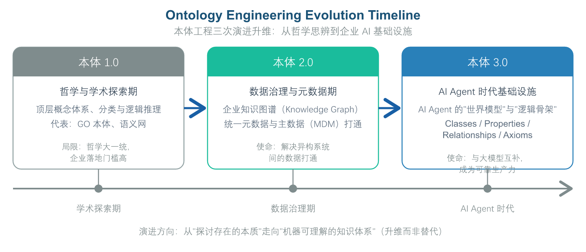

# 第 1 章 前言与大模型时代的“语义危机”

## 1.1 大模型热潮下的底层困局：缺乏“语义秩序”的知识幻觉

随着生成式人工智能（Generative AI）与大语言模型（LLM）在企业级应用中的全面渗透，企业数字化转型正式迈入“智能化”的新阶段。从基于 Retrieve-Augmented Generation（RAG）的知识库问答，到能够自主规划、拆解任务并调用 API 的 AI Agent（智能体），大模型展现出了前所未有的自然语言理解与交互能力。 然而，在经历了初步的技术尝鲜（PoC）之后，越来越多的企业在将 AI 推进至核心业务流程时，撞上了一座难以逾越的隐形高墙——语义失真与逻辑无序。 大语言模型本质上是基于概率统计的语言生成概率模型。它拥有强大的“语感”与通用常识，却缺乏对特定企业复杂业务逻辑的精准认知与刚性约束。当企业试图让 AI Agent 处理跨部门数据、执行精准业务决策或进行自动化治理时，以下底层困局频繁爆发：

1. 幻觉（Hallucination）与不可控性：大模型倾向于生成“听起来合理但实际上错误”的回答。在金融风控、医疗诊断、工业制造等容错率极低的领域，概率性的自然语言输出无法满足企业对“确定性”与“精准度”的严苛要求。
2. 企业级语义断裂（Semantic Fragmentation）：企业内部存在严重的数据孤岛与语义割裂。“客户”、“订单”、“产品”等核心概念，在 CRM、ERP、供应链系统以及不同的业务部门之间定义各异。当 AI Agent 面对同一个术语的不同业务内涵时，极易产生错误的上下文联想与动作调度。
3. “暗知识”难以沉淀与显性化：企业最核心的业务规则、领域知识与专家经验，往往散落在复杂的业务代码、口头约定或非结构化文档中。传统的向量数据库（Vector DB）仅能做到“相似度检索”（Similarity Search），无法理解概念之间的深层逻辑关系（如包含、因果、推导、约束等），导致 RAG 系统的检索召回率高却精度极低。

企业级 AI 应用的竞争，已经从“比拼模型参数大小”转向了“比拼企业私有知识的语义供给质量”。 缺乏统一、严谨语义秩序的 AI 架构，无异于在沙滩上建高楼。

## 1.2 本体论的升维：从哲学抽象到企业 AI 基础设施

面对大模型时代的"语义危机"，计算机科学界与企业架构师们重新将目光投向了一项在人工智能发展史上沉淀多年、却在企业长期应用中被忽视的核心技术——本体论（Ontology）。与单纯依赖统计概率的大语言模型不同，本体论通过形式化的逻辑体系为企业构建了一套可计算、可验证、可约束的"语义秩序"，成为破解 AI 幻觉与语义断裂难题的关键路径。

本体（Ontology）这一概念有着深厚的哲学渊源。早在公元前 4 世纪，古希腊哲学家亚里士多德便在其著作《形而上学》中系统探讨了"存在"的本质属性与概念分类，将其称为"关于存在之为存在的科学"。这一哲学传统历经两千余年的发展，逐渐演变为一套研究"范畴体系"与"概念关系"的方法论。20 世纪 90 年代，计算机学者 Tom Gruber 将这一哲学概念引入人工智能领域，并在 1993 年给出了至今仍被广泛引用的经典定义："本体是对共享概念模型的明确形式化规范"（An explicit, formal specification of a shared conceptualization）。这一定义包含四个核心要素：**共享（Shared）**指面向特定群体的共识，**概念模型（Conceptualization）**指对现实世界的抽象表达，**明确（Explicit）**指概念与约束有清晰的定义，**形式化（Formal）**指使用数学逻辑语言进行编码，使其可被机器理解与推理。

从哲学思辨到计算机科学，本体论完成了一次重要的范式转换——从探讨"存在的本质"转变为构建"机器可理解的知识体系"。在过去数十年的发展历程中，如图 1-1 所示，本体工程经历了三次重大演进与升维：

*图1-1: 本体工程三次演进升维 / Ontology Engineering Evolution Timeline*

- 本体 1.0（哲学与学术探索期）：聚焦于顶层概念体系的分类与逻辑推理，多存在于生物信息学（如 GO 本体）、语义网（Semantic Web）等学术领域，因过于追求“哲学大一统”和复杂的逻辑形式化，导致企业落地门槛极高。
- 本体 2.0（数据治理与元数据期）：作为传统数据治理的高级形态，本体被用于构建企业知识图谱（Knowledge Graph）、统一元数据管理与主数据（MDM）打通，试图解决企业异构系统间的数据打通问题。
- 本体 3.0（AI Agent 时代的基础设施）：在大模型时代，本体被赋予了全新的历史使命——它不再仅仅是给“人”看的数据字典，而是成为 AI Agent 的“世界模型”（World Model）与“逻辑骨架”。

在本体 3.0 时代，本体通过定义业务领域的概念（Classes）、属性（Properties）、实体关系（Relationships）以及逻辑规则（Axioms & Constraints），为企业构建了一个机器可理解、可推理、刚性约束的语义中枢。

**它与大模型形成了完美互补：**

- 大模型（LLM） 负责 概率计算、自然语言交互与泛化理解（模糊的“左脑”）；
- 本体（Ontology） 负责 精准表达、逻辑推理与确定性约束（严谨的“右脑”）。

两者相结合，才能真正让 AI Agent 在企业级严谨业务场景中“知其然，更知其所以然”，实现从“聊天对话”向“可靠生产力”的跨越。

## 1.3 本体管理：数据管理的语义增强层，而非替代

### 1.3.1 一句话定位：本体是 AI 时代的“增强版术语表”

在 DAMA-DMBOK 等主流数据管理体系中，业务术语表（Business Glossary）一直是数据治理的基石能力：它为“客户”“订单”“产品”等核心业务概念给出统一的名称与定义，是企业对齐业务口径的第一道防线。从这个角度看，**业务术语表其实就是在“小数据时代”的简化版本体**——两者本质上在做同一件事：让业务概念拥有唯一、明确的语义。

然而，术语表有一个天生的软肋：它的消费对象是“人”。术语表以“名词 + 文字释义”的形式存在，供业务人员与分析师翻阅；而“给人看”的东西，往往很难被真正管好——许多企业的术语表建完就沦为静态文档，业务不用、系统不消费，变更不传导、口径难追溯，最终流于形式。

进入大模型与 AI Agent 时代，情况发生了根本变化：**机器开始“思考”了**。AI 要理解“客户与合同、订单是什么关系”“一个客户可以签几份合同”，不能再像人一样“读懂”自然语言定义，它需要可计算、可推理、可校验的语义。对语义一致性的刚性追求，让术语表从“人读词典”升维为“机器语义资产”成为顺理成章的事——这个升维后的形态，就是本体。

因此，如果要用一句话回答“本体到底是什么”，最直白的答案是：**本体本质上是 AI 时代增强版的业务术语表**——它在术语定义之上，叠加了关系层、约束层与映射层，把名词、关系、约束与映射变成机器可读、可推理、可校验的语义资产。

由此引出本节的核心定位：**本体管理不是独立于数据管理之外的新体系，而是数据管理向语义层的延伸**。在 DAMA-DMBOK、DCMM 等主流数据管理知识体系中，并没有一个独立的“本体域”；本体能力天然归属于**元数据管理、业务术语与数据标准**的范畴，是其“向上增强”的语义治理层。传统数据管理回答“数据存哪里、值是什么、质量好不好、血缘怎么走”（面向记录、表、字段）；本体管理补充回答“业务概念是什么、概念之间是什么关系、机器应当如何理解业务”（面向业务语义与知识，服务大模型与 Agent 推理）。两者是同一数据资产的两层视角，前者是底座，后者是增强，**不是替代**。

### 1.3.2 概念谱系：本体不是凭空出现

本体之所以容易让人觉得“凭空出现”，是因为它在形式上（图、公理、推理机）与传统数据管理差异显著。但沿着“语义资产”的演进谱系看，本体的位置非常自然：

| **语义资产** | **回答的问题** | **结构特征** | **机器可消费性** |
| --- | --- | --- | --- |
| 业务术语表（Glossary） | 概念是什么（名词 + 定义） | 词条 | 弱（人读词典） |
| 受控词表 / 分类体系（Taxonomy / SKOS） | 概念之间的层级与别名 | 层级树 | 中（可检索） |
| 本体（Ontology） | 概念 + 关系 + 约束 + 推理 | 图 + 逻辑公理 | 强（可推理、可校验） |
| 知识图谱（Knowledge Graph） | 真实实体与实例数据 | 本体 + 实例填充 | 强（可查询、可消费） |

**这个谱系说明三点：**

- **本体复用术语表的成果**：本体的业务概念必须来源于已经治理评审过的业务术语与数据标准，而不是另造一套词；本体只是把术语“扩展”出关系、约束与推理能力。
- **逐级增强而非推倒重来**：从术语表到本体，每一步都是在上一级基础上增加结构与可计算性——术语表加层级成为分类体系，再加关系与公理成为本体，再灌入实例成为知识图谱（具体方法见第 3 章 3.3.1 的四级阶梯）。
- **“人读词典”升级为“机器语义资产”**：改造后的术语表不再仅仅给人查阅，同时供给数据质量校验、指标口径校验、数据目录血缘、大模型 RAG 与 Agent 推理。

### 1.3.3 边界：本体管理管什么、不管什么

增强不等于包办。本体管理在数据管理体系中的边界应当清晰：

- **本体管理负责**：概念语义与业务定义、概念间关系与推理规则、语义约束（SHACL / 公理）的建模与治理，以及本体概念到底层物理资产（元数据、字段、主数据、指标、报表）的语义锚定与映射。
- **仍然归传统数据治理负责**：主数据实例的管控与黄金记录、数据质量规则的执行与监控、数据安全与访问权限、数据生命周期与存储。这些不因本体层的存在而转移。

两者通过**锚定（Anchor）与映射**连接：本体概念绑定到元数据与字段之上，赋予物理数据“语义身份”（机制详见第 10 章 10.2 节）。边界不清会滑向两个极端——要么本体与治理脱节，成为“自嗨的私有资产”；要么本体被粗暴并入传统治理后，退化成一个失去推理能力的静态词典——两者都使本体的价值归零。

### 1.3.4 为什么现在必须讲清这个关系

其一，**AI 时代第一次让术语表有了机器消费方**。过去业务术语表建完常流于静态文档，业务不用、系统不消费；而大模型与 Agent 要准确理解企业业务，必须依赖概念、关系与语义——术语表由此从“合规文档”变成“AI 生产必需的输入资产”，业务方与 AI 团队会主动来消费它，倒逼术语的审批、变更与认责真正运转起来。

其二，**防止两个极端**。完全割裂：AI 团队脱离数据治理私建一套本体，与治理侧的术语、标准两套词汇并存，AI 输出口径与 BI 报表口径对不上；粗暴归一：把本体整体丢给传统数据治理团队全权接管，缺乏知识工程能力后，本体退化为简单业务词典，推理与复杂关系能力被废掉。正确姿势是**治理制度、审批流程、业务概念来源归一；专业岗位、建模执行分工**——业务定义归治理，语义建模归知识工程；同一套审批流，两套专业执行角色（组织落地详见第 10 章与第 15 章）。

## 1.4 OMBOK 发起的初衷与“三大铁律”

面对本体工程从学术走向企业落地的巨大历史机遇，行业内也出现了一系列亟待解决的乱象与偏颇。一方面，部分机构将本体论过度学术化、神秘化，陷入“言必称哲学”的玄学讨论；另一方面，部分技术人员生搬硬套大模型全自动生成，忽视了企业数据治理的严肃性，甚至混淆了本体与数据模型、知识图谱的工程边界。 为此，DAiMA-国际数据和人工智能管理协会 正式发起并组织构建 OMBOK（Ontology Management Body of Knowledge，本体管理知识体系），旨在为全球数字化转型与 AI 落地从业者提供一套标准化、工程化、可落地的知识体系与实践指南。 OMBOK 明确拒绝概念炒作，坚定立足工程实践，严格遵循以下 “三大铁律”：

### 铁律一：锚定企业场景，死磕业务语义

“不搞虚无缥缈的大一统通用哲学，一切以解决企业真实业务问题为终点。” OMBOK 坚决摒弃试图构建“包含宇宙万物”的抽象通用本体的学术陷阱。OMBOK 的核心轴心永远是 “企业与领域业务语义”。任何本体构建过程，必须由业务能力问题（CQ）驱动，直接回答业务部门“需要解决什么决策问题”、“如何定义业务资产”。本体的价值不在于概念多么高深，而在于能否精准映射企业的商业逻辑。

### 铁律二： 模式骨架与图谱实例高效协同

“本体（Ontology）定义基因与规则，知识图谱（Knowledge Graph）承载实体与肉体。” 必须严格界定本体与知识图谱的工程边界：

- 本体（Ontology / TBox）：负责定义概念体系、业务规则、公理约束与关系逻辑。它是企业知识的“ 模式骨架（Schema）”与“基因”。
- 知识图谱（Knowledge Graph / ABox）：负责将企业海量的真实业务数据、实体（Instances）与属性值灌入骨架中。它是企业的“数据实体”与“肉体”。

两者不是互相替代的关系，而是“基因与肉体”的有机统一。不理解本体而盲目建图谱，会导致图谱失去逻辑约束；脱离图谱与真实数据谈本体，则会导致本体沦为纸上谈兵。

### 铁律三：坚持人机协同，严禁无人驾驶变更

“大模型可用于辅助语义提取，但核心本体的变更与演进必须经过严格的语义治理。” 在大模型时代，AI 可以极大加速本体的构建过程（如通过 LLM 自动从非结构化文档中抽取候选实体与关系）。然而，绝不能允许大模型直接、全自动地反哺修改企业的核心本体。 企业核心本体代表着企业的法律法规、风控底线与最高业务规则。OMBOK 强调“人机协同”（Human-in-the-Loop）治理范式：大模型作为“提案者”提出语义演进建议，人类专家与语义治理委员会（Governance Board）作为“决策者”进行审核校验。确保本体在保持敏捷演进的同时，风险绝对可控。

## 1.5 本章小结

大模型时代的到来，没有让传统的数据管理与语义定义过时，反而将其推向了前所未有的战略高度。从“数据治理”走向“语义治理”，是企业级人工智能能够真正落地的必由之路。 OMBOK（本体管理知识体系）的推出，正是为了在“大模型的概率幻觉”与“企业业务的确定性需求”之间搭建一座坚固的桥梁。在接下来的章节中，我们将详细展开 OMBOK 本体车轮图的总体架构，并逐一剖析支撑这一体系落地建设的 10 大知识域与实践工程。

## 相关笔记

- [[00-目录]]
