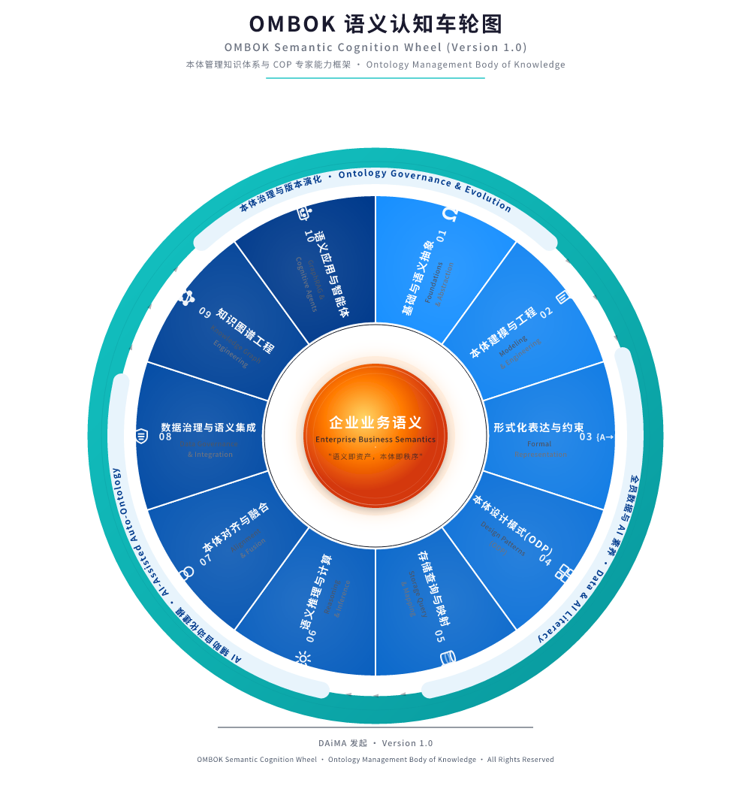
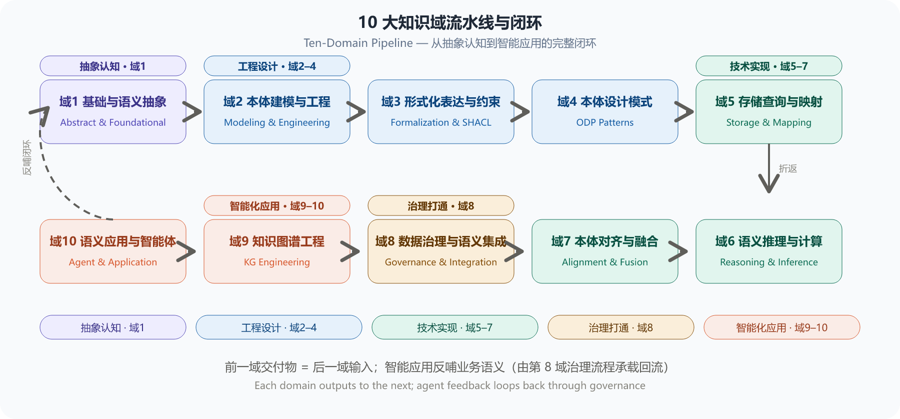
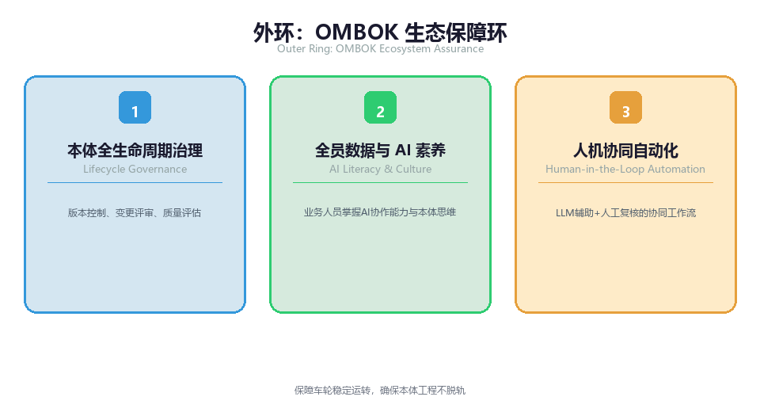
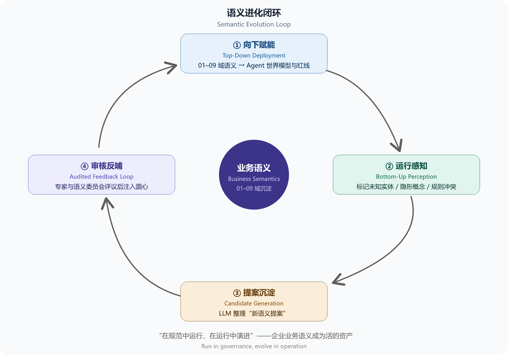

**第 2 章 OMBOK 本体车轮图总体架构**

## 2.1 车轮图设计哲学："一核、十域、三支撑、一演进"

为了将复杂、抽象的本体工程转化为企业可操作、可度量、可演进的标准化建设路线，本白皮书借鉴了软件工程知识体系（SWEBOK）、数据管理知识体系（DMBOK）的成熟框架设计理念，结合本体工程的独特技术特征，创新性地提出了"OMBOK 本体车轮图"（OMBOK Ontology Wheel）总体架构。

传统企业 IT 架构通常采用"自下而上"的线性堆栈思维，将系统划分为数据层、服务层、应用层等固化的技术栈结构，各层之间通过接口调用进行单向传导。然而，本体工程的核心对象——业务语义——并非一个静态的技术产物，而是一个随业务演进不断变化、需要多方协同治理的动态知识体系。基于这一认知，OMBOK 车轮图**如图2-1所示**采用了同心闭环（Concentric Closed-Loop）的拓扑结构，以"业务语义"为轴心，以十大知识域为辐条，以治理保障为外环，形成了一个从内向外辐射、又从外向内回流的双向循环体系。它表达的核心理念是：企业语义不是静止不动的代码文件，而是围绕业务内核持续运转、自我净化、不断进化的认知引擎。

*图2-1: OMBOK本体车轮图 / OMBOK Ontology Wheel*

车轮图整体视觉与逻辑架构可以精炼归纳为 "一核、十域、三支撑、一演进"：

- 一核：位于圆心的“企业与领域业务语义”，是整个体系驱动的源头与唯一事实来源（Single Source of Truth）。
- 十域：分布在圆心周围的十条辐射状“辐条”，代表本体工程落地必须履行的十个专业技术与管理领域。
- 三支撑：环绕外围的“轮胎外环”，提供治理、文化与自动化工具底座，保障车轮运转时的稳定性与安全边界。
- 一演进：连接最外层应用与最内层业务语义的“回流闭环”，赋予企业语义体系生生不息的自进化能力。

## 2.2 核心轴心：企业与领域业务语义

车轮图的最中央是整个知识体系的轴心（Hub）—— 企业与领域业务语义。 标语（Slogan）“语义即资产，本体即秩序” 深刻揭示了轴心的战略定位。在传统数字化体系中，数据的价值往往被固化在特定的数据库表格或应用程序逻辑中，一旦脱离原有系统，数据就会失去含义。 OMBOK 强调，业务语义应当脱离具体的技术实现而独立存在：

1. 业务概念的权威中枢：定义全企业（如“客户”、“保单”、“合同”、“设备”）或特定领域（如“临床诊疗”、“高精供应链”）的底层概念集合。
2. 逻辑规则的形式化表达：用机器可读的约束（如“一位客户在同一个结算周期内只能绑定一个主账户”）来表达业务规则，取代散落在业务系统中的硬编码代码。
3. 消除语义二义性：打破跨部门沟通中的“同名异义”与“异名同义”乱象，为人类业务专家与机器 AI Agent 提供统一的共识基座。

所有的技术手段、工具链和治理流程，都是为了保护、沉淀并激活这个业务语义轴心。

## 2.3 中层十辐条：10 大知识域概览

围绕业务语义轴心，10 大知识域按照顺时针方向逻辑展开，形成了从"抽象认知  工程设计  技术实现  治理打通  智能化应用"的完整闭环。**如图2-2所示**，10 大知识域并非孤立存在，而是沿着企业语义工程的全生命周期依次展开、层层递进：从最顶层的哲学思辨与概念抽象出发，逐步向下游推进到形式化建模、存储计算、推理融合，最终汇聚到知识图谱构建与 AI Agent 应用落地，形成了一条清晰的"语义价值链"。各知识域之间通过标准化的输出输入接口实现无缝衔接——前一域的交付物即为后一域的输入，共同保障企业本体工程从理论到实践的完整落地。

*图2-2: 10大知识域流水线与闭环 / Ten-Domain Pipeline — 从抽象认知到智能应用的完整闭环*

各知识域的具体职责与工程边界如下表所示：

| **知识域** | **知识域名称** | **核心职责与工程目标** | **关键产出/交付物** |
| --- | --- | --- | --- |
| 域1 | 基础与语义抽象 | 厘清概念哲学，定义顶层/上层本体规范，界定本体与数据模型、元数据的本质区别。 | 上层本体规范（Upper Ontology）、术语对齐表 |
| 域2 | 本体建模与工程 | 采用敏捷建模方法论，基于业务能力问题（CQ）驱动本体需求定义与概念建模。 | 能力问题列表（CQs）、概念模型图、业务规则矩阵 |
| 域3 | 形式化表达与约束 | 运用 RDF、OWL 2 标准语法定义 TBox，采用 SHACL/ShEx 编写刚性数据质量校验规则。 | OWL 2 形式化文档、SHACL 质量校验规则文件 |
| 域4 | 本体设计模式 (ODP) | 复用经过工程验证的标准语义范式（Part-Whole、Role-Actor、事件时序等），提升建模效率。 | 模式库映射表、领域扩展模型 |
| 域5 | 存储查询与映射 | 进行 三元组存储（Triple Store）/图数据库选型，编写高效 SPARQL 查询，使用 R2RML 实现关系数据映射。 | SPARQL 查询套件、R2RML/RML 映射脚本 |
| 域6 | 语义推理与计算 | 引入推理机（如 Pellet、HermiT）进行本体一致性校验、逻辑推理与隐性关系挖掘。 | 推理规则库、逻辑冲突诊断报告 |
| 域7 | 本体对齐与融合 | 解决多系统、跨部门甚至跨企业间的语义冲突，完成本体对齐（Alignment）与融合。 | 语义映射表（Mapping Table）、融合后统一本体 |
| 域8 | 数据治理与语义集成 | 将本体与传统数据治理打通，锚定主数据（MDM）、数据血缘（Lineage）及统一指标库。 | 语义元数据目录、主数据-本体锚定图谱 |
| 域9 | 知识图谱工程 | 实施 模式图谱（Schema/TBox）与数据实体图谱（ABox）的绑定与大规模数据灌入。 | 大规模企业知识图谱（Knowledge Graph）、实体关联库 |
| 域10 | 语义应用与智能体（Agent） | 为 GraphRAG 检索增强提供结构化语义，为 AI Agent 提供动作空间（Action Space）与世界模型。 | Agent 语义接口（Tools/APIs）、GraphRAG 索引库 |

## 2.4 十大知识域统一章节结构

OMBOK 对 10 大知识域（第 3 章至第 12 章）采用统一的五段式章节结构，确保知识体系的系统性与一致性，也便于读者建立稳定的阅读预期。每个知识域均包含以下五个标准小节：

| **小节** | **标题** | **内容定位** |
| --- | --- | --- |
| X.1 | 域定义与工程目标 | 明确本领域解决的核心企业痛点、工程目标，以及与相邻知识域的职责边界。 |
| X.2 | 核心概念与理论基石 | 阐述本领域关键概念、底层理论与对应的 W3C/ISO 国际标准，给出核心术语的形式化定义。 |
| X.3 | 实施方法与技术工具 | 提供可落地的工程方法论、标准操作流程、工具链选型，以及 Turtle、SHACL、SPARQL 等代码示例。 |
| X.4 | 人机协同与 AI 赋能 | 说明大模型（LLM）在本领域的辅助提质方式，明确人类专家质量把关的强制节点，贯彻"人机协同（Human-in-the-Loop）"铁律。 |
| X.5 | 语义治理与质量评估 | 定义本领域特有的量化质量指标、版本管理规范与安全风控要求，以及融入企业治理机制的路径。 |

该结构覆盖了"目标定义→理论基础→工具落地→人机协作→质量治理"的完整工程闭环，同时与第 15 章 COP 认证的五大能力维度（概念理解、理论深度、工程实操、人机协作、治理意识）天然对齐。

## 2.5 外环支撑：OMBOK 生态保障环

如果将 10 大知识域比作驱动车辆前进的辐条，那么最外层的生态保障环（Outer Guarantee Ring） 就是包裹在车轮外侧的“轮胎”。它负责与复杂的外部企业环境接触，吸收震动、提供抓地力，确保本体工程在运行过程中不脱轨。

外环由如图2-2所示的三大不可或缺的环境底座构成：

*图2-3: OMBOK生态保障环 / OMBOK Governance Outer Ring*

1. 本体全生命周期治理（Lifecycle Governance）：

本体不是一次性交钥匙的工程，而是动态演进的软件资产。必须建立类似软件工程的版本控制机制（如 Git-based Ontology Versioning）、变更评审流程（Change Management Board）以及质量评估指标（清晰度、完整性、扩展性）。

2. 全员数据与 AI 素养（AI Literacy & Culture）：

践行 “学 AI 素养，做 AI 主人” 的核心宣传语。语义治理不仅仅是 IT 部门的事情，业务人员必须具备将“隐形业务规则”转化为“显性概念表达”的 AI 时代基础素养，消弭业务与技术之间的对话鸿沟。

3. 人机协同自动化（Human-in-the-Loop Automation）：

在技术工具层，充分释放大模型的自然语言提炼能力。大模型可以自动分析海量文档并生成初始本体草案（Draft），但必须在流程上强制保留人类专家审核节点（Human-in-the-Loop），确保自动化带来的高效不会破坏语义体系的确定性与严谨性。

## 2.6 进化闭环：语义进化与知识反哺路径

传统数据建模的最大痛点在于“上线即归宿，开发即落后”——系统一旦发布，模型就跟不上快速变化的业务需求。OMBOK 通过设计如图2-4所示的 “语义进化闭环”（Semantic Evolution Loop） 彻底解决了这一难题。

*图2-4: 语义进化闭环 / Semantic Evolution Loop*

**闭环的运转机制如下：**

1. 向下赋能（Top-Down Deployment）：从圆心经过 01-09 知识域沉淀出的刚性语义体系，在 语义应用与智能体（第10域（Agent）） 中被直接注入给 AI Agent，成为 Agent 执行任务时的世界模型与规则红线。
2. 运行感知（Bottom-Up Perception）：AI Agent 在执行复杂业务决策、与用户自然交互或处理异常数据流的过程中，会频繁遇到现有本体未覆盖的“未知实体”、“隐形概念”或“业务规则冲突”。
3. 提案沉淀（Candidate Generation）：Agent 系统自动将这些语义盲区打上标记，利用大模型的总结能力整理成“新语义提案”（Semantic Change Proposal）。
4. 审核反哺（Audited Feedback Loop）：提案沿着闭环回流至最外层的"本体治理流程"，由领域专家与语义委员会进行评议。通过审核的新概念与新规则被正式采纳，重新注入并更新圆心的"业务语义"。

通过这一闭环，OMBOK 架构实现了 “在规范中运行，在运行中演进” 的自适应进化能力，真正让企业业务语义变成了活的资产。

## 2.7 本章小结

OMBOK 本体车轮图不仅提供了一幅宏观的架构全景图，更为企业指明了本体工程落地的科学路径。 它告别了过去“为了建本体而建本体”的学术误区，将业务语义置于最核心位置，借由 10 大知识域完成工程化实施，依靠外环治理与人机协同提供安全保障，最终通过 Agent 应用形成自演进闭环。

在接下来的第 3 章至第 12 章中，我们将逐一深入每个知识域的内部，进行深度拆解与实操工程剖析。

## 相关笔记

- [[00-目录]]
