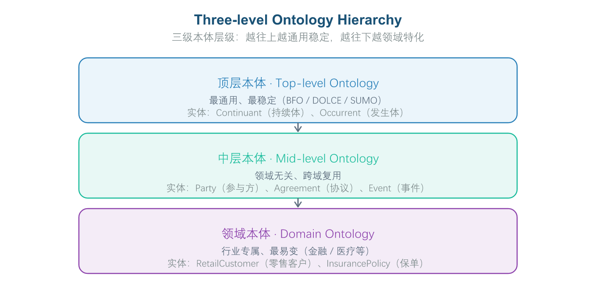
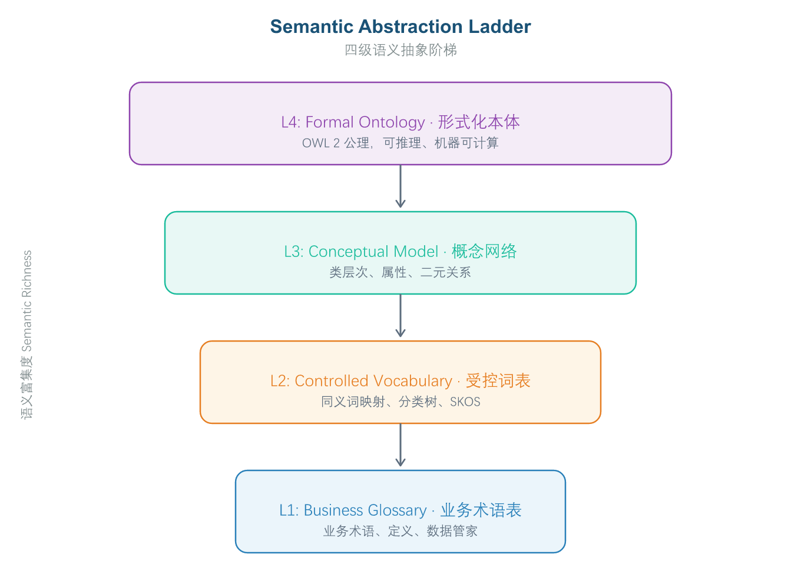
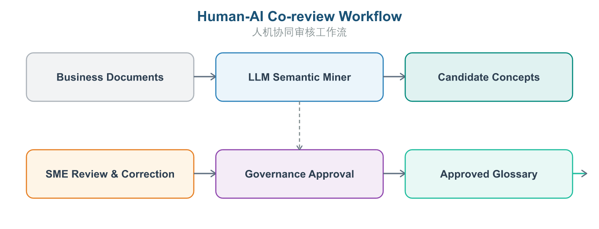
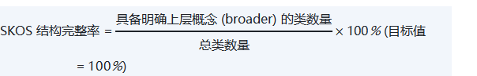

# 第 3 章 第1域：基础与语义抽象

## 3.1 域定义与工程目标：厘清语义本质与概念抽象边界

“基础与语义抽象”（Foundations & Semantic Abstraction）是 OMBOK 知识体系的起点，旨在为企业提供一套统一的概念抽象方法论与底层语义秩序。本域关注如何从纷繁复杂的业务现实中，提取出具有通用性、稳定性与机器可理解性的“概念（Concepts）”、“范畴（Categories）”及其“基本关系（Fundamental Relationships）”。

**企业痛点**

在企业语义基础设施建设中，最常见的障碍集中在以下三个方面：

- **语义二义性导致“同名异义/异名同义”，数据难以融合**：企业内部不同业务部门（如销售部、财务部、风控部）对同一核心概念往往存在不同的定义和理解。例如，“客户”一词在销售场景中指下单主体，在财务场景中指付款方主体，在风控场景中则可能指担保方；“收入”在不同部门的统计口径也可能完全不同（是否含税、是否包含退款等）。这种语义二义性在数据汇总、跨部门协作时会导致指标冲突、报表不一致等问题，严重影响业务分析和决策的准确性。
- **业务模型与技术实现深度耦合，语义资产难以传承**：传统数据建模方式将业务语义直接硬编码在数据库表结构（Schema）或代码逻辑中，导致业务知识与技术实现深度绑定。当企业进行系统重构、技术栈升级或应用迁移时，这些内嵌在代码中的业务语义资产往往需要重新梳理和编码，不仅造成重复劳动，还可能因迁移过程中的遗漏或理解偏差导致业务规则丢失，无法实现业务知识的长期积累和跨系统复用。
- **大模型缺乏企业顶层概念映射，难以理解业务边界**：通用大语言模型（LLM）虽然具备强大的语言理解能力，但缺乏特定企业的业务概念体系和抽象范畴映射。在处理复杂业务逻辑时，模型容易出现“概念混淆”问题，例如将“企业客户”与“个人客户”的业务边界模糊化，或将“销售额”与“营业额”等不同统计口径的概念混为一谈。这种跨范畴的逻辑幻觉会导致 AI 应用（如智能问答、辅助决策）的输出结果不可靠，难以直接用于生产环境。

**工程目标**

**本域确立以下核心工程目标：**

1. **构建企业统一术语中枢**：通过系统性收集、梳理和对齐企业各业务域的核心概念，消除“同名异义”与“异名同义”现象，形成全公司统一认可的业务术语字典（Glossary）与概念关系网络，为后续的本体建模、数据治理和 AI 应用提供一致的语义基础。
2. **业务语义资产化**：将业务概念从具体技术实现中剥离出来，形成独立于技术平台的企业语义资产。无论底层技术架构如何演进，业务语义都能保持稳定，并可被复用于新系统建设、数据平台、AI 模型训练等多种场景，实现业务知识的长期积累与跨场景复用。
3. **与相邻知识域的逻辑边界**：本域专司“是什么（What）”——定义概念与抽象方法；其下游的域2（本体建模与工程）负责“怎么建（How）”，域9（知识图谱工程）负责“落地实例（Instance）”。三者构成“抽象层 → 建模层 → 实例层”的清晰分工。

围绕“语义抽象究竟是什么”这一根本问题，本节先厘清三个最基础的概念，它们是理解整个 OMBOK 体系的地基。

### 3.1.1 语义抽象的核心目标——让数据“机器可理解”

语义抽象的本质，不是把文档写得更工整让“人”读得懂，而是把业务含义**显式建模为机器可读取、可推理的结构**（如 RDF 三元组、OWL 公理），使系统能够自动理解概念之间的关系、并跨源集成与推理。

这里的关键词是“机器可理解（machine-understandable）”而非“人类可读”。一张漂亮的 ER 图或一份自然语言说明书，人能看懂，但机器无法据此自动推理；“机器可理解”要求语义以结构化、带逻辑约束的形式表达，推理机才能据此做一致性检查、推导隐含关系。这是本体区别于普通文档或图表的根本特征，也是后续所有 AI 应用（RAG、Agent）能“讲逻辑”的前提。

### 3.1.2 受控词表、本体、知识图谱的层级递进

三者能力**逐级递进**，不可相互替代：

- **受控词表（Controlled Vocabulary）**：最轻量，仅规范“词汇”及其同义/层级关系（如 SKOS 标准），解决“叫法不一”的问题。
- **本体（Ontology）**：在词汇之上定义“类、属性、约束与公理”，形成可推理的模式（Schema / TBox），解决“概念间如何逻辑关联、能否推导”的问题。
- **知识图谱（Knowledge Graph）**：在本体模式之上再挂载海量“实例数据（ABox）”，并支持查询与推理，解决“具体世界有哪些实体、关系如何”的问题。

一句话记忆：**词表规范词 → 本体补关系与约束 → 图谱再叠加实例与推理**。误以为“知识图谱比本体更轻量”或“词表+本体即图谱”都是常见误区——图谱的核心增量正是大规模实例层。

### 3.1.3 域1 在 OMBOK 车轮图中的定位（抽象层）

OMBOK 把“从抽象到落地”的分工切成三层，域1 处于最上方：

- **抽象层（域1）**：回答“什么是概念、如何抽象”，产出统一术语字典与概念网络。
- **建模层（域2）**：把抽象出的概念落成可工程的领域本体模型。
- **实例层（域9）**：把模型落地为具体的实例数据（对应 TBox 模式层与 ABox 实例层）。

域1 的典型越界误区是把“大模型微调训练”“图数据库运维”等归到自己名下——这些分别属于工程或应用层，不在抽象范畴之内。

## 3.2 核心概念与理论基石：顶层本体、描述逻辑与三元组范式

为了避免“重复造轮子”并保证跨领域的语义可兼容性，抽象过程需参考成熟的顶层本体规范。本体工程遵循“三级本体层级”设计原则，**如图3-1所示**，从最抽象的顶层范式到具体的行业应用，形成了一个层层递进、可复用的语义架构：

**顶层本体（Upper Ontology / Top-Level Ontology）**是整个体系的基石，定义了极其抽象、跨越所有领域的普适范式（如时间、空间、实体、过程、角色等基本概念）。它为所有行业本体提供了统一的哲学基础和逻辑框架，确保不同领域的本体在底层语义上保持一致性。经典的顶层本体规范包括：BFO（Basic Formal Ontology）——被生物医学领域广泛采用的开源规范，SUMO（Suggested Upper Merged Ontology）——覆盖范围最广的通用本体，以及 DOLCE（Descriptive Ontology for Linguistic and Cognitive Engineering）——侧重于人类认知语言学的描述本体。

**中层本体（Mid-Level Ontology）**是连接顶层本体与具体行业领域本体的桥梁，它在顶层本体的基础上，进一步定义了跨行业通用的业务范式（如“组织结构”、“合同契约”、“交易过程”、“产品生命周期”等）。中层本体为企业提供了“开箱即用”的业务语义模板，避免每个行业都从零开始建模，同时保证了跨行业协作时的语义兼容性。

三级本体层级从上到下依次为：顶层本体（普适范式）→ 中层本体（跨行业范式）→ 领域本体（行业专属范式），每一层都继承了上层的语义约束并进行领域特化，从而构建起一个既统一又灵活的企业语义体系。

*图3-1: 三级本体层级 / Three-level Ontology Hierarchy*

**描述逻辑（Description Logics, DL）** 本体抽象的形式化数学基础是描述逻辑（一阶谓词逻辑的可判定子集）。描述逻辑定义了本体的四大核心要素：

- 概念（Concepts / Classes）：实体的集合，如 Customer（客户）。
- 角色/关系（Roles / Properties）：实体间的二元关系，如 hasOrder（拥有订单）。
- 个体（Individuals / Instances）：领域中的具体对象，如 John_Doe。
- 公理（Axioms）：关于概念和关系的断言，如 VIPCustomer ⊆ Customer（VIP 客户是客户的子集）。

**语义三元组范式（Triple Paradigm）** 一切语义抽象的形式化表达均遵循 主语 - 谓语 - 宾语（Subject-Predicate-Object, SPO） 的三元组范式，例如：[Customer_001] --(hasStatus)--> ["Active"]。

**概念厘清：本体 vs. 数据模型 vs. 元数据**

| **维度** | **本体 (Ontology)** | **数据模型 (Data Model)** | **元数据 (Metadata)** |
| --- | --- | --- | --- |
| 核心关注点 | 现实世界的业务概念与逻辑约束 | 数据的物理/逻辑存储结构 | 关于数据与系统资源的描述数据 |
| 面向对象 | 业务专家、AI Agent、逻辑推理机 | 数据库管理员（DBA）、软件开发人员 | 数据治理人员、数据工程师 |
| 逻辑基础 | 描述逻辑（开放世界假定 OWA） | 关系代数 / 图模型（封闭世界假定 CWA） | 键值对 / 层次结构表 |
| 可扩展性 | 极高，概念与关系可动态叠加推导 | 较低，变更表结构或字段成本极高 | 中等，多为静态目录描述 |

要支撑前述抽象方法，需要先掌握一组基础构件。下面逐一展开语义抽象的“零件清单”。

### 3.2.1 RDF 三元组范式（SPO）

RDF 以“主语—谓语—宾语”（Subject-Predicate-Object）三元组表达一条**陈述（Statement）**，多条三元组相连即构成 RDF 图。这是语义网最基础的原子数据模型。注意区分两个层次：**三元组**是数据原子（一条主谓宾），**RDF 图**是由三元组构成的网络。常见误区是把“节点+边”直接说成三元组——节点与边只是图的直观，三元组才是其基本组成单元；也不能把三元组等同于关系数据库的“表/行/列”或带权图的“节点+权重”。

### 3.2.2 IRI/URI 资源标识

RDF 中每个**资源**都由全局唯一的 **IRI/URI** 标识，确保跨系统可解析、可去重。需要区分“资源”与“值”：**字面量（Literal）**（字符串、编号、日期）只是“值”，没有独立身份，不能充当资源标识；电子表格的单元格坐标、界面上的颜色图标也都不具备全局唯一性。凡是需要被独立引用、可跨系统对齐的对象，都必须有一个 IRI。

### 3.2.3 空白节点（Blank Node，匿名资源）

空白节点是**未分配 IRI 的匿名资源**，适合表达“没有独立名称的中间结构”（如 RDF 列表、复合地址）。它与字面量不同（字面量是值，空白节点仍是资源），也与具名资源不同（具名资源才有 IRI、可独立寻址）。空白节点在任意 RDF 序列化中都可能出现，并非知识图谱独有；其风险在于跨图合并时身份难以对齐，因此是质量评估的关注点。

### 3.2.4 描述逻辑（DL）作为形式化语义基础

描述逻辑（如 ALC）以概念、角色、个体及构造符（交、并、补、存在/全称限定等）提供严格的形式语义，是 OWL 的底层逻辑。它最关键的工程性质是**“可判定”**——推理结果可在有限时间内得出。这里有一处高度易混的误区：一阶逻辑表达力强但通常**不可判定**，而描述逻辑恰恰是刻意受限（牺牲部分表达力）以保可判定，这正是本体推理可靠性的根基。把描述逻辑说成“一阶逻辑、不可判定”正好说反了。

### 3.2.5 三级本体层级（顶层 / 中层 / 领域 / 应用）

典型层级自顶向下为：**顶层本体 TLO**（如 SUMO、BFO，最通用、最稳定）→ **中层本体**（领域无关但跨域复用）→ **领域本体**（如金融、医疗）→ **应用本体**（具体系统，最易变）。越往上越稳定、越往下越易变；复用策略上应优先复用上层、谨慎定制下层。常见误区是颠倒“顶层最通用”与“应用最具体”的位置，或认为抽象级别对建模无实质影响。

### 3.2.6 SKOS 受控词表与层级关系

SKOS（Simple Knowledge Organization System）用 **skos:broader 与 skos:narrower** 表达概念之间的上下位层级关系；用 **skos:prefLabel / skos:altLabel** 分别表达优选标签与同义别名；用 **skos:related** 表达非层级的横向关联；skos:note 仅作注释说明。构建术语表（Glossary）时，层级关系必须靠 broader/narrower，而不能误用 related（横向）或 altLabel（别名）或 note（注释）。

### 3.2.7 Turtle 语法与命名空间前缀

Turtle（Terse RDF Triple Language）用 @prefix 前缀: <IRI> . 声明命名空间前缀，把冗长 IRI 缩写成短前缀，简化三元组书写。它是 RDF 的**序列化语法**（怎么写），与 SPARQL 的 SELECT ?s WHERE { }（怎么查）外观相近但属于不同语言，也不能与 SQL 的 CREATE TABLE 或 Python 的函数定义混淆。

## 3.3 实施方法与技术工具：抽象级别划分与术语表（Glossary）构建

在工程落地中，业务概念的抽象应当遵循**如图3-2所示**的四级递进法则，每一级都有明确的目标、方法和产出物，形成从“业务语言”到“机器语言”的完整转化路径：

- **第一级：业务术语表（Business Glossary）** — 这是语义抽象的起点，核心任务是“接地气”。需要组织业务专家和数据分析师，通过访谈、工作坊等形式，搜集各部门的原生业务语言（包括缩写、简称、内部黑话等），建立一份包含术语名称、文字定义、数据责任人（Data Steward）、使用场景的原始清单。
- **第二级：受控词表与分类体系（Taxonomy / SKOS）** — 在术语表的基础上进行“去伪存真”。对收集到的术语进行去重与归一化处理（解决“同名异义”和“异名同义”问题），并使用 SKOS 标准定义术语间的层次关系（broader、narrower、exactMatch、related 等）。
- **第三级：概念网络（Conceptual Model）** — 从“词汇”上升到“关系”。明确识别出领域内的核心“类（Class）”以及类之间的“对象属性（Object Property）”，产出轻量级概念模型，为后续形式化建模奠定结构基础。
- **第四级：形式化本体（Formal Ontology）** — 最终实现“机器可理解”。引入刚性逻辑约束（如类的互斥 disjointWith、属性基数限制、公理推导 subClassOf/equivalentClass 等），转化为 OWL 2 标准的形式化本体，使其具备自动推理和一致性校验能力。

*图3-2: 语义抽象四级阶梯 / Semantic Abstraction Ladder*

**工具链推荐**：术语与概念管理可使用 Apache Atlas、Collibra、PoolParty；SKOS / 概念建模可视化可使用 Protégé、VocBench 3（详见 4.3 节）。

在方法论之外，概念随业务演进带来的治理风险同样关键。本节讨论两点，其中之一是容易被忽视的语义漂移。

### 3.3.1 语义抽象四级阶梯方法论

四级阶梯回答了“业务语言如何变成机器语言”：术语表（接地气）→ 受控词表（去伪存真）→ 概念网络（立关系）→ 形式化本体（可推理）。每一级都是上一级的精细化，缺一不可。它也是后面域2（建模）、域3（形式化约束）的方法论 precursor——域1 负责把“概念说清楚”，下游才谈得上“建得对、推得动”。与之相关的“抽象级别（顶层/中层/领域/应用）”已在 3.2.5 讲清，二者是同一思想在“层级”与“流程”两个角度的呈现。

### 3.3.2 语义漂移（Semantic Drift）与演进风险

**语义漂移**指概念的业务含义随业务演进发生偏移；若不治理版本，历史数据会被新含义误读，是语义治理必须关注的演进风险。它与“跨系统命名不一致”不同：漂移是**同一概念随时间**的含义变化，而非不同系统间的对齐缺失。应对之道是版本管理（如版本化 IRI、变更日志），在新旧定义间建立演进关系，保证历史数据仍可按其当时的语义被正确解读——这正是 3.5.3 要展开的工程机制。

## 3.4 人机协同与 AI 赋能：大模型辅助的业务概念提取与范畴推演

在传统本体抽象过程中，概念提取是最耗时、最依赖专家经验的环节之一。企业内部的业务知识通常散落在各类非结构化文档中——SOP 操作流程、需求规格说明书、系统接口规范、会议纪要、客服对话记录等。大模型的语义理解能力为这一环节带来了革命性突破，能够以“准自动化”的方式辅助专家完成概念发现和初步整理。

大模型在概念提取中的两个核心应用场景：

- **非结构化文档概念抽取**：自动解析企业 PDF、Word 等格式的规范文档，抽取潜在候选概念（Candidate Classes）与实体关系（Candidate Relations）。例如，从“客户开户流程”文档中自动识别出 Customer、Account、KycVerification 等核心概念。
- **同义词与二义性自动识别**：利用大模型的深层语义理解能力，自动识别跨部门文档中对同一业务对象的不同表达，或标记出存在二义性的术语，供后续审核处理。

但大模型存在固有局限：一是**过度泛化**（将具体概念上升到过于抽象的层级）；二是**概念层级混淆**；三是可能产生**幻觉**概念（文档中未出现但模型自行生成的虚假概念）。因此必须建立严格的人机协同审核工作流——**如图3-3所示**，“LLM 初步提取 → 规则约束过滤 → 专家人工复核 → 正式入库”的四步闭环：

- **提示词工程规范约束**：调用 LLM 提取概念时，必须通过提示词限制输出格式（如 JSON-LD 或 SKOS），并注入 BFO/DOLCE 顶层分类本体的分类规则，引导模型生成符合本体论规范的概念层级。
- **领域专家人工复核**：LLM 提取的候选概念和关系需经领域专家逐条审核，确认准确性、层级合理性与兼容性，审核通过方可纳入正式术语字典。

*图3-3: 人机协同审核 / Human-AI Co-review Workflow*

大模型介入之后，“人”与“机”的分工边界成为新的核心议题。本节围绕这条边界讨论两点。

### 3.4.1 LLM 辅助概念提取的铁律（Human-in-the-Loop）

人机协同（Human-in-the-Loop）的**铁律**是：LLM 生成的候选概念/关系**必须由人类领域专家审核确认**，才能进入本体，防止幻觉与错误语义污染知识库。这条红线不可越过——让实习生/初级标注员“确认即可放行”权威性不足，让 LLM 输出“直接入库”是事故根源，而“完全禁止 LLM”又因噎废食、浪费提效机会。专家把关的是“语义正确性”，推理机做的是“逻辑一致性检查”，二者职责不同、不可互相替代。

### 3.4.2 LLM 在域1 的典型辅助场景

在域1（基础与语义抽象），LLM 的**典型定位**是从制度、合同、SOP 等非结构化文档中**抽取候选业务概念与范畴（上下位）关系**，作为人类专家审核的输入，加速 Glossary 与顶层概念构建。它不该做的：替代推理机做全部一致性检查（越权且不可靠）、充当数据库运维工具、自动生成并签署审计报告（越界且责任主体错误）。一句话：LLM 是“抽取与草稿助手”，不是“决策与入库主体”。

## 3.5 语义治理与质量评估：概念清晰度、二义性检测与语义对齐度

本域的治理产物——业务概念、术语表与受控词表——属于本体资产，其版本、变更与发布须由数据部门（或企业本体治理委员会）评审把关（见第 1 章 1.3）；以下为具体的治理指标与手段。

为确保抽象出的业务概念符合工程落地要求，定义以下量化评估指标：

（式 0-1）

（式 0-2）

（式 0-3）

**长效治理与安全风控机制**

- 语义变更影响分析：当一个核心概念（如“客户”）的抽象定义发生修改时，治理平台必须能够反向追溯受影响的数据流、指标公式及 AI Agent 提示词。
- 概念发布与版本控制：所有抽象出的概念语义必须纳入 Git 式的版本管理，每个概念均具备 Draft（草案）、Under Review（评审中）、Approved（已发布）、Deprecated（已废弃）四种生命周期状态。

最后，如何衡量抽象质量、守住语义一致性，需要一套治理指标。本节沿“清晰度、对齐度、可追溯”三条主线展开。

### 3.5.1 二义性检测（同词异义 / 异词同义）

**二义性检测**聚焦概念清晰度，专门排查同一词汇在不同语境指向不同概念（**同词异义 / Polysemy**）或不同词汇指向同一概念（**异词同义 / Synonymy**）。它是质量评估中与“语义清晰度”直接挂钩的维度，区别于性能类指标（查询时延、推理吞吐）和覆盖类指标（映射覆盖率）。治理目标就是把“概念二义性率”压到 1% 以内。

### 3.5.2 语义对齐度（与顶层本体对齐）

**语义对齐度（Alignment）**量化局部概念与顶层/参考本体（如 TLO、SUMO）的概念映射覆盖率与正确性，是评估抽象层治理成熟度的核心指标。它不等同于“概念覆盖率”（只看数量占比）或“推理一致性率”（关注矛盾检出）或“术语复用率”（看复用外部词表比例）——对齐度强调的是“与顶层语义的吻合程度”。目标值通常要求 ≥ 90%。

### 3.5.3 概念版本管理与语义漂移治理

当发现某概念定义已随业务变化、但历史数据仍按旧定义存储时，**最应优先做的是版本管理并标注演进**，使旧数据可被正确解读。具体包括：版本化 IRI、变更日志、生命周期状态（Draft/Under Review/Approved/Deprecated），让历史数据按其发布时的语义可追溯。绝不能“只改显示名称不改定义”（底层仍误读）、“直接删除旧数据”（破坏可追溯与合规）或“忽略变更”（放任漂移累积）。这正是 3.3.2 所述语义漂移的工程应对。

## 3.6 本章小结与示例

*本章正文围绕语义抽象的概念、方法、工具与治理展开。为帮助读者检验对前述概念的理解，章末附数道示例题供自学巩固；更系统的练习另行成册，不在此重复。建议先遮住本节末尾的参考答案与解析，独立作答后再行核对。*

#### *题目 1：在 OMBOK 中，"语义抽象"的核心目标是让数据具备下列哪种能力？*

**题目类型**：单选

- A 方便业务人员用自然语言流畅地阅读文档
- B 仅用于把数据库表结构绘制成可视化的 ER 图
- C 提升电子表格软件的排版与配色美观度
- D 让机器自动理解、推理并跨系统集成的语义

#### *题目 2：RDF 三元组的基本组成单元是？*

**题目类型**：单选

- A 由主语、谓语、宾语构成，表达一条陈述
- B 由键、值与附带的时间戳构成，类似键值对
- C 由表、行、列构成，类似关系数据库的存储方式
- D 由节点、边与边的权重构成，类似带权图

#### *题目 3：所谓"语义漂移（Semantic Drift）"是指？*

**题目类型**：单选

- A 概念含义随业务演进偏移，导致旧数据被误读
- B 推理机因算力不足而无法完成一致性检查
- C 不同系统对同一词汇采用了互不兼容的命名约定
- D 本体迭代时废弃旧概念，所有历史数据随之作废

#### *题目 4：利用大模型（LLM）辅助"业务概念提取"时，必须遵守的铁律是？*

**题目类型**：单选

- A 由实习生或初级标注员确认后即可放行
- B 大模型的输出可直接入库，无需任何审核
- C 关键概念与关系须经人类专家审核确认
- D 完全禁止大模型参与任何概念提取的工作

#### *题目 5：衡量"某领域概念与上层顶层本体（TLO）对齐程度"的指标通常称为？*

**题目类型**：单选

- A 概念覆盖率，统计本体所涵盖的概念数量在领域词表中的占比
- B 推理一致性率，反映推理机在模式层检出的逻辑矛盾所占比例
- C 语义对齐度，即与顶层本体的映射吻合程度
- D 术语复用率，衡量本体中直接沿用外部标准词表术语的比例

### 参考答案与解析

**题目 1　参考答案**：D **解析**：语义抽象的本质，是把业务含义显式建模为机器可读取、可推理的结构（RDF 三元组、OWL 公理），使系统能自动理解概念之间的关系并跨源集成（相关讨论见 3.1 节）。

**题目 2　参考答案**：A **解析**：RDF 以“主语—谓语—宾语”三元组表达一条陈述，多条三元组相连即构成 RDF 图，这是语义网最基础的原子数据模型（见 3.2 节）。

**题目 3　参考答案**：A **解析**：语义漂移指概念的业务含义随业务演进发生偏移；若不治理版本，历史数据会被新含义误读，是语义治理必须关注的演进风险（见 3.3 节）。

**题目 4　参考答案**：C **解析**：LLM 生成的候选概念/关系必须由人类领域专家审核确认才能进入本体（Human-in-the-Loop），以防止幻觉污染知识库（见 3.4 节）。

**题目 5　参考答案**：C **解析**：语义对齐度（Alignment）量化局部概念与顶层/参考本体的映射吻合程度，是评估抽象层治理成熟度的核心指标（见 3.5 节）。

## 相关笔记

- [[00-目录]]
