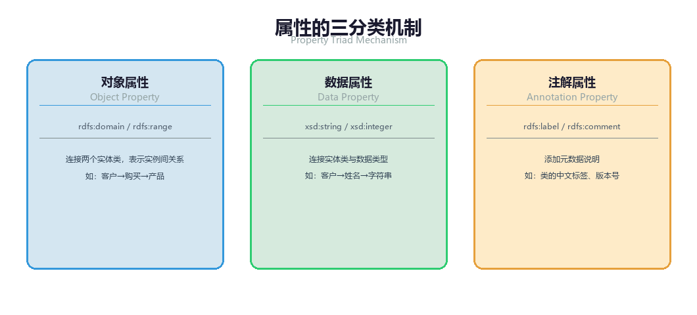
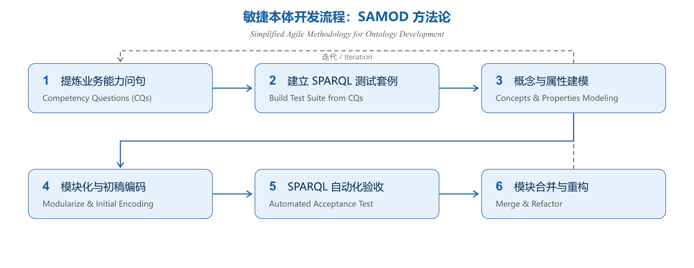
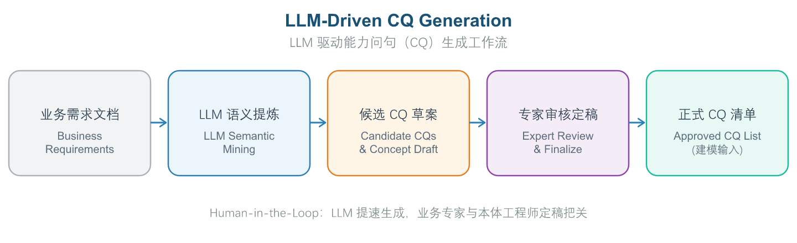
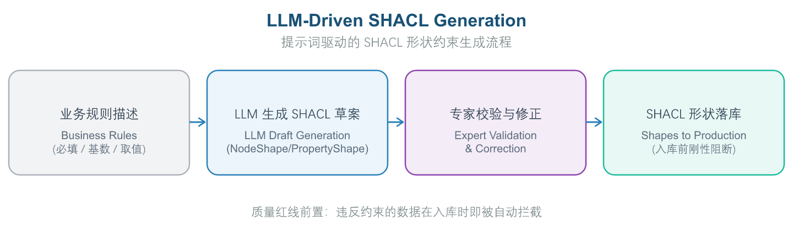
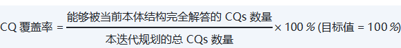
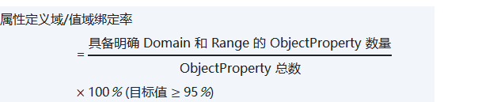

# 第 4 章 第2域：本体建模与工程

## 4.1 域定义与工程目标：业务驱动的敏捷本体建模方法论

“本体建模与工程”（Ontology Modeling Engineering）是把第1域抽象出的业务概念落成可工程化领域模型的核心建造环节。本域关注如何用敏捷、规范的方法论，将零散的业务语义构建为逻辑严密、高复用、可扩充的领域本体模型（Domain Ontology Model）。本节先界定本域的职责边界与所针对的核心痛点，再阐明其所主张的方法论。

**企业痛点**

- 语义孤岛：业务概念散落在各业务系统，缺乏统一建模，跨域难以对齐与集成。
- 瀑布式重型建模周期漫长，交付即过时；模型往往无法解答实际业务问题。
- 质量验收全凭主观评审，缺少客观、可量化的验收标尺。

**工程目标**

- 以业务驱动、敏捷迭代的方法论，把第1域抽象出的概念落成可工程化的领域本体模型。
- 以能力问句（CQ）为核心驱动力，小步快跑、增量建模，让本体随业务认知持续演进。
- 以 CQ 覆盖率等量化指标客观验收，为 AI 应用与数据治理提供可信支撑。

### 4.1.1 本域的定位：从概念抽象到领域模型

OMBOK 把“从抽象到落地”的分工切成三层，域2 处于承上启下的“建模层”：

- **抽象层（域1）**：回答“什么是概念、如何抽象”，产出统一术语字典与概念网络。
- **建模层（域2）**：把抽象出的概念落成具备逻辑约束的领域本体模型。
- **实例层（域9）**：把模型落地为具体的实例数据（对应 TBox 模式层与 ABox 实例层）。

**与相邻知识域的边界可以进一步量化：**

| **对比维度** | **本域（本体建模与工程）** | **形式化表达与约束（第5章）** |
| --- | --- | --- |
| 核心关注点 | 建模方法论、需求定义与概念结构表达 | 语法代码实现与质量约束 |
| 解决的问题 | 建什么结构（What Structure） | 代码与语法实现（Code & Syntax） |
| 输入 | 第1域输出的标准化概念体系 | 本域构建的概念与逻辑结构 |
| 输出 | 结构化的领域本体模型 | OWL 2/SHACL 形式化文档 |

### 4.1.2 语义孤岛的连锁代价：为何必须统一建模

传统本体建模最大的病灶不在技术，而在概念模型的不一致：同一概念（如“客户”“订单”）在不同部门、不同系统中各有一套定义，形成“语义孤岛”，使数据难以互通、语义难以对齐。本体建模工程的目标，正是提供统一、可复用的概念模型来消除这类歧义。与之相邻但不同质的问题包括：底层数据库的选型与性能差异（属运维范畴）、数据标准与编码规则冲突（侧重表示层规则）、主数据字段缺失与重复（字段级质量）——它们都未触及概念层的语义一致性，这正是本域的发力点。

### 4.1.3 业务驱动、敏捷迭代的建模方法论

针对“瀑布式重型建模导致周期漫长、交付即过时”“模型无法解答实际业务问题”“质量验收全凭主观”三大痛点，本域主张：

1. **能力问题驱动（CQ-Driven）的敏捷流程**：以“能力问句”（Competency Question, CQ）为建模核心驱动力——从业务人员提出的具体问题（如“系统能否识别高风险客户的关联关系？”）反向确定需要哪些类、属性和关系，按周/双周快速交付可用的本体片段，避免过度建模。
2. **高内聚与低耦合的模块化**：将复杂领域本体拆分为职责清晰、边界明确的子模块（如客户、产品、订单模块），模块内部高内聚、模块间通过标准化接口松耦合，新业务线只需增量构建新模块而非大规模重构。
3. **量化的质量验收**：以 CQ 覆盖率等客观指标替代主观评审，作为模型对 AI 应用与数据治理支撑效果的量化证据。

其内核是“业务驱动、敏捷迭代、小步快跑，按能力问句逐步增量建模”，让本体随业务认知持续演进，而不是追求一次“完美本体”。

## 4.2 核心概念与理论基石：类公理、属性分类与能力问句

在动手建模之前，必须先掌握一组形式化构件。它们决定了模型能否被机器正确推理、能否清晰界定边界、能否被高效地复用与维护。本节逐一展开这些“建模零件”。

### 4.2.1 类级公理：分类、互斥与等价

类（Class）及其层级是本体骨架。OWL 提供三类关键类级构造符：

- **类与子类（SubclassOf / rdfs:subClassOf）**：建立严谨的单继承或多继承分类（Taxonomic）结构，如 VIPCustomer ⊑ Customer。
- **类互斥（DisjointClasses / owl:disjointWith）**：声明两个类的实例集合没有交集，即“人与组织”不可能有共同实例，是防止概念被错误重叠、消解语义混淆的关键公理。配合推理机，一旦有人把某实例同时归入两个互斥类，系统即可报警。
- **类等价（EquivalentClasses / owl:equivalentClass）**：声明两类在语义上完全等价、共享同一批实例，为推理机自动归类提供依据。

需要特别区分：owl:disjointWith 表示“互不相交、不能有共同实例”，与 owl:equivalentClass（完全等价）恰好相反；rdfs:subClassOf 表达的是包含（子类）关系，也不等价。

### 4.2.2 属性的三分类：对象属性、数据属性与标注属性

*图3-4: 属性三分类机制 / Property Triad Mechanism*

属性（Property）连接概念，OWL 明确区分三类：

- **对象属性（Object Property）**：定义域与值域都是个体（资源），连接两个实体，如“客户 → 持有 → 账户”。
- **数据属性（Datatype Property）**：值域是字面量（Literal，字符串、日期、数字等），连接实体与字面量值，如“客户 → 姓名 → 张三”。
- **标注属性（Annotation Property）**：用于添加元信息，如给类或属性添加注释、标签或版本信息，不参与逻辑推理。

最基本的区分在于：对象属性连接“个体与个体”，数据属性连接“个体与字面量”。把两者的值域关系颠倒，是初学者最常见的混淆，也会导致推理与存储方式出错。

### 4.2.3 能力问句（CQ）：界定建模的范围与边界

能力问句（Competency Question, CQ）是“本体必须能回答的一组关键业务问题”清单，例如：“该客户在过去 12 个月中，通过哪些渠道触发过高风险交易，且关联的最终受益人是谁？”

**CQ 在本体工程中有三重作用：**

- **界定范围（Scope）与粒度（Granularity）**：任何不能直接或间接服务于 CQ 的类与属性，均不应被盲目引入模型，从而防止模型失控膨胀或遗漏核心语义。
- **驱动概念抽取**：从业务问题反向确定需要哪些类、属性与关系。
- **作为验收依据**：后续以“CQ 覆盖率测试”检验模型是否真正满足需求（详见 4.5 节）。

CQ 不是数据库命名规范，也不是功能/回归测试的替代品，更不是需求文档的章节大纲——它的核心职能是“用业务问题划定本体必须回答的范围，从而界定建模边界”。

### 4.2.4 属性特征：函数属性、逆属性与传递性

除了分类，OWL 还允许为属性声明“特征（Property Characteristics）”，以约束取值与关系：

- **函数属性（Functional Property / owl:functionalProperty）**：对任意主体，该属性**至多有一个值**，体现函数（单值）性质。例如“出生日期”，推理机借此消解“一人多出生日期”的冲突。注意它只保证“至多一个”，并不要求“必须存在”——把“至多一个”偷换为“恰有一个/必填”是常见误区。
- **逆属性（Inverse Property / owl:inverseOf）**：声明两个对象属性在方向上互为逆关系，如“持有”与“被持有”。
- **传递属性（Transitive Property）**：若 A 关系到 B、B 关系到 C，则自动推导出 A 关系到 C，如“部分—整体”关系。

### 4.2.5 模块化的单一职责原则

复杂的领域本体应拆分为多个职责清晰、边界明确的子模块（如客户模块、产品模块、订单模块）。每个模块内部保持**高内聚**（相关概念紧密组织），模块之间通过标准化的接口（类引用、属性链接）实现**松耦合**。

遵循**单一职责原则**：一个模块只聚焦一个内聚的概念域，从而降低耦合、提升复用性与可维护性，避免“超大单体本体”难以演进。与之相对的误区包括：把最通用的概念无限塞进一个“超级基础模块”（让基础模块承担过多职责、耦合回升）、按技术层次而非业务域切分（可能把一个业务概念拆散到多层）、按团队组织边界划分（模块随组织结构漂移、语义割裂）。

### 4.2.6 命名规范与 IRI 设计：机器可读的第一步

类、属性与实例的命名，决定了本体是"可被全企业长期复用"的资产，还是"只有建模者本人看得懂"的临时草图。命名规范（Naming Conventions）与 IRI 设计是本体建模最基础、也最容易被轻视的工程纪律：它不改变任何逻辑语义，却直接决定本体在跨系统集成、跨团队协作与长期演进中的可用性。

**IRI 设计原则**。IRI（见 3.2.2 节）是本体的"身份证"，一旦发布并被引用，改动成本极高。设计时应遵循三条铁律：

- **前缀统一**：为每个领域维护统一的命名空间前缀（如 ex:、risk:），并在建模工具（如 Protégé，见 4.3.2 节）中集中声明；禁止各模块自行发明互不兼容的前缀，否则跨模块引用时 IRI 各自为政，对齐成本陡增。
- **IRI 稳定且语义化**：用业务概念构造可读的 IRI（如 ex:CustomerAccount），而非无意义字符串；同时**不要在 IRI 中编码易变信息**——版本号、发布日期、内部数据库 ID 等都应落到属性值中，否则每次版本变更都会导致 IRI 失效（版本化 IRI 的处理见 3.5.3 节）。
- **区分机器标识与人读标签**：IRI 负责机器解析的唯一性，rdfs:label 负责人类可读的名称，并可用语言标签（如 @zh、@en）承载多语言。命名规范约束的首要对象是 IRI 的构造规则，其次才是 label 的书写习惯。

**类与属性的命名约定**。业界通行（并为多数建模章程采纳）的约定包括：

- **类（Class）**：UpperCamelCase、单数名词，如 CustomerAccount、RiskLevel，避免复数堆砌与无意义缩写。
- **对象属性（Object Property）**：lowerCamelCase 的动词短语，体现"主语—谓语—宾语"的语义，如 hasOwner、participatesIn、appliesTo。
- **数据属性（Data Property）**：命名表达"某属性的取值"，如 accountBalance、validFrom；与对象属性在词形上即可区分——数据属性多为名词短语，对象属性多为谓词短语。
- **实例（Individual）**：通常由类名加区分符构成（如 ex:CustomerAccount_AC10086），保证在命名空间内可读且唯一。

**与数据库命名的差异**。本体命名面向"概念逻辑层"：关系库用下划线蛇形命名物理列（customer_account），本体则用 CamelCase 表达逻辑概念（CustomerAccount）；数据库列名承载物理存储含义，本体 IRI 承载业务语义含义。把数据库命名习惯直接搬进本体，会削弱语义表达力，是常见的新手误区。

命名规范应作为**建模章程（Modeling Guidelines）**的一部分随本体发布，并在建模评审（见 4.5.3 节）中强制检查——命名问题虽不产生逻辑冲突，却会以"积少成多"的方式侵蚀本体作为企业级语义资产的价值。

## 4.3 实施方法与技术工具：SAMOD、工具链与模块复用

掌握构件之后，本节的焦点转向“如何把构件组织成可交付的模型”：敏捷的开发流程、支撑建模与可视化的工具链，以及跨模块的复用机制。

### 4.3.1 SAMOD 简化敏捷本体开发方法

*图3-5: SAMOD敏捷开发 / SAMOD Methodology*

OMBOK 推荐的 SAMOD（Simplified Agile Methodology for Ontology Development，简化敏捷本体开发方法）是一种轻量敏捷方法，其迭代流程为：

- **CQ 提炼与测试用例编写**：针对当前迭代，编写 5–10 个核心 CQs，并将其直接转化为预期的 SPARQL 查询测试用例。
- **小步快跑建模**：仅构建足以回答当前 CQs 的最小本体模块（Ontology Module）。
- **自动化测试验证**：运行 SPARQL 测试，若无法正确回答或产生逻辑冲突，则退回重构。
- **模块集成**：测试通过后，将小模块通过 owl:imports 机制合并至主领域本体中。

SAMOD 最突出的特征是**轻量敏捷、强调早期原型和持续评审的迭代开发**，契合本域“业务驱动、敏捷迭代”的核心理念。它与重文档规范、严格分阶段瀑布的方法形成鲜明对照。

### 4.3.2 建模与可视化工具链：Protégé 与 WebVOWL

- **Protégé**：由斯坦福大学开发的开源本体编辑器，是学术界和工业界最广泛使用的本体建模标准工具。支持 OWL 2、RDF、RDFS 等主流本体语言，提供直观的图形化界面，适合本体架构师进行 TBox（术语层）建模。
- **WebVOWL**：基于 Web 的本体可视化工具，将本体结构以网络图形式呈现，适合业务人员与技术人员沟通时展示本体结构。
- **TopBraid Composer**：企业级本体建模与知识图谱平台，支持 OWL 2、SHACL、SPARQL 等全栈语义技术栈，内置推理引擎和数据集成能力，适合大型企业级项目。
- **OntoNet**：国内团队开发的本体与知识图谱建模平台，支持中文本体建模。

其中 **Protégé 负责本体编辑、WebVOWL 负责交互式可视化**，二者构成典型的“建模—可视化”工具链，是本域的核心工具。

### 4.3.3 模块复用机制：owl:imports

当多个模块需要共享同一批定义时，OWL 通过 owl:imports 声明模块间依赖，使一个本体导入并复用另一个本体的类、属性与公理，且随源模块统一演进。这优于简单复制（复制会导致版本分裂、语义漂移）。

与此相对的几种做法是不足取的：把整份本体复制改名由各团队独立维护（多份副本各自演进、产生定义冲突）；仅用 rdfs:seeAlso 做说明性链接（并不真正合并公理，无法复用定义）；把 owl:equivalentClass 当作复用机制（它本质是跨本体对齐/声明等价，并非导入复用）。

## 4.4 人机协同与 AI 赋能：LLM 辅助建模与专家把关

大模型显著加速了敏捷建模的循环周期，但它不能替代人类专家的语义裁决。本节厘清 LLM 的合理定位，以及建模流程中必须由人把关的关键节点。

### 4.4.1 LLM 辅助建模的合理定位：候选草案生成

*图3-6: LLM驱动CQ生成 / LLM-Driven CQ Generation*

大模型可在两个关键环节提供自动化辅助：

- **业务需求到 CQ 批量转化**：LLM 分析业务部门的痛点描述或需求文档，自动整理并提炼出规范、结构化的能力问句（CQs）。
- **CQ 到概念模型草案生成**：输入一组 CQs 后，引导 LLM 输出初始的类清单、属性清单以及二元关系三元组草案，为人工精修提供基础框架。

LLM 最合理的定位是**从文档生成候选 CQ 与概念草案，交专家审核定稿**——它提速但不越权，最终语义正确性仍由人类本体工程师与业务专家确认。主张“零人工全自动生成生产本体”或“仅做格式校验即上线”都违背了质量底线；而完全禁用 LLM 则放弃了其显著的提效价值。

### 4.4.2 人类专家必须把关的关键节点

*图3-7: SHACL约束生成 / SHACL Constraint Generation*

LLM 生成的模型往往缺乏严格的公理约束，甚至可能出现环形继承等建模错误。因此，类、属性、关键公理的**语义正确性评审把关**必须由人类专家完成——确认其是否真实反映业务语义，这是防错与质量兜底的核心节点，自动化无法替代。

自动化能完成的是：推理机自动执行一致性检测并报告逻辑冲突（只能发现冲突，不能判断业务契合度）；将本体渲染为可视化图谱并导出评审用图片（展示辅助，不涉及语义决策）；模型的自动保存、提交与多格式导出（纯工具操作）。这些都不涉及语义决策，不能替代专家评审。

## 4.5 语义治理与质量评估：CQ 覆盖率、版本管理与专家评审

本域的治理产物——本体模型（类、属性与公理）——属于本体资产，其版本、变更与发布须由数据部门（或企业本体治理委员会）评审把关（见第 1 章 1.3）；以下为具体的治理指标与手段。

建模不是一次性的交付，而是伴随业务演进的持续治理过程。本节给出本域的核心量化指标与治理机制。

### 4.5.1 CQ 覆盖率与建模完备性验收

为评估本体模型的工程完备性，定义以下量化指标：

（式 0-4）

（式 0-5）

（式 0-6）

**CQ 覆盖率**衡量“本体能正确回答的 CQ 数占全部 CQ 的比例”，是衡量建模完备性的核心验收指标，直接反映“本体能否回答它该回答的问题”。当某个 CQ 无法被当前本体回答时，合理的处理是**增补相应的类、属性或公理使本体满足该 CQ，并做回归测试**——这是“以问题驱动建模”的正向闭环；而放宽 CQ 要求来迁就模型、推迟处理或仅在查询侧拼装答案而不改模型，都只是掩盖语义缺口。

### 4.5.2 版本管理与语义可追溯

本体需要随业务持续演进，因此必须引入**版本管理（Versioning）**记录本体的变更与概念演进，使历史数据能按其发布时的语义被正确解读与追溯——这是应对语义漂移的治理基础，也支撑回滚与审计。

版本管理的主旨是“记录概念演进、使历史数据按发布时语义可追溯”，而非将模型冻结禁止修改，也不是让各团队分叉独立发展（后者会导致定义再次分裂、背离统一语义目标）。自动通知下游系统只是版本发布的配套动作，并非版本管理本身的目的。

### 4.5.3 业务专家评审：质量兜底

在每次敏捷迭代结束前，应组织业务专家（SME）对照 CQs 进行模型业务含义签核，并自动触发历史 CQs 的 SPARQL 回归测试集，防止模型变更导致的逻辑断裂。

业务专家评审的角色是**对语义正确性与业务契合度做最终确认，是质量兜底环节**：自动化测试无法替代其对关键语义的裁决，应纳入正式治理流程并对关键类/公理做全量把关，而非仅抽样抽检或降格为交付签字。

## 4.6 本章小结与示例

*本章围绕本体建模与工程的“痛点—方法论—构件—工具—治理”主线展开。为帮助读者检验对前述内容的理解，章末附数道示例题供自学巩固；更系统的练习另行成册，不在此重复。建议先遮住本节末尾的参考答案与解析，独立作答后再行核对。*

#### *题目 1：OMBOK 域2（本体建模与工程）主张的本体建模方法论核心是？*

**题目类型**：单选

- A 以成熟标准本体为蓝本做轻量适配后直接上线，省略迭代打磨
- B 业务驱动、敏捷迭代、小步快跑，按能力问句逐步增量建模
- C 由大模型一次性全自动生成完整本体，无需业务与工程师介入
- D 先打磨出概念上完全完美的单体模型，再统一发布并冻结变更

#### *题目 2：关于对象属性（Object Property）与数据属性（Datatype Property），正确的是？*

**题目类型**：单选

- A 数据属性连接两个个体，对象属性只连接个体与数据类型
- B 对象属性连接两个个体，数据属性连接个体与字面量
- C 对象属性只能承载数值与字符串，无法再指向其他个体
- D 二者在 OWL 语义中等价，可按工程习惯任意互换使用

#### *题目 3：简化敏捷本体开发方法 SAMOD 方法最突出的特征是？*

**题目类型**：单选

- A 重文档规范、先出完整建模规范再着手实现
- B 严格分阶段瀑布，阶段门通过后才进入下一阶段
- C 轻量敏捷、强调早期原型和持续评审的迭代开发
- D 以成熟标准本体为蓝本轻量适配后直接上线，省略迭代

#### *题目 4：在域2（本体建模与工程）的建模流程中，下列哪个节点必须由人类专家把关？*

**题目类型**：单选

- A 模型文件的自动保存、提交与多格式批量导出
- B 用推理机自动执行一致性检测并报告逻辑冲突
- C 将本体渲染为可视化图谱并导出评审用图片
- D 关键类、属性与公理的语义正确性评审把关

#### *题目 5："能力问句 CQ 覆盖率"用于衡量？*

**题目类型**：单选

- A 本体能正确回答的 CQ 数占全部 CQ 的比例
- B 推理机在既定时间约束内完成查询的响应成功比例
- C 经业务专家评审通过的公理数占全部公理数目的比例
- D 本体中已正式定义并纳入模型的类总数占计划建模类总数的比例

### 参考答案与解析

**题目 1　参考答案**：B **解析**：域2（本体建模与工程）主张“业务驱动、敏捷迭代”：先由业务问题出发，用能力问句（CQ）界定范围，再小步快跑、逐步增量地建模并评审，而非追求一次“完美本体”（见 4.1 节）。C 把建模完全交给大模型，违背人机协同中专家必须把关的铁律；D 是典型的瀑布思维，单体完美模型难以演进且易过时。

**题目 2　参考答案**：B **解析**：OWL 中对象属性（Object Property）的定义域是个体、值域也是个体，如“作者”连接《书》与《人》；数据属性（Datatype Property）的值域是字面量（字符串、日期、数字等），如“出版日期”连接书与一个日期值（见 4.2.2 节）。A 把两者的值域关系完全颠倒；D 称二者等价可互换，忽视 OWL 对属性类型的严格区分，会导致推理错误。

**题目 3　参考答案**：C **解析**：SAMOD（Simplified Agile Methodology for Ontology Development，简化敏捷本体开发方法）是轻量敏捷方法，强调快速原型、迭代评审与增量发布，契合本域“业务驱动、敏捷迭代”的理念（见 4.3.1 节）。B 是典型瀑布，阶段门通过后难回退；D 看似敏捷，却缺失 SAMOD 关键的早期原型与持续评审，易与业务脱节。

**题目 4　参考答案**：D **解析**：类、属性、关键公理的语义正确性直接决定本体质量，必须由专家评审把关，确认其是否真实反映业务语义，这是防错与质量兜底的核心节点（见 4.4.2 节）。B 的一致性检测由推理机自动完成，只能发现逻辑冲突，不能判断业务契合度；A、C 均为纯工具操作或展示辅助，不涉及语义决策。

**题目 5　参考答案**：A **解析**：CQ 覆盖率 = 已被本体（含推理）正确回答的能力问句数 / 总能力问句数，是衡量建模完备性的核心验收指标，直接反映“本体能否回答它该回答的问题”（见 4.5.1 节）。D 是“类覆盖率”，关注概念数量而非问答能力；B 是查询响应率/性能指标，属域5（存储查询与映射）范畴。

## 相关笔记

- [[00-目录]]
