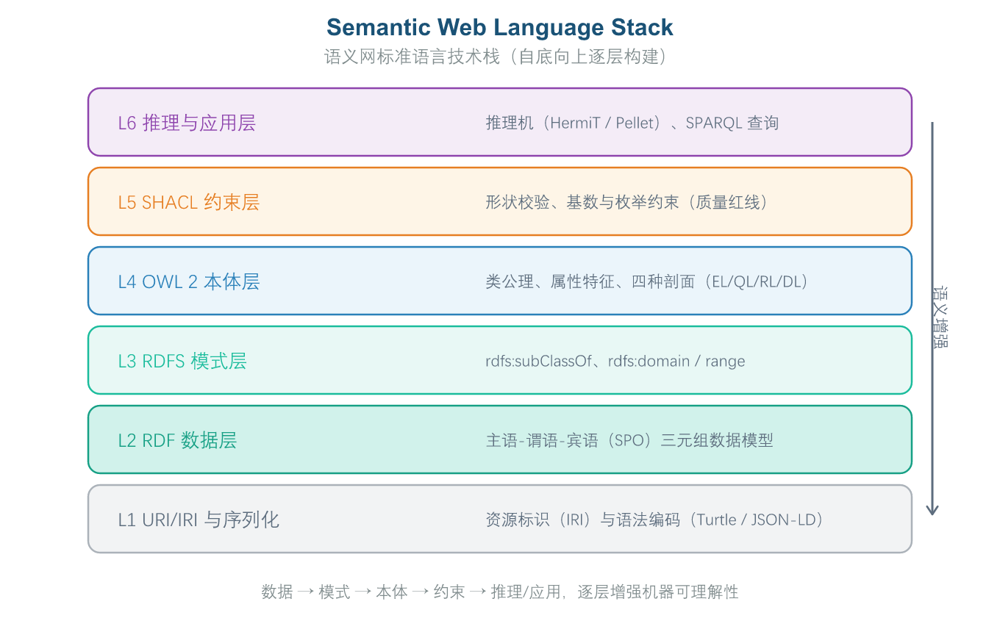

# 第 5 章 第3域：形式化表达与约束

第4章讨论了如何把业务概念落成可工程的本体模型；但一个仅存在于文档与脑海中的模型，距离"机器能自动校验、能跨平台运行"仍有一步之遥。第3域（形式化表达与约束）要解决的，正是这一步：用 W3C 国际标准的本体语言把模型编码为机器可读、可计算的形式，并用 SHACL 这类形状约束语言为语义数据划定不可逾越的质量红线。本章沿着"为何要形式化—形式化的理论基石—如何动手编码—人与机器如何协同—怎样治理质量"的逻辑展开，读者学完应能理解标准语言栈的分工，并具备把一条业务规则写成可执行的 OWL 2 公理或 SHACL 约束的基本判断力。

## 5.1 域定义与工程目标

### 5.1.1 形式化表达与约束的工程定位

形式化表达与约束（Formal Languages & Constraints）是将第2域（本体建模与工程）构建的概念与逻辑结构转化为标准可计算代码、并为企业语义数据划定质量安全红线的关键工程领域。本域关注如何使用国际标准的本体描述语言（如 RDF、RDFS、OWL 2）进行机器可读的形式化编码，并运用数据形状约束语言（SHACL/ShEx）为语义数据划定不可逾越的数据质量安全红线。

**企业痛点**

在形式化表达与质量约束领域，企业常遇到以下三个方面的挑战：

- **语义表达模糊，"软约束"无法解决业务逻辑冲突**：传统数据库的校验机制只能检查字段级别的数据类型和格式（如字段是否为 String 或 Int、是否允许为空等），但无法在语义层面限制业务逻辑的合法性。例如，保险业务中"保单生效日期晚于理赔日期"、银行信贷中"放款金额超过授信额度"等违反业务规则的数据，仅凭数据库层面的校验无法被识别和拦截，只能在应用层通过代码判断，容易被绕过或遗漏，给企业带来合规风险和资金损失。
- **技术栈私有化导致语义模型无法跨平台迁移**：部分企业采用了私有化的语义技术方案，使得本体模型和语义数据与特定图数据库（Graph DB）、推理机或 AI 框架深度绑定。当企业需要更换技术栈（如从 Neo4j 迁移到 GraphDB）或与其他系统进行数据交换时，私有化格式的语义资产无法直接迁移或互操作，需要重新编码和适配，带来巨大的迁移成本和技术债务。
- **数据质量治理滞后，错误发现时已造成下游污染**：传统的数据质量治理通常依赖事后检查，数据错误往往在进入下游图谱库或 RAG 系统后才被发现。例如，一个违反业务规则的三元组可能已经被推理引擎传播到数百个相关实体，或被 RAG 系统引用并用于生成回答。这种"事后补救"的模式不仅修复成本高，还可能导致 AI 应用输出错误信息，影响业务决策的准确性。企业缺少在数据入库前进行"刚性阻断"的语义级校验机制。

**工程目标**

**本域着眼于以下工程目标：**

**1. 实现无缝跨平台语义互操作**

企业在建设语义系统时往往面临多厂商、多平台的选择困境：图数据库可能选用 Neo4j、GraphDB 或 Stardog，推理机可能使用 HermiT、Pellet 或 ELK。如果每个系统都采用私有的语义描述格式，模型迁移和数据共享将变得极为困难。本域要求所有本体和语义数据严格遵循 W3C 国际标准规范进行编码——包括 RDF（资源描述框架）、RDFS（RDF 模式）和 OWL 2（Web 本体语言）。基于这些标准编码的语义资产可以在不同厂商的工具和平台之间无损迁移，确保企业在技术选型上的灵活性，避免被单一厂商锁定。

**2. 建立自动化语义质量阻断机制**

传统的数据质量校验通常在数据入库后进行，发现问题时已造成下游污染。本域将质量管控前置，通过 SHACL（形状约束语言）在数据灌入图谱之前就进行严格的语义级校验。SHACL 可以定义类的必填属性、属性值类型约束、关系基数限制等规则，例如"每个客户实体必须有客户编号"或"保单生效日期不能晚于理赔日期"。任何违反约束的数据在入库时即被自动拦截并标注错误原因，实现"零容忍"的语义质量阻断，确保进入图谱的数据在逻辑上始终正确。

**3. 与相邻知识域的逻辑边界**

| **对比维度** | **本域（形式化表达与约束）** | **语义推理与计算（第6域，第8章）** |
| --- | --- | --- |
| 核心关注点 | 语法声明、语义结构编码与静态形状约束 | 动态逻辑推导与一致性计算 |
| 解决的问题 | 怎么用标准语法和代码表达 | 怎么运行与推理 |
| 输入 | 本域编写的语法规则与约束 | 本域输出的形式化文档 |
| 输出 | OWL 2/SHACL 代码文件 | 推理结果与一致性报告 |

### 5.1.2 语义网语言栈：RDF、RDFS 与 OWL 2

本体的形式化表达不是"找一个工具"，而是一套分层递进的语言栈，每一层解决不同粒度的语义描述问题，如图3-8介绍了各个层级的作用。

**RDF（Resource Description Framework）：打地基**

RDF 是整个语义网的基础数据模型，用三元组（主语-谓语-宾语，Subject-Predicate-Object）作为基本数据单元。它的核心设计理念是通过 URI（统一资源标识符）给每个概念和资源一个全局唯一的"身份证"，确保在分布式环境下不会出现概念歧义。例如，可以声明"客户A 购买了 产品B"这样的简单事实。RDF 本身不提供类的概念，它只负责描述事实关系，是整个语义网的通用语言。

**RDFS（RDF Schema）：搭骨架**

RDFS 在 RDF 之上增加了类（Class）和属性（Property）的定义能力，是一套轻量级的建模语言。通过 rdfs:Class 可以声明"什么是类"，通过 rdfs:subClassOf 可以表达"类之间的继承关系"，通过 rdfs:domain 和 rdfs:range 可以约束"属性的定义域和值域"。例如，可以声明"客户"是一个类，"个人客户"是"客户"的子类，"hasAccount"属性的定义域是"客户"类。RDFS 适合描述简单的层次结构，但表达能力有限。

**OWL 2（Web Ontology Language 2）：封顶**

OWL 2 是 W3C 制定的正式标准，在 RDFS 基础上大幅扩展了表达能力，是业界公认的本体建模主流语言。它引入了大量公理约束来表达复杂的业务语义：可以声明两个类互斥（owl:disjointWith）、某个属性是传递的（owl:TransitiveProperty）、某个关系是函数性的（owl:FunctionalProperty）、某个属性的值域可以通过枚举限制等。OWL 2 的表达力足以支撑企业级复杂业务规则的建模，是本域的核心推荐语言。



*图3-8: 语义网技术栈 / Semantic Web Stack*

### 5.1.3 为什么要"机器可读的硬核语义表达"

一个常被忽视的误区，是把"语义表达"等同于"把业务规则写得更清楚的自然语言文档"。然而自然语言存在固有的歧义与不可计算性：同一句话在不同人、不同语境下可能被解读出不同含义，且无法被程序自动判定"这条数据是否违反了规则"。这正是第3域强调"机器可读的硬核语义表达"的根本动机——把业务约束改写成机器可校验的形式（如 SHACL 形状约束、OWL 公理），使得一致性检查可以在上线前被自动执行，而不是依赖人工逐条阅读文档去比对。

这种动机背后是两类价值的统一。其一是**可判定性**：形式化语言附带严格的语义定义，推理机或校验器能够明确回答"成立"或"不成立"，而非"大概如此"。其二是**可自动化**：一旦约束被形式化，它就能被接入持续集成流水线，凡违反即拦截，把质量管控从"人盯文档"升级为"机器把关"。图形化可视化（把语义画成图）固然能降低业务方的阅读门槛，但形式化的本质并非"画得直观"，而是"算得严谨"；同样，用更口语化的叙述去"降低门槛"，往往是以牺牲机器可校验性为代价，与"硬核语义"的目标背道而驰。

### 5.1.4 质量红线：不可逾越的语义级阻断

当语义约束被形式化之后，其中一部分约束会被提升为"质量红线"——即在语义数据进入生产环境之前**必须被强制校验、不可被业务方酌情忽略**的硬性规则。典型的质量红线包括关键属性的必填性（如每个客户必须拥有唯一客户编号）、枚举值域的排他性（如订单状态只能取预定义的有限集合）、以及核心实体间的互斥关系。

质量红线与一般性规范的区别，在于它必须落到可执行的拦截机制上：它不是"写在设计文档里供参考的软性约定"，也不是"上线后出了问题再提示一下"的友好说明，而是要在发布流水线中由 SHACL 等工具**强制阻断**——凡违反红线的数据一律拒绝入库，绝不允许"带病上线"。把红线降级为可忽略的建议，或仅以界面提示的方式呈现，都会使其丧失强制力，使形式化的全部工程价值落空。质量红线的治理，构成了本章 5.5 节将要讨论的语义质量评估的硬抓手。

## 5.2 核心概念与理论基石

*第3域的"硬核"首先体现在理论基石上：本体语言不是单一形态，而是按"表达力—计算代价"权衡出的标准家族；并且，推理与校验是两件不同的事，由两类引擎分别承担。*

### 5.2.1 OWL 2 的四种剖面：EL、QL、RL、DL

OWL 2 并非只有一种"完全版"语言，而是 W3C 为适配不同工程场景而定义的四个标准剖面（Profile）。它们本质上是同一套 OWL 词汇在不同表达力与计算复杂度之间的折中——理解各自的适用边界，是做出正确技术选型的前提。

- **OWL 2 EL**：主动牺牲部分表达力（例如不支持全称限定），换取**多项式时间的可判定推理**。它特别适合包含海量公理的大规模本体——例如 SNOMED CT 这类拥有数十万条临床概念、需要频繁做分类推理的医学术语体系。面对"公理数量爆炸"的场景，EL 几乎是不二之选。
- **OWL 2 QL**：专为**与关系数据库的虚拟映射和高效查询**而设计。当企业把关系表通过 R2RML 之类机制映射为 RDF，并希望用户的 SPARQL 查询能被重写回标准 SQL 在后端关系库执行时，QL 剖面能让查询优化落在熟悉的数据库引擎上，而非在内存中做昂贵的本体推理。
- **OWL 2 RL**：依托**规则扩展、面向前向链推理**的传统集成场景，适合那些希望用产生式规则表达推理、并与既有规则引擎衔接的部署。
- **OWL 2 DL**：追求**最大表达力**、容忍较高推理复杂度的剖面，常见于科研或对逻辑严密性要求极高、且规模可控的场景。

四个剖面都是真实存在的标准，差异只在"为哪类问题优化"。选型的关键，是诚实地评估自身的瓶颈：是公理规模、查询效率，还是表达力需求。

### 5.2.2 两类引擎的分工：OWL 推理机与 SHACL 校验器

即便都工作在语义层，OWL 推理机与 SHACL 校验器承担的角色并不相同，二者不可互相替代。其根本分歧在于所依据的"世界假定"不同：

- **OWL 推理机基于开放世界假定（Open World Assumption）**，默认"没有明说的不代表假"。它擅长在模式层（TBox）做逻辑推导，从已声明的公理中**推出隐含结论**——例如从"控股子公司 ⊆ 股东"和"甲持股 60%"推知"甲是控股股东"。它回答的是"根据已知，还能得出什么"。
- **SHACL 校验器基于封闭世界假定（Closed World Assumption）**，默认"没有的就是缺失或不允许"。它作用在实例数据层（ABox），判断数据是否**满足声明的形状**——必填项是否缺失、取值是否越界、枚举是否合规。它回答的是"这条数据是否违反了既定规则"。

因此，SHACL 校验实例数据（ABox）是否满足形状，OWL 在模式层（TBox）做推理推导隐含结论，是二者清晰互补的分工。认为"OWL 推理同样能直接校验实例完整性，SHACL 多余"，或认为"二者完全相同可二选一"，都混淆了"报错式校验"与"逻辑式推导"的本质差异。在工程实践中，二者常常同时运行：入库前由 SHACL 先把关数据合规，再由 OWL 推理机从合规数据上推导新知识。

### 5.2.3 OWL 关键原语：不相交公理 owl:disjointWith

在 OWL 的诸多原语中，owl:disjointWith 是表达"硬约束"最直接、也最常用的一条。它声明两个类**不相交**，即它们不应拥有任何共同实例。例如声明"个人客户"与"企业客户"互不相交，推理机一旦发现某个实体同时被归为二者，就会立即报错——这正是用逻辑而非文档来保证分类的纯粹性。

需要留意的是，owl:disjointWith 与另外两个容易混淆的原语分工明确：rdfs:subClassOf 表达"子类"关系（A 的实例都属于 B），owl:equivalentClass 表达"等价类"（二者共享完全相同的实例集合）。它们语义各不相同，误用会导致模型逻辑错误。owl:disjointWith 作用于**类**，不要与作用于**属性**的 owl:inverseOf（逆属性）相混。

## 5.3 实施方法与技术工具

### 5.3.1 SHACL 的形状模型：NodeShape 与 PropertyShape

在正式动手编写约束之前，有必要先建立对 SHACL（Shapes Constraint Language，W3C 推荐的 RDF 数据形状约束语言）形状模型的基本认识。SHACL 通过两类形状协同工作，实现精准的数据质量管控：

- **节点形状（NodeShape）**：指定校验的目标范围，定义"哪些实体需要被检查"。它通过 sh:targetClass、sh:targetNode 等属性确定校验范围。例如，创建一个"客户节点形状"，指定所有类型为 Customer 的实体都要被校验。
- **属性形状（PropertyShape）**：嵌套在节点形状的 sh:property 中，定义对具体属性的精细化约束。它支持的约束类型包括基数约束（如"必须且仅能有一个身份证号"）、值约束（如"身份证号格式必须符合正则表达式"）、范围约束（如"客户类型只能是预定义集合"）以及逻辑约束。

一个正确的 SHACL 节点形状，必须以 sh:NodeShape 作为根类型，并在其 sh:property 中内联属性形状——属性形状本身不能脱离节点形状单独作为根形状存在。这是编写合法 SHACL 脚本的第一道门槛。

### 5.3.2 基数与枚举约束：sh:minCount、sh:in 与 sh:closed

在属性形状的众多约束构件中，有三组最常被用于落地"质量红线"，理解它们的语义边界是避免误用的关键：

- **`sh:minCount` 与 `sh:maxCount`（基数约束）**：sh:minCount 声明某属性在实例中**至少必须出现的次数**（基数下限），关键标识属性常设 sh:minCount 1 以保证必填；sh:maxCount 则声明基数上限。例如"客户编号至少出现一次"用 sh:minCount 1，而"至多出现 0 次"则语义上变为禁止出现。
- **`sh:in`（枚举值约束）**：规定属性取值必须属于给定列表。当事先能穷举合法取值（如订单状态只能是"待支付/已支付/已发货/已完成"）时，sh:in 是最直接的选择；超出列表即判违规。它不同于 sh:pattern（用正则约束文本格式）和 sh:datatype（只限定数据类型如整数/字符串），后者并不限制"取值集合"。
- **`sh:closed`（封闭形状约束）**：当设置 sh:closed true 时，对象**只能包含形状中显式声明过的属性**，任何未声明的额外属性即判违规。这是封闭世界式强 Schema 管控的典型手段，适用于对数据结构有强一致性要求的场景。其反义 sh:closed false 则允许额外属性；而 sh:severity 只调整违规的严重级别（告警或错误），并不控制属性是否允许出现。

### 5.3.3 从业务规则到可执行代码：OWL 2 与 SHACL 实战

理论落到工程，需要把一句业务规则翻译成标准语法。下面两个示例分别展示如何用 OWL 2 声明类与属性、如何用 SHACL 编写刚性校验。

1. 代码示例：用 OWL 2 声明类和属性（Turtle 语法）

```
@prefix ex: <http://example.org/obok#> .
@prefix owl: <http://www.w3.org/2002/07/owl#> .
@prefix rdfs: <http://www.w3.org/2000/01/rdf-schema#> .
@prefix xsd: <http://www.w3.org/2001/XMLSchema#> .
```

*[turtle]*

#### *类声明：个人客户与企业客户互斥*

```
ex:Customer a owl:Class .
ex:IndividualCustomer a owl:Class ;
    rdfs:subClassOf ex:Customer ;
    owl:disjointWith ex:CorporateCustomer .
ex:CorporateCustomer a owl:Class ;
    rdfs:subClassOf ex:Customer .
```

*[turtle]*

#### *对象属性声明：拥有账户 (定义域与值域绑定)*

```
ex:hasAccount a owl:ObjectProperty ;
    rdfs:domain ex:Customer ;
    rdfs:range ex:Account .
```

*[turtle]*

2. 代码示例：SHACL 刚性数据质量校验脚本 (Turtle 语法)

```
@prefix sh: <http://www.w3.org/ns/shacl#> .
@prefix ex: <http://example.org/obok#> .
@prefix xsd: <http://www.w3.org/2001/XMLSchema#> .
```

*[turtle]*

#### *校验规则：所有客户实体的证件号必须且仅能有一个，且开户金额必须大于0*

```
ex:CustomerShape a sh:NodeShape ;
    sh:targetClass ex:Customer ;
    sh:property [
        sh:path ex:customerID ;
        sh:minCount 1 ;
        sh:maxCount 1 ;
        sh:datatype xsd:string ;
        sh:severity sh:Violation ;
        sh:message "错误：每个客户必须包含且仅包含一个唯一的 customerID！" ;
    ] ;
    sh:property [
        sh:path ex:accountBalance ;
        sh:minInclusive 0.00 ;
        sh:datatype xsd:decimal ;
        sh:message "错误：账户余额不能为负数！" ;
    ] .
```

*[turtle]*

上述 SHACL 片段正是 5.3.1 与 5.3.2 所讲形状模型与约束构件的具体落地：以 sh:NodeShape 为根、sh:property 内联属性形状，并用 sh:minCount/sh:maxCount/sh:datatype 表达刚性红线。

### 5.3.4 形式化工具链

工程落地离不开工具支撑，常见的形式化技术栈包括：

- **语法校验与格式转换**：RDF4J（Eclipse 基金会的 RDF 处理框架，支持 SPARQL 1.1）、Apache Jena CLI（开源的 RDF/OWL 命令行工具套件）。
- **SHACL 校验引擎**：TopBraid SHACL API（企业级 SHACL 校验套件）、pySHACL（Python 版本的 SHACL 校验器，适合数据工程场景快速集成）。

## 5.4 人机协同与 AI 赋能

### 5.4.1 提示词驱动的 OWL/SHACL 代码生成

OWL 2 与 SHACL 的语法规则较为复杂，编写过程中容易出现格式错误和低级 bug。大模型（LLM）在此环节可充当语义代码助教，辅助架构师快速生成和校验代码：

- **自然语言约束转 SHACL 代码**：架构师只需提供自然语言约束描述（如"限制借款人年龄在 18 至 65 岁之间"），LLM 可自动生成标准的 SHACL Turtle 代码片段，例如转化为 sh:minInclusive 18; sh:maxInclusive 65 的数值约束表达式，大幅降低约束规则的编写门槛。
- **OWL 2 语法纠错与格式化**：对于复杂的 OWL 2 本体文件，LLM 可自动检查并纠正前缀（Prefixes）缺失、数据类型不匹配、属性域值域错误等常见问题，并按标准格式重新排版代码。

然而必须明确一条铁律：LLM 生成的是"草案"，而非"可直接上线的成品"。在 OMBOK 的人机协同实践中，LLM 起草的约束代码必须经过领域专家校验其语法与语义正确性，确认无误后才纳入校验流水线（Human-in-the-Loop）。让 LLM 全权负责上线、专家仅形式签字，或自动合并到主干即时发布，都会使约束丧失语义把关，可能放过脏数据或误伤合法数据。

### 5.4.2 自动纠错为何仍需专家把关

工程上常引入对 SHACL/OWL 代码的自动纠错插件，它确实能修好不少语法错误。但即便语法被顺利通过，仍必须由专家确认——原因在于"修对语法"与"保真语义"是两回事。

自动纠错可能修正了语法，却悄悄改变了约束的业务含义：例如把某枚举值约束误改成更宽松的范围，使约束不再反映真实业务规则；表面上看代码能解析、能运行，实则语义已经偏离。因此，语义层必须由专家把守，防止"语法绿灯、语义翻车"。误以为"只要解析器通过，业务含义就绝不会偏差"，或高估推理机对语义的担保能力，都会在这一环节埋下隐患。自动纠错的价值是减轻机械性劳动，而非替代人类对业务意图的最终责任。

## 5.5 语义治理与质量评估

本域的治理产物——OWL 2 本体文件与 SHACL 形状约束——属于本体资产，其版本、变更与发布须由数据部门（或企业本体治理委员会）评审把关（见第 1 章 1.3）；以下为具体的治理指标与手段。

### 5.5.1 刚性约束冲突率与质量健康度

形式化约束的价值，最终要落到可量化的质量指标上。本域定义以下核心指标来衡量语义资产的健康度：


（式 0-7）


（式 0-8）


（式 0-9）

其中，"刚性约束冲突率"是一个尤其值得单独强调的指标：它等于**未通过 SHACL 校验的实例数 ÷ 总实例数**，直接反映数据违反硬约束的严重程度。与"推理机消耗多少 CPU""类型声明覆盖率""三元组冗余度"等无关指标不同，冲突率直指"数据是否合规"这一核心命题，应设定阈值并纳入治理看板持续监控。

### 5.5.2 冲突处置：从根因治理而非掩盖

监控发现某数据集 SHACL 校验冲突率持续偏高时，处置方式决定了治理的成败。正确的路径是**定位根因**：找出高频违规的形状，修复数据生产链路（映射或录入环节），并迭代校验规则本身——是从源头消除不合规数据的产生，而非在其下游补救。

需要警惕三类"伪处置"：其一是直接上调告警阈值，把超标当作可接受的常态，等于主动放弃质量红线；其二是仅把冲突数字记录进报表、不启动任何整改，问题持续累积；其三是直接废弃整个数据集改用新源，成本高昂且并未触及根因。治标与治本的分野，就在于是否回到数据生产的源头去修复。

### 5.5.3 语法合规性与 CI 门禁

除了前述质量指标，形式化代码本身的"可解析、可运行"也是治理的前置条件。语法合规性检查（解析、合理性、引用完整性等）应作为持续集成（CI）式的**自动门禁（Gate）**：在语义资产入库或发布前自动拦截非法内容，防止坏数据进入生产。

与之配套的是规则等级治理（Severity Governance）：将 SHACL 违反响应划分为三个等级——sh:Info（仅记录提示）、sh:Warning（告警但允许入库）、sh:Violation（刚性阻断并拒绝入库）。把核心红线设为 sh:Violation，与 CI 门禁结合，便构成了"语法合规 + 语义合规"双重把关的工程闭环。

## 5.6 本章小结与示例

*本章依次讨论了形式化表达的工程动机与质量红线、OWL 2 剖面与 OWL/SHACL 的引擎分工、SHACL 约束的编写实战，以及语义质量指标的治理。为帮助读者检验对前述概念的理解，章末附数道示例题供自学巩固；更系统的练习另行成册，不在此重复。建议先遮住本节末尾的参考答案与解析，独立作答后再行核对。*

#### *题目 1：OMBOK 第3域（形式化表达与约束）强调"机器可读的硬核语义表达"，其核心动机是？*

**题目类型**：单选

- A 把业务约束改写成更口语化的自然语言叙述，从而显著降低领域专家的编写门槛
- B 使业务约束以机器可校验的形式表达，而非停留在自然语言描述
- C 让业务约束以图形化图表呈现，方便业务方直观阅读
- D 将业务约束交回人工逐条评审，由专家对照纸质文档逐句核对其正确性与一致性

#### *题目 2：在 OWL 2 四种剖面（EL/RL/QL/DL）中，最适合含海量公理、需多项式时间推理的医学本体的，是下列哪一个？*

**题目类型**：单选

- A OWL 2 EL：大规模（如生物医疗）本体，要求多项式时间推理
- B OWL 2 QL：本体重在关系数据库映射、查询可重写 SQL 的场景
- C OWL 2 RL：依托规则扩展、面向前向链推理的传统集成场景
- D OWL 2 DL：追求最大表达力、容忍较高推理复杂度的科研场景

#### *题目 3：在 SHACL 形状中，声明某关键标识属性至少必须出现一次，应使用下列哪个构件？*

**题目类型**：单选

- A sh:minCount：声明该属性在数据中至少必须出现的次数（基数下限）
- B sh:in：限定取值必须属于给定的枚举列表
- C sh:pattern：用正则表达式约束取值的文本格式
- D sh:datatype：声明该属性取值所要求的数据类型（如 xsd:integer）

#### *题目 4：团队尝试用提示词驱动大语言模型生成 SHACL 校验脚本。关于这一"AI 赋能"工作流，下列说法正确的是？*

**题目类型**：单选

- A 仅用 LLM 整理需求说明文档，所有约束代码由人工逐条编写
- B LLM 生成草案，再由专家校验语法与语义正确性后纳入流水线
- C 允许 LLM 自动生成约束脚本并直接上线，专家审核签名仅作流程留存
- D 将 LLM 输出的约束脚本自动合并到主干并即时发布

#### *题目 5：在语义治理看板上，用于衡量数据违反硬约束严重程度的"刚性约束冲突率"，其定义为？*

**题目类型**：单选

- A 推理机完成一次全量推理所消耗的 CPU 时间比例
- B 全部实例中已声明类型（rdf:type）的比例
- C 未通过 SHACL 校验的实例数占总实例数的比例
- D 图谱中重复三元组数量占三元组总量的比例

### 参考答案与解析

**题目 1　参考答案**：B **解析**：第3域的核心动机，是把业务规则写成机器可验证的形式（如 SHACL 形状约束），从而在上线前自动检查一致性，而非依赖人读自然语言文档——后者易生歧义、遗漏且无法自动化。这正是"硬核语义"与"质量红线"的工程基础。图形可视化或口语化叙述都无法替代机器可校验性（见 5.1.3 节）。

**题目 2　参考答案**：A **解析**：OWL 2 EL 主动牺牲部分表达力，换取多项式时间的可判定推理，非常适合 SNOMED CT 这类含海量公理的医学本体做高效分类。OWL 2 QL 专为关系库映射与查询重写设计，OWL 2 RL 依赖规则与前向链，OWL 2 DL 表达力最强但推理代价高，各自适配不同场景（见 5.2.1 节）。

**题目 3　参考答案**：A **解析**：sh:minCount 声明某属性在实例中至少出现的次数（基数下限），关键标识属性常设 sh:minCount 1 保证必填。与之相对，sh:in 限定枚举、sh:pattern 约束文本格式、sh:datatype 限定数据类型，语义各不相同（见 5.3.2 节）。

**题目 4　参考答案**：B **解析**：在人机协同实践中，LLM 可加速 SHACL/OWL 代码起草，但生成的约束必须经过专家校验语法与语义，确认无误后才纳入校验流水线，体现"人在回路"。让 LLM 全权负责上线或仅形式签字，都缺失语义把关（见 5.4.1 节）。

**题目 5　参考答案**：C **解析**：刚性约束冲突率 = 违反 SHACL 等硬约束的实例数 ÷ 总实例数，反映数据语义质量的"健康度"，应设定阈值并纳入治理看板。推理开销、类型声明覆盖率、三元组冗余度均非冲突率（见 5.5.1 节）。

## 相关笔记

- [[00-目录]]
