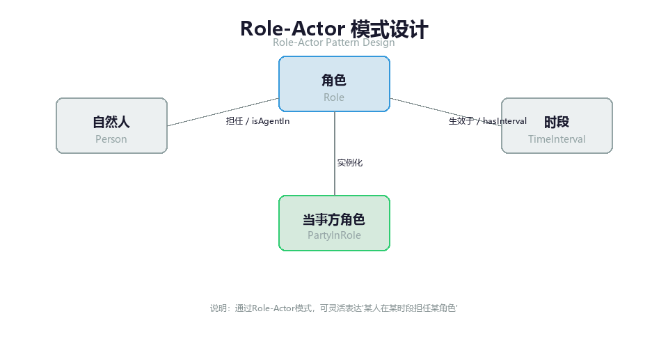
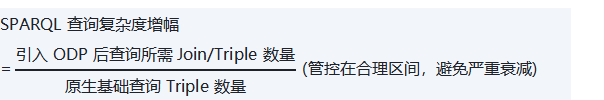

# 第 6 章 第4域：本体设计模式

## 6.1 域定义与工程目标：复用最佳实践，拒绝重复造轮子

在 OMBOK 的十域框架里，本体设计模式（Ontology Design Pattern, ODP）域处在"如何把已被验证的建模经验沉淀为可复用资产"这一层。如果说第2域（本体建模与工程）回答"造什么"、第3域（形式化表达与约束）回答"如何用机器可判定的语言把语义钉死"，那么本域回答的则是"用什么标准构件来造"——它把反复出现的建模难题，压缩成一套经过工程检验的语义建筑模板，让团队像调用预制组件一样套用成熟结构，而不是每次都从零摸索。

**企业痛点**

- 各业务线都从零开始建模，同一概念被反复重建，语义资产无法在企业尺度复用与组合。
- 跨领域集成时缺乏标准化构件，结构性异构（Structural Heterogeneity）被推到集成阶段才爆发，融合成本高、风险大。
- 缺少经过验证的建模模板，新手易踩坑，模型质量高度依赖个人经验。

**工程目标**

- 把"复用既有 ODP"立为基本工程纪律，让成熟解法即取即用，而非每次重新发明。
- 统一建模的词汇与句法，把结构性异构前置消解，显著降低跨系统语义集成成本。
- 建立可演进、可治理的复用模式库，使语义资产在企业内可组合、可生长。

### 6.1.1 把"复用 ODP"立为工程纪律：本域为何值得复用

把复用 ODP 提升为工程纪律，主要瞄准两类代价高昂的失序。其一是**重复造轮子导致的质量失控**：当不同项目组面对"角色与参与方""历史变更记录""部分-整体关系"等共性场景时，如果各自凭经验独立建模，同类问题的结构会千奇百怪、命名规范不统一，查询性能与推理能力差异巨大，无法沉淀为可复用资产。其二是**跨域集成时的结构性壁垒**：若 A 部门用继承关系建模角色、B 部门用关联关系建模角色，等到第7域（本体对齐与融合）需要打通时，即便概念语义相同，底层结构的不统一也会让直接对齐几乎不可能，必须进行昂贵的人工结构转换。

当多个业务线普遍采用同一批 ODP 时，收益是直接的：建模语言的"词汇与句法"被统一，融合时的结构性异构（Structural Heterogeneity）被前置消解，跨系统语义集成的成本显著下降。这正是"复用"二字在 OMBOK 里的战略含义——它不是图省事，而是为了让语义资产在企业尺度上真正可组合、可生长。

### 6.1.2 本域与相邻知识域的边界

为避免与第2域混淆，有必要厘清两者的分工。第2域关注的是"整体敏捷建模流程与需求定义"——即决定造什么、如何组织 CQ（能力问句）；本域关注的则是"特定通用建模难题的标准解法与模板复用"——即用什么构件来造。两者的输入与输出恰好衔接：本域输出的标准化概念体系，是第2域确定建模需求与 CQ 之后的"建筑材料"；而第2域基于这些模式构建出的，才是落地的领域本体模型。简言之，第2域定方向与需求，本域供构件与方法。

| **对比维度** | **本域（本体设计模式）** | **本体建模与工程（第2域）** |
| --- | --- | --- |
| 核心关注点 | 特定通用建模难题的标准解法与模板复用 | 整体敏捷建模流程与需求定义 |
| 解决的问题 | 用什么标准构件来造（Building Blocks） | 造什么（What to Build） |
| 输入 | 本域输出的标准化概念体系 | 第2域确定的建模需求与 CQ |
| 输出 | 可复用的设计模式库 | 基于模式构建的领域本体模型 |

## 6.2 核心概念与理论基石：结构型与时序型范式

要熟练运用 ODP，先要建立对模式分类的清晰认知。不同文献对 ODP 的分类粒度不同，但把握住"静态结构"与"动态演变"这一主轴，绝大多数模式都能被正确地归位与选用。

### 6.2.1 什么是本体设计模式（ODP）：定义与分类主轴

本体设计模式（ODP）的准确定义是：针对**反复出现的（recurring）**建模问题、经过实践验证、**可跨项目复用**的小型本体片段或建模方案。它有三个不可妥协的特征：**小**（聚焦于一个明确的建模子问题，而非覆盖整个领域的庞然大物）、**可复用**（在多个项目中被证明有效，而非一次性交付物）、**经验证**（由社区或企业架构组评审确认其正确性，而非推理机自动生成的隐含公理）。

理解这三个特征，也就排除了几类常见误解。把 ODP 当成"覆盖整个领域的完整大型本体"是错误的——那更接近顶层本体（TLO）的定位，ODP 只是其中的小构件。把 ODP 当成"推理机自动生成的隐含公理集合"也错，因为 ODP 由人设计并须经人工验证，自动化生成的是实例数据而非模式本身。把它当成"不可跨项目复用的局部草图"同样违背了"可复用"这一本质。一个贴切的比方是：ODP 之于本体工程，正如设计模式（Design Patterns）之于软件工程——都是把"踩过坑后沉淀下来的最佳结构"标准化，供后人直接取用。

在更细的分类体系中，ODP 常被划分为四大类别：**结构型**（关注本体的整体组织与类层次，如 Taxonomy 层级、Part-Whole 组合、Role-Actor 角色解耦）、**概念型**（聚焦业务概念的精细化表达，如定义模式、属性模式、枚举模式）、**关系型**（定义概念间的复杂关联，如传递关系、对称关系、时间索引关系）、**推理型**（为本体赋予推理能力，如等价类、互斥类、属性链）。

而在工程选型与考核中，最常用、也最易混淆的是另一种更粗却更犀利的二分法——**结构型（Structural）**与**时序型（Temporal）**。两者区分的唯一判据是建模的关注点：**结构型刻画"静态"的概念关系**，回答"是什么、如何构成"，典型如 Taxonomy（分类层级，上下位继承）、Collection（集合归属，元素与集合的成员关系）、Part-Whole（部分-整体，部件与多层的组成关系）；**时序型刻画"动态"的事物**，回答"何时发生、如何演变"，典型如 Event-Time（事件-时间）模式，把事件/过程与其发生时间、参与者及前后状态绑定。

需要提醒读者，这两套分类并不矛盾，而是互补：四类别是更丰富的"词典"，二分法是更实用的"决策捷径"。当一道建模题问"这个模式关注时间演化还是静态构成"时，沿结构型/时序型主轴判断即可；当要系统盘点一个本体的模式资产时，四类别的视角更周全。把握住这一层关系，就不容易在模式选型时张冠李戴。

### 6.2.2 Part-Whole（部分-整体）模式

Part-Whole（部分-整体，又称 Meronymy）模式用于刻画部件与整体的组成、传递与聚合关系。它的核心价值，在于把真实世界普遍存在的多层结构（如"轮辐∈轮子∈汽车""部门∈事业部∈集团"）显式地建模出来，并让推理机理解其层级穿透。

这里必须强调**传递性（Transitivity）**这一关键属性。当部分关系被声明为传递（如将 proper part 标注为 transitive）时，推理机可由"活塞是发动机的一部分"与"发动机是汽车的一部分"**自动推出**"活塞也是汽车的一部分"——无需人工逐层补齐。反之，若只用普通对象属性而不声明传递，便丢失了"活塞∈发动机∈汽车 ⇒ 活塞∈汽车"这一隐含结论，是 Part-Whole 最常见的误用。另一类反模式是"禁止组成部分再分以维持简单"——这违背了真实世界的多层结构；以及混淆对象属性与数据类型属性——组成是实体间关系，绝不可用 DatatypeProperty 表达。

### 6.2.3 Role-Actor（角色-参与者）模式

Role-Actor（角色-参与者）模式解决的是"多重身份"这一经典难题。它的设计铁律是：**把"角色"（社会/组织赋予的职能，如医生、患者、客户）与"扮演该角色的参与者"（具体的个体或组织，如自然人张三）分离**。

为什么要分离？因为业务里普遍存在"张三今天是患者、明天是医生"这类情况。若把人直接等同于其当前职务（如 Customer rdfs:subClassOf Person），会导致：其一，当同一人同时持有多重身份时，子类间的互斥约束会引发逻辑冲突；其二，无法表达身份生效的时间、所属机构等上下文。Role-Actor 通过引入独立的"角色"类与中介关系（如 PartyInRole），让同一个参与者在不同时间段绑定不同角色，身份保持一致、仅角色随时间变化——既支持多角色，又避免了把易变的职务写死在个体上。把角色与参与者合并、或把同一自然人拆成两个独立个体来分别承载不同身份，都是该模式要纠正的反模式。

### 6.2.4 Event-Time（事件-时间）模式

Event-Time（事件-时间）模式刻画"带时间的事件/过程"：它把事件（或过程）与其发生的时间区间、参与者、前后状态绑定，专门处理随时间演变的事物。最典型的场景包括订单的"创建（t1）—支付（t2）"、会议的"开始—结束时间与参会者"、保单受益人的"多次变更历史"。

判断一个场景是否属于时序型，只需问一句：它关心的是"何时发生、谁参与、状态如何流转"，还是"静态的分类与构成"？前者（如电商订单节点、会议对象）应归 Event-Time；后者（如静态商品分类树）属于结构型中的 Taxonomy。需要指出，标准三元组 (S, P, O) 仅支持二元关系，表达"张三在 2020–2023 年任 A 公司 CTO"这类带时间约束的关系时，必须做三元组重构（N-ary Relation）——引入一个中间节点（如"任职事件""会员状态"）来承载时间属性，将二元关系扩展为多元关系。这一点在下一节的代码实践中会具体展开。

## 6.3 实施方法与技术工具：模式的选择、实例化与组合

理论之后，本节的重心转向"动手"：如何把 Part-Whole、Role-Actor、Event-Time 这三类高频模式真正落到代码与工具链中。由于本域在"实施方法（X.3）"维度未设独立自测示例，这一节以方法论述与工程实践为主，是承上启下的操作指南。

### 6.3.1 Part-Whole 模式的设计与落地

落地 Part-Whole 时，第一步是明确"部分"的语义粒度：是物理组装（发动机∈汽车）、组织包含（分公司∈集团）还是地理层级（市∈省∈国）。不同粒度共享同一传递公理，但基数限制各异——例如物理组装常要求"部分不可为整体自身"（反自反），而组织包含允许临时重叠。实践中应在模式层声明 properPartOf 为传递且反自反的对象属性，并在需要时对特定层级附加基数约束，使推理既能自动穿透多层，又不会推出荒谬结论。

### 6.3.2 Role-Actor 模式的实例化

以金融场景为例：一个自然人可能同时是客户、员工、担保人。采用 Role-Actor 时，将"人（Person）"设为独立实体类，"角色（Role）"设为独立分类体系，通过一个中介关系类（PartyInRole）将两者关联。下方 Turtle 片段展示了这一"实体与角色解耦"的标准写法——注意 PartyInRole 是把二元关系实体化为 N-ary Relation 的关键节点，时间属性（startDate）挂在它之上，而非挂在人或角色之上：

```
@prefix ex: <http://example.org/ombok#> .
@prefix owl: <http://www.w3.org/2002/07/owl#> .
@prefix rdfs: <http://www.w3.org/2000/01/rdf-schema#> .
@prefix xsd: <http://www.w3.org/2001/XMLSchema#> .

# 实体与角色解耦
ex:Person a owl:Class .
ex:Role a owl:Class .
ex:PartyInRole a owl:Class .   # 关系实体化 (N-ary Relation)

# 关系绑定
ex:hasParty a owl:ObjectProperty ;
    rdfs:domain ex:PartyInRole ;
    rdfs:range ex:Person .
ex:hasRole a owl:ObjectProperty ;
    rdfs:domain ex:PartyInRole ;
    rdfs:range ex:Role .
ex:startDate a owl:DatatypeProperty ;
    rdfs:domain ex:PartyInRole ;
    rdfs:range xsd:date .

# 实操实例化：张三在 2024 年担任合规官角色
ex:Assignment_001 a ex:PartyInRole ;
    ex:hasParty ex:Person_ZhangSan ;
    ex:hasRole ex:Role_ComplianceOfficer ;
    ex:startDate "2024-01-01"^^xsd:date .
```

*[turtle]*



*图3-10: Role-Actor 模式 / Role-Actor Pattern*

### 6.3.3 时序索引的 N-ary Relation 实现

Event-Time 的落地同样依赖 N-ary Relation 重构。以"会议"为例，会议是一个发生在特定时间区间、并带有参与者（参会者）的事件，不能退化为"由参会者组成"的 Part-Whole，也不能退化为静态分类。正确做法是引入事件节点，把时间区间（start/end）与参与者作为该节点的属性挂载，使查询可以同时回答"谁参与了会议"与"会议发生在何时"。这种"为关系引入中间节点以承载额外维度"的手法，是时序型模式与结构型模式在工程上最直观的分水岭。

### 6.3.4 ODP 模式库与工具链

工程上不必闭门造车，可借助成熟的模式资产与工具：

- **ODP 官方模式库**（OntologyDesignPatterns.org，ODP Portal）：国际 ODP 标准模式库，收录 100+ 本体设计模式，是按场景检索成熟模板的首选入口。
- **Protégé ODP 插件**：在 Protégé 中直接导入与实例化标准模式，降低手工编码门槛（用法详见第 6 章 6.3 节）。
- **eXtreme Design（XD）**：基于 ODP 的敏捷本体设计方法，支持场景驱动的模式选择与组合，适合在需求尚未完全冻结时渐进式构建。

## 6.4 人机协同与 AI 赋能：大模型辅助选型与拟合

ODP 的抽象程度较高，初学者常在"这个场景该用哪个模式"上反复试错。大模型（LLM）的介入，正是要把选型从依赖资深专家的经验，部分转化为可规模化的辅助推荐——但边界必须清晰。

### 6.4.1 LLM 辅助 ODP 选型：推荐而非拍板

LLM 在本域的合理角色是"架构师助手"：输入一段业务需求描述（如"我们需要记录保单受益人的多次变更历史，以及每次变更的比例"），它能自动识别其中的时间属性、多值关系与历史追溯需求，匹配并推荐最合适的 ODP（如 Time-Indexed N-ary Relation Pattern），甚至据模式骨架自动生成标准 Turtle/OWL 代码。这能显著降低初学者的试错成本。

但定位必须止于"推荐候选"——最终是否适配，仍由本体工程师或领域专家把关定夺。把 LLM 神化为最终决策者（让它直接拍板选定模式、项目不再需要人类工程师），或把它贬为纯翻译工具完全不用于选型，都浪费了它的模式匹配能力，也放弃了应有的专业判断。

### 6.4.2 模式拟合的人工确认：不变式校验

即便 LLM 推荐了看似合适的 ODP，工程师在正式套用前仍须做一次人工确认，根本原因在于：**每个 ODP 都内嵌隐含的不变式（invariant）**。例如 Part-Whole 的部分关系要求传递性，Role-Actor 要求角色与参与者分离。若这些不变式与真实业务语义冲突（如某"部分"在业务上并不传递），直接套用会产生错误推理。因此"模式拟合的人工确认"不是补流程文档的形式主义，而是拦截语义错配的关键闸门——专家要核对的，正是"模式自带的不变式，是否与本业务的真实语义相容"。把不变式校验完全交给自动化工具、或迷信机器推荐必然正确，都违背了"人在回路（Human-in-the-loop）"这一底线。

## 6.5 语义治理与质量评估：合规性与可扩展性

本域的治理产物——ODP 设计模式与模式库——属于本体资产，其版本、变更与发布须由数据部门（或企业本体治理委员会）评审把关（见第 1 章 1.3）；以下为具体的治理指标与手段。

当模式被套用到生产本体后，治理的关注点从"选得对不对"转向"用得对不对、长得健康不健康"。本域定义了两类核心评估，并辅以量化指标。

### 6.5.1 模式套用合规性（Conformance）

"模式套用合规性"评估回答的问题是：实际建出的模型，是否真的**满足**所采用 ODP 的不变式与各项约束？例如 Part-Whole 的部分关系是否确实声明了传递、Role-Actor 是否真的把角色与参与者分离。它防止的是"挂名套用"——名义上用了模式，语义却处处违背。需要强调，合规性**不等于**"命名风格一致"：类名长得像，不代表语义对；它也不等同于文件体积、查询响应速度等运维或运行指标——那些与"是否满足模式不变式"无直接关系。

### 6.5.2 可扩展性（Extensibility）评估

可扩展性评估衡量：当业务扩展、需要引入新概念或新关系时，既有的 ODP 能否在不破坏原有不变式与已有推理的前提下平滑接纳，使本体长期演进保持健康。它关注的是"模式随业务生长而不崩"，而非单纯测算存储容量上限、或追求扩展后推理更快。认为模式选定即一劳永逸、再无需演进评估，是忽视业务持续演进的典型误区。

### 6.5.3 量化治理指标

为把上述判断落到可考核的数字上，本域定义以下指标：


（式 0-10）


（式 0-11）



（式 0-12）

此外，长效治理还应建设企业级专属 ODP 模式库（所有入库模式经架构组审计、命名规范、文档齐全、Git 版本化），并将 ODP 合规性纳入本体模型评审的强制检查项——未通过者不予签核。

## 6.6 本章小结与示例

*本章围绕"把已被验证的建模经验沉淀为可复用构件"展开，依次阐述了 ODP 的定义与工程纪律、结构型与时序型两大范式（Part-Whole / Role-Actor / Event-Time）、模式的实例化方法与工具链、人机协同的选型边界，以及合规性与可扩展性两类治理评估。为帮助读者检验理解，章末附数道示例题供自学巩固；更系统的练习另行成册，不在此重复。建议先遮住本节末尾的参考答案与解析，独立作答后再行核对。*

>

*注：本域在"实施方法（X.3）"维度未设独立自测示例，故下述示例按其余四个维度各取一题。*

#### *题目 1：在 OMBOK 中，本体设计模式（ODP）的准确定义是？*

**题目类型**：单选

- A 针对反复出现的建模问题、经验证可复用的小型本体片段或方案
- B 只描述单一概念、不可跨项目复用的局部草图
- C 一次性交付、覆盖整个领域的完整大型本体（而非可复用片段）
- D 由推理机自动生成、无需人工设计的隐含公理集合

#### *题目 2：在 ODP 的常见范式划分中，下列四个模式中哪一个属于"时序型（Temporal）"？*

**题目类型**：单选

- A Event-Time（事件-时间）模式，刻画事件随时间发生的时序绑定
- B Collection（集合）模式，刻画元素与其所属集合之间的成员归属与构成关系
- C Taxonomy（分类层级）模式，刻画概念间的上下位继承与分类层级关系
- D Part-Whole（部分-整体）模式，刻画部件与整体之间的多层组成、传递与聚合关系

#### *题目 3：在本体工程项目里引入大语言模型（LLM）辅助 ODP 选型，关于 LLM 的合理定位，下列说法正确的是？*

**题目类型**：单选

- A 在项目中严禁使用任何 LLM，以防其给出错误建议
- B 由 LLM 依业务场景描述推荐候选 ODP，再由专家确认定夺
- C 由 LLM 直接拍板选定最终本体模式，项目不再需要任何人类工程师把关
- D 仅把 LLM 当作文本翻译工具使用，完全不利用其做本体设计模式的选型

#### *题目 4：治理团队审计一个已套用 Part-Whole 与 Role-Actor 的本体，要检查它是否真的"用对了模式"。这项"模式套用合规性"评估最关注下列哪点？*

**题目类型**：单选

- A 推理机单次查询的平均响应速度与整体吞吐表现是否达标
- B 本体文件占用的磁盘存储空间大小及其序列化后的字节规模是否超标
- C 模型是否采用了与所选 ODP 模板完全一致的类名与命名风格
- D 实际模型是否满足所采用 ODP 的不变式与各项约束

### 参考答案与解析

**题目 1　参考答案**：A **解析**：本体设计模式（ODP）针对反复出现的建模问题、经过实践验证、可跨项目复用，核心是"小、可复用、经验证"三特征（见 6.2.1 节）。C 描述的是覆盖全领域的完整大型本体（接近顶层本体定位），D 把 ODP 说成推理机自动生成、忽略人工设计与验证，B 把 ODP 说成不可复用的局部草图，均违背"可复用"本质。

**题目 2　参考答案**：A **解析**：时序型（Temporal）模式处理"随时间变化"的事物，Event-Time 把事件/过程与其发生时间、参与者及前后状态绑定，刻画动态过程（见 6.2.1、6.2.4 节）。B 的 Collection、C 的 Taxonomy、D 的 Part-Whole 都刻画静态概念结构（分类、集合、组成），属结构型。区分二者的关键是建模关注点：结构型关注"是什么、如何构成"，时序型关注"何时发生、如何演变"。

**题目 3　参考答案**：B **解析**：LLM 的合理角色是"辅助推荐"——从业务场景描述中识别建模特征（如"部分-整体"→Part-Whole、"带时间的事件"→Event-Time），给出候选模式加速选型，最终适配仍由专家把关（见 6.4.1 节）。C 把 LLM 神化为最终决策者，违背"人在回路"；A 因噎废食完全禁用；D 贬为纯翻译，均不恰当。

**题目 4　参考答案**：D **解析**：合规性（Conformance）评估的核心是实际模型是否真正遵循所选 ODP 的不变式与约束（如 Part-Whole 部分关系是否确实传递、Role-Actor 是否真的分离角色与参与者），防止"挂名套用"（见 6.5.1 节）。B 是存储运维指标，C 把"命名风格"等同于合规，A 是运行性能指标，均与是否满足模式不变式无关。

## 相关笔记

- [[00-目录]]
