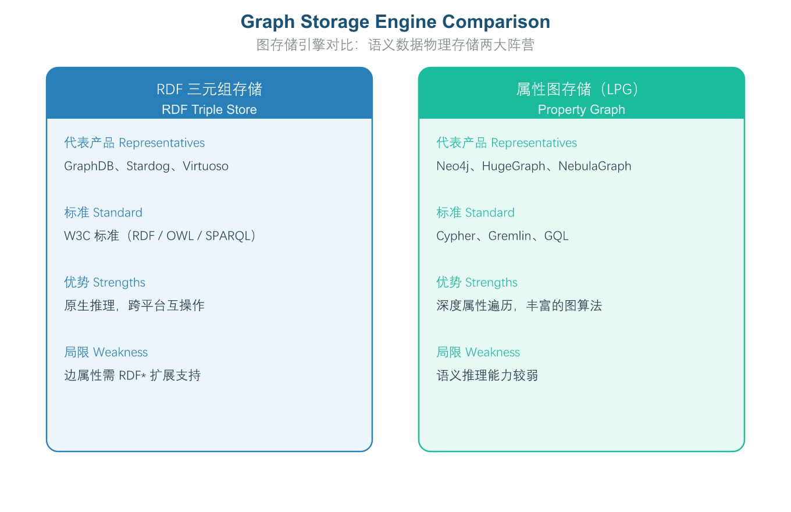
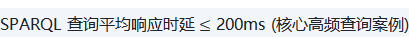

# 第 7 章 第5域：存储查询与映射

## 7.1 域定义与工程目标：连接静态本体与动态数据底座

"存储查询与映射"（Storage, Query & Data Mapping）是连接上层抽象本体模型与底层企业海量异构数据源的物理落地与工程枢纽。本域关注如何高效持久化存储 RDF/OWL 语义数据（三元组存储 / Graph DB）、如何运用标准化图查询语言（SPARQL）进行高并发检索，以及如何通过映射技术（R2RML / RML / VKG / OBDA）将关系数据库与数据湖"零搬迁"转化为语义可访问的知识资产。

**企业痛点**

在存储查询与映射领域，工程实施的典型痛点包括：

- 物理数据孤岛与语义脱节：企业内部存在大量 SQL 数据库、NoSQL 存储与 API 接口，传统物理 ETL 搬迁成本极高、数据血缘易断裂且时效性差。
- 语义图数据存储与查询性能瓶颈：随着数据规模达到十亿/百亿级，三元组存储库在面对多跳图遍历与复杂语义 Join 时容易出现性能断崖式下跌。
- 数据访问接口不统一：应用层开发人员需要对接各种私有数据库 API，无法通过统一的本体语义视图实现"一次查询，全域响应"。

**工程目标**

**围绕上述问题，本域设定以下工程目标：**

1. 实现"零搬迁"虚拟数据集成（VKG）：采用基于本体的数据访问（OBDA）技术，通过建立本体模型与现有 SQL 数据库表结构之间的映射关系，实现虚拟知识图谱（VKG）。用户查询时，系统自动将 SPARQL 语义查询翻译为 SQL 语句在源系统上执行，数据始终保留在原处无需搬迁。
2. 构建高并发语义检索能力：通过优化 SPARQL 执行计划、引入多级缓存机制与针对典型查询模式的索引结构定制，保障企业级 RAG 应用、语义搜索等场景在复杂语义查询下的响应时延稳定可控，支持高并发访问。
3. 与相邻知识域的逻辑边界。

### 7.1.1 本域的核心定位：承上启下的物理落地枢纽

在 OMBOK 的十域框架中，域2（本体建模与工程）定义模式与词汇，域5 则把这套静态模式落到可存储、可查询、可映射的数据底座，使本体从"纸面定义"走向"被数据驱动"。它聚焦三件事——三元组存储、SPARQL 类查询、以及把关系/多源数据映射为 RDF。域5 既承接上游建模产物，又为下游推理（域6）、图谱构建（域9）与 Agent 应用（域10）供给统一的数据访问层。

### 7.1.2 与相邻知识域的逻辑边界

本域与域3（形式化表达与约束）、域6（语义推理与计算）以及域9（知识图谱工程）的分工常被混淆，需在工程上划清：

| **对比维度** | **本域（存储查询与映射）** | **形式化表达与约束（第3域）** |
| --- | --- | --- |
| 核心关注点 | 数据物理存储、高效查询与关系映射 | 语义语法编码与刚性约束编写 |
| 解决的问题 | 数据存哪里、怎么查、怎么映射 | 数据规则怎么写 |
| **对比维度** | **本域（存储查询与映射）** | **语义推理与计算（第6域）** |
| 核心关注点 | 显式图模式匹配与数据物理存取 | 隐式逻辑推导与新知识计算 |
| 解决的问题 | 查现存的数据 | 算潜在的数据 |
| **对比维度** | **本域（存储查询与映射）** | **知识图谱工程（第9域）** |
| 核心关注点 | 数据如何存、如何查、如何由源映射为 RDF | 图谱如何从文本与多源数据中构建、抽取实体并融合 |
| 分工关系 | 提供统一的存储与查询底座 | 产出图谱往往落到本域的存储与查询层，二者前后衔接 |

特别地，域5 与域9 并非可互换：域5 回答"数据如何存、如何查、如何由源映射为 RDF"；域9 回答"图谱如何从文本与多源数据中构建、抽取实体并融合"。两者职责根本不同，但前后衔接——域9 产出的图谱通常要落到域5 的存储与查询层。

## 7.2 核心概念与理论基石：三元组存储、SPARQL 与虚拟知识图谱

### 7.2.1 三元组存储（Triple Store）与原生库选型

在企业级本体工程中，底层存储引擎的选型直接影响查询性能与推理能力。目前主流的语义图存储方案分为两大技术路线：一类是基于 RDF 标准的三元组存储（Triple Store），以三元组（主体-谓词-客体）为基本存储单元，天然支持 SPARQL 查询与 OWL 推理，适合需要严格语义合规的场景（如金融风控、合规审计）；另一类是属性图（Property Graph, LPG），以节点-边模型为核心，支持多态属性与原生图遍历，在社交网络、推荐系统等场景中具备更强的邻接查询性能。

所谓**原生三元组存储（Native Triple Store）**，指直接以"主语-谓语-宾语"图模型组织数据、并为图查询（SPARQL）做过存储与索引优化的数据库（典型如 GraphDB、Virtuoso、Stardog）。它区别于"在关系库上叠加 R2RML 映射"的虚拟化方案——后者复用既有关系库，查询时再把 SPARQL 虚拟化为 SQL 视图。两条路线并非互斥：企业常按场景混合，例如原生库存热数据、关系库经映射接冷数据。主流原生库同样支持集群与水平扩展，并非只适合极小数据规模。



*图3-11: 图存储引擎对比 / Graph Storage Engine Comparison*

### 7.2.2 SPARQL 查询语言的核心机制

SPARQL（SPARQL Protocol and RDF Query Language）是 W3C 推荐的标准语义图查询语言，核心机制是图模式匹配（Graph Pattern Matching）。它定义了四种基础查询形式，各自产出不同：

- **SELECT**：以表格式返回匹配变量绑定，用于数据提取。
- **CONSTRUCT**：按指定模板把匹配到的解构造成一段新的 RDF 三元组图，常用于推导新事实、生成视图或格式转换——只读不写，仅产出图。
- **ASK**：返回一个布尔值，表示查询模式是否被数据满足。
- **DESCRIBE**：返回资源的描述性 RDF 片段。

在模式匹配层面，SPARQL 提供了若干关键子句以表达复杂语义。**OPTIONAL** 用于"软匹配"：被括起的模式若匹配成功则绑定变量，若匹配不到则相关变量置为空，但包含该模式的整行结果仍被保留——非常适合"有则取、无则空"的属性。这与 **FILTER** 截然不同：FILTER 是在已有解上做条件筛选，不满足条件的整行会被剔除；**UNION** 则把多个图模式的结果取并集。分清这四种子句的语义，是写出正确 SPARQL 的前提。

### 7.2.3 虚拟知识图谱（VKG）与基于本体的数据访问（OBDA）

**虚拟知识图谱（VKG）** 的核心特征在于"查询时映射"：收到 SPARQL 后，按映射把底层关系/多源数据实时虚拟成 RDF 图返回，全程不物化数据副本，因此数据源更新能立刻反映到查询结果，也避免冗余存储。这与**物化（Materialization）**路线正相反——后者先导出 RDF 再查，会生成一份静态副本。

支撑 VKG 的理论基础是**基于本体的数据访问（OBDA）**：通过在物理数据源与上层 SPARQL 查询之间建立一层"虚拟映射"，让关系数据库"也能答 SPARQL"，而数据始终不离库、语义全打通。

### 7.2.4 NL2SPARQL：自然语言到查询的自动生成

**NL2SPARQL（Natural Language to SPARQL）** 指借助大语言模型或语义解析，把用户用自然语言提出的问句翻译/生成为可执行的 SPARQL 查询，从而降低查询门槛，是域5 人机协同的典型前置能力。需注意其方向：NL2SPARQL 是"自然语言 → 查询"；反向的"把 SPARQL 解释回自然语言给人看"是 SPARQL→NL，二者不可混淆。NL2SPARQL 并非某种存储格式，也不同于后台持续做逻辑推导的推理引擎。

## 7.3 实施方法与技术工具：R2RML/RML 映射与 VKG 引擎实操

### 7.3.1 R2RML：关系库到 RDF 的映射标准

**R2RML（RDB to RDF Mapping Language）** 是 W3C 推荐的映射标准，它用 Triples Map 把关系库的"逻辑表"关联到主语，再用列映射定义谓语与宾语，从而把关系数据系统化为 RDF，使上层 SPARQL 能直接查询。它的方向是"关系 → RDF"；反过来（RDF → 关系表）不是它的职责。R2RML 是连接传统关系资产与语义层的语义桥梁，而非离线压缩工具或模型权重存储方案。

### 7.3.2 RML：面向多源数据的映射扩展

**RML（RDF Mapping Language）** 在 R2RML 的语法与思想上做正向扩展：保留 Triples Map 等概念，但把"逻辑源"从关系表推广到 CSV、JSON、XML 等多种格式，从而统一多源数据的 RDF 化。RML 是开放标准、兼容并扩展 R2RML，并非某厂商私有精简版，也从未取消"映射"这一核心概念。

### 7.3.3 VKG 引擎的查询重写流程与工具链

部署虚拟知识图谱（如 Ontop）时，查询通常经历如下流程：引擎收到 SPARQL 后，依据映射把查询**重写（Query Rewriting）**为底层源的原生查询（典型为 SQL），交由源系统执行，再把返回的行按映射虚拟组装成 RDF 三元组返回——全程不落盘物化。这与物化路线（先导出 RDF 再查）恰好相反。

下列示例展示了跨实体复杂语义关联查询，以及关系表到 RDF 的 R2RML 映射写法，二者是工程落地的高频操作：

```
PREFIX ex: <http://example.org/obok#>
PREFIX rdfs: <http://www.w3.org/2000/01/rdf-schema#>
# 需求：检索所有账户余额大于 100000 且所属客户为高风险等级的客户名称与账户ID
SELECT ?customerName ?accountID ?balance
WHERE {
    ?customer a ex:Customer ;
              ex:customerName ?customerName ;
              ex:riskLevel "HIGH" ;
              ex:hasAccount ?account .
    ?account ex:accountID ?accountID ;
             ex:accountBalance ?balance .
    FILTER(?balance > 100000.00)
}
ORDER BY DESC(?balance)
LIMIT 50
```

*[sparql]*

```
@prefix rr: <http://www.w3.org/ns/r2rml#> .
@prefix ex: <http://example.org/obok#> .
@prefix xsd: <http://www.w3.org/2001/XMLSchema#> .
# 将数据库表 `tb_customer_info` 映射为 `ex:Customer` 实体与属性
<#CustomerMapping>
    rr:logicalTable [ rr:tableName "tb_customer_info" ] ;
    rr:subjectMap [
        rr:template "http://example.org/obok#Customer_{cust_id}" ;
        rr:class ex:Customer ;
    ] ;
    rr:predicateObjectMap [
        rr:predicate ex:customerName ;
        rr:objectMap [ rr:column "cust_name" ; rr:datatype xsd:string ] ;
    ] ;
    rr:predicateObjectMap [
        rr:predicate ex:riskLevel ;
        rr:objectMap [ rr:column "risk_grade" ; rr:datatype xsd:string ] ;
    ] .
```

*[turtle]*

技术工具链方面：VKG/OBDA 引擎可选 Ontop（开源虚拟知识图谱引擎，支持 R2RML/RML）、Stardog Virtual Graphs（企业级虚拟图方案）；物理三元组数据库可选 Ontotext GraphDB（企业级 RDF 库，支持全文检索与推理）、Apache Jena Fuseki（开源 SPARQL 端点）、Amazon Neptune（AWS 托管图库）；图查询与可视化中间件可选 Metaphactory、Gruff。

## 7.4 人机协同与 AI 赋能：映射生成辅助与人工把关

业务人员直接用自然语言查询图数据、快速将关系型数据库映射到本体模式，是降低语义技术使用门槛的两个关键场景。大模型在这两方面均可提供自动化辅助，但边界必须清晰——生成之后必须有人工校验。

### 7.4.1 LLM 辅助映射生成与专家校验

大模型可读取数据库 DDL 建表语句与 OWL 本体定义文件，自动推导表字段与本体类、属性之间的语义对应关系，生成 R2RML 映射代码草案；亦可结合本体模式结构与上下文感知提示词，把自然语言查询需求转化为语法合规且语义精准的 SPARQL。这两类生成显著缩短配置周期。

但 LLM 自动生成的映射必须经由专家校验，原因在于：模型可能错配列/主键、误解字段业务含义，导致映射出的 RDF 与真实语义偏离。实务逻辑是"生成 + 把关"，而非"完全不可信、全手工"（那抹杀了 LLM 的提速价值），也绝非"模型永远一次正确、校验只是留痕"（正因其可能出错才需要校验）。此外，LLM 生成的 SPARQL 还可能存在性能问题（如笛卡尔积全表扫描）或幻觉谓词（引用了本体注册表中不存在的类/属性），因此系统应在提交生产前自动评估执行计划复杂度、对比本体注册表拦截幻觉谓词，再由 DBA 与语义工程师对高复杂度查询与映射规则审核定夺。

## 7.5 语义治理与质量评估：时延、覆盖率与虚拟化开销

本域的治理产物——R2RML/RML 映射、虚拟化视图与 SPARQL 查询模板——属于本体资产，其版本、变更与发布须由数据部门（或企业本体治理委员会）评审把关（见第 1 章 1.3）；以下为具体的治理指标与手段。

### 7.5.1 查询性能与时延指标

评估 SPARQL 查询性能时，核心指标是**查询时延**（通常以 P95/P99 响应时间衡量）与 CPU、内存等资源占用——二者反映用户体感与系统开销，需结合索引、查询重写来优化。需要区分的是：图谱实体总数与平均度数属数据规模指标，RDF 文件磁盘占用属存储成本口径，结果集行数/字段数属结果体量指标，这些都不直接衡量"查询快不快、费不费资源"。性能治理要盯的是"快不快、费不费资源"。

### 7.5.2 映射覆盖率与虚拟化开销的治理

**映射覆盖率** 衡量源数据被成功映射为 RDF 的表/列占应映射总量的比例——覆盖率低意味着仍有数据"躺在库里未被本体化"，是域5 语义化完整度的关键治理指标。

而采用 VKG 时，由于不在本地物化数据、每次查询都要把 SPARQL 改写成底层源查询并执行，会占用源系统（如生产关系库）的 CPU、连接与负载并引入改写延迟，因此必须额外评估这种**虚拟化开销**是否冲击源业务。认为虚拟化方案"天然零成本"忽视了改写对源库的真实压力；而用"RDF 副本磁盘大小"来评估 VKG 也不适用——因为 VKG 恰恰不保存副本，这正是它相对物化方案的区别。

为把上述判断落到可考核的数字上，本域定义以下指标：



（式 0-13）


（式 0-14）


（式 0-15）

长效治理方面：在三元组存储中启用 SPO、POS、PSO 等全排列前缀索引结构，针对高频查询谓词建立专用图形物化索引；并采用混合存储策略——对时效要求极高、变化频繁的数据采用 VKG 虚拟化直连，对历史沉淀数据、复杂多跳推理数据采用定时物化（Materialization）抽取至物理三元组存储，平衡存储开销与查询性能。

## 7.6 本章小结与示例

*本章围绕"把静态本体落到动态数据底座"展开，依次阐述了域5 的核心定位与相邻域边界、三元组存储与原生库选型、SPARQL 的四种查询形式与 OPTIONAL/FILTER/UNION 语义、虚拟知识图谱（VKG）与 OBDA 理论、R2RML/RML 映射标准与 VKG 引擎查询重写流程，以及人机协同的映射生成辅助与查询性能、映射覆盖率、虚拟化开销三类治理指标。为帮助读者检验理解，章末附数道示例题供自学巩固；更系统的练习另行成册，不在此重复。建议先遮住本节末尾的参考答案与解析，独立作答后再行核对。*

#### *题目 1：OMBOK 域5（存储查询与映射）的核心定位是？*

**题目类型**：单选

- A 连接静态本体与动态数据底座，提供存储、查询与映射
- B 在域2（本体建模与工程）之上额外承担本体的推理与规则计算
- C 仅提供自然语言问答接口而不参与数据落库
- D 负责知识图谱的实体抽取与多源融合式构建

#### *题目 2：虚拟知识图谱（VKG）的核心特征是？*

**题目类型**：单选

- A 在客户端缓存一份静态快照，所有查询都命中本地缓存
- B 先把源数据全量导出并物化为独立的 RDF 文件，随后再对外提供查询
- C 查询时按映射规则实时把源数据虚拟为 RDF 图，不保存数据副本
- D 仅把 RDF 用作离线批处理的数据交换格式，不支持交互查询

#### *题目 3：R2RML 的主要作用是？*

**题目类型**：单选

- A 对 RDF 文件做压缩与归档处理，以减少磁盘占用的离线工具
- B 把训练好的大语言模型权重持久化地保存到关系数据库之中
- C 将 RDF 三元组反向转回关系表，作为下层数据的降维存储与归档方案使用
- D 定义关系库表/列到 RDF 三元组的映射，使 SPARQL 可查

#### *题目 4：LLM 自动生成 R2RML 映射后，必须专家校验的原因是？*

**题目类型**：单选

- A 自动生成的映射可能不符真实表结构或业务语义，须人工确认
- B 模型输出完全不可信，所有映射都应改由人工从头逐条手工编写
- C 校验仅是走流程的形式环节，对最终映射正确性没有实质影响
- D 大模型的映射永远一次正确，校验只是为了满足审计留痕要求

#### *题目 5："映射覆盖率"用于衡量？*

**题目类型**：单选

- A 源数据被成功映射为 RDF 的表/列占应映射总量的比例
- B 知识图谱对外提供查询服务的页面日均访问量与调用次数
- C 存储 RDF 的三元组库所实际占用的磁盘总容量与增长趋势
- D 系统中实际部署的推理机实例数量与并发处理线程的总数

### 参考答案与解析

**题目 1　参考答案**：A **解析**：域5 在 OMBOK 框架里承担"承上启下"的角色：域2 定义模式与词汇，域5 把这套静态模式落到可存储、可查询、可映射的数据底座，聚焦三元组存储、SPARQL 类查询、以及把关系/多源数据映射为 RDF（见 7.1.1 节）。B 混淆了域5 与域6（推理与规则计算属语义推理域）；C 窄化了其存储与映射本质；D 描述的是域9（知识图谱工程）的职责，二者前后衔接而非同一件事。

**题目 2　参考答案**：C **解析**：VKG（如 Ontop）的核心在于"查询时映射"——收到 SPARQL 后按映射把底层数据实时虚拟成 RDF 图返回，全程不物化数据副本，源数据更新能立刻反映到结果（见 7.2.3 节）。B 描述的是物化（Materialization）路线，与 VKG 的"不物化"正相反；D 把 VKG 降级为离线格式，忽视其交互式查询能力；A 仅谈缓存快照，既非虚拟化本质，也会因缓存陈旧而偏离源数据。

**题目 3　参考答案**：D **解析**：R2RML 是 W3C 推荐的映射标准，用 Triples Map 把关系库的"逻辑表"关联到主语，再用列映射定义谓语与宾语，从而把关系数据系统化为 RDF，使上层 SPARQL 能直接查询（见 7.3.1 节）。C 把方向弄反了——R2RML 是"关系→RDF"，反过来不是它的职责；B 把映射标准与模型权重存储混为一谈；A 把它降级为压缩工具，忽略了其语义桥梁作用。

**题目 4　参考答案**：A **解析**：LLM 虽能快速起草 R2RML，但可能错配列/主键、误解字段业务含义，导致映射出的 RDF 与真实语义偏离，因此须由专家对照源 schema 与本体校验（见 7.4.1 节）。B 走向极端——"完全不可信、全手工"抹杀了 LLM 的提速价值，实务是"生成+把关"；C 把校验说成纯形式，忽视其拦截错映射的关键作用；D 声称"永远一次正确"，而正因其可能出错才需要校验。

**题目 5　参考答案**：A **解析**：映射覆盖率 = 已成功映射的源表/列 ÷ 应当映射的总量，衡量有多少源数据被真正转化为 RDF，是域5 语义化完整度的关键治理指标（见 7.5.2 节）。D 的推理机数量属算力配置，不直接反映映射广度；B 的页面访问量是使用热度指标；C 的磁盘容量是存储规模，容量大不代表映射得全。治理要看的是"该映射的是否都映射了"。

## 相关笔记

- [[00-目录]]
- [[ontology_object_storage_design|对象存储设计]]
- [[tidb_ontology_sharding_and_partitioning_design|TiDB 分片设计]]
