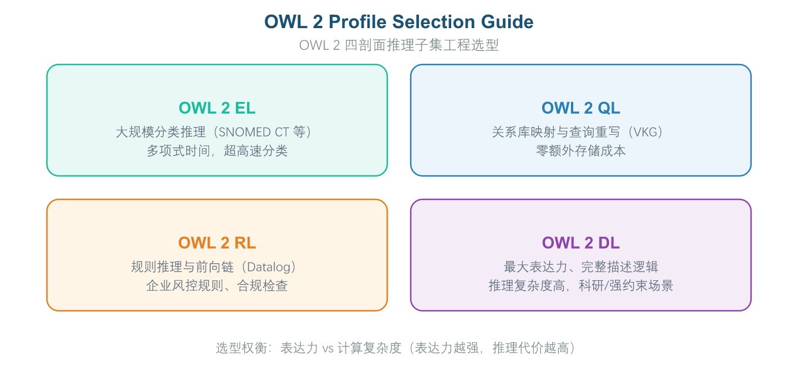
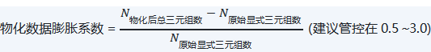

# 第 8 章 第6域：语义推理与计算

## 8.1 域定义与工程目标：把隐藏知识“算”出来，把逻辑冲突“拦截”在上线前

“语义推理与计算”（Semantic Reasoning & Computation）是让知识图谱与本体从“静态存储”升级为“自主推导”的核心工程领域。本域关注如何利用描述逻辑（DL）、SWRL 规则语言与推理引擎，基于已有事实与公理，自动推导出隐藏的业务关联，并对本体模型进行“零自相矛盾”的刚性逻辑校验。它既是语义层的“计算引擎”，也是上线前拦截逻辑错误的“质检闸门”。

**企业痛点**

在语义推理与计算的实际部署中，企业普遍面临以下三大难题：

- **隐式业务关系“看不见、算不出”**：企业数据库中只存储了显式的业务记录（如“A 持股 B，B 持股 C”），但风控部门在排查关联风险时需要定位“A 穿透控制 C”这类多层级的隐式关系。传统 SQL 多表关联在处理固定层级的穿透查询时性能尚可，但一旦遇到未知深度的关联网络，查询逻辑就变得异常复杂甚至无法实现，导致大量潜在的风险关联被遗漏。
- **业务规则硬编码、变更代价高**：风控、合规与推荐逻辑往往以硬编码形式散落在各类业务系统的 Java/Python 代码中，形成铺天盖地的 if-else 嵌套。每当业务规则发生调整（如“将高风险客户的判定标准从逾期30天改为逾期15天”），开发团队就需要修改多处代码并走完整的发版流程，不仅响应速度慢，还极易因多处修改不一致而产生逻辑冲突，给生产环境带来潜在风险。
- **模型逻辑错误隐蔽、难以自检**：随着本体规模扩大到数百乃至数千个概念，人工设计的继承关系和约束规则可能出现隐蔽的逻辑错误（例如某个类同时被声明为两个互斥类的子类，导致系统推导出某个对象既是“个人”又是“企业”的矛盾结论）。这类错误在静态模型检查阶段难以被发现，通常要等到系统上线运行后，在具体业务场景中才会暴露，直接引发业务决策失误或数据计算偏差。

**工程目标**

**本域旨在达成以下工程目标：**

1. 数据不出库，价值自动翻倍：通过推理引擎在后台自动推算衍生关系（如“张三任 A 公司风控经理、A 是 B 母公司 ⇒ 张三可查看 B 的风控数据”），无需额外 ETL，即可获得数倍于原始数据的隐藏业务价值。典型场景包括风险关系穿透分析、组织层级权限推导、客户关联图谱构建等。
2. 业务规则集中化、可解释：将规则下沉到本体层统一声明，每条推理结论自动生成完整的“推导依据链”，使结论具备可解释性与可追溯性，便于业务审计和合规审查。
3. 与相邻知识域的逻辑边界。

### 8.1.1 推理的两大核心价值

在 OMBOK 框架中，域6 的“推理”有两大不可替代的核心价值：其一，从显式公理与规则中**自动推导出隐含结论**（如“子类之子类”关系、传递属性带来的间接关联）；其二，在数据或本体加载前做**一致性检测**，把逻辑冲突（如相互矛盾的归属、不可满足的类）拦截在上线之前，从而保障语义正确。把推理贬低为“仅做术语翻译”“仅做规模统计”或“仅做文件压缩”，都偏离了这两大本质。

### 8.1.2 与相邻知识域的逻辑边界

本域与域3（形式化约束与校验）、域5（存储查询与映射）的分工常被混淆，需在工程上划清：

| **对比维度** | **本域（语义推理与计算）** | **形式化表达与约束（第3域）** |
| --- | --- | --- |
| 核心关注点 | 规则执行、逻辑推导与新数据计算 | 规则编写与静态约束定义 |
| 解决的问题 | 规矩怎么动态执行 | 怎么写规矩 |
| 输入 | 第3域输出的规则与约束代码 | 本域的推理执行结果 |
| 输出 | 派生三元组与一致性报告 | OWL 2/SHACL 代码文件 |
| **对比维度** | **本域（语义推理与计算）** | **存储查询与映射（第5域）** |
| 核心关注点 | 隐式逻辑推导与新知识计算 | 显式图模式匹配与数据检索 |
| 解决的问题 | 算潜在的 | 查现有的 |
| 输入 | 第5域存储的显式三元组 | 本域推导的隐式关系 |
| 输出 | 推理结果与派生三元组 | 查询结果与虚拟图谱视图 |

特别地，域3 用 SHACL 对数据做显式合规校验（值域、基数、结构约束），属于“约束层”；域6 用推理机做隐含知识推导与一致性检测，属于“推理层”——二者职责不同、互补而非重复。把推理说成“仅做存储”或把二者等同，都是常见的误区。

## 8.2 核心概念与理论基石：描述逻辑、图模型与推理算法

### 8.2.1 演绎推理与描述逻辑基础

本体推理机在本体上做必然推导，依赖的是**演绎推理（Deductive Reasoning）**：从通用规则/公理必然推出特例结论，例如若 C⊆D 且 x∈C，则必然 x∈D。描述逻辑（DL）正是为这种可判定推理提供形式化基础的语义框架。与之相对的是**归纳推理（Inductive Reasoning）**——从大量观测实例中归纳一般性规律，结论带有不确定性（如统计学习得到的关联），不属于推理机做严格必然推导的范畴。分清演绎与归纳，是理解“推理机为何能保证结论正确”的前提。

### 8.2.2 表达力与效率的平衡：OWL 2 四剖面与推理假设

OWL 2 标准提供了丰富的表达能力，但并非所有场景都需要全部特性。为了在“语义表达能力”与“计算速度”间取得平衡，必须按场景选择推理子集（Profile）：

- **OWL 2 EL**：表达能力最弱但推理效率最高（多项式时间），支持等价类、子类、属性域/值域等基础特性，适用大型分类体系（如医疗术语、产品目录），主流工具 ELK、HermiT。
- **OWL 2 QL**：专为基于本体的查询设计，可将 SPARQL 改写为 SQL 直接访问关系库，实现“本体即数据库视图”，主流工具 Ontop、Stardog。
- **OWL 2 RL**：基于规则的推理语言，表达力中等，支持 Datalog 规则推理，适用保险规则、合规检查等大量规则推导场景，主流工具 Pellet、HermiT、GraphDB。
- **OWL 2 DL**：完整的描述逻辑子集，表达力强但推理复杂度高（指数时间），适用复杂约束与公理推导，主流工具 Pellet、HermiT。

实际选型建议：**优先选择满足业务需求的最弱 Profile**，而非盲目追求最强表达力——90% 的企业本体场景 OWL 2 EL 或 RL 已足够。



*图3-12: OWL2配置选型 / OWL 2 Profile Selection Guide*

此外，本体推理基于两个与传统数据库截然不同的逻辑假设：**开放世界假定（OWA）**——“没记录”不等于“没有”，推理机不轻易做否定判断，只认定为“未知”；**无单名假定（NUNA）**——名字不同不代表是两个实体，若两个 URI 推演出完全相同的唯一特征（如身份证号相同），推理机会通过 SameAs 将其合并。这两个假设是理解推理行为、避免错误实体合并的关键。

### 8.2.3 推理执行策略：前向链 vs 后向链

- **前向链（Forward Chaining / Materialization）**：“预先算好存起来”。数据入库即运行推理，把能推导的新三元组物化写入图库。优点是查询极快；缺点是占额外存储、更新需重算，适合读多写少场景。
- **后向链（Backward Chaining / Dynamic Reasoning）**：“查的时候实时算”。查询时实时改写并动态计算派生知识。优点是不占额外存储、更新无需重算；缺点是复杂查询响应延迟高，适合写多或实时风控场景。

### 8.2.4 图模型选型：属性图 vs RDF 图

在图模型间选型或互通时，必须分清两类模型的差异。**属性图（Property Graph，以 Neo4j 为代表）**中，关系（边）是一等公民，可带类型与属性；**RDF 图（W3C 标准）**的谓词（边）默认不带属性，需要 reification 或 RDF* 扩展才能表达边的属性。二者可互转但模型不同：把属性图说成“边无类型、语义全在节点”，或把 RDF 说成“谓词可随意带属性”，都颠倒了事实。

### 8.2.5 RDF 与属性图的互转映射

实践中常把 RDF 数据集导入 Neo4j 以利用遍历与图算法，标准的映射做法是：资源 IRI → 节点，谓词 → 带类型的边（关系），三元组 → 节点-边-节点，字面量作为节点或边的属性——从而保留结构并实现两模型互通。把三元组整体压成纯文本、反转节点与边角色、或丢弃谓词，都会破坏语义结构。

### 8.2.6 推理机核心算法范式：Tableau 与规则引擎

OWL 推理机（如 Pellet、HermiT）必须在有限时间内给出正确结论，其底层多采用 **Tableau 算法**在描述逻辑上做可判定推理，保证正确性与终止性；规则型推理机则基于 **RETE 等规则引擎**执行。穷举搜索不可判定且易不终止，相似度近似并非严格推理，纯人工审阅也不属机器推理。

### 8.2.7 SWRL 规则语言的结构

SWRL（Semantic Web Rule Language）把 OWL 与规则结合，用于在推理机中表达蕴含关系。其规则形如 body → head：用 ∧ 连接前提原子（Antecedent），变量以 ? 开头，例如 hasParent(?x,?y) ∧ hasBrother(?y,?z) → hasUncle(?x,?z)。需要区分：SWRL 是“前提→结论”的蕴含规则，而非 SPARQL 的 SELECT-FROM-WHERE 查询块，也非 Python 的 if-then 代码块或仅做正则文本匹配。

## 8.3 实施方法与技术工具：SWRL 编写与图计算工具链

### 8.3.1 SWRL 规则编写与蕴含推导

SWRL 的核心模式是“如果前提条件满足 → 则导出新事实”，业务人员也能理解与维护。下列反洗钱风险识别范例展示了标准写法：

```
# 业务逻辑：若客户 A 控股公司 B，且 B 与公司 C 发生大额转账，且 C 是高风险实体，
# 则自动推导出“客户 A 存在隐式高风险暴露”
ex:Customer(?a) ^ ex:controls(?a, ?b) ^ ex:Company(?b) ^
ex:hasTransactionWith(?b, ?c) ^ ex:HighRiskEntity(?c)
-> ex:hasImplicitRiskExposition(?a, ?c)
```

*[turtle]*

以亲属关系为例，“叔叔 = 父亲的兄弟”可表达为 hasParent(?x,?y) ∧ hasBrother(?y,?z) → hasUncle(?x,?z)——当 x 的父是 y、y 的兄弟是 z 时，推出 z 是 x 的叔叔。把结论错写成父亲（hasFather）或从子辈反向推导侄辈，都违背该语义。

此外，可用 SPARQL CONSTRUCT 将推理结果“物化”入库：

```
PREFIX ex: <http://example.org/obok#>
# 业务逻辑：通过多跳传递关系，自动计算并生成“最终控制人”的直接三元组
CONSTRUCT {
    ?person ex:ultimateControls ?ultimateCompany .
}
WHERE {
    ?person ex:directControls ?midCompany .
    ?midCompany ex:directControls+ ?ultimateCompany .
    ?person a ex:IndividualCustomer .
}
```

*[sparql]*

### 8.3.2 属性图查询语言 Cypher 与 Neo4j

Neo4j 是主流属性图数据库，其配套查询语言 **Cypher** 以 ASCII 图模式直观表达节点与关系的遍历，典型形如 MATCH (a)-[r:REL]->(b) RETURN ...。例如 MATCH (p:Person)-[:KNOWS]->(f:Person) RETURN p,f 匹配标签为 Person 的节点 p 经 KNOWS 关系到另一 Person 节点 f，返回所有“人—认识—人”对——属于读查询而非写入（CREATE/DELETE/COUNT 才是建、删、聚合语义）。Cypher 用于 RDF 图、SQL 用于关系表、Gremlin 用于 TinkerPop/JanusGraph，均非 Neo4j 原生语言。

### 8.3.3 图算法工具链：PageRank 与社区发现

在图谱上做影响力排序或主题聚类时，需选用合适的图算法：**PageRank** 通过链接结构迭代计算节点重要性（被重要节点指向则更重要），专用于衡量实体的“影响力/重要性”；**社区发现（Community Detection，如 Louvain）** 把联系紧密的节点聚为一群，用于发现紧密关联的实体群组、完成子图聚类（如主题聚类、异常团伙识别）。最短路径（Dijkstra）算距离、连通分量划分子图、中心性排序挑中心，均不衡量单点重要性或发现群组。

### 8.3.4 超大规模图的分布式存储选型

当图谱规模达到千亿级边、并发访问极高时，单机图库在内存与吞吐上都难以支撑，应优先考虑**分布式图数据库**（如 JanusGraph 基于 Cassandra/BerkeleyDB、NebulaGraph）通过分片与多副本做水平扩展。把全图导出为单一 CSV、仅依赖单机关系库加二级索引、或每次查询临时重建大图，均不可行。

技术工具链方面：逻辑一致性检查可用 HermiT、Pellet（支持 SWRL）；超高速分类可用 ELK；图库原生推理可用 GraphDB Reasoning Engine、Stardog 推理引擎。

## 8.4 人机协同与 AI 赋能：LLM 写规则、推理机兜底

### 8.4.1 LLM 辅助规则编写与“推理机兜底”分工

企业内部大量业务规则以非结构化文本（风控手册、合规办法）存在，转化为可执行 SWRL 是一项耗时易错的工作。LLM 可自动提取条件与动作、生成标准 SWRL 草案，并将晦涩的推导日志“人话解读”为业务可读的分析报告。但模型可能生成语法错误或自相矛盾的规则（如 A 推 B、B 推 A 的循环），因此合理的人机协同工作流是：**LLM 起草规则 → 推理机做语法与可满足性校验 → 专家最终定稿**。完全禁用 LLM 或让 LLM 一次生成直接上线，都不可取。工程上还应将生成的规则先投入沙盒做死锁与一致性测试，并对每条规则设置最大递归深度与执行超时阈值（如 5 秒），防止无限循环推理拖垮服务。

### 8.4.2 关键推导链的人工复核优先级

推理机产出的隐含结论数量庞大，而人工复核资源有限，必须按风险优先级安排：最应由人工复核的是**影响业务决策的关键推导链**（如风控“不得放款”、合规“高风险主体”判定），避免错误公理被放大为错误结论——这是“人在回路”的重点。平凡子类断言、计数类派生、外观属性推导等不涉业务判定的结论，优先级低。

## 8.5 语义治理与质量评估：算得对、跑得快

本域的治理产物——推理规则（SWRL）与本体公理——属于本体资产，其版本、变更与发布须由数据部门（或企业本体治理委员会）评审把关（见第 1 章 1.3）；以下为具体的治理指标与手段。

### 8.5.1 推理正确性：一致性检查与可满足性

“推理正确性”治理要求本体在上线前证明自身没有逻辑矛盾。检测本体是否自相矛盾，称为**一致性检查（Consistency Checking）与可满足性（Satisfiability）**——判断是否存在不可满足的类或推出矛盾（如某类既是自身又非自身），确保推理“算得对”。性能测试、规模统计、视觉检查均不检测逻辑自相矛盾。

为把正确性落到可考核数字上，本域定义以下指标：


（式 0-16）



（式 0-17）


（式 0-18）

### 8.5.2 推理性能治理：超时、增量与预物化

复杂推理（深度归纳或大规模规则）在大数据集上可能耗时过长甚至超时，需在正确性与性能间治理。优先措施包括：**推理超时熔断**、**增量推理**（仅算变化部分）、**预计算并物化高频结论**，从而在“算得对”与“算得快”间取得平衡。切忌对海量业务数据直接开启最重的 OWL 2 Full 全量推理——只在“元数据/本体定义”阶段跑 HermiT 查逻辑错误，在“亿级实例数据”阶段只开启轻量级 OWL 2 RL 或 SPARQL CONSTRUCT 定向规则物化。所有 SWRL 与推理规则文件须存入 Git，每次修改自动触发 CI/CD 回归测试，确保新规则不会误杀正常业务。

## 8.6 本章小结与示例

*本章围绕“把隐藏知识算出来、把逻辑冲突拦截在上线前”展开，依次阐述了推理的两大核心价值与相邻域边界、演绎推理与描述逻辑、OWL 2 四剖面与 OWA/NUNA 假设、前向/后向链执行策略、属性图与 RDF 图的选型及互转、推理机 Tableau/规则引擎算法范式、SWRL 规则结构，以及 SWRL/Cypher 编写、PageRank 与社区发现、分布式图库等工具链，最后落到 LLM 写规则+推理机兜底的人机协同与一致性检查、推理性能治理两类评估。为帮助读者检验理解，章末附数道示例题供自学巩固；更系统的练习另行成册，不在此重复。建议先遮住本节末尾的参考答案与解析，独立作答后再行核对。*

#### *题目 1：在 OMBOK 的架构中，域6（语义推理与计算）中“推理”的两大核心价值是什么？*

**题目类型**：单选

- A 仅负责把术语标签翻译为英文，改善跨语言可读性
- B 仅对本体中的公理做统计与计数，用于衡量本体规模
- C 把隐含知识自动推导出来，并在上线前拦截逻辑冲突
- D 仅负责将本体文件压缩归档，便于长期离线保存

#### *题目 2：下列情形中，属于“演绎推理”的是哪一项？*

**题目类型**：单选

- A 在已有数据上做随机抽样，用统计分布描述整体特征
- B 仅对术语标签做同义归并，不改变本体逻辑关系
- C 从一般公理推出特定实例的必然结论（如子类继承）
- D 从大量观测实例中归纳出一般性规律，结论带有不确定性

#### *题目 3：SWRL（Semantic Web Rule Language）规则的基本结构是？*

**题目类型**：单选

- A 用 if-then 代码块直接编写，仅用于 Python 脚本
- B 前提(body) → 结论(head)，变量以 ? 开头
- C 仅用正则表达式匹配文本串，不支持变量
- D 形如 SELECT-FROM-WHERE 的声明式查询块

#### *题目 4：用大语言模型辅助编写 SWRL/推理规则能显著提升效率，但模型可能生成语法错误或自相矛盾的规则。合理的人机协同工作流应是？*

**题目类型**：单选

- A LLM 起草规则，推理机校验，专家最终定稿
- B 完全禁用 LLM，全部规则仅由专家手工编写
- C 仅用 LLM 把已有规则翻译为多种自然语言
- D 由 LLM 一次生成规则并直接上线，不做任何校验

#### *题目 5：“推理正确性”治理要求本体在上线前证明自身没有逻辑矛盾。在“推理正确性”评估中，检测本体是否自相矛盾，称为？*

**题目类型**：单选

- A 一致性检查（Consistency Checking）与可满足性
- B 对推理过程的整体耗时做基准测试，评估端到端的响应延迟与系统吞吐能力
- C 统计本体中公理与实体的数量，以此衡量本体的整体规模大小
- D 检查本体标签的配色方案是否符合可视化展示的视觉规范

### 参考答案与解析

**题目 1　参考答案**：C **解析**：域6 的“推理”有两大核心价值——从显式公理与规则中自动推导出隐含结论，以及在数据或本体加载前做一致性检测、把逻辑冲突拦截在上线之前（见 8.1.1 节）。B 只是规模统计、D 是压缩归档、A 是翻译，均与“推导隐含知识 + 拦截冲突”无关。

**题目 2　参考答案**：C **解析**：演绎推理从通用规则/公理必然推出特例结论（如 C⊆D 且 x∈C ⇒ x∈D），本体推理机正是基于这种必然推导在描述逻辑上工作（见 8.2.1 节）。D 描述的是归纳推理（结论不确定）；A 是统计抽样、B 是同义归并，均非演绎。

**题目 3　参考答案**：B **解析**：SWRL 规则形如 body → head，用 ∧ 连接前提原子，变量以 ? 开头（见 8.2.7 节）。D 是 SPARQL 的查询块结构（查询而非规则），A 把规则误当 Python 的 if-then，C 的正则匹配无法表达变量关系。

**题目 4　参考答案**：A **解析**：LLM 可高效起草规则，但须由推理机做语法与可满足性校验，再由专家确认语义，防止矛盾规则进入生产——这是“LLM 写、推理机兜底”的分工（见 8.4.1 节）。D 跳过校验风险高、B 完全放弃 LLM 效率、C 仅翻译不改变规则质量。

**题目 5　参考答案**：A **解析**：一致性检查判断本体是否存在不可满足的类或推出矛盾，是“可满足性”的核心，确保推理“算得对”（见 8.5.1 节）。B 是性能测试、C 是规模统计、D 是视觉检查，均不检测逻辑自相矛盾。

## 相关笔记

- [[00-目录]]
