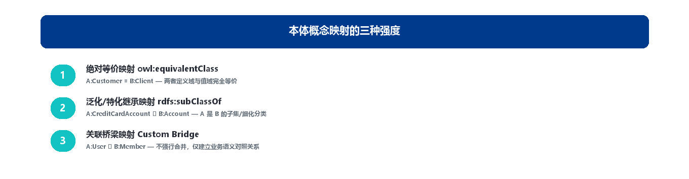
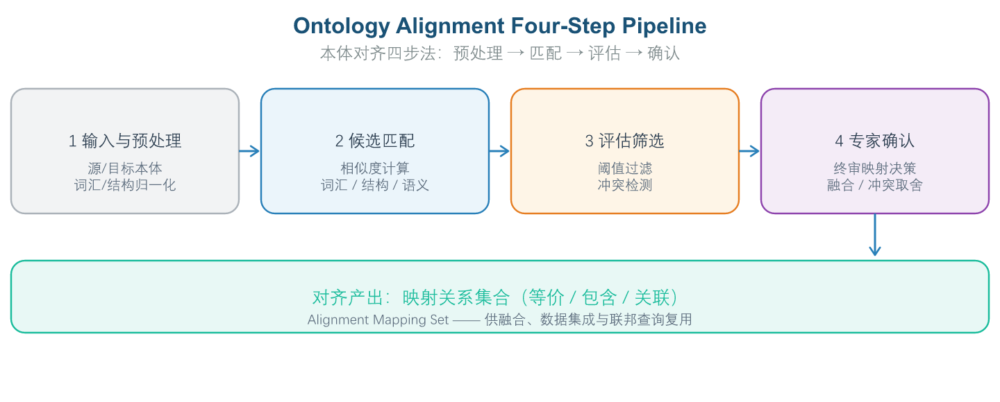
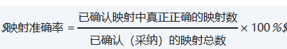
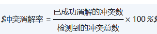

# 第 9 章 第7域：本体对齐与融合

## 9.1 域定义与工程目标：解决“语义异构”，实现多源本体的合一

“本体对齐与融合”（Ontology Alignment, Integration & Mapping）是解决企业内部“语义烟囱”与异构系统归并的核心工程手段。本域聚焦于如何运用语义相似度算法、本体对齐技术与异构映射范式，将来自不同业务部门、不同供应商或不同历史时期构建的多个独立本体，融合成一份统一、连贯的企业级主本体（Master Ontology）。在 OMBOK 的十域框架中，域5（存储查询与映射）负责把单一本体落到数据底座，域7 则进一步回答“多份本体如何彼此对齐、合而为一”——它承接上游建模产物，也为下游图谱构建（域9）与语义应用（域10）供给统一的概念视图。

**企业痛点**

在本体对齐与融合实践中，主要挑战来自以下三个方面：

- **跨部门“语义烟囱”导致数据融合冲突**：企业在发展过程中，各业务部门通常会独立构建各自的本体体系，导致对同一业务对象的定义存在显著差异。例如，风控部门定义的 Customer 强调风险属性（信用评分、逾期记录），营销部门定义的 User 侧重消费行为（偏好、活跃度），两者字段名不同但指代同一对象；或者更复杂的情况是名称相同（都叫 Account）但内涵完全不同（一个指银行账户，一个指营销账号）。这种语义异构在企业并表、跨部门协作时会引发严重的数据合并冲突，导致统计算法错误或业务口径不一致。
- **重复造轮子与语义资产割裂**：由于缺乏统一的本体建设规范和对齐机制，不同团队往往各自建立独立的本体模型，导致相似概念被重复定义、相同结构被反复构建。这种资产割裂不仅造成开发资源的浪费，还形成了新的“图谱孤岛”，使得跨系统的语义查询和推理难以实现。
- **跨行业标准对接缺少映射桥梁**：在对外开放合作或引入外部数据时，企业自有本体需要对接行业标准本体（如金融领域的 FIBO、医疗领域的 SNOMED CT）。由于这些外部标准通常采用不同的建模方式和术语体系，企业缺乏标准化的映射桥梁将自有概念与外部标准进行对齐，导致数据交换和合规审计成本居高不下。

**工程目标**

针对上述异构问题，本域设定以下工程目标：

1. 消除语义异构，实现“一视图看全”：通过自动化本体对齐技术，识别不同本体之间的概念等价、包含与部分-整体关系，将多源本体合并为统一的全局视图，保障全域数据语义的一致性。
2. 支撑企业级并购与跨系统语义打通：通过建立桥梁本体（Bridge Ontology）的方式，在不破坏原有子系统本体结构的前提下，用映射规则将新旧本体的概念和属性关联起来，实现跨系统语义的平滑过渡与渐进式迁移。
3. 与相邻知识域的逻辑边界。

### 9.1.1 本域的核心定位：多本体的“合一”工程

域7 的出发点是“多个已经存在的本体”。它们可能由不同团队在不同时期为不同目的构建，命名习惯、建模粒度、概念层级都不一致。域7 不去重新设计这些本体，而是用一组可验证的映射把它们“接起来”——对齐（Alignment）建立对应关系，融合（Integration）产出合并后的统一本体。它与域5 的根本区别在于关注对象：域5 处理“本体概念 ↔ 物理数据（SQL 表/字段）”的映射；域7 处理“本体 ↔ 本体”的概念映射。一个管“向下接数据”，一个管“横向接本体”，二者前后衔接：域7 融合出的统一本体，最终仍要落到域5 的存储与查询层。

### 9.1.2 与相邻知识域的逻辑边界

本域与域5（存储查询与映射）、域9（知识图谱工程）的分工常被混淆，需在工程上划清：

| **对比维度** | **本域（本体对齐与融合）** | **存储查询与映射（第5域）** |
| --- | --- | --- |
| 核心关注点 | 本体与本体之间的概念对齐与融合 | 本体概念与物理 SQL 表字段的映射 |
| 解决的问题 | 概念与概念的语义对齐 | 模式到数据的物理绑定 |
| 输入 | 多个异构本体模型 | 本域对齐后的统一本体 |
| 输出 | 对齐映射规则与融合本体 | OBDA 映射配置与虚拟图谱 |
| **对比维度** | **本域（本体对齐与融合）** | **知识图谱工程（第9域）** |
| 核心关注点 | 已存在本体之间的语义对应与合并 | 从文本与多源数据中抽取实体、构建并融合图谱 |
| 分工关系 | 偏“概念层”的桥接与一致性保障 | 偏“数据层”的抽取、实例对齐与图谱充实 |

## 9.2 核心概念与理论基石：语义异构、映射强度与等价/包含公理

在多系统、多部门、多领域的企业环境中，不同本体之间的语义差异是必然存在的。本体对齐与融合的核心任务，就是通过建立概念间的映射关系，消除这些差异，确保企业语义的一致性和互操作性。本节阐述对齐实践必须首先厘清的三个理论支点：语义异构的本质、映射关系的强度谱系，以及等价/包含公理的语义后果。

### 9.2.1 语义异构：对齐要解决的根本问题

所谓**语义异构（Semantic Heterogeneity）**，指不同系统或本体用不同的概念、命名或结构来表达同一个现实对象，导致机器无法自动判断“说的是不是同一回事”。一个典型的例子是：“Customer”“Client”“User”在三个系统中都可能指代“与企业发生关系的自然人”，但字段命名、属性集合、计算口径各不相同。域7 的核心目标，正是通过建立跨本体的映射把这种语义层面的不互通消弭掉，实现多源本体合一。

需要强调的是，异构是分层的：最浅的是**语法异构**（技术格式或编码不同，如 RDF/XML 与 JSON-LD、中文与英文编码），最易通过格式转换解决；中层是**结构异构**（同一概念的建模粒度不同，如“姓名”在 A 本体是单一属性，在 B 本体拆为“姓”与“名”）；最深层才是**语义异构**——同名或同结构的概念，业务含义或计算口径却不同（如“营业收入”在财务本体指“已确认销售收入”，在税务本体指“应纳税所得额”）。对齐策略的选型，取决于你面对的是哪一层异构：语法层靠转换工具，结构层靠属性映射与数据转换，语义层则必须靠建立语义约束和映射公理，有时还需构建中间桥梁本体。

### 9.2.2 三种映射强度：等价、包含与关联

本体映射通过建立不同本体概念之间的逻辑公理来消除异构，其逻辑强度从弱到强依次有三档：

- **等价映射（Equivalence Mapping，≡）**：最强的映射关系，表示两个概念在语义上完全等价，其外延（实例集合）完全相同。例如，财务本体中的 Customer 与客服本体中的 Client 若指向同一业务概念，可声明为等价。等价映射是实现跨本体数据融合的基础，推理机会自动将等价概念视为同一实体，在推导中可互相替换。
- **包含映射（Subsumption Mapping，⊆）**：表示一个概念是另一个概念的子概念或父概念（即 subClassOf 关系）。例如，“VIP 客户”是“客户”的子集，“客户”又是“利益相关者”的子集。包含映射用于建立跨本体的分类层级，使不同本体的概念能在同一分类体系下比较和查询。
- **关联映射（Association Mapping，↔）**：最弱的映射关系，表示两个概念之间存在某种业务关联但不具备等价或包含关系。例如，“客户”与“合同”之间的“签订”关系。关联映射通常通过对象属性（Object Property）来表达，是建立跨本体语义链接的主要方式。

包含与等价不可混用：包含（subsumption，记作⊑）只表示上下位/子类关系；等价（equivalence，记作≡）表示两个类外延完全相同。二者语义强度不同，等价强于包含。若把本应是子类的关系错标为等价，会强行合并不等价的概念，引发推理矛盾；反之把等价降级为包含，又会丢失本可共享的实例集合。在对齐中严格区分二者，是避免逻辑污染的第一道防线。

### 9.2.3 owl:equivalentClass / owl:equivalentProperty 与错误等价的代价

在 OWL 中，owl:equivalentClass 用于声明两个类语义等价，其外延完全相同，在推理中可互相替换；owl:equivalentProperty 则声明两个属性等价。它们是对齐的“强力胶水”，但也是风险最高的构造子。

当两个并不真正等价的类被错误地用 owl:equivalentClass 绑定时，就等于向本体注入了一条与事实相悖的强声明。推理机依据描述逻辑做推导，会由此推出矛盾，使相关类变得**不可满足（unsatisfiable）**，整个本体进入**不一致（inconsistent）**状态。这正是语义冲突的主要来源之一：错误的等价不会“无影响”，也不会“自动被推理机修正”，而是直接摧毁本体的逻辑一致性。因此，凡涉及 owl:equivalentClass/owl:equivalentProperty 的等价声明，都应经过推理机的二次验证，确认不会引发不可满足或矛盾后方可落库。

### 9.2.4 对齐产出物：映射关系集合

澄清一个常见误解：本体对齐（Alignment）是一项活动，其**产出物是“映射（Mapping）”**——即一组描述源本体与目标本体之间，哪些类、哪些属性、哪些实例相互对应的关系集合。它是后续本体融合、数据集成与联合查询的基础，而非物理文件、数据搬运脚本或简单的标签翻译。对齐产出的是语义对应关系，而非数据库 ETL 管道；它回答“谁对应谁”，而非“数据搬到哪”。



*图3-13: 语义映射强度 / Semantic Mapping Modalities*

### 9.2.5 映射与融合：两种"合一"路径的分野

本域名称中的"对齐"与"融合"对应两条**不同的合一路径**，工程上常被混为一谈，需要首先厘清。

**对齐/映射（Alignment / Mapping）**：各源本体保持独立，在其之上**新增一层映射关系**（等价、包含、关联，见 9.2.2 节），多本体通过映射层"虚拟地"合一。其优点在于：源本体不动、零侵入，可增量维护、可随时回溯，映射出错时撤销成本低。它适用于需要**多套自治本体长期共存**的场景——例如跨企业协作、联邦查询与数据共享（对应域5 的虚拟知识图谱与域8 的语义集成）。

**融合/合并（Merging）**：把多个本体**物理合并为一个统一本体**，消除重复概念、合并等价类，最终交付单一权威模型。融合通常以 9.2.4 节的映射集合为输入，因此映射在前、融合在后：先对齐出"谁对应谁"，再决定"合并后保留谁、删除谁、如何改名"。成熟做法是引入**保守扩展（Conservative Extension）**等约束——合并过程只允许新增结论、不允许破坏原本体已推出的结论，从机制上防止"合并即污染"。融合的工程代价显著：合并决策一旦落库，原本体的自治性与版本独立性即被牺牲；若合并中引入不自洽的等价声明，会直接导致新本体不一致（见 9.2.3 节）。它适用于需要**单一权威本体**的场景，如企业并购后的统一数据模型、集团级标准本体建设。

两者并非互斥而是递进关系：映射是低成本、可逆的"软合一"，融合是高成本、不可逆的"硬合一"。实践中应先以映射满足跨系统协同，在治理条件成熟、确有必要时再向融合演进，并在融合后保留完整的映射与版本记录（见 9.5.3 节），使每一次"合一"决策都可追溯、可回退。

## 9.3 实施方法与技术工具：自动对齐流水线、LogMap 与映射融合

对齐不是一次性手工比对，而是一条“工具生成候选 + 人确认”的工程流水线。本节给出标准的自动对齐流程、主流工具链，以及多份映射如何融合为全局一致的实操要点，并附一段 Turtle 范例展示跨本体映射的写法。

### 9.3.1 自动对齐三步法：匹配 → 评估 → 确认

自动对齐（Automated Alignment）的标准工程化流程分三步，形成闭环：

1. **匹配（Matching）**：工具基于字符串、结构、语义等多种相似度计算（如编辑距离、TF-IDF、词向量，以及类在层次树中的邻居拓扑），生成候选对齐。
2. **评估（Assessment）**：对每条候选给出置信度（Confidence）评分并排序，区分高置信与临界项。
3. **确认（Validation）**：专家复核高置信候选，定稿为正式映射。

对齐工具（如 AML、LogMap）运行后输出的，正是一组**候选映射对**（如 概念 A ↔ 概念 B），并为每条候选附带相似度或置信度评分——这是它的核心交付物，是一份“带分数的建议清单”，而非统计图、报错日志或二进制缓存。工具本身并不替你判定对错，它给出建议，人做最终拍板。理解这一输出形态，才能正确进入人工确认环节。

### 9.3.2 主流对齐工具：LogMap、AML 与 Alignment API

- **LogMap**：业界主流的本体匹配（ontology matching）系统，专门针对大规模本体设计。它采用基于模块的划分技术控制计算复杂度，并在生成对齐的同时尽量保持本体的**可满足性（Satisfiability）**——即不引入使类不可满足的矛盾。面对巨型医学/基因本体时，LogMap 能在内存与一致性上保持稳健。
- **AgreementMakerLight（AML）**：高效的本体匹配库，输出同样是一组带置信度的候选映射对。
- **Alignment API**：W3C 推荐的本体对齐标准 API，支持 EDOAL（Expressive and Declarative Ontology Alignment Language）对齐语言，并被 OAEI 国际本体对齐大赛用作评测基准。



*图3-14: 本体对齐四步法 / Ontology Alignment Pipeline*

### 9.3.3 映射融合与冲突消解：得到全局一致的映射

当多份由不同团队产出的映射要合并时，它们之间很可能冲突：例如同时出现 B≡C、C⊂D，却又存在与此矛盾的 B⊂D，或形成循环依赖。融合的关键不是简单堆叠或顺序拼接（后写声明覆盖前者只会掩盖冲突），而是先做**冲突检测**，再用等价/包含关系的逻辑一致性规则**消解矛盾**，得到一份全局一致的映射集。冲突消解能力直接决定融合结果的可信度，是域7 质量治理的核心环节之一。

### 9.3.4 代码示例：跨本体的等价与包含映射（Turtle 语法）

下面用一段 Turtle 演示如何把两个异构本体的类与属性对齐起来——注意等价用 owl:equivalentClass、属性等价用 owl:equivalentProperty、子类包含用 rdfs:subClassOf：

```
@prefix owl:  <http://www.w3.org/2002/07/owl#> .
@prefix rdfs: <http://www.w3.org/2000/01/rdf-schema#> .
@prefix ontA: <http://company.com/ontology/finance#> .
@prefix ontB: <http://company.com/ontology/risk#> .

# 1. 跨系统类的绝对等价对齐
ontA:Client owl:equivalentClass ontB:Customer .

# 2. 属性的等价对齐
ontA:taxID owl:equivalentProperty ontB:socialTaxNumber .

# 3. 父子继承对齐：风险本体中的“高危借款人”是财务本体“客户”的子类
ontB:HighRiskBorrower rdfs:subClassOf ontA:Client .
```

*[turtle]*

所有经 AI 与人工联合确认的映射，都建议单独存放于独立的桥梁本体文件（Bridge Ontology，如 bridge_fin_risk.ttl），而非直接改动两个源本体，以便独立版本管理。

## 9.4 人机协同与 AI 赋能：LLM 推荐候选，专家最终把关

大模型为传统对齐算法补上了“语义理解”的短板，但凡涉及语义对错的终局判断，仍必须由人做出。本节界定 LLM 的合理角色、人类专家的终审职责，以及准确率偏低时的治理动作。

### 9.4.1 LLM 的辅助角色：语义推荐与冲突标出

传统对齐算法主要依赖字面字符相似度，容易出现“同词异义”与“异词同义”的误判。LLM 通过深层语义理解能力，为本体对齐提供精准辅助：它能结合类的注释（rdfs:comment）、上下文属性与业务场景，识别“表面不同但实质相同”的概念（如 Borrower 与 Debtor 均指借款人），以及“表面相同但实质不同”的概念（如“业务账号”与“财务账号”的口径差异）；当两个本体存在概念分歧时，它还能用自然语言生成映射建议与口径差异说明，把海量比对压缩成少量待审清单。合理定位是“辅助而非替代”：LLM 是加速器，不是裁判。

### 9.4.2 人类专家的终审职责：关键映射与冲突取舍

按“人在回路（Human-in-the-Loop）”原则，凡直接影响融合语义正确性的环节——尤其是关键映射（等价/包含）的建立，以及冲突消解时“保留哪条、放弃哪条”的取舍——都必须由人类专家最终确认。因为这些决策一旦出错（如错误等价），会引发全局推理不一致，机器难以独立担责。相反，纯视觉样式调整、概念数量统计、字符串完全相等的琐碎匹配，都不该占用专家的最终把关资源，应交给自动化或低层级审核。

### 9.4.3 阈值与复核治理：准确率偏低时收紧入口

当工具产出海量候选但抽样准确率偏低，说明候选里误匹配（噪声）很多。治理优先动作应是“收紧入口”：**提高确认阈值**（只放行高置信候选），并**加强专家人工复核**，把低置信的误匹配在入融合前剔除，防止错误沿集成链传播。反之，一律全部拒绝会丢失正确候选，全部接受会让错误大规模进入融合，直接关闭工具更是因噎废食——阈值+复核才是准确率治理的标配手段。

## 9.5 语义治理与质量评估：准确率、冲突消解率与版本控制

本域的治理产物——本体映射集（对齐产出）——属于本体资产，其版本、变更与发布须由数据部门（或企业本体治理委员会）评审把关（见第 1 章 1.3）；以下为具体的治理指标与手段。

域7 的交付物是否可信，需要量化指标与长效治理机制来保障。本节给出核心评估指标与映射版本控制要点。

### 9.5.1 映射准确率（Precision）与召回率

**映射准确率（Precision of Alignment）** 是质量评估的核心指标，定义为：在已确认（采纳）的映射中，真正正确的映射所占比例——



（式 0-19）

它反映“采纳的映射有多少是对的”，过低说明噪声大。与之配套的**映射召回率（Recall）** 衡量覆盖度：


（式 0-20）

二者构成对齐质量的基本看板：准确率高保证“采纳的都对”，召回率高保证“该对的都对上”。

### 9.5.2 冲突消解率与逻辑冲突发生率

**冲突消解率** 衡量融合过程的可治理程度，定义为：已被成功消解的冲突数 / 检测到的冲突总数，即“发现的冲突里有多少被解决掉了”——



（式 0-21）

比率越高，说明团队处理语义冲突的能力越强、融合结果越可信。与之相对的是**逻辑冲突发生率**（引发本体推理不一致的映射数 / 建立的映射总数），它是刚性指标，目标值为 0%——任何导致不一致的映射都必须拦截在融合之前。

### 9.5.3 映射版本控制：可追溯、可回溯

源本体随业务持续演进（新增概念、调整层级），其上的映射也必须跟着更新。把映射纳入版本控制，核心目的是记录“哪一版本本体的哪些概念，映射到另一本体的哪一版”的对应关系演变，使历史集成关系**可解释、可回溯、可审计**，出问题能定位到具体版本差异。推荐将对齐公理单独存放于桥梁本体文件并独立版本管理；当源本体版本升级（如 Ontology A v1.0 → v2.0）时，自动触发映射失效检测流水线，提示架构师更新桥梁映射。版本控制绝非应付审计的形式主义，而是语义资产长期可维护的基石。

## 9.6 本章小结与示例

*本章围绕“把多个异构本体合一”展开，依次阐述了域7 的核心定位与相邻域边界、语义异构的本质与三层异构、等价/包含/关联三种映射强度及* *owl:equivalentClass* *错误等价的代价、自动对齐“匹配→评估→确认”三步法与 LogMap/AML 工具链、多映射融合的冲突消解，以及人机协同中 LLM 推荐候选、专家终审关键映射的分工，最后给出映射准确率、冲突消解率与版本控制三类治理要点。为帮助读者检验理解，章末附数道示例题供自学巩固；更系统的练习另行成册，不在此重复。建议先遮住本节末尾的参考答案与解析，独立作答后再行核对。*

#### *题目 1：OMBOK 域7（本体对齐与融合）要解决的“语义异构”主要指？*

**题目类型**：单选

- A 不同系统部署在相距较远的数据中心，带来网络往返延迟问题
- B 不同系统使用不同的编程语言编写实现，需额外开发接口适配层才能彼此互相调用
- C 不同系统的数据库产品不一致，数据须经中间库做格式转换后才能同步
- D 不同系统用不同的概念、命名或结构表达同一事物，导致机器无法直接对应与互通

#### *题目 2：若将并不真正等价的类强行用 owl:equivalentClass 绑定，最可能导致的后果是？*

**题目类型**：单选

- A 推理机会自动修正底层冲突数据，将矛盾记录直接删除并补齐
- B 对本体语义没有任何影响，仅会额外增加少量冗余标注信息
- C 推理机会自动优化本体内部类层级结构，使查询推理性能明显提升
- D 推理机会推出矛盾，使相关类变得不可满足（unsatisfiable），本体不一致

#### *题目 3：自动对齐工具（如 AML、LogMap）运行后，其输出通常包含？*

**题目类型**：单选

- A 一组候选映射对，并附带每对的相似度或置信度评分
- B 仅生成一张展示两本体类目规模数量对比的静态统计图表
- C 仅输出一份记录运行报错与警告信息的日志文件供排查
- D 仅生成一份不可查看的二进制缓存文件用于内部暂存

#### *题目 4：在域7 流程中，必须由人类专家最终确认的是？*

**题目类型**：单选

- A 所有字符串完全相等这类琐碎的自动化匹配结果，都应由专家逐条复核
- B 影响融合正确性的关键映射（等价/包含）与冲突消解的取舍决策
- C 仅负责调整工具界面主题的配色方案与按钮摆放等纯视觉样式
- D 仅是对齐前后概念数量的简单统计与各项计数类的汇总工作

#### *题目 5：“冲突消解率”衡量的是？*

**题目类型**：单选

- A 对齐结果落地后写入底层存储系统所占用的磁盘空间与副本总量
- B 参与本轮本体对齐项目的标注与审核人员的总人数规模
- C 在已检测出的冲突中，被成功消解（解决）的冲突所占比例
- D 推理机完成一次全局一致性检查所需的平均响应耗时

### 参考答案与解析

**题目 1　参考答案**：D **解析**：语义异构（Semantic Heterogeneity）指不同系统或本体用不同的概念、命名、结构来表达同一个现实对象，导致机器无法自动判断“说的是不是同一回事”，这正是域7 要消弭的核心问题（见 9.2.1 节）。A 把问题混淆为网络延迟（性能异构），B 混淆为编程语言技术栈异构，C 混淆为数据库存储格式异构——这些都属于“技术异构”而非“语义异构”，不是域7 的范畴。

**题目 2　参考答案**：D **解析**：当两个并不真正等价的类被错误用 owl:equivalentClass 绑定时，等于向本体注入一条与事实相悖的强声明；推理机依据描述逻辑推导会推出矛盾，使相关类变得不可满足（unsatisfiable），整个本体进入不一致（inconsistent）状态（见 9.2.3 节）。B 称“无影响”明显错误，C 误以为冗余声明能提升性能，A 幻想推理机“自动修复数据”——推理机只做逻辑推导，不会擅自改动数据。

**题目 3　参考答案**：A **解析**：对齐工具运行后输出的核心交付物，是一组候选映射对（如 概念 A ↔ 概念 B），并为每条候选附带相似度或置信度评分，以便人工筛选与确认（见 9.3.1、9.3.2 节）。B、C、D 都把它说成只产出统计图、报错日志或二进制缓存，这些或是对齐报告的附属物、或根本不是标准输出，均不能体现对齐工具“带分数的建议清单”这一本质。

**题目 4　参考答案**：B **解析**：按“人在回路（Human-in-the-Loop）”原则，凡直接影响融合语义正确性的环节——尤其是关键映射（等价/包含）的建立，以及冲突消解时“保留哪条、放弃哪条”的取舍——都必须由人类专家最终确认（见 9.4.2 节）。C 仅关乎界面配色、D 仅关乎计数统计、A 把所有琐碎匹配都交给专家反而浪费专家精力，它们都不该占用专家的最终把关资源。

**题目 5　参考答案**：C **解析**：冲突消解率 = 已成功消解的冲突数 / 检测到的冲突总数，即“发现的冲突里有多少被解决掉了”，衡量融合过程的可治理程度（见 9.5.2 节）。B 混淆为人员数量，D 混淆为推理耗时，A 混淆为存储占用——这些都与“冲突是否被发现并解决”无关，属指标错配。该指标常与准确率、一致性一道纳入对齐质量看板。

## 相关笔记

- [[00-目录]]
