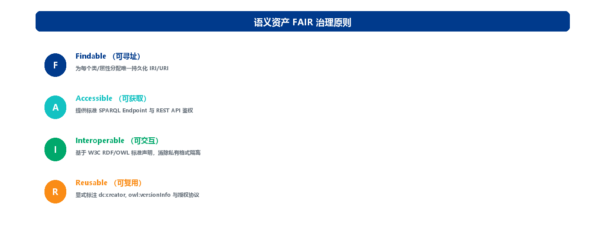

# 第 10 章 第8域：数据治理与语义集成

## 10.1 域定义与工程目标：与 DAiMA 传统数据治理体系（MDM/元数据）深层锚定

“数据治理与语义集成”（Data Governance & Semantic Integration）是连接本体工程与传统企业数据治理体系的核心枢纽。本域关注如何将本体语义层与企业主数据（MDM）、元数据管理、数据血缘（Lineage）、统一指标库等传统数据治理资产进行深度锚定打通，建立基于 FAIR 原则的语义元数据标准，构建基于 PROV-O 标准的语义血缘追踪链路，以及贯穿全生命周期的语义数据质量（SDQ）监控与变更控制机制，确保本体与知识图谱在企业环境中持续健康、高可靠运行。在 OMBOK 的十域框架中，域2（本体建模与工程）产出概念模型，域8 则负责把这份模型“锚进”既有治理体系并使其持续运营——前者造“语义骨架”，后者让骨架在企业里“活起来、管得住”。

**企业痛点**

在数据治理与语义集成领域，企业面临的核心痛点包括以下三个方面：

- **语义资产“上线即腐化”，版本管理失控**：随着业务需求频繁迭代，本体模型和图数据需要不断更新，但由于缺乏统一的元数据管理和版本控制机制，企业内部往往同时存在多个版本的本体文件，无人知晓哪个是当前的权威生产版本。例如，客户本体可能存在 v1.0（财务部维护）、v2.1（风控部维护）、v3.0（数据科学团队维护）等多个版本并行，导致不同应用系统引用的版本不一致，数据口径相互矛盾，给业务分析和决策带来严重困扰。
- **质量问题“雪崩式扩散”，影响范围难以估量**：知识图谱具有高度的联结性和推理传递性，一个底层的小问题可能会像滚雪球一样被迅速放大。例如，一个三元组中的错别字或数据类型错误，在推理引擎的传递性推理作用下，可能会污染数千乃至数万个相关三元组，导致依赖这些数据的上层业务应用产生错误的分析结果。
- **变更影响“处于黑盒状态”，风险评估无从下手**：本体结构的任何变更都可能沿着依赖链传导至下游的各个应用系统，但企业目前缺乏有效的影响分析工具。例如，当架构师计划删除一个被多个子类继承的父类，或重命名一个被数十个 SPARQL 查询引用的属性时，无法准确预测这一变更会对哪些数据管道、查询接口、推理规则造成破损，只能依赖人工排查或凭经验判断，变更风险极高。

**工程目标**

**本域确立以下工程目标：**

1. 实现语义资产“全链路可溯、全视图可管”：语义资产包括本体模型、三元组数据、对齐映射规则、约束脚本等，这些资产在企业中往往分散管理、缺乏统一视图。本域致力于建立覆盖全部语义资产的元数据目录，为每一个类、属性、实体和三元组记录其来源系统、创建时间、责任人和业务含义，实现“来源可溯、含义清晰、责任到人”的全链路管理。
2. 质量异常“自动化熔断”：传统数据质量问题往往在下游应用时才被发现，修复成本高且影响范围广。本域在语义数据生产、流转和存储的全生命周期中设置质量门禁（Quality Gates），通过自动化校验规则实时监控数据质量指标。任何违反约束的三元组在入库时即被自动拦截，异常规则在上线前即被阻断，实现“违规三元组零污染入库、坏规则零冒顶上线”的零容忍质量管控。
3. 与相邻知识域的逻辑边界。

### 10.1.1 本域的核心定位：语义层与传统治理“锚定”而非“另起炉灶”

域8 的根本立场是“语义治理不能另起炉灶”。企业往往已经建有 DAiMA（国际数据和人工智能管理协会）体系下的主数据管理（MDM）与元数据管理，语义治理的价值不在于推倒重来，而是在这一既有基座之上叠加一层本体语义，使数据资产可被机器理解并自动集成，从而与原有治理**协同运作而非割裂**——这是“增强”而非“替代”关系。DAiMA 倡导的传统治理体系关注数据质量、主数据唯一来源与元数据登记，而语义层则把这些信息链接到本体概念；二者前后衔接，避免“业务本体”和“数据治理”两张皮。理解这一点，是正确回答“语义治理与 DAiMA 传统体系是什么关系”的前提。

### 10.1.2 与相邻知识域的逻辑边界

本域与多个相邻域的分工常被混淆，需在工程上划清：

| **对比维度** | **本域（数据治理与语义集成）** | **本体建模与工程（第2域）** |
| --- | --- | --- |
| 核心关注点 | 把概念模型锚进治理并持续运营 | 产出概念层本体（类、属性、关系） |
| 解决的问题 | 模型怎么在企业里长期治理与运营 | 概念模型怎么建 |
| 关系 | 建模与治理是上下游：无模型则治理缺骨架，无治理则模型只是纸面资产 |  |
| **对比维度** | **本域（数据治理与语义集成）** | **形式化表达与约束（第3域）** |
| 核心关注点 | 约束规则的长效治理与生产环境监控 | 约束脚本的编写与语法定义 |
| 解决的问题 | 规矩怎么在生产环境长效治理 | 规矩语法怎么写 |
| **对比维度** | **本域（数据治理与语义集成）** | **知识图谱工程（第9域）** |
| 核心关注点 | 管道中的元数据采集、质量监控与拦截告警 | 三元组的物理抽取与写入执行 |
| 解决的问题 | 管道过程中的治理管控 | 数据搬运与转换 |
| **对比维度** | **本域（数据治理与语义集成）** | **存储查询与映射（第5域）** |
| 核心关注点 | 图数据之上的质量治理、安全与版本管理 | 图数据的物理存储与查询引擎选型 |
| 解决的问题 | 数据的治理与管控 | 数据的存储与检索 |
| **对比维度** | **本域（数据治理与语义集成）** | **本体对齐与融合（第7域）** |
| 核心关注点 | 对齐后本体的统一治理框架与长效管控 | 跨系统本体的语义映射与对齐 |
| 解决的问题 | 对齐后的本体怎么管 | 不同本体怎么对齐 |

## 10.2 核心概念与理论基石：语义元数据、锚定、数据血缘与 SDQ

要把“语义治理”讲清楚，必须先厘清三个基石概念——语义元数据、锚定（Anchor）与数据血缘（Data Lineage），以及衡量数据质量的 SDQ 三维模型。这些概念是域8 一切工程动作的语言基础。

### 10.2.1 语义元数据（Semantic Metadata）：传统元数据链接到本体概念

**语义元数据（Semantic Metadata）** 并非取代传统元数据，而是在其之上建立“链接”——把表、列、口径等传统元数据对象指向本体中的类与属性，使“这张表的这一列”能被机器理解为某个确定的业务概念。例如把 cust_id 链接到本体概念“客户（Customer）”，下游系统便可自动识别它而无需人工解读。普通元数据只回答“数据叫什么、存哪里”，语义元数据进一步回答“它在本体世界中代表什么”。这一“链接”动作，正是域8 把模型落到数据资产上的起点。

### 10.2.2 锚定（Anchor）：物理字段绑定到本体概念，赋予语义身份

将物理字段与本体概念绑定，是“语义元数据锚定”的基本动作，在治理术语中称为 **Anchor（锚定）**。它让底层数据获得一个可被机器理解的**语义身份**，下游集成、检索与推理都能直接识别 cust_id 即“客户”的标识，而无须再依赖人工约定。锚定是域8 把模型落到数据资产上的核心操作，也是“元数据语义覆盖率”这一治理指标得以度量的前提——没有锚定，字段就没有语义身份。

### 10.2.3 数据血缘（Data Lineage）与 PROV-O：追踪源到消费的来龙去脉

**数据血缘（Data Lineage）** 记录字段、指标在系统中的加工与流转路径（从源系统到中间层再到消费端）。它不只是“表到表”的流动记录，更应基于 W3C PROV-O 标准记录“知识推导与加工”的来源，涵盖三大核心要素：Entity（实体/数据集，如原始文本、三元组数据集）、Activity（加工活动，如 LLM 抽取、SPARQL CONSTRUCT 物化推理、人工审核）、Agent（执行主体，如 ETL 任务、提示词模型或数据工程师）。当数据出错或口径变更时，血缘可据此做**影响分析（Impact Analysis）**定位受影响的报表，也可回溯问题根因，是合规审计与变更治理的基础设施。

### 10.2.4 语义数据质量（SDQ）三维评估模型

语义数据质量（Semantic Data Quality, SDQ）从三个维度评估：

- **结构合规维度（Structural Compliance）**：实例数据是否符合 SHACL/ShEx 形状约束（如必填项检查、基数约束）。
- **逻辑一致性维度（Logical Consistency）**：本体与实例是否通过推理机的冲突校验（如无 owl:Nothing 矛盾类）。
- **业务语义准确维度（Semantic Accuracy）**：实体消歧的准确率、真实世界属性反映的及时性与完整性。



*图3-15: FAIR治理原则 / FAIR Governance Principles*

### 10.2.5 语义集成的三种落地架构：联邦、虚拟化与物化

"语义集成"在本域不是单一技术，而是**三条落地路径**，区别在于"数据是否真正进入语义存储"：

- **联邦查询（Federated Query）**：各源系统原地不动，查询时由联邦引擎基于映射实时跨源检索（SPARQL SERVICE 或分布式引擎）。优点是零拷贝、数据天然最新；缺点是跨源时延高、源系统负载大，复杂的跨库连接（Join）容易超时。
- **虚拟化（Virtualization / 虚拟知识图谱）**：不复制数据，而是通过 R2RML/RML 映射把关系库"虚拟成"RDF 视图，以本体为中间层统一口径（机制见 7.2.3 节与域5 的 VKG 路线）。与联邦查询的区别在于：虚拟化以本体视图为唯一语义入口、口径在本体层统一；联邦更偏多库直连、口径分散在各方。
- **物化（Materialization）**：通过 ETL/批流管道把多源数据**落入知识图谱存储**，构建实体化的语义数据底座（存储与管道见域5、域9）。优点是查询性能好、可直接推理、便于刚性治理；缺点是存在拷贝与时效延迟，需要配套增量更新与全血缘（见 10.2.3 节）。

**三条路径的选型取决于四类约束：**

| **决策维度** | **联邦查询** | **虚拟化** | **物化** |
| --- | --- | --- | --- |
| 数据时效性 | 实时 | 近实时 | 取决于管道周期 |
| 跨源查询性能 | 低（跨库连接昂贵） | 中（映射重写有开销） | 高（图库本地计算） |
| 语义治理强度 | 弱（口径分散） | 中（本体统一口径） | 强（可推理、可校验） |
| 建设与运维成本 | 低 | 中 | 高 |

企业语义中枢通常**三路并用**：对实时性要求高的轻量场景走联邦或虚拟化，对需要推理与刚性治理的核心场景走物化，并由 10.3 节的语义数据目录统一登记三类数据资产的元数据与血缘，最终支撑本章开篇所述的"一视图看全"目标。

## 10.3 实施方法与技术工具：MDM-本体锚定、语义数据目录与血缘标注

本节介绍两项核心能力及其落地代码：主数据（MDM）-本体锚定技术，是确保企业核心数据“唯一真实来源”的抓手；语义数据目录，是语义资产的可发现入口；二者配合 PROV-O 血缘标注，使治理可追踪。

### 10.3.1 MDM-本体锚定：以“黄金记录”为唯一真实来源

主数据管理（Master Data Management, MDM）旨在为企业核心数据实体（客户、产品、组织等）提供唯一、准确、完整的数据源。**MDM-本体锚定技术**的本质，是把企业核心主数据收敛为一个权威的“黄金记录（Golden Record）”作为**唯一真实来源**，并将其映射到本体概念，从而杜绝同一概念在不同系统各说各话。它解决的正是“客户在 D 系统叫 X、在 A 系统叫 Y”的口径分裂，使语义集成有统一锚点；例如将 CRM 系统的“客户”与 ERP 系统的“客户”统一锚定到本体中的 Customer 类，实现“一处维护、处处生效”。

### 10.3.2 语义数据目录（Semantic Data Catalog）：语义资产的统一入口

**语义数据目录（Semantic Data Catalog）** 在普通元数据之上叠加本体语义，让业务人员用业务概念（如“营收”“客户”）而非技术字段名去检索数据资产，是本域面向用户的“门户”。其核心特点是：基于本体的元数据标注（每个资产关联到本体概念，支持语义智能检索）、自动血缘追踪（PROV-O 记录生产加工消费全流程）、FAIR 合规性验证。它提升资产的可发现性、可理解性与可复用性，缩短“找数据—懂数据—用数据”的路径，而非仅仅做备份、迁移或生成质量规则。

### 10.3.3 冲突裁决：以 MDM 黄金记录为权威，本体锚定其上统一口径

当主数据系统（如“客户”的权威定义）与本体中的“客户”定义不一致时，正确做法是以 **MDM 黄金记录作为唯一权威来源**，把本体概念锚定到该来源并统一口径，从根本上消除集成冲突。这既尊重治理权威，又保证语义一致——下游推理与检索都基于同一“客户”定义。反之，直接删除本体概念、两套定义长期并存、或随机保留一份，都会让冲突继续蔓延。锚定之上的“统一口径”，是语义集成可持续的前提。

### 10.3.4 代码示例：PROV-O 血缘标注与 SPARQL 质量探针

下面用 PROV-O 标注一条经 SWRL 规则推理得到的隐式事实，记录其生产来源、加工活动与执行主体：

```
@prefix prov: <http://www.w3.org/ns/prov#> .
@prefix ex:   <http://example.org/obok#> .
@prefix xsd:  <http://www.w3.org/2001/XMLSchema#> .

ex:Triple_Risk_1001 a prov:Entity ;
    rdfs:label "张三 - [存在隐式风险暴露] -> B公司" ;
    prov:wasGeneratedBy ex:Activity_Inference_20260408 ;
    prov:wasDerivedFrom ex:RawData_Transaction_PDF_09 .

ex:Activity_Inference_20260408 a prov:Activity ;
    rdfs:label "规则推理机运行-SWRL高风险规则" ;
    prov:startedAtTime "2026-04-08T10:00:00Z"^^xsd:dateTime ;
    prov:endedAtTime   "2026-04-08T10:00:05Z"^^xsd:dateTime ;
    prov:wasAssociatedWith ex:Agent_HermiT_Reasoner .

ex:Agent_HermiT_Reasoner a prov:Agent ;
    rdfs:label "HermiT Reasoner v1.4" .
```

*[turtle]*

下列 SPARQL 探针检测本体中的“悬挂孤立概念”——缺失中文标签且无任何关联关系的类，作为语义数据质量监控的探针：

```
PREFIX rdfs: <http://www.w3.org/2000/01/rdf-schema#>
PREFIX owl:  <http://www.w3.org/2002/07/owl#>

SELECT ?concept WHERE {
    ?concept a owl:Class .
    FILTER NOT EXISTS {
        ?concept rdfs:label ?label .
        FILTER(lang(?label) = "zh" || lang(?label) = "")
    }
    FILTER NOT EXISTS { ?concept ?p ?other }
    FILTER NOT EXISTS { ?another ?p2 ?concept }
}
```

*[sparql]*

**技术工具链**：语义编目与元数据管理（TopBraid EDG、Apache Atlas、DataHub）；语义质量检测引擎（pySHACL、TopBraid SHACL API、RDFUnit）；版本控制与 CI/CD（Git 存储 Turtle/.owl 文本、OntoStack CI/CD、GraphDB 命名图版本快照）。

## 10.4 人机协同与 AI 赋能：LLM 生成语义标注建议，数据管家终审

面对成千上万张表和字段，人工逐条编写语义链接成本极高。大模型为域8 缓解了语义标注的瓶颈，但凡涉及语义对错的发布决策，仍必须由人做出。

### 10.4.1 LLM 辅助语义标注：为字段自动建议链接到本体概念

LLM 可从字段名、注释与样本数据中推断业务语义，自动建议“该字段应链接到哪个本体概念”，从而大幅加速语义标注的初稿生产——例如对 hasAnnualIncome 推断出“客户年度税前总收入，用于还款能力评估”，并建议将其锚定到本体的相应属性。生成结果再由数据管家或领域专家审核确认后入库。这是“人机协同”——机器提效、人类把关，而非让模型独立裁定全部链接。LLM 还可补全缺失的 rdfs:comment 与 skos:altLabel，并把 SHACL 技术错误日志翻译成业务人员可读的自然语言说明。

### 10.4.2 人在回路：数据管家审核语义正确性后发布

语义标注一旦错误，会把数据错链到错误概念，污染下游集成、检索与推理，代价很高。因此 LLM 生成的候选标注**必须由数据管家（Data Steward）或领域专家审核语义正确性，确认无误后才发布入库**——这正是“人在回路（Human-in-the-Loop）”的关键闸门。仅靠模型置信度分数或目录颜色深浅来判定合格，都不足以拦截错链；审核是发布的硬前置环节，不是形式流程。

### 10.4.3 变更控制：破坏性变更检测与 CCB 双签

本体结构的任何调整都会沿依赖链传导至下游：删除一个属性可能导致 SPARQL 查询报错，修改类继承可能触发推理大面积变化。因此须建立严格变更控制：将本体提交纳入 CI/CD 流水线，每次提交自动扫描是否存在删除既有属性、改变属性类型、修改类层级等破坏性变更，并列出可能受影响的下游查询与应用；破坏性变更经检测后，由语义工程师从技术角度、业务专家从业务角度**双签（CCB）**方可合并主干，重大重构还需提前通知下游团队预留适配窗口。

## 10.5 语义治理与质量评估：元数据语义覆盖率、指标一致性与 SMM 成熟度

本域的治理产物——语义元数据、锚定与语义标注——属于本体资产，其版本、变更与发布须由数据部门（或企业本体治理委员会）评审把关（见第 1 章 1.3）；以下为具体的治理指标与手段。

域8 的交付物是否可信，需要量化指标、口径治理机制与成熟度模型来共同保障。

### 10.5.1 元数据语义覆盖率：语义化治理的“广度”指标

**元数据语义覆盖率** 反映企业语义化治理的进度与覆盖面，定义为：企业数据资产中被成功标注语义元数据的比例——


（式 0-22）

它衡量还有多少表、列、指标尚未获得语义身份（即“语义盲区”）。与之配套的指标还包括：元数据完整率（配置了完整 label、comment 与版本号的元素占比，目标 ≥98%）、语义血缘覆盖率（具备 PROV-O 标注的实体/三元组占比，目标 ≥95%）、SHACL 违规率（未通过形状约束的实例占比，刚性目标 =0%）。

### 10.5.2 统一指标一致性校验与口径冲突治理

**统一指标一致性校验** 确保同名指标（如“营收”“净利润”）跨部门、跨域的口径与计算逻辑一致，防止“同一名字、不同含义”导致数出多门与误判，是治理的核心防线——若口径漂移（Semantic Drift）不被遏制，汇总报表将自相矛盾。当发现口径冲突时，正确的处理是：在**统一语义指标库中固化正确的口径定义**，并协同下游报表与系统按新口径修正，从源头消除歧义（既改字典又改引用），而非删除指标、放任并存或留待年终盘点。

### 10.5.3 语义成熟度模型（SMM）与治理闭环

随着语义治理成熟度提升，响应方式从人工救火走向自动化运营。在 **SMM（Semantic Maturity Model，语义成熟度模型）** 高阶（如 L5），指标口径变更会经数据血缘（Data Lineage）自动定位受影响的报表与下游资产，并**通知相关责任人**，实现“变更—影响分析—通知—修正”的治理闭环。这是成熟度从被动响应走向主动自治的标志：血缘不再只是事后溯源工具，而是变更治理的自动化触发器。

### 10.5.4 版本控制与血缘断线监控

对语义资产采用本体语义化版本规范（SemVer for Ontology）：MAJOR 表示破坏性变更（删除类/修改既有定义），MINOR 表示向下兼容的新增，PATCH 表示修正拼写或丰富注释。同时每天定时运行 SPARQL 脚本检测血缘孤岛，一旦发现无 PROV-O 标注的新增三元组，立即向数据管道责任人发送告警，防止血缘断线导致治理盲区累积。

## 10.6 本章小结与示例

*本章围绕“把本体语义锚进企业数据治理”展开，依次阐述了域8 的核心定位（与 DAiMA 传统治理体系协同而非替代）、语义元数据与锚定（Anchor）的本质、数据血缘（Data Lineage）与 PROV-O 的来龙去脉、MDM-本体锚定以黄金记录为唯一真实来源、语义数据目录作为语义资产统一入口，以及人机协同中 LLM 生成语义标注建议、数据管家终审发布的分工，最后给出元数据语义覆盖率、统一指标一致性校验与 SMM 成熟度等治理要点。为帮助读者检验理解，章末附数道示例题供自学巩固；更系统的练习另行成册，不在此重复。建议先遮住本节末尾的参考答案与解析，独立作答后再行核对。*

#### *题目 1：OMBOK 域8（数据治理与语义集成）主张语义治理应“与 DAiMA 传统数据治理体系锚定”，其根本目的是？*

**题目类型**：单选

- A 用语义层彻底取代现有的 MDM 与元数据管理，将原有治理体系完全推倒重来
- B 只在报表前端统一展示口径，后台治理机制维持不变即可
- C 在 MDM/元数据等既有治理之上叠加语义层，使二者协同而非割裂
- D 把语义能力作为独立专项工程，与现有治理体系并行推进、互不干预

#### *题目 2：数据工程师将字段“客户表.cust_id”显式链接到本体概念“客户（Customer）”。这一动作在治理术语中属于？*

**题目类型**：单选

- A 对敏感字段做脱敏处理，防止隐私信息被泄露
- B 把源数据转换为目标系统要求的存储格式与结构
- C 对原始数据做定期备份，以保障可恢复性
- D 将物理字段锚定到本体概念，赋予其语义身份

#### *题目 3：某集团客户、产品等核心主数据分散在多个系统、各有一套定义。引入 MDM-本体锚定技术，最希望达成的核心目标是？*

**题目类型**：单选

- A 确立核心数据唯一真实来源（黄金记录）并锚定本体，消除多套定义
- B 定期清理旧主数据，仅保留最近一年的业务记录
- C 汇总主数据生成报表，供管理层做经营分析
- D 在各部门复制多份主数据，并以本地副本提升查询性能

#### *题目 4：LLM 自动产出的语义标注建议质量参差不齐，若直接写入语义数据目录可能错链数据。因此在正式发布前，这些标注必须？*

**题目类型**：单选

- A 人工仅依据标注在目录中的颜色深浅来评定其是否可用
- B 生成后无需人工确认，直接写入语义数据目录即可对外发布
- C 由数据管家或领域专家审核语义正确性后再发布
- D 仅依赖模型输出的置信度分数即可自动判定标注合格

#### *题目 5：当企业语义治理成熟度达到较高水平（如 SMM L5），某核心指标口径发生变更。此时治理机制最可能出现的自动化响应是？*

**题目类型**：单选

- A 仅在变更日志文档中登记本次调整，下游相关方对此并不知情
- B 自动触发血缘影响分析并通知相关报表负责人
- C 由数据管家逐张手工翻阅报表，凭经验排查可能受变更影响的指标
- D 直接将该指标从指标体系里废弃，不再进行任何后续评估与处理

### 参考答案与解析

**题目 1　参考答案**：C **解析**：域8 的根本立场是“语义治理不能另起炉灶”——企业往往已建有 DAiMA 体系下的 MDM 与元数据管理，语义治理的价值在于在这一既有基座之上叠加一层本体语义，使数据资产可被机器理解并自动集成，与原有治理协同运作而非割裂，是“增强”而非“替代”关系（见 10.1.1 节）。A 错在把语义治理当作取代 MDM/元数据的平行工程；B 只做前端口径展示、后台不落地，仍是两张皮；D 主张互不干预，违背“锚定”原则。

**题目 2　参考答案**：D **解析**：将物理字段与本体概念绑定，是“语义元数据锚定（Anchor）”的基本动作：它让底层数据获得一个可被机器理解的语义身份，下游集成、检索与推理都能直接识别 cust_id 即“客户”的标识（见 10.2.2 节）。A 是脱敏、B 是格式转换、C 是备份，都与“赋予语义身份”无关，属动作错配。

**题目 3　参考答案**：A **解析**：MDM-本体锚定技术的本质，是把企业核心主数据收敛为一个权威的“黄金记录（Golden Record）”作为唯一真实来源，并将其映射到本体概念，从而杜绝同一概念在不同系统各说各话（见 10.3.1 节）。B、C、D 都偏离核心——清理旧数据、生成报表、复制多份副本，都不能解决“同一概念多套定义”的口径分裂问题，反而可能加剧。

**题目 4　参考答案**：C **解析**：语义标注一旦错误，会把数据错链到错误概念，污染下游集成、检索与推理，代价很高。因此 LLM 生成的候选标注必须由数据管家（Data Steward）或领域专家审核语义正确性，确认无误后才发布入库，这是“人在回路”的关键闸门（见 10.4.2 节）。A 靠颜色深浅、D 靠置信度分数都不足以拦截错链；B 主张免审核直接发布，正是应被禁止的高风险做法。

**题目 5　参考答案**：B **解析**：在 SMM（Semantic Maturity Model，语义成熟度模型）高阶（如 L5），指标口径变更会经数据血缘（Data Lineage）自动定位受影响的报表与下游资产，并通知责任人，实现“变更—影响分析—通知—修正”的治理闭环（见 10.5.3 节）。A 只登记不通知、C 靠人工逐张翻阅、D 直接废弃指标，都属于低成熟度的被动响应，不符合 L5 的自动化运营特征。

## 相关笔记

- [[00-目录]]
