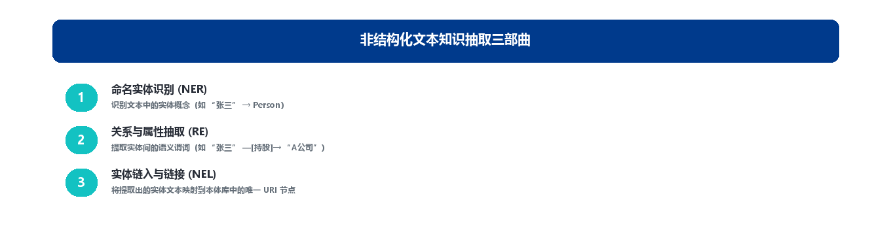
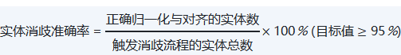
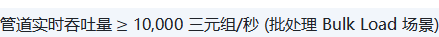

# 第 11 章 第9域：知识图谱工程

## 11.1 域定义与工程目标

“知识图谱工程”（Knowledge Graph Engineering）是将第 2 域设计好的模式骨架（Schema，即 TBox）填充为海量实例数据（Instance，即 ABox）的核心落地工程。本域关注如何构建自动化、高吞吐、增量更新的语义 ETL/ELT 数据管道，将结构化数据库、半结构化文档与非结构化文本（PDF、合同、报告）自动抽取、清洗、实体消歧并灌入图数据库中，实现“模式”与“实例”的高效绑定。

**企业痛点**

在知识图谱工程实践中，企业普遍遭遇以下三大瓶颈：

- **非结构化文档成为“数据黑洞”，关键知识无法利用**：企业中约 80% 的核心业务知识沉淀在非结构化文本中，包括合同条文、行业研报、病历记录、规章制度、邮件往来等。传统 ETL 工具只能处理结构化数据库中的表数据，完全无法从自由文本中抽取实体、关系和事件信息，导致大量高价值知识被埋没。
- **手工建图效率低下，难以支撑规模化应用**：一个包含数千个实体和关系的领域图谱，依靠人工标注可能需要数周乃至数月的时间完成。更关键的是，业务数据持续变化，手工构建的图谱会迅速过期，往往沦为“一次性工程”，无法持续维护和规模化扩展。
- **增量更新机制缺失，图谱质量持续恶化**：缺乏自动化的实体消歧（Entity Resolution）和增量数据管道，新数据灌入时系统无法自动识别已存在的实体，导致同一实体被重复创建为多个节点。例如“腾讯”“腾讯科技”“Tencent”可能被识别为四个独立节点，随时间推移这些重复节点不断积累，严重拖低查询准确性与推理可靠性。

**工程目标**

**本域的核心工程目标聚焦于：**

- **构建非结构化文本“秒级入图”流水线**：整合命名实体识别（NER）、关系抽取（RE）和命名实体链接（NEL）等 NLP 技术，结合大模型辅助抽取，将合同、文档等非结构化数据高效转化为符合本体规范的结构化三元组，把“数据黑洞”变为“结构化资产”。
- **实现千万级/亿级三元组的高吞吐实时/批处理写入**：建立稳定的图数据 CDC（Change Data Capture）增量管道，支持实时流处理与批量处理两种模式，保障图谱时效性与完整性。

### 11.1.1 本域核心定位：Schema 是基因，Instance 是肉体

OMBOK 用「Schema 是基因、Instance 是肉体」来比喻知识图谱的构成，强调的是图谱必须**由模式层（Schema）与实例层（Instance）共同构成、二者缺一不可**。模式层（即本体，定义类、属性与约束）是图谱稳定的结构骨架，如同基因决定了一个生命体的形态与机能；实例层（具体实体与事实）是把骨架填充为血肉的具体数据，使图谱真正承载可被查询与推理的知识。仅有模式而无实例，图谱是空壳；仅有实例而无模式，数据只是无结构的堆砌，既无法支撑推理，也难以复用。

### 11.1.2 与相邻知识域的逻辑边界

域9 处于 OMBOK 框架中段，承上启下——域2（本体建模与工程）提供本体模式，域5（存储）提供持久化与查询底座，域9 则负责从多源构建并融合实例，把它们落到已有的模式与存储之上。它不重新定义模式，也不另建存储，而是把上游产物落为可被消费的实例图谱。下表厘清其与关键相邻域的分工：

| **对比维度** | **本域（知识图谱工程）** | **本体建模与工程（第 2 域）** |
| --- | --- | --- |
| 核心关注点 | 实例级（ABox）抽取、消歧、融合与灌库 | 模式级（TBox）本体设计与演进 |
| 解决的问题 | 如何把海量数据加工并填充到已有模式 | 如何用本体定义概念、关系与约束 |
| 输入 | 源系统的原始数据 + 第 2 域提供的模式 | 业务需求与术语体系 |
| 输出 | 灌入图库的高质量实例三元组 | 本体模式（OWL/TBOX） |
| **对比维度** | **本域（知识图谱工程）** | **存储查询与映射（第 5 域）** |
| 核心关注点 | 物理抽取、清洗、消歧与流水线构建 | 虚拟化映射与图数据库物理查询 |
| 解决的问题 | 如何把海量数据物理加工并灌入图库 | 如何不搬迁数据直接查或物理图库怎么存 |
| 输入 | 源系统的原始数据 | 本域清洗后的三元组数据 |
| 输出 | 灌入图数据库的高质量三元组 | 虚拟图谱视图与查询服务 |
| **对比维度** | **本域（知识图谱工程）** | **本体对齐与融合（第 7 域）** |
| 核心关注点 | 实例级（ABox）的实体消歧与数据融合 | 跨本体的 Schema 级映射对齐 |
| 解决的问题 | 同名实体的去重与融合 | 不同本体模式的概念对齐 |
| 输入 | 多源抽取的实例数据 | 本域消歧后的实体 |
| 输出 | 统一的实例三元组 | 对齐映射规则与融合本体 |
| **对比维度** | **本域（知识图谱工程）** | **数据治理与语义集成（第 8 域）** |
| 核心关注点 | 数据抽取、消歧与物理写入的主流程 | 管道中的元数据采集、质量监控与拦截告警 |
| 解决的问题 | 数据搬运与转换 | 管道过程中的治理管控 |
| 输入 | 源系统原始数据 | 本域流转中的三元组数据 |
| 输出 | 结构化三元组数据 | 质量告警与拦截记录 |

## 11.2 核心概念与理论基石

### 11.2.1 TBox 与 ABox 分离架构

TBox/ABox 分离是描述逻辑与知识图谱的经典架构。**TBox（Terminological Box，术语箱）** 定义模式层，包含类、属性及其公理约束；**ABox（Assertional Box，断言箱）** 存放实例层，包含具体个体及其断言事实。二者在逻辑上解耦、可分别维护——TBox 回答“世界应当如何组织”，ABox 回答“世界中具体有哪些事实”。

### 11.2.2 TBox/ABox 解耦的工程收益

将 TBox 与 ABox 解耦后，带来一项关键工程收益：**模式变更可独立进行，不必重构实例；实例层（ABox）的批量增删、质量校验与扩展也能独立自动化进行**——实例也能独立校验与扩展，从而显著提升图谱的可维护性与演进效率。解耦的初衷正是“分别演进、互不绑架”，而非要求两层强制同步改动或制造冗余。

### 11.2.3 文本抽取三部曲：NER + RE + NEL

从非结构化文本构建知识图谱，需经过三个核心步骤，构成一条完整的文本知识抽取流水线（如图 3-16 所示）：

- **命名实体识别（Named Entity Recognition, NER）**：作为知识抽取的第一步，从原始文本中识别出具有业务意义的实体（人名、地名、机构名、产品名、时间、金额等），并打上类别标签，输出带有实体类型和位置标注的结构化数据。
- **关系抽取（Relation Extraction, RE）**：在识别出的实体之间发现和定义语义关系，将非结构化文本转化为“头实体—关系—尾实体”的三元组（如“甲公司—收购—乙公司”），构成图谱的边。现代方法多采用大模型的 Zero-Shot/Few-Shot 能力快速适配新领域关系。
- **命名实体链接（Named Entity Linking, NEL）**：将抽取的实体链接到已有知识图谱或本体中的对应节点，解决“实体对齐”与“消歧”问题。



*图3-16: 文本知识抽取三部曲 / Knowledge Extraction Pipeline — NER+RE+NEL*

### 11.2.4 实体消歧与知识融合

- **实体消歧（Entity Disambiguation, ED）** 解决“同名异实”问题：判定同一称谓究竟指向哪个真实世界实体，并把它绑定到正确的图谱节点。例如文本中的“苹果”，需根据上下文判断是指“苹果公司”还是“水果苹果”，避免歧义实体被错误合并。
- **知识融合（Knowledge Fusion, KF）** 的目标则是把来自多个异构来源的“同一实体”对齐并合并为统一节点，同时协调不同来源之间的冲突属性（如两个系统给出不同生日），形成一致、可信的知识。实体对齐（Entity Alignment）常被视为融合的子集步骤之一，但它本身不等于融合的全部——融合还必须处理属性冲突的协调。

### 11.2.5 构建范式：自顶向下、自底向上与混合

知识图谱的构建范式主要有三类：**自顶向下（Top-Down）** 先由专家定义好本体模式（Schema/类/关系），再据此从数据中抽取并填充实例，适合模式稳定、领域明确的场景（如医疗、金融）；**自底向上（Bottom-Up）** 先抽取大量实例，再归纳抽象出模式，常用于开放域；**混合构建（Hybrid）** 则是两者结合。医疗领域“先定义疾病—症状—药物模式，再抽取实例填充”即典型的自顶向下范式。

## 11.3 实施方法与技术工具

### 11.3.1 RDF 与属性图（Property Graph）的结构映射

当已用 RDF 三元组描述的企业图谱需导入 Neo4j 等属性图数据库以运行 PageRank 等图算法时，标准的 RDF→PG 映射规则是：**将资源（IRI）映射为节点，将谓词（Predicate）映射为带类型的边，将字面量（Literal）映射为节点或边的属性**。这一映射保留了语义结构并支持图算法，而非把三元组平铺成宽表、丢弃谓词与字面量或仅保留 IRI。

### 11.3.2 知识图谱嵌入（KGE）

TransE、DistMult 等模型把图谱中的实体与关系转成连续数值表示，即**知识图谱嵌入（Knowledge Graph Embedding, KGE）**：将实体与关系映射为低维向量，使“头实体 + 关系 ≈ 尾实体”（如 TransE 的 h + r ≈ t）在向量空间成立，从而支撑实体相似度计算、链接预测与实体对齐等下游任务。它既不是“渲染可视化图片”，也不是“导出为关系表”，核心是向量化的语义表示。

### 11.3.3 批流一体图管道架构

大规模知识图谱的构建与更新需同时处理历史初始化和实时变更：

- **批处理管道（Batch Pipeline）**：用于全量历史数据的高吞吐初始化加载（Bulk Import），从关系库抽取→转换为 RDF 三元组→批量加载到图数据库（Neo4j、JanusGraph），加载速度可达百万三元组/秒。
- **流式管道（Streaming Pipeline）**：结合消息队列（Kafka）与流处理引擎（Flink、Spark Streaming），实时捕获业务库的变更事件（CDC），将新增或修改的数据即时转化为三元组更新到图谱中，确保图谱始终最新。

**代码示例：基于 Python 与本体模式（Schema）的三元组抽取与消歧**

```
import json
import re

# 模拟抽取与消歧函数：将非结构化抽取结果转换为符合 OMBOK 本体模式（Schema）的三元组
def process_extraction_to_triples(extracted_data, ontology_prefix="http://example.org/obok#"):
    triples = []

    # 实体消歧规则映射表 (将别名归一化至标准 URI)
    entity_master_map = {
        "腾讯": "Company_Tencent",
        "腾讯科技": "Company_Tencent",
        "Tencent Corp": "Company_Tencent"
    }
    for item in extracted_data:
        subj_raw = item.get("subject")
        pred_raw = item.get("predicate")
        obj_raw = item.get("object")

        # 1. 实体消歧与主数据绑定
        subj_uri = entity_master_map.get(subj_raw, f"Entity_{hash(subj_raw)}")
        obj_uri = entity_master_map.get(obj_raw, f"Entity_{hash(obj_raw)}")

        # 2. 映射为符合本体规范的三元组
        subj_full = f"<{ontology_prefix}{subj_uri}>"
        pred_full = f"<{ontology_prefix}{pred_raw}>"
        obj_full = f"<{ontology_prefix}{obj_uri}>"
        triples.append(f"{subj_full} {pred_full} {obj_full} .")
    return triples

# 示例抽取文本输入
raw_extracted = [
    {"subject": "腾讯科技", "predicate": "investsIn", "object": "EpicGames"},
    {"subject": "腾讯", "predicate": "hasCEO", "object": "PonyMa"}
]
turtle_output = process_extraction_to_triples(raw_extracted)
print("\n".join(turtle_output))
```

*[python]*

### 11.3.4 技术工具链

- 非结构化抽取与文档解析：Unstructured.io、PaddleOCR、LangChain / LlamaIndex（LLM 数据加载器框架）。
- 高吞吐管道与 CDC：Debezium（分布式数据库变更捕获）、Apache Flink / Spark Streaming、Apache NiFi。
- 图数据库批量加载：GraphDB Bulk Loader、Neo4j Admin Import、Stardog Bulk Load。

## 11.4 人机协同与 AI 赋能

### 11.4.1 LLM 辅助非结构化文本抽取

大语言模型为知识抽取带来新路径：只需接收本体模式（Schema）结构作为抽取指令，即可直接从复杂文本（招股书、合同条款、研报）中抽取候选实体与关系，输出结构化的 JSON-LD 或 Turtle 三元组，无需针对每个领域单独训练，大幅降低冷启动成本；并能处理长文档的代词指代与跨段落语义关联，显著提升抽取质量。

### 11.4.2 人机协同审核：置信度分级与校验优先级

尽管 LLM 表现出色，仍可能产生“幻觉关系”——语法正确但事实不存在的三元组。为此需建立分级审核流水线：置信度 ≥ 0.90 自动入库，0.60～0.90 进入人工审核平台由专家校验，低于 0.60 直接抛弃。在人工校验环节，**应优先把关“关键实体的消歧结果”与“关系类型的正确性”**——这两类错误会沿图谱边传播、放大，直接拉低下游推理与检索质量，是性价比最高的人工介入点，远比字面核对或单纯追求抽取数量更有价值。

### 11.4.3 主动学习反馈机制

人工审核中的修正操作会自动沉淀为少样本（Few-Shot）示例，持续优化 LLM 的提示词模板；随着审核数据积累，后续抽取准确率逐步提升，形成“人机协同、持续进化”的良性循环。

## 11.5 语义治理与质量评估

本域的治理产物——图谱 Schema、实例数据与抽取消歧规则——属于本体资产，其版本、变更与发布须由数据部门（或企业本体治理委员会）评审把关（见第 1 章 1.3）；以下为具体的治理指标与手段。

### 11.5.1 实体抽取质量评估：Precision / Recall / F1

评估实体抽取流水线质量，最常用的是 **Precision（准确率）/ Recall（召回率）/ F1** 这一组指标，分别对应“抽得准”与“抽得全”：Precision 衡量抽出的实体中有多少是对的，Recall 衡量应抽的实体中有多少被抽出，F1 为二者调和均值。混淆矩阵中的真正例/假正例/假负例只是计算 P/R/F1 的底层计数，而非最终指标本身。

### 11.5.2 死节点与孤立实体治理

当某实体既无法链接到任何已知实体、自身也没有任何出/入边关系时，它在治理术语中称为**孤立/死节点（Dangling Node）**，是图谱连通性的“悬空碎片”。**死节点治理率**度量“已识别并清理/修复的孤立实体数”占“全部孤立实体总数”的比例，反映团队对图谱健康度的维护力度——比率越高，图谱越连通、越可用。若图谱规模庞大但死节点治理率长期偏低，大量孤立实体会持续堆积，直接拖低图谱连通性与多跳查询的召回质量。

### 11.5.3 长效治理与运维控制

**定义以下量化指标以保障管道稳定性：**



（式 0-23）



（式 0-24）

- **幂等写入（Idempotent Writes）**：图管道写入必须具备幂等性（重复写入相同三元组不产生冗余边），保障崩溃重试时数据不重不漏。
- **脏数据隔离区（Dead Letter Queue, DLQ）**：不符合 SHACL 校验规则（第 3 域）或格式破损的三元组自动打入 DLQ，防止阻塞主数据管道。

## 11.6 本章小结与示例

*本章围绕“把静态模式落到动态实例数据”展开，依次阐述了域9 的核心定位（Schema 是基因、Instance 是肉体）、与相邻域的边界、TBox/ABox 分离架构及其解耦收益、文本抽取三部曲（NER/RE/NEL）、实体消歧与知识融合、构建范式、RDF→属性图映射、知识图谱嵌入、批流一体管道，以及人机协同的 LLM 辅助抽取与校验、抽取质量评估（P/R/F1）和死节点治理。为帮助读者检验理解，章末附数道示例题供自学巩固；更系统的练习另行成册，不在此重复。建议先遮住本节末尾的参考答案与解析，独立作答后再行核对。*

#### *题目 1：OMBOK 在域9（知识图谱工程）中常用「Schema 是基因、Instance 是肉体」来比喻知识图谱的构成。这一比喻主要强调知识图谱的哪一层构成关系？*

**题目类型**：单选

- A 知识图谱由模式层与实例层共同构成，二者缺一不可
- B 知识图谱以模式层为主，实例层仅为可有可无的附庸
- C 知识图谱仅需实例层填充数据，无需任何模式约束
- D 知识图谱只需设计模式层，具体实例可完全省略

#### *题目 2：在知识图谱构建中，文本里出现的「苹果」可能指水果，也可能指科技公司。针对同一称谓指向不同真实对象的问题，应启用哪项技术？*

**题目类型**：单选

- A 实体对齐（Entity Alignment），将不同来源中的同一实体合并到统一节点
- B 命名实体识别（NER）仅负责从文本中标注出实体的边界与类别
- C 关系抽取（RE）负责识别并标注实体之间存在的语义关系
- D 实体消歧（Entity Disambiguation），判定同名异实的歧义

#### *题目 3：某医疗领域先由专家定义好疾病—症状—药物的本体模式，再据此从文献中抽取实例填充。这种「先模式、后实例」的构建方式称为？*

**题目类型**：单选

- A 自顶向下（Top-Down），先定义本体模式再填充实例
- B 自底向上（Bottom-Up），先抽取实例再归纳抽象模式
- C 混合构建（Hybrid），仅做人工标注不做自动抽取
- D 数据驱动（Data-Driven），仅依赖爬虫抓取不建模式

#### *题目 4：团队已用 RDF 三元组描述了一张企业图谱，现需导入 Neo4j 等属性图数据库以运行图算法（如 PageRank）。为此应如何处理 RDF 与属性图之间的结构差异？*

**题目类型**：单选

- A 将资源映射为节点、谓词映射为带类型边、字面量设为属性
- B 把全部三元组平铺成一张宽表，不再保留图结构
- C 仅保留 RDF 的 IRI 标识符，丢弃所有谓词与字面量
- D 直接丢弃 RDF 的语义结构，仅把文本存入图数据库

#### *题目 5：某知识图谱规模已超千万实体，但其死节点治理率长期偏低。从图谱可用性角度，这种「只看规模、不治孤岛」的状态最可能带来哪类后果？*

**题目类型**：单选

- A 图谱整体连通性保持良好，仅存储成本随实体增长而上升
- B 推理与查询性能反而提升，因为可跳过的无效路径更多
- C 仅影响前端可视化渲染速度，对数据层无任何实质影响
- D 大量孤立实体拖低图谱连通性与多跳查询召回质量

### 参考答案与解析

**题目 1　参考答案**：A **解析**：OMBOK 用「Schema 是基因、Instance 是肉体」强调的是图谱既需要稳定的结构骨架（模式层/本体），也需要被具体数据（实例层）填充才有意义——仅有模式而无实例，图谱是空壳；仅有实例而无模式，数据只是无结构的堆砌，无法支持推理与复用（见 11.1.1 节）。B 误以为实例层可有可无，违背了“模式 + 实例”双要素定位；C、D 则把两层视为可对立省略，完全偏离 KG 基本构成。

**题目 2　参考答案**：D **解析**：“苹果”既可指水果也可指科技公司，这是“同一称谓指向不同真实对象”的同名异实问题，应启用**实体消歧（Entity Disambiguation）**，判定该称谓究竟绑定到哪个真实实体（见 11.2.4 节）。A 实体对齐针对“不同来源中的同一实体”的跨源合并，对象不同；B 的 NER 只标出实体边界与类别，不解决指称歧义；C 的关系抽取关注实体间语义关系，与消歧无关。

**题目 3　参考答案**：A **解析**：先由专家定义好本体模式、再据此抽取并填充实例，是典型的**自顶向下（Top-Down）**构建范式，适合模式稳定、领域明确的场景（见 11.2.5 节）。B 自底向上正好相反，先抽取实例再归纳模式；C 混合构建是两者结合而非“仅人工标注”；D 把构建矮化为“仅爬虫抓取不建模式”，既忽略模式也忽略融合。

**题目 4　参考答案**：A **解析**：把 RDF 三元组导入属性图数据库的标准映射是：资源（IRI）→节点，谓词（Predicate）→带类型的边，字面量（Literal）→节点或边的属性，从而保留语义结构并支持 PageRank 等图算法（见 11.3.1 节）。B 平铺成宽表会退化为关系表、不再保留图结构；C 仅保留 IRI、丢弃谓词与字面量，彻底破坏三元组语义；D 丢弃语义结构仅存文本，丧失图谱可计算性。

**题目 5　参考答案**：D **解析**：当图谱规模庞大但死节点治理率长期偏低时，大量无法消歧、无关系的孤立实体持续堆积，直接拖低图谱的连通性与多跳查询的召回质量（见 11.5.2 节）。A 认为连通性保持良好、仅成本上升，回避了孤立节点对连通性的实质伤害；B 声称性能因可跳过无效路径而提升，忽视了召回率下降这一核心代价；C 把问题局限在前端渲染，否认对数据层的影响，明显失实。

## 相关笔记

- [[00-目录]]
- [[palantir_quiver_deep_dive|Quiver 研究]]
- [[tidb_nebulagraph_large_scale_object_link_projection_solution|TiDB+NebulaGraph 方案]]
