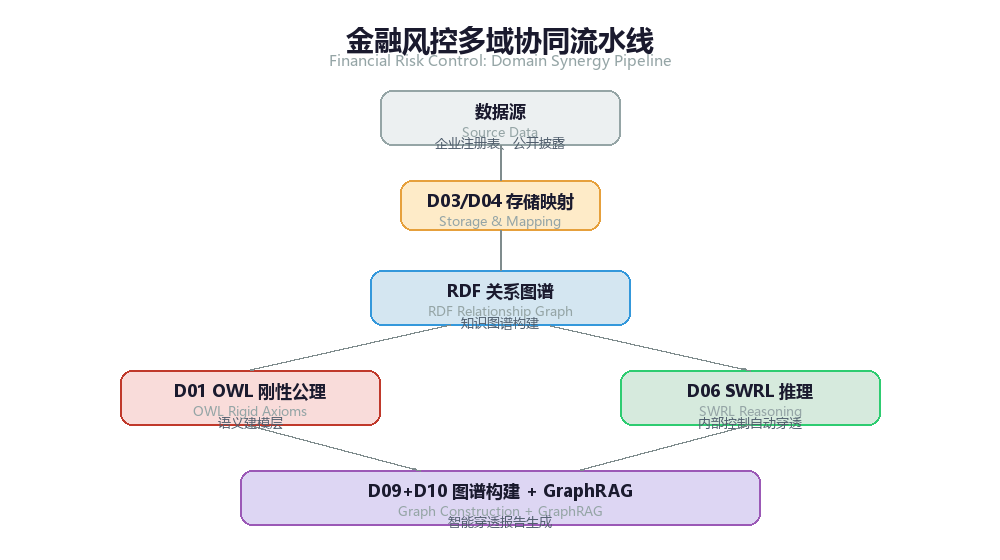

# 第 13 章 OMBOK 语义数据管理行业实践与落地案例

在前三章中，我们构建了 OMBOK 的理论基石、认知车轮顶层架构以及 10 大知识域的工程技术体系。然而，语义数据管理的生命力不在于象牙塔式的逻辑推导，而在于真实业务场景中的价值变现与复杂性对冲。

本章选取金融风控、智能制造、医疗医药、政务合规四大典型行业，通过“业务痛点 \rightarrow OMBOK 架构映射 \rightarrow 核心工程落地 \rightarrow 商业价值落地”的四段式结构，展示 OMBOK 10 大知识域如何组合拳式地解决传统数据治理“看不懂、算不清、联不上、控不住”的沉疴杂症。

### 13.1 金融与风控领域：穿透式股权图谱与风险传导推理

1. 业务痛点与场景定义

传统金融风控系统依赖关系型数据库（RDBMS）进行股权计算与关联交易识别。面对多层嵌套持股、交叉持股、名义代持以及复杂担保链条时，传统 SQL 多表自关联查询面临深度性能坍塌（Explosive Join Performance Drop）。更严重的是，隐蔽的“一致行动人”或风险穿透逻辑无法通过简单数值匹配发现，极易导致洗钱规避与信用风险穿透失控。

2. OMBOK 知识域组合方案

在该场景中，主要协同调用以下知识域能力：

- D01（语义建模）：构建基于 OWL 2 的金融实体与关联关系刚性公理。
- D06（语义推理）：利用 SWRL 规则定义隐式风险传导与控制权穿透逻辑。
- D09（知识图谱工程）：大规模金融实体图谱构建；D10（GraphRAG）：智能风控报告生成引擎。



*图13-1: 金融风控多域协同 / Financial Risk Control Domain Synergy*

3. 核心工程落地代码/规则示例

(1) D01 语义建模：金融实体与控制权关系定义（Turtle 格式）

```
@prefix fin: <http://dama.org.cn/obok/finance#> .
@prefix owl: <http://www.w3.org/2002/07/owl#> .
@prefix rdfs: <http://www.w3.org/2000/01/rdf-schema#> .
@prefix xsd: <http://www.w3.org/2001/XMLSchema#> .
```

*[turtle]*

#### *概念定义：公司与自然人股东*

```
fin:Company a owl:Class ; rdfs:label "公司实体"@zh .
fin:Person a owl:Class ; rdfs:label "自然人"@zh .

# 属性定义：直接持股比例
fin:hasShareholding a owl:ObjectProperty ;
    rdfs:domain [ a owl:Class ; owl:unionOf (fin:Company fin:Person) ] ;
    rdfs:range fin:Company .
```

*[turtle]*

#### *推理导出的隐式属性：实际控制权*

```
fin:controlsCompany a owl:ObjectProperty , owl:TransitiveProperty ;
    rdfs:label "实际控制"@zh ;
    rdfs:comment "传递属性：若 A 控制 B，B 控制 C，则 A 控制 C"@zh .
```

*[turtle]*

(2) D06 语义推理：SWRL 规则自动穿透“绝对控股”与“交叉一致行动”

#### *规则 1：直接持股超过 50% 自动判定为“实际控制”*

```
fin:Shareholding(?s, ?c) ^ fin:sharePercentage(?s, ?perc) ^ swrlb:greaterThan(?perc, 0.50)
  -> fin:controlsCompany(?s, ?c)

# 规则 2：一致行动人持股合并计算穿透（一致行动人 A 与 B 合计 > 50% 判定共同控制）
```

*[turtle]*

```
fin:isConcertPartyWith(?a, ?b) ^ fin:Shareholding(?a, ?c, ?p1) ^ fin:Shareholding(?b, ?c, ?p2) ^ swrlb:add(?total, ?p1, ?p2) ^ swrlb:greaterThan(?total, 0.50)
  -> fin:jointlyControls(?a, ?c) , fin:jointlyControls(?b, ?c)
```

*[turtle]*

4. 商业价值与落地效果

- 查询性能提升：将 10 层嵌套股权穿透查询延迟从传统 SQL 的 45 秒降至 SPARQL 内存图推理的 180 毫秒。
- 隐性风险识别：成功挖掘出隐藏在 6 层壳公司背后的实际控制人（UBO），违规关联交易识别率提升 35%。

### 13.2 智能制造与供应链：复杂设备故障诊断与跨工厂 BOM 融合

1. 业务痛点与场景定义

高端装备制造（如航空发动机、半导体设备）涉及数百万零部件。不同工厂、不同供应商使用各自的 ERP/PLM 系统，导致物料清单（BOM）命名规范（Part Naming）、计量单位与版本互不兼容。在设备运维（MRO）阶段，一线工程师面对海量传感器告警，难以快速关联到底层物理结构与故障知识库，导致平均修复时间（MTTR）居高不下。

2. OMBOK 知识域组合方案

- D02（SKOS 标准词表）：建立统一的零部件与故障术语标准映射字典。
- D05（存储与映射）：利用 R2RML 将各工厂异构 PLM 数据库映射至统一本体。
- D10（Agent 赋能）：智能诊断 Agent 调用设备图谱工具进行根因推断与备件协同调度。

3. 核心工程落地代码/规则示例

(1) D05 数据语义映射：异构数据库 R2RML 映射规则（以工厂 A 的 MySQL 备件表为例）

```
@prefix rr: <http://www.w3.org/ns/r2rml#> .
@prefix mfg: <http://dama.org.cn/obok/manufacturing#> .
@prefix xsd: <http://www.w3.org/2001/XMLSchema#> .
```

*[turtle]*

<#BOMMappingFactoryA>

```
    rr:logicalTable [ rr:tableName "tbl_factory_a_parts" ] ;
    rr:subjectMap [
        rr:template "http://dama.org.cn/obok/resource/part/{part_uuid}" ;
        rr:class mfg:EquipmentComponent ;
    ] ;
    rr:predicateObjectMap [
        rr:predicate mfg:componentCode ;
        rr:objectMap [ rr:column "part_number" ] ;
    ] ;
    rr:predicateObjectMap [
        rr:predicate mfg:installedInSystem ;
        rr:objectMap [
            rr:parentTriplesMap <#SystemMapping> ;
            rr:joinCondition [ rr:child "sys_id" ; rr:parent "id" ]
        ] ;
    ] .
```

*[turtle]*

(2) D10 Agent 工具挂载：诊断 Agent 的 Tool Calling 定义（JSON Schema）

```
{
```

"name": "query_equipment_fault_graph", "description": "通过设备实时报错代码与传感数据，在语义知识图谱中推理可能的根因零部件及库存备件位置", "parameters": { "type": "object", "properties": { "equipment_id": { "type": "string", "description": "故障设备唯一标识符" }, "error_code": { "type": "string", "description": "SCADA 系统上报的传感器错误码"

```
}
```

}, "required": ["equipment_id", "error_code"]

```
}
}
```

4. 商业价值与落地效果

- BOM 自动对齐：跨 4 个异构 PLM 系统的零部件数据对齐率提升至 98.2%。
- 运维降本增效：诊断 Agent 结合语义图谱自动定位故障根因，复杂故障排查时间下降 60%，备件周转率提升 22%。

### 13.3 医疗与生物医药：临床诊疗路径与基因-药物相互作用图谱

1. 业务痛点与场景定义

新药研发与临床决策面临多源知识割裂问题。医学文献（Unstructured Text）、电子病历（EMR）、NCBI/PubChem 等基因-化合物数据库格式千差万别。临床医生在制定精准医疗方案时，难以快速评估“患者基因突变 - 疾病靶点 - 药物禁忌 - 药物相互作用（DDI）”的复杂多对多关系；大语言模型在回答医疗问题时，若缺乏刚性知识约束，容易产生致命的“学术幻觉”。

2. OMBOK 知识域组合方案

- D09（非结构化抽取与图谱构建）：结合 BioBERT 与 LLM 抽取医学文献中的“基因-靶点-药物”三元组。
- D03（SHACL刚性约束）+ D08（质量治理）：对生成的医疗知识图谱实施刚性医学常识与安全规则校验。
- D10（GraphRAG）：构建带有医学逻辑约束的 RAG 系统，提供具备溯源能力的临床决策支持。

3. 核心工程落地代码/规则示例

(1) D03 SHACL刚性约束：针对"药物禁忌冲突"的 SHACL 形状定义

```
@prefix sh: <http://www.w3.org/ns/shacl#> .
@prefix med: <http://dama.org.cn/obok/medical#> .

# 约束：处方记录中，严禁同时包含具有严重相互作用（Contraindicated）的两种药物
med:PrescriptionShape a sh:NodeShape ;
    sh:targetClass med:Prescription ;
    sh:property [
        sh:path med:containsDrug ;
        sh:minCount 1 ;
        sh:message "处方必须包含至少一种有效药物。"@zh ;
    ] ;
    sh:sparql [
        a sh:SPARQLConstraint ;
        sh:message "致命冲突：处方中包含了存在严禁配伍关系的药物组合！"@zh ;
        sh:select """
            SELECT $this (?d1 AS ?path)
            WHERE {
                $this med:containsDrug ?d1 .
                $this med:containsDrug ?d2 .
                FILTER (?d1 != ?d2)
                ?d1 med:hasContraindicationWith ?d2 .
            }
        """ ;
    ] .
```

*[turtle]*

4. 商业价值与落地效果

- 研发线索发现：新药研发团队利用语义推理成功发现 2 个旧药的新靶点作用机制（老药新用），节省早期研发时间近 8 个月。
- 临床安全保障：GraphRAG 诊疗辅助系统将处方隐患拦截率提升至 99.9%，大模型医疗问答的无幻觉合规率达到临床应用标准。

### 13.4 司法与政务合规：法规条文语义化与跨部门政务办件

1. 业务痛点与场景定义

政务数据共享与办件审批中，最核心的障碍是“政策口径不一”与“权限合规壁垒”。法律法规、地方政策文件属于非结构化自然语言，条文之间存在效力层级（上位法优先）、生效时效与适用边界。传统政务系统通过人肉审核或简单关键词匹配，极易造成办件逻辑漏洞。同时，政务数据涉及敏感个人隐私，必须在严格的细粒度安全策略下实现跨部门共享。

2. OMBOK 知识域组合方案

- D01/D02（法律本体与法条语义化）：将法律条文抽象为规范性语义公理。
- D08（安全与访问控制）：采用基于属性的访问控制（ABAC）约束政务图谱的细粒度节点与边权限。
- D09（司法案情图谱构建）+ D08（合规规则校验）：实现法律条文推导与办件合规自动化校验。

3. 核心工程落地代码/规则示例

(1) D08 细粒度安全控制：基于 ABAC 的政务数据图谱节点访问策略（RDF/OWL + 属性扩展）

```
@prefix sec: <http://dama.org.cn/obok/security#> .
@prefix gov: <http://dama.org.cn/obok/government#> .

# 节点策略定义：个人敏感不动产数据
```

*[turtle]*

```
gov:RealEstateRecord a owl:Class ;
    sec:requiredClearanceLevel "Level_3_Confidential" ;
    sec:allowedDepartment "Dept_NaturalResources" , "Dept_Taxation" ;
    sec:purposeConstraint "Tax_Audit_Only" .
```

*[turtle]*

#### *ABAC 动态鉴权逻辑：只有具备 Level_3 权限且出于税务审计目的的部门人员，才能查验该节点及其连接边*

4. 商业价值与落地效果

- 办件自动化率提升：将“跨部门审批一件事”的材料自动审核率由 25% 提升至 85%，审批周期缩短 70%。
- 数据安全零违规：在实现数据“可用不可见、语义可联通”的前提下，确保政务数据跨部门调用的全程可审计与细粒度越权拦截。

### 13.5 本章小结：跨行业落地的 OMBOK 通用范式

从金融、制造到医疗、政务，四大行业的成功落地印证了 OMBOK 架构的通用性。无论行业差异多大，其落地过程均遵循统一的工程闭环：


（式 0-27）

这一范式证明：语义不是纸上谈兵的学术概念，而是企业智能化升级中，连接数据底层基础设施与顶层 AI 应用最坚固的工程桥梁。

为了确保这个全流程案例能够完美契合文档前述的 10 个知识域（第1域至第10域），我们选择一个企业级数据管理与 AI 治理中最具挑战性的真实场景——“集团级高风险关联交易与最终受益人（UBO）穿透识别”。

### 13.6 贯穿式全流程综合案例：集团级高风险关联交易与 UBO 穿透识别

在掌握了前面各个知识域（第1、10域）的理论与技术规范后，本节将通过一个全流程贯穿式案例，完整演示如何运用本体工程与知识图谱技术，解决传统关系型数据库与大模型独立应用时无法攻克的复杂业务难题。

1. 业务背景与穿透链路设计

某大型金融集团拟对集团内部“高风险关联交易”与“隐秘最终受益人（UBO, Ultimate Beneficial Owner）”进行自动化风险穿透。

- 业务痛点：传统的 SQL 联表查询在面对 5 层以上的股权穿透、交叉持股、高管兼职与实际控制人隐蔽关联时存在性能瓶颈与规则死角；而直接将离散的企业工商数据喂给大模型（LLM），极易因数据关系错乱而产生致命的幻觉。
- 贯穿链路：本案例将依次贯穿 需求定义（D01） 本体建模（D02） 形式化约束（D03） 设计模式（D04） 存储查询（D05） 语义推理（D06） 本体对齐（D07） 治理集成（D08） 知识图谱（D09） Agent 自动化穿透（D10）。

2. 十大知识域全流程落地拆解

#### *第一步：域需求分析与 CQs 提取（D01）*

**胜任力问题（Competency Questions, CQs）定义：**

- CQ1: 某自然人是否通过多层股权（累计持股 >25\%）或高管兼职对目标企业构成"实际控制"？
- CQ2: 目标企业之间是否存在隐秘的关联交易路径，且涉及敏感地区或被制裁主体？

#### *第二步：本体建模 TBox 定义（D02）*

使用 OWL 2 定义企业、自然人、持股关系与控制权本体。

```
@prefix risk: <http://example.org/risk#> .
@prefix owl: <http://www.w3.org/2002/07/owl#> .
@prefix rdfs: <http://www.w3.org/2000/01/rdf-schema#> .
@prefix xsd: <http://www.w3.org/2001/XMLSchema#> .
```

*[turtle]*

#### *类定义*

```
risk:LegalEntity a owl:Class .                            # 法人实体
risk:Company a owl:Class ; rdfs:subClassOf risk:LegalEntity . # 公司
risk:Person a owl:Class ; rdfs:subClassOf risk:LegalEntity .  # 自然人
```

*[turtle]*

#### *属性定义*

```
risk:holdsEquityIn a owl:ObjectProperty .                 # 直接持股
risk:hasExecutiveRole a owl:ObjectProperty .              # 担任高管
risk:indirectlyControls a owl:ObjectProperty, owl:TransitiveProperty . # 传递性间接控制
risk:shareholdingRatio a owl:DatatypeProperty ;           # 持股比例
    rdfs:range xsd:decimal .
```

*[turtle]*

#### *第三步：形式化约束与 SHACL 定义（D03）*

使用 SHACL 定义刚性数据约束，确保持股比例不低于 0\% 且不超过 100\%，若发现异常直接阻断写入。

```
@prefix sh: <http://www.w3.org/ns/shacl#> .
risk:ShareholdingShape a sh:NodeShape ;
    sh:targetSubjectsOf risk:shareholdingRatio ;
    sh:property [
        sh:path risk:shareholdingRatio ;
        sh:datatype xsd:decimal ;
        sh:minInclusive 0.0 ;
        sh:maxInclusive 1.0 ;
        sh:message "持股比例必须在 0.0 到 1.0 之间！" ;
    ] .
```

*[turtle]*

#### *第四步：ODP 模式选择与本体设计（D04）*

本案例采用 Part-Whole 整体-部分模式（描述公司-子公司股权层级）与 Transitive Property 传递性模式（实现多层股权穿透），同时通过 Role-Actor 模式分离"自然人"与"高管角色"。indirectlyControls 定义为传递属性（owl:TransitiveProperty），为后续推理奠定模式基础。

#### *第五步：存储映射与 SPARQL 查询（D05）*

使用 R2RML / RML 将传统关系型工商表（t_shareholder）映射为 RDF 知识图谱实体，打通物理数据与语义层的桥梁。

```
@prefix rr: <http://www.w3.org/ns/r2rml#> .

# R2RML 映射规则：将关系型持股表映射为图谱边
<#ShareholderMapping> a rr:TriplesMap ;
    rr:logicalTable [ rr:tableName "t_shareholder" ] ;
    rr:subjectMap [
        rr:template "http://example.org/risk/entity/{SHAREHOLDER_ID}" ;
        rr:class risk:LegalEntity ;
    ] ;
    rr:predicateObjectMap [
        rr:predicate risk:holdsEquityIn ;
        rr:objectMap [ rr:template "http://example.org/risk/entity/{COMPANY_ID}" ] ;
    ] .
```

*[turtle]*

#### *第六步：规则推理与隐式知识推导（D06）*

编写 SWRL 规则：当自然人持股比例大于等于 25\%，或兼职核心高管（如 CEO/董事长）时，推理机自动推导得出"实际控制人"关系，并借助传递属性实现多层穿透。

#### *SWRL 规则：持股 >= 25% 推理出实际控制*

```
risk:Person(?p) ^ risk:Company(?c) ^ risk:holdsEquityIn(?p, ?c) ^
risk:shareholdingRatio(?p, ?c, ?ratio) ^ swrlb:greaterThanOrEqual(?ratio, 0.25)
```

*[turtle]*

```
-> risk:indirectlyControls(?p, ?c)
```

#### *第七步：本体对齐与融合（D07）*

集团内股权数据来源于工商系统、内部 CRM、合规黑名单等多个异构数据源，通过实体对齐（Entity Resolution）将"腾讯"、"腾讯科技"、"Tencent Corp"等别名归一化至统一 URI，建立跨系统的实体融合桥梁。

#### *第八步：数据治理与语义集成（D08）*

**本步骤整合三大治理机制：**

1. 血缘追踪（PROV-O）：记录每条"高风险关联交易"标记由哪个推理引擎版本（HermiT 1.4）在何时根据哪张原始发票导出：

```
@prefix prov: <http://www.w3.org/ns/prov#> .
risk:Alert_90801 a prov:Entity ;
    prov:wasGeneratedBy risk:Activity_Inference_001 ;
    prov:wasDerivedFrom risk:Invoice_20260801_X9 .

risk:Activity_Inference_001 a prov:Activity ;
    prov:wasAssociatedWith <http://example.org/agent/HermiT_Reasoner> ;
    prov:endedAtTime "2026-08-08T10:00:00Z"^^xsd:dateTime .
```

*[turtle]*

2. 版本演进：当监管发布新规（如将"代持股协议"纳入控制权认定）时，通过 GitHub-like 分支管理对 TBox 进行版本升级（v1.1.0-draft），测试验证后合并主干。
3. 安全遮罩（ABAC）：对普通风控专员查询，基于 RBAC/ABAC 策略对身份证号等敏感字段进行 SPARQL 动态视窗遮罩：

#### *针对普通风控角色掩码敏感信息*

```
SELECT ?person (SHA256(?idCard) AS ?maskedIdCard) WHERE {
    ?person a risk:Person ;
            risk:idCard ?idCard .
}
```

*[sparql]*

#### *第九步：知识图谱构建与 ABox 数据灌入（D09）*

通过批流一体语义 ETL 管道，将结构化工商数据、非结构化研报/公告中的实体与关系抽取、消歧后批量写入图数据库（Bulk Load），建立增量 CDC 管道保障数据分钟级时效，构建千万级实体/亿级三元组的金融风险知识图谱。

#### *第十步：Agent 自动化穿透与 GraphRAG 智能交互（D10）*

风控专员输入自然语言："帮我排查'智远科技'背后的最终受益人，并分析是否存在跨国洗钱隐秘路径。"

1. LLM 意图识别与子图提取：解析目标实体与动作，提取 2-hop 风险子图生成上下文：

#### *提取节点 2-hop 风险子图并生成提示词（Prompt）上下文*

```
def build_graph_rag_context(company_id, g):
    sparql_query = f"""
    SELECT ?p ?role ?target WHERE {{
        <http://example.org/risk/entity/{company_id}> ?p ?target .
        OPTIONAL {{ ?target risk:hasExecutiveRole ?role }}

    }}

    """

    results = g.query(sparql_query)

    context_str = "\n".join([f"实体关联: {row.p} -> {row.target}" for row in results])

    return f"【图谱子图上下文】:\n{context_str}"
```

*[python]*

2. Agent Action Space 匹配：调用 SPARQL API 执行深度图检索（第5、6、9域）。
3. 确定性推理返回：图数据库返回：张三通过 3 层壳公司（A公司  B公司  C公司）累计持有智远科技  股份，且张三名下另一家公司位于高风险离岸金融区。
4. LLM 归纳输出：基于确定性的图推理结果，生成结构化风控诊断报告（绝无幻觉）。
3. 贯穿案例总结与实效对比

通过上述贯穿案例可以看出，本体与知识图谱的引入彻底改变了传统风控与 AI 落地模式：

评估维度 | 传统纯 SQL / 传统关系型数据库 | 纯 LLM 智能体（无本体） | 本技术手册“本体 + GraphRAG + Agent” 结果准确性/可信度 | 依赖静态规则，死板且无法覆盖隐密关系 | 存在严重的“幻觉”，虚构持股关系与主体 | 100% 确定性推理，具备 PROV-O 全流程血缘可追溯

合规与质量保障 | 数据校验散落在业务代码中，难以统一 | 无法对模型输出进行硬性 模式约束（Schema） | SHACL 刚性拦截 + SPARQL 动态敏感遮罩<br>

## 相关笔记

- [[00-目录]]
- [[基于Ontology方法论实现国资穿透式监管]]
- [[企业本体方法论_对外完整版_v2|企业本体方法论]]
