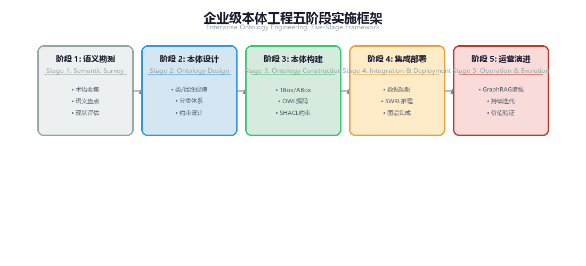
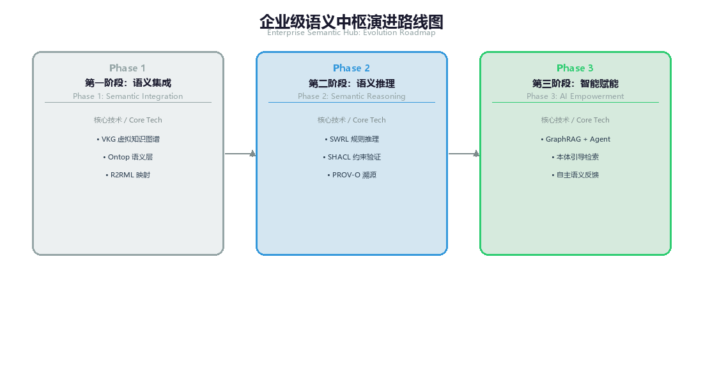
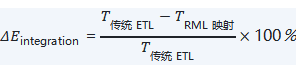
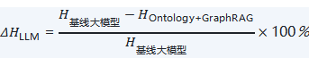

# 第 14 章 OMBOK 实施方法论与成熟度演进

将 OMBOK 知识体系（第1、10域）从理论架构转化为企业级语义基础设施（Semantic Infrastructure），需要一套系统化、可度量且具备持续演进能力的方法论指导。本章重点阐述企业推进本体数据管理的五阶段实施框架、语义数据管理成熟度模型（SMM）、企业级演进路线图以及 ROI 投资回报率评估体系，为企业搭建语义中枢（Semantic Hub）并赋能 AI Agent 提供清晰的落地指引。

## 14.1 企业级本体工程五阶段实施框架

企业级本体与知识图谱建设并非孤立的代码开发工程，而是贯穿“业务语义提炼 \rightarrow 逻辑建模 \rightarrow 物理映射 \rightarrow 推理合规 \rightarrow Agent 赋能”的敏捷闭环。OMBOK 提出了“双环驱动、敏捷迭代”的五阶段实施框架：

*图14-1: 企业级本体工程五阶段实施框架 / Five-Stage Ontology Engineering Framework*

双环驱动、敏捷迭代：每一阶段完成后回流至前序环节持续优化，形成闭环。

### 1. 第一阶段：业务对齐与胜任力问题提炼（第1域）

- 核心目标：打破业务与技术的语义壁垒，明确本体建设的边界与验收标准。
- 关键动作：

**◦** 梳理核心业务场景（如高风险关联交易穿透、高净值客户全景画像、供应链风险预警）。

**◦** 提炼刚性的胜任力问题（Competency Questions, CQs），将业务诉求转化为可被 SPARQL 查询或逻辑推理验证的标准问题集。

**◦** 制定领域词表（Vocabulary）草案，识别核心概念与关键属性。

### 2. 第二阶段：TBox 顶层与领域建模（第2、4域）

- 核心目标：构建高内聚、低耦合、严密表达的领域本体模式（TBox）。
- 关键动作：

**◦** 基于 W3C OWL 2 DL 标准定义概念类（Class）、对象属性（Object Property）与数据属性（Datatype Property）。

**◦** 引入顶层本体（Upper Ontology，如 BFO、GFO、GIST）进行对齐，保障语义的跨域兼容性。

**◦** 复用本体设计模式（ODP，第4域）提升建模效率，建立基于 Git-Ontology 的模式版本控制规范（第8域），为 TBox 的分支演进与合并冲突解决设定标准。

### 3. 第三阶段：ABox 映射与自动化图谱构建（第5、7、9域）

- 核心目标：打通多源异构数据源，将物理数据打散重构为图谱实体（ABox）。
- 关键动作：

**◦** 编写 R2RML / RML 规范映射脚本（第5域），实现关系型数据库（RDBMS）、数据湖（Data Lake）及 REST API 数据向 RDF 三元组的自动化转换。

**◦** 部署虚拟知识图谱（VKG，如 Ontop）实现 SQL-to-SPARQL 的实时查询下推（第5域），降低数据重构与搬迁成本。

**◦** 执行实体对齐（Entity Resolution）与主数据链接（第7域），通过批流一体管道完成 ABox 灌入（第9域），生成高质量分布式知识图谱。

### 4. 第四阶段：质量校验、逻辑推理与安全部署（第3、6、8域）

- 核心目标：确保知识图谱的准确性、一致性与合规可追溯性。
- 关键动作：

**◦** 编写 SWRL 业务推理规则，利用 HermiT / Pellet 推理引擎实现隐性业务关系的自动演绎导出（第6域）。

**◦** 配置 SHACL 刚性约束形状（Shapes），在数据写入与导出端进行 模式（Schema）级别的刚性质量拦截（第3域）。

**◦** 引入 PROV-O 标注全流程生成血缘（第8域），并部署基于 RBAC/ABAC 的 SPARQL 动态视窗，实现敏感字段的安全遮罩（第8域）。

### 5. 第五阶段：GraphRAG 融合与 Agent 语义赋能（第9、10域）

- 核心目标：实现“Ontology + LLM”左右脑协同，将语义资产转化为 AI 生产力。
- 关键动作：

**◦** 结合向量数据库与本体图结构（第9域），构建 GraphRAG 混合检索管道，解决大模型检索增强过程中的关系断裂问题（本域）。

**◦** 将 SPARQL 查询与推理能力封装为标准 API，作为 AI Agent 的动作空间（Action Space）与确定性世界模型（World Model）（本域）。

## 14.2 语义数据管理成熟度模型（Semantic Maturity Model, SMM）

为了帮助企业科学评估自身语义治理水平，并制定合理的阶梯式演进规划，OMBOK 制定了五级语义成熟度评估模型（SMM）：

| **成熟度等级** | **等级名称** | **核心特征与技术表现** | **OMBOK 主导知识域** | **业务赋能形态** |
| --- | --- | --- | --- | --- |
| Level 1 | 初始级 (Initial) | 存在离散的业务词典或主数据表；语义硬编码在 ETL 脚本与业务代码中；缺乏统一的 Ontology 概念 | 第1域 | 人工点对点查表，数据孤岛严重 |
| Level 2 | 受控级 (Managed) | 构建了局部领域本体（TBox）；能提炼简单三元组；实现了关系型数据的静态映射与图查询 | 第1域至第3域 | 支持单域内的多跳图查询与简单关系探索 |
| Level 3 | 稳健级 (Defined) | 具备企业级顶层本体；引入 SWRL 规则引擎进行自动化推理；部署 SHACL 进行刚性数据质量校验 | 第1域至第5域 | 自动发现隐性风险关系，源头阻断非法语义数据 |
| Level 4 | 量化级 (Quantified) | 建立完备的 PROV-O 全流程血缘；实现了 SPARQL 动态视窗安全遮罩；本体模式实现了 Git 化平滑演进 | 第5域至第9域 | 满足严苛的金融/医疗监管合规，推理过程 100% 可追溯 |
| Level 5 | Agent 赋能级 (Optimized) | 实现了“Ontology + LLM”左右脑协同；语义本体成为 AI Agent 的世界模型与动作空间；构建自进化语义中枢 | 第1域至本域 全域 | AI Agent 自动化执行复杂多步穿透与业务决策 |

## 14.3 企业级语义中枢（Semantic Hub）架构与演进路线图

企业在落地 OMBOK 体系时，应当遵循“架构统一、轻量切入、双轨运行、渐进替代”的原则，避免对原有 IT 基础设施进行破坏性重构。建议按照以下三阶段路线图推进：

*图14-3: 企业级语义中枢演进路线图 / Semantic Hub Roadmap*

### 第一阶段：虚拟映射与轻量接入（第 1 ~ 3 个月）

- 目标：不破坏现有关系型数据库与数据湖，快速验证语义映射价值。
- 策略：部署虚拟知识图谱引擎（如 Ontop），利用 R2RML 在现有关系型数据仓库之上建立逻辑映射层，将传统多表联表查询转换为 SPARQL 统一语义接口。

### 第二阶段：规则推理与刚性治理（第 3 ~ 6 个月）

- 目标：构建刚性质量门禁与自动化推理能力，提升数据资产可信度。
- 策略：接入 HermiT 推理引擎部署 SWRL 业务规则；在 API 网关与数据入湖节点集成 pySHACL 校验模块，实现非法数据的源头阻断；同步引入 PROV-O 进行数据导出全血缘标记。

### 第三阶段：语义中枢与 Agent 全面赋能（第 6 个月以上）

- 目标：全面建设企业级语义中枢（Semantic Hub），支撑大模型与 AI Agent 应用。
- 策略：融合图数据库、向量数据库与 GraphRAG 混合检索；将企业本体能力全面暴露为 Agent 工具集（Tools）；建立语义卓越中心（Semantic CoE）团队，常态化维护企业 TBox 的模式版本演进。

## 14.4 价值评估与 ROI 投资回报率指标体系

本体工程与语义治理的建设需要量化的业务价值支撑。OMBOK 推荐从“降本、提效、防错、合规”四个维度建立 ROI 评估公式与指标体系：

### 1. 降本与开发提效维度（Cost & Efficiency）

- 异构集成效率提升率（）：

（式 0-28）

度量利用 RML/R2RML 语义映射替代传统硬编码 ETL 脚本所节省的人力工时。

- 代码维护削减比率：复杂多表 SQL 联表查询替换为 SPARQL/图查询后，脚本代码量（Lines of Code）与维护成本的降低幅度。

### 2. 性能与穿透能力维度（Performance & Penetration）

- 多跳关系穿透响应时间（）：

度量在 5 层以上的复杂股权、高管兼职或资金链穿透场景下，SPARQL 查询与图计算相比传统 SQL 递归查询的性能提升（通常由分钟级降至毫秒级）。

### 3. AI 赋能与防错维度（AI Accuracy & Hallucination Mitigation）

- LLM 幻觉率降低幅度（）：

（式 0-29）

度量引入 Ontology 刚性语义约束与 GraphRAG 上下文增强后，大模型输出事实性错误的下降比例。

### 4. 质量与合规防护维度（Quality & Compliance）

- SHACL 异常源头拦截率（）：

度量数据在写入端被 SHACL 形状约束成功拦截的违规数据比例，评估数据质量“防患于未然”的能力。

- 推理结果可追溯覆盖率（）：

具备 PROV-O 全流程证据链的推理结论与告警信息的比例（要求达到 100%）。

### 14.4 本章小结

企业级 OMBOK 的落地不是一场短期的大运动，而是一次长期的认知升维。 通过 SMM 成熟度模型 确定定位，依靠 三阶段敏捷路线图 稳扎稳打，结合 “三位一体”团队与全员 AI 素养 的组织护航，企业才能真正打破数据孤岛与逻辑幻觉，把静止的数据资产转化为源源不断赋能业务的智能化认知动力。

## 相关笔记

- [[00-目录]]
