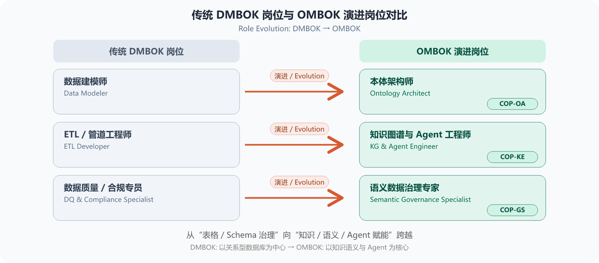
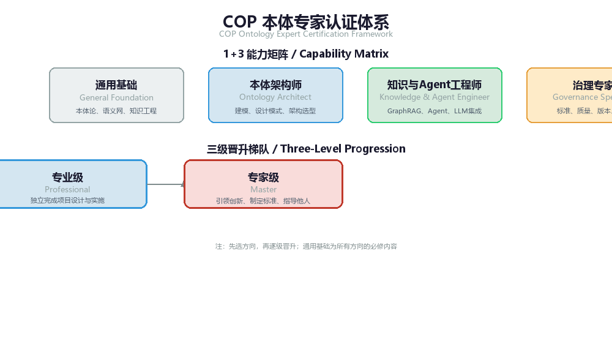
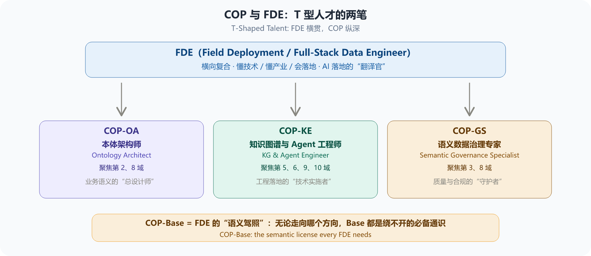

# 第 15 章 OMBOK 岗位能力矩阵、全员 AI 素养与 COP 认证体系

企业语义中枢（Semantic Hub）与 AI 基础设施的真正落地，不仅依赖于 OMBOK 所确立的 10 大知识域技术标准（第1、10域），更取决于企业是否具备匹配的人才梯队与全员 AI 认知文化。

为了将 OMBOK 知识体系转化为企业可落地、可评估的人力资源标准与组织能力，本章首先提出面向全员的 AI 素养转型路径，随后发布 OMBOK 核心岗位能力矩阵，并推出配套的 COP（Certified Ontology Professional，本体专家认证）体系，打造“全员素养-专业岗位-行业认证”三位一体的人才闭环。

## 15.1 全员 AI 素养转型：学 AI 素养，做 AI 主人

大模型时代的到来，并没有削弱人的价值，反而对全员的数据与 AI 素养提出了更高要求。如果员工缺乏对“逻辑、知识界限与结构化表达”的认知，就容易被大模型的“幻觉”所误导，沦为 AI 的被动接受者。 OMBOK 倡导 “学 AI 素养，做 AI 主人” 的核心理念，建议企业从以下三个维度提升全员素养：

1. 从“模糊描述”到“结构化表达”：培训业务人员掌握基础的概念梳理能力（如区分“类”与“实例”、“属性”与“关系”），学会用结构化的思维向 Agent 和大模型提问。
2. 从“盲目信任”到“批判性校验”：提升全员的数据辨析力，理解大模型的“概率输出”与本体图谱的“刚性推导”之间的区别，善用基于 SHACL 和事实图谱的追溯机制校验 AI 结果。
3. 从“数据使用者”到“知识贡献者”：鼓励一线业务人员在日常工作中发现并纠正错误语义，通过简易的业务前端将新知识反哺给企业本体库，让每位员工都成为企业“认知大脑”的养分提供者。

## 15.2 传统 DMBOK 岗位与 OMBOK 核心岗位演进

传统 DAMA-DMBOK 的岗位体系（如数据建模师、数据质量分析师、数据治理专员）主要围绕关系型数据库（RDBMS）与二维表结构展开。在大模型（LLM）与 AI Agent 时代，OMBOK 实现了从“表格/Schema 治理”向“知识/语义/Agent 赋能”的跨越，企业核心岗位形态也发生了深刻演进：

*图15-1: 传统 DMBOK 岗位与 OMBOK 演进岗位对比 / Role Evolution: DMBOK → OMBOK*

### 1. 三大核心岗位职责定义

- 本体架构师 (Ontology Architect)：企业业务语义的“总设计师”。负责将业务需求转化为刚性的领域本体（TBox），掌控企业顶层语义模型、胜任力问题（CQs）提炼与模式演进分支。
- 知识图谱与 Agent 工程师 (Knowledge Graph & Agent Engineer)：工程落地的“技术实施者”。负责将多源异构数据映射为图谱（ABox）、部署推理引擎、搭建 GraphRAG 管道，并为 AI Agent 封装确定性的语义动作空间（Action Space）。
- 语义数据治理专家 (Semantic Data Governance Specialist)：质量与合规的“守护者”。负责编写 SHACL 数据质量校验规则、构建 PROV-O 全流程数据血缘，以及实施 SPARQL 动态视窗与安全遮罩。

### 2. 岗位能力矩阵与 OMBOK 知识域映射表

| **岗位名称** | **核心职责** | **必备 OMBOK 核心知识域** | **核心交付物** | **常用工程工具链** |
| --- | --- | --- | --- | --- |
| **本体架构师** Ontology Architect | 顶层本体设计、业务 CQs 提炼、本体版本管理与演进 | 第2域 本体建模 (TBox) 第8域 模式演进 | 业务 CQs 清单 OWL 2 领域本体文件 本体演进 Git 分支规范 | Protégé, TopBraid, OWL 2 DL, Git-Ontology |
| **知识图谱与 Agent 工程师** KG & Agent Engineer | ABox 映射构建、SWRL 推理、GraphRAG 与 AI Agent 对接 | 第5域 R2RML 映射 第6域 SWRL 逻辑推理 第9域 图谱构建 (ABox) 第10域 Agent 赋能与运营 | R2RML/RML 映射脚本 SWRL 业务推理规则 Agent SPARQL 工具接口 | Ontop, GraphDB, Stardog, SPARQL, Python, LangChain, LlamaIndex |
| **语义数据治理专家** Semantic Governance Specialist | 数据质量刚性约束、PROV 全血缘追溯、安全遮罩与合规 | 第3域 SHACL 约束 第8域 质量治理与血缘追踪 第8域 安全合规与隐私 | SHACL 质量形状文件 PROV-O 血缘追溯图谱 SPARQL 动态遮罩视窗 | pySHACL, Jena SHACL, PROV-O, SPARQL 动态视窗过滤, Apache Jena |

## 15.3 基于 OMBOK 的 COP 认证体系设计

COP（Certified Ontology Professional，本体专家认证） 是基于 OMBOK 体系打造的行业权威人才认证。COP 采用 **"矩阵 × 梯队"** 的二维设计：横向是 **"1 项通用基础 + 3 个岗位方向"** 的能力矩阵，纵向是 **"Associate → Professional → Master"** 的三级晋升梯队。

*图15-2: COP 本体专家认证体系 / COP Certification Framework*

### 1. 能力矩阵：通用基础 × 岗位方向

COP 认证的知识覆盖由"1+3"矩阵构成：

- **COP-Base（通用基础）**：涵盖第 1 域至第 5 域的核心理论，是所有认证等级的必备基础。
- **COP-OA（Ontology Architect，本体架构师方向）**：面向本体设计与架构演进，聚焦第 2、8 域。
- **COP-KE（Knowledge & Agent Engineer，知识图谱与 Agent 工程师方向）**：面向图谱构建与智能体赋能，聚焦第 5、6、9、10 域。
- **COP-GS（Governance Specialist，语义数据治理专家方向）**：面向质量治理与安全合规，聚焦第 3、8 域。

### 2. 三级晋升梯队

COP 认证设有三级递进路径，从业者可根据自身资历与职业目标选择起点：

**Level 1：COP-Associate（助理级）**

- **目标人群**：数据分析师、初级开发人员、传统数据治理专员转型入门。
- **考核内容**：仅需通过 COP-Base 通用基础考核（客观题机考）。
- **认证效力**：具备 OMBOK 基础知识素养，可在团队中辅助语义工程相关工作。

**Level 2：COP-Professional（专业级）**

- **目标人群**：企业一线本体架构师、知识图谱工程师、语义治理专家。
- **考核内容**：COP-Base + 任选 OA/KE/GS 一个方向（理论笔试 + 上机实操）。
- **认证效力**：可独立承担企业级语义工程项目设计与落地。

**Level 3：COP-Master/Fellow（大师级）**

- **目标人群**：企业首席数据/语义架构师、行业专家、OMBOK 社区核心贡献者。
- **考核内容**：需先取得 Professional 认证，额外提交 5 年以上真实生产环境的本体工程案例，通过 OMBOK 专家委员会答辩。
- **认证效力**：具备企业级语义工程战略规划与行业标准制定能力。

### 3. COP 与 FDE：AI 落地工程师的“语义驾照”

近两年，FDE（Field Deployment Engineer，现场部署工程师；亦指 Full-Stack Data Engineer，全栈数据工程师）成为 AI 领域最受关注的岗位之一：它以“懂技术、懂产业、会落地”的横向复合能力著称，负责把大模型真正交付进企业业务场景。FDE 的画像与 COP 并不冲突，二者恰好构成 T 型人才的两笔——FDE 是“一横”（端到端落地的广度），COP 的三个专业方向是“一竖”（语义纵深的专精）。

*图15-3: COP 与 FDE：T 型人才的两笔 / COP × FDE: T-Shaped Talent*

值得强调的是，FDE 的横向能力中，**语义素养是不可或缺的底座，而这正是 COP-Base 的覆盖范围**。COP-Base 涵盖第 1 域至第 5 域的核心理论：业务语义与形式化基础、本体建模、OWL/SHACL 形式化约束、本体设计模式、语义存储与映射。FDE 在客户现场落地 AI 时最常见的失败模式，是“机器不懂业务”——术语口径对不上、概念关系缺失、输出无法校验；COP-Base 给出的，正是把业务语义准确讲给机器听的基本功。一个只会调 API、搭管道而缺乏语义素养的 FDE，交付的 AI 应用难以与既有 BI 口径对齐，这恰恰是企业 AI 落地最大的隐性风险。

因此，可以把 COP-Base 理解为 FDE 的“语义驾照”：无论日后向哪个纵深方向（OA / KE / GS）发展，Base 都是绕不开的必备通识；企业组建 AI 落地团队时，也可将 COP-Base 作为语义素养的考核基线。对希望向语义专家进阶的 FDE 而言，COP-Associate（仅需通过 Base 考核）是最短的入门路径。

从能力框架看，FDE 通常被概括为 **T 型结构**：横向是**全栈广度**——数据管道与 ETL、后端 API、前端可视化、云基础设施，以及 AI 工程（模型调用、RAG、Agent 编排）都要能上手；纵向则要求在 1-2 个方向做到专家级。业界对其能力构成的量化共识大致为：**技术能力约 40%**（全栈开发、AI/ML 基础、系统集成与数据管道）、**客户沟通约 35%**（需求诊断、工作坊引导、方案讲解与冲突解决）、**商业敏锐度约 25%**（ROI 测算、行业领域知识与价值呈现）。值得注意的是，FDE 技术能力的最深处正是**语义素养**——概念建模、语义约束与图谱推理（即 COP-Base 覆盖的第 1-5 域），它决定了 FDE 交付的 AI 应用能否与既有业务口径严格对齐。简言之：FDE 的“能”横着铺开，COP 的“专”竖着扎下，二者叠加才是完整的 AI 落地人才能力地图。

## 15.4 企业组建语义卓越中心（Semantic CoE）落地建议

基于 OMBOK 知识体系与 COP 认证，企业在推进语义中枢与 AI Agent 基础设施建设时，建议采取以下实施步骤：

1. 普及全员 AI 素养：落实 6.1 节“学 AI 素养，做 AI 主人”的核心理念，针对全员开展结构化表达与 AI 结果批判性校验的通识培训，建立人机协同治理文化。
2. 能力盘点与岗位转型：对照 6.2 节岗位能力矩阵，对现有数据团队进行能力基线盘点，制定向 OMBOK 岗位转型的培养计划。
3. 以考促训与工程演练：组织团队围绕 OMBOK 10 大知识域进行系统化实操训练，利用第 13 章的贯穿案例进行上机演练，并参加 COP-Professional 专业认证。
4. 成立企业级语义卓越中心（Semantic CoE）：以通过 COP-Master/Professional 认证的人才为核心，组建企业级语义卓越中心。负责统一把控企业的 TBox 本体资产、管控本体版本演进（第8域），并为全企业 AI Agent 提供标准化、高可信的 SPARQL 语义动作接口（本域）。

## 相关笔记

- [[00-目录]]
