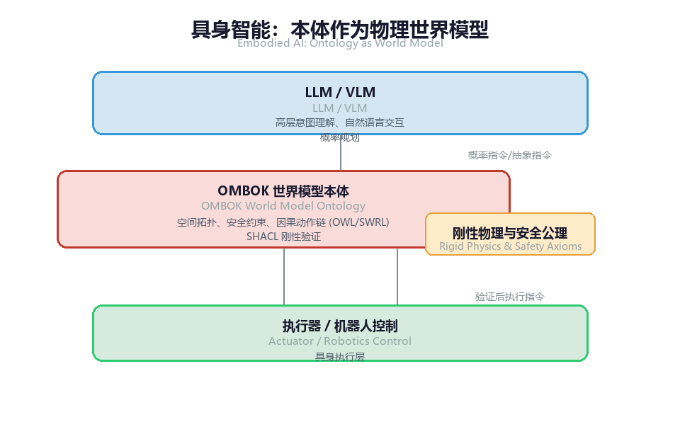
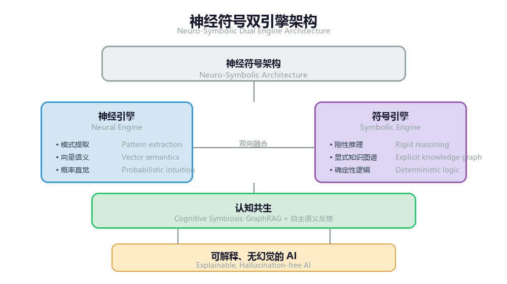

# 第 16 章 未来展望：本体、大模型与数据空间

作为 OMBOK 的终局章节，本章不再局限于单体企业内部的语义数据管理，而是将视野投向 AI 演进与数据要素基础设施的前沿交汇点。 在大模型（LLM）加速迭代、具身智能（Embodied AI）走入物理世界、以及数据空间（Data Spaces）重塑跨组织数据流通的宏大背景下，本体（Ontology）不再仅仅是静态的知识治理工具，而是成为了连接物理世界、神经符号 AI 与数据要素价值释放的“底层语义协议”。 本章将深入探讨语义技术在未来 5 到 10 年的三大核心演进方向：具身智能的世界模型、神经符号 AI 的终极融合，以及跨企业数据空间的数据主权表达。

### 16.1 本体与具身智能（Embodied AI）：作为“世界模型”的刚性语义

1. 从纯文本大模型到物理世界交互

具身智能（如人形机器人、自主无人系统、智能制造车间机器人）的突破，标志着 AI 正式从数字空间迈入物理空间。纯文本或多模态大模型在虚拟空间中表现优异，但在真实物理世界中，对空间拓扑、物理常识、因果约束与动作安全界限的违背是致命的（例如：机器人误将高危化学品容器判定为普通水杯）。



*图16-1: 具身智能架构 / Embodied AI Architecture — 本体作为LLM与物理世界的"刚性语义协议"*

2. 本体作为具身智能的“物理世界模型（World Model）”

在 OMBOK 体系下，本体为具身智能提供了不可忽略的刚性上下文与因果边界：

- 空间与物理拓扑建模（D01）：通过 OWL 2 描述物理空间（如“房间 - 货架 - 托盘 - 零件”的包含关系）与物理属性（如重量、易碎性、毒性、温度上限）。
- 因果与动作约束推理（D06）：利用 SWRL 规则定义可操作条件。例如：如果 (物品 X 是易爆品) 且 (环境温度 > 40℃) -> 严禁 (机械臂执行抓取动作 B)。
- 物理世界状态的图存与同步（D05/D09）：机器人传感器实时回传的物理感知数据动态挂载至图数据库，形成物理世界的“数字孪生语义图谱”。

通过将本体作为世界模型的刚性底座，企业可以确保具身智能在执行复杂任务时，高层由 LLM 驱动“灵动思考”，底层由 OMBOK 本体确保“绝对安全”。

### 16.2 神经符号 AI（Neuro-Symbolic AI）：大模型与本体图谱的深度融流

**1. 两种 AI 范式的互补与对撞**

人工智能发展的数十年间，始终存在两大流派：

- **连接主义（Connectionism / 神经网络）**：以大模型为代表，擅长模式识别、直觉联想与自然语言生成，但存在不可解释、逻辑脆弱、容易产生幻觉的致命缺陷。
- **符号主义（Symbolism / 知识图谱与本体）**：以 OMBOK 体系为代表，擅长刚性推导、因果分析与 100% 确定性校验，但存在构建成本高、知识获取存在瓶颈的难题。

**2. 神经符号 AI 的终极演进形态**

未来 10 年，AI 的终极形态必将是神经网络（感性直觉）与符号逻辑（理性刚性）的深度融流：



*图16-2: 神经符号双引擎 / Neuro-Symbolic Dual Engine*

- **符号引导神经网络（Symbolic-guided Neural）**：在 LLM 的预训练或微调阶段，将 OWL 本体公理与图结构作为损失函数（Loss Function）或注意力掩码（Attention Mask）的硬约束，从底层消除大模型的逻辑幻觉。
- **神经驱动符号扩展（Neural-driven Symbolic Evolution）**：大模型作为非结构化数据抽取的超级发动机（D09），持续从海量文本、视频和运行日志中抽取潜在的三元组，经由 SHACL 质控（D03）与语义架构师审核后，实现本体库的自动化自进化。

### 16.3 数据空间（Data Spaces）与数据要素：基于语义的数据主权表达

**1. 跨企业数据要素流通的终极壁垒**

在数据要素市场化配置与跨国/跨企业数据空间（如欧洲 IDSA 数据空间、中国国家数据局推进的数据基础设施）的建设中，传统的数据接口传输面临两大核心障碍：

- **语义异构（Semantic Heterogeneity）**：企业 A 的"客户"与企业 B 的"用户"定义不同，数据离开本域后失去上下文。
- **数据主权与合规管控（Data Sovereignty & Compliance）**：数据拥有方不敢轻易共享数据，缺乏"数据可用不可见、用途可控可追溯"的技术手段。

**2. OMBOK 在数据空间中的核心枢纽作用**

OMBOK 为数据空间提供了"语义可联通"与"控制权可表达"的双重标准：

```
# 示例：基于 DCAT 与 ODRL 本体的"数据要素流通策略"表达

@prefix dcat: <http://www.w3.org/ns/dcat#> .
@prefix odrl: <http://www.w3.org/ns/odrl/2/> .
@prefix obok_gov: <http://dama.org.cn/obok/government#> .

# 1. 语义元数据发布：企业 A 的风控数据集
obok_gov:EnterpriseRiskDataset a dcat:Dataset ;
    dcat:title "企业高精风控行为图谱"@zh ;
    obok_gov:alignedOntology <http://dama.org.cn/obok/finance#> .  # 挂载 OMBOK 标准语义本体

# 2. 数据主权与使用策略约束（ODRL 本体表达）
obok_gov:DataUsagePolicy a odrl:Offer ;
    odrl:permission [
        odrl:target obok_gov:EnterpriseRiskDataset ;
        odrl:action odrl:use ;
        odrl:constraint [
            odrl:leftOperand odrl:purpose ;
            odrl:operator odrl:eq ;
            odrl:rightOperand "Financial_Anti_Money_Laundering"  # 仅限用于"反洗钱"场景
        ]
    ] ;
    odrl:prohibition [
        odrl:target obok_gov:EnterpriseRiskDataset ;
        odrl:action odrl:derive  # 严禁导出原始三元组
    ] .
```

*[turtle]*

- 跨域语义对齐（DCAT/SKOS）：通过挂载公共 OMBOK 本体，数据空间内的各方无需修改底层数据库，即可实现"语义无损对齐与联邦查询"。
- 细粒度主权策略表达（ABAC + ODRL）：将数据治理政策、数据安全法（DSL）、GDPR 等法规转化为刚性语义策略。数据在数据空间内流通时，策略随数据同源绑定，计算节点自动解析策略并强制执行，真正实现“数据要素可信流通”。

### 16.4 本章小结：迎接“认知驱动”的数据治理新纪元

从第 1 章对传统数据治理局限的反思，到第 2 章车轮图总体架构与第 3 章至第 12 章对 10 大知识域的精密构建，再到第 13、14 章的行业实战与实施演进，最后到第 16 章对具身智能、神经符号 AI 与数据空间的展望——OMBOK 的完整图景已经清晰呈现。 数据不再是静止在磁盘里的冷冰冰的行与列，而是经过语义升维后，具备自我解释、自我推理、自我防护能力的知识与资产。 “学 AI 素养，做 AI 主人”。在这场由大模型与语义技术共同引发的认知革命中，掌握了本体与语义治理钥匙的企业与专业人才，必将在这场智能化浪潮中立于不败之地，真正把数据转化为驱动业务增长与社会进步的无限认知动力！

### 附录：OMBOK 常用核心术语表（Glossary of Terms）

- RDF (Resource Description Framework)：资源描述框架，语义网的核心标准，使用“主-谓-宾”三元组表示数据。
- OWL (Web Ontology Language)：Web 本体语言，用于定义丰富、复杂的概念公理与逻辑关系。
- SKOS (Simple Knowledge Organization System)：简单知识组织系统，用于表示受控词表、分类体系与词汇表。
- SPARQL：RDF 图数据库的标准查询语言，类似于传统关系型数据库的 SQL。
- SWRL (Semantic Web Rule Language)：语义网规则语言，用于结合 OWL 本体编写自定义逻辑推理规则。
- SHACL (Shapes Constraint Language)：图约束语言，用于对 RDF 数据图谱进行刚性结构与质量校验。
- GraphRAG (Graph-Augmented Retrieval-Augmented Generation)：图增强检索生成，利用知识图谱的精确逻辑结构为大语言模型提供无幻觉的上下文上下文支撑。
- Neuro-Symbolic AI (神经符号 AI)：将深度学习神经网络（模式识别与生成）与符号逻辑（本体与知识图谱）深度融合的下一代人工智能范式。
- 三元组（Triple）：RDF 中的基本数据单位，由“主-谓-宾”三部分组成，用于表示数据之间的关系与连接。

## 相关笔记

- [[00-目录]]
- [[从技术壁垒到结构性壁垒：软件被大模型淹没后的生存方向]]
- [[中国FDE团队核心壁垒分析]]
